# Note Database

  <strong>Turn Markdown notes into editable, visual databases inside Obsidian.</strong> 
  Same notes. Six views. Still plain Markdown.

  
  
  
  
  

Edit frontmatter in place, save several views of the same notes, and keep every record in the vault you already use.

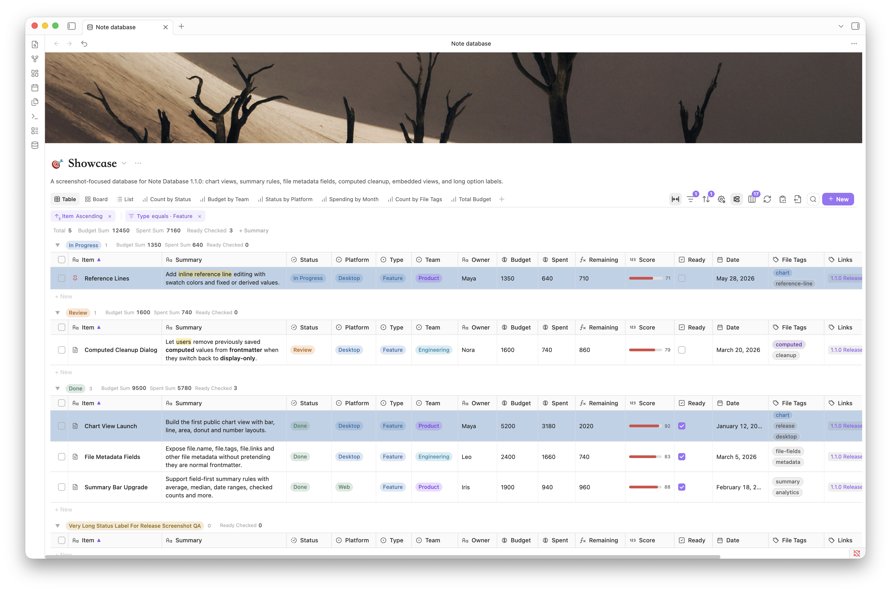

## Highlights

- **Six database views:** see the same notes as a table, board, gallery, chart, calendar, or timeline.
- **Local Markdown storage:** each database is an ordinary Markdown file with `db_view: true`; records, properties, and relations also stay inside your vault.
- **Direct property editing:** edit text, numbers, currency, dates, options, statuses, checkboxes, and file names without opening every note; one dialog confirms the display name, property key, and type for new properties.
- **Spreadsheet-style workflows:** use keyboard navigation, range selection, copy/paste, fill, paste-to-create, bulk editing, and single-step undo.
- **Flexible organization:** combine search, filters, sorting, groups, subgroups, manual order, quick facet chips, and result limits.
- **Source-aware creation:** select records by folder, tag, property, link, or expression, then preserve source/group defaults and apply templates when creating notes.
- **Visual presentation:** use database/record icons, database/card covers, inline Markdown, option colors, number styles, and conditional formatting.
- **Summaries and charts:** aggregate the current result, show several summaries in groups, and inspect the notes behind a chart value.
- **Formulas, Relations, and Rollups:** calculate properties safely, connect notes with Obsidian wikilinks, and derive count, sum, average, or list values.
- **Native Obsidian links:** use `file.*` metadata and the core Page preview plugin for record titles, Relations, and internal links inside text.
- **Date planning:** drag and resize date or time ranges in month/week/day calendars and day/week/month/quarter timelines.
- **Embedding and portability:** place read-only database views in notes, copy or export data, and convert Obsidian `.base` files.
- **Local and private:** no cloud data copy and no external transmission of vault content, metadata, formulas, or settings.

## Six views, one vault

| Table | Board |
| --- | --- |
|  | 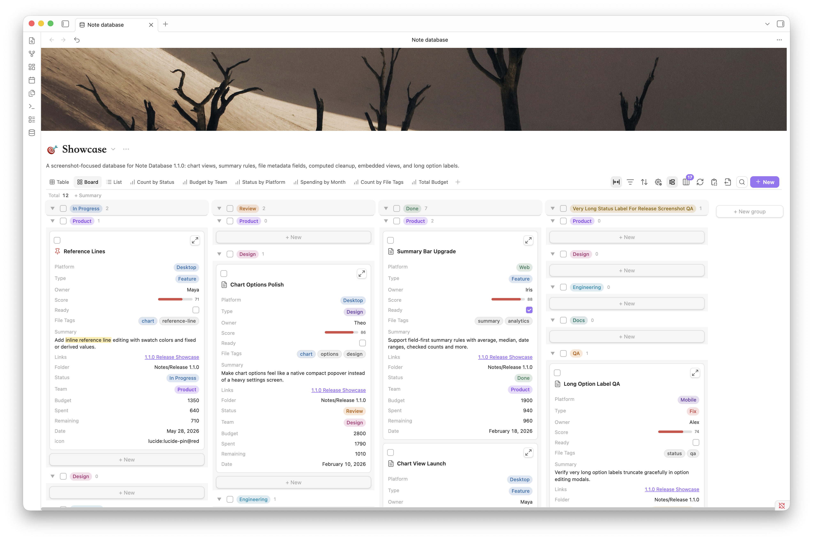 |
| Edit dense records, paste ranges, fill cells, group, sort, and navigate by keyboard. | Move cards through stages, use subgroups, covers, colored options, and drag-and-drop. |

| Gallery |
| --- |
| 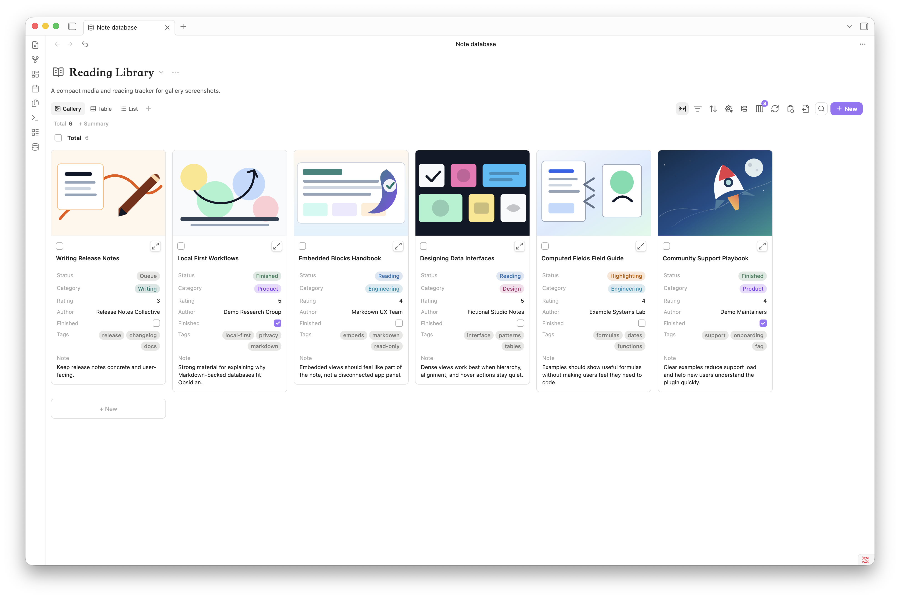 |
| Browse visual libraries with covers, properties, groups, and summaries. |

| Chart | Timeline |
| --- | --- |
| 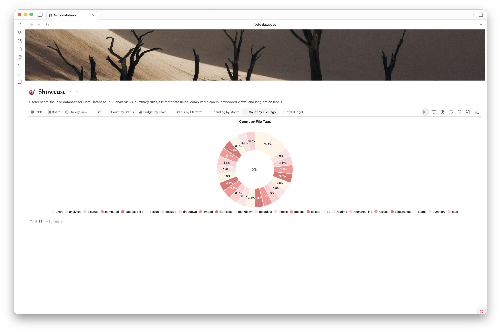 | 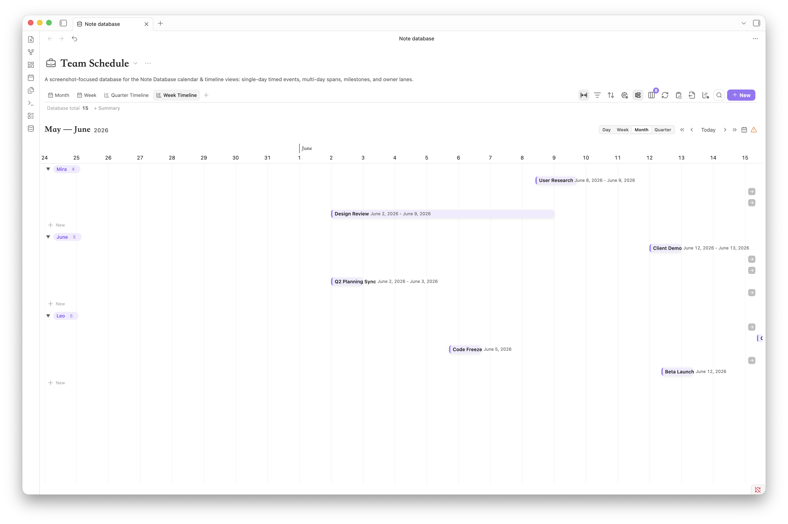 |
| Turn the current filtered result into charts, summaries, drilldowns, and PNG exports. | Plan across day, week, month, or quarter scales; drag and resize date ranges. |

| Calendar month | Calendar week |
| --- | --- |
| 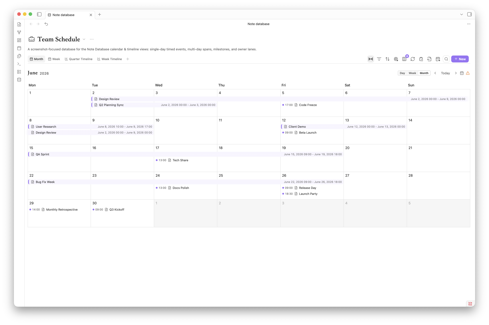 | 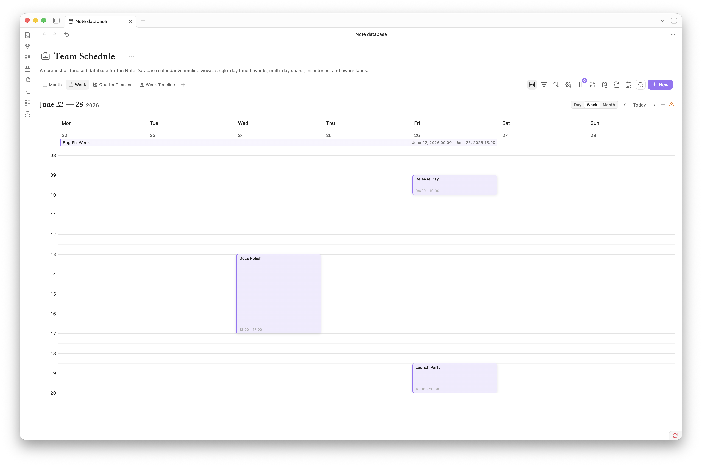 |
| Arrange all-day and multi-day records in a monthly overview. | Work with all-day and timed records on a detailed weekly grid. |

Each view keeps its own filters, sorting, grouping, visible properties, title property, and layout—without duplicating the notes.

## New in 1.2.8

| Faster filter and sort controls |
| --- |
| 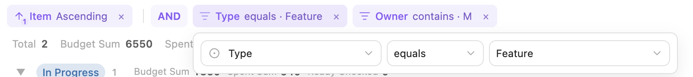 |
| See active rules as compact chips. Edit one rule in place or remove it directly. |

| Record covers on boards |
| --- |
| 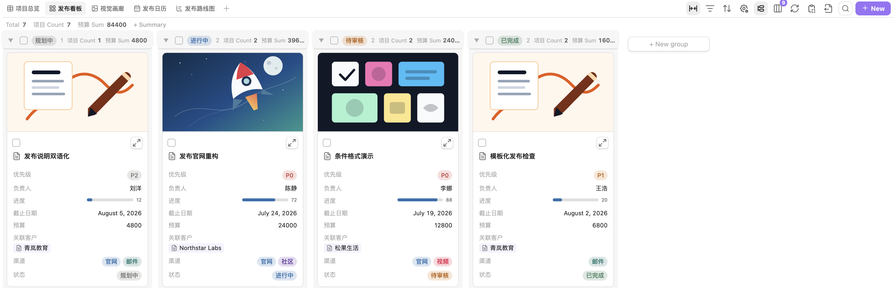 |
| Choose a cover property, crop mode, and ratio independently for every board view. |

| Clearer formulas | One new-property dialog |
| --- | --- |
| 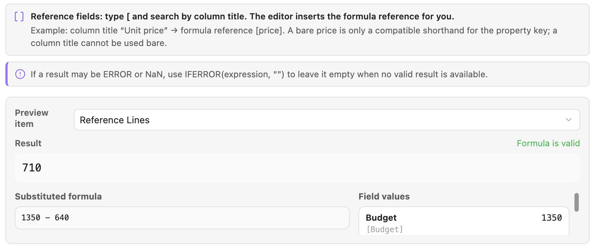 | 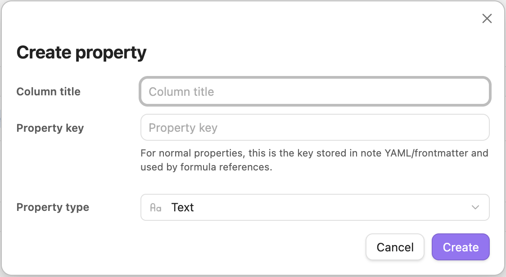 |
| Distinguish display names from frontmatter keys, preview substituted values, use `file.name` / `file.tags`, and recover with `IFERROR`. | Confirm the display name, frontmatter key, and property type from every creation entry point. |

| Relations | Rollups |
| --- | --- |
| 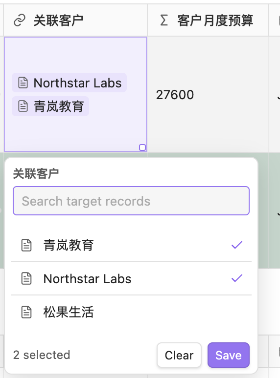 | 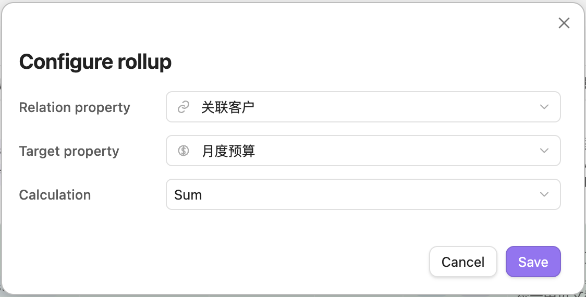 |
| Store relations as wikilinks and clear old values as one undoable target change. | Double-click a table cell to configure its Rollup. |

| Native note preview |
| --- |
| 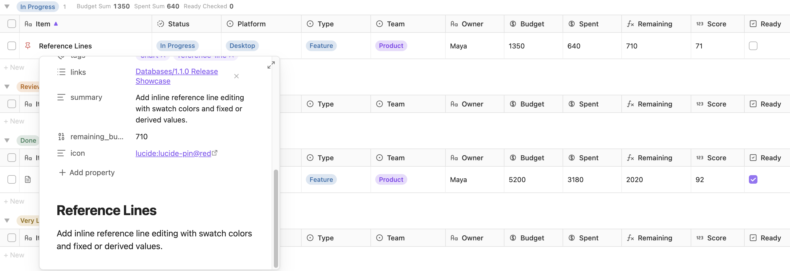 |
| Preview internal links with Obsidian's Page Preview and the user's chosen modifier key. |

Enable Obsidian's core **Page preview** plugin first. Preview works on record titles, Relation properties, clickable `file.*` metadata, text properties in Link display mode, and internal links or `[[wikilinks]]` in inline-Markdown text/computed-text properties. Table, Board, Gallery, Calendar, Timeline, the record detail panel, database-file views, and embedded views share the same behavior.

## Edit many notes without opening them

Field-aware editors cover text, numbers, currency, dates, checkboxes, selects, multi-selects, statuses, and file names. Table workflows include range selection, copy/paste, fill, overflow row creation, safe file renaming, and single-step undo.

| Typed bulk editing | Inline Markdown and number displays |
| --- | --- |
|  | 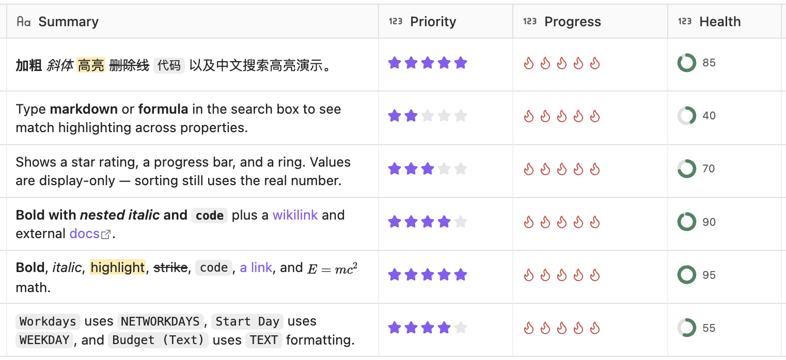 |
| Preview the affected records, confirm risky writes, and roll back a failed transaction. | Render text as links or inline Markdown; show numbers as ratings, bars, or rings without changing stored values. |

## Organize, highlight, and summarize

| Conditional formatting | Group summaries |
| --- | --- |
| 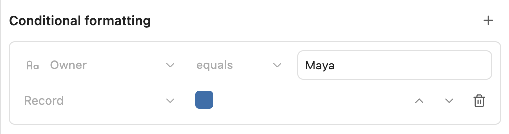 | 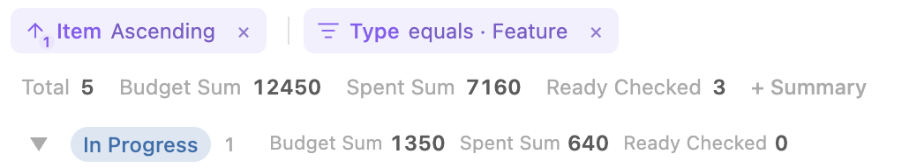 |
| Highlight a matching property or the whole record with view-specific rules. | Add and reorder count, sum, average, min/max, and other summaries in grouped views. |

Active filter and sort chips use the same rules as the full toolbar panels. Source rules can combine folders, tags, properties, links, and expressions with `AND`, `OR`, and `NOT`.

## Calculate and connect

| Formulas | Relations and Rollups |
| --- | --- |
| 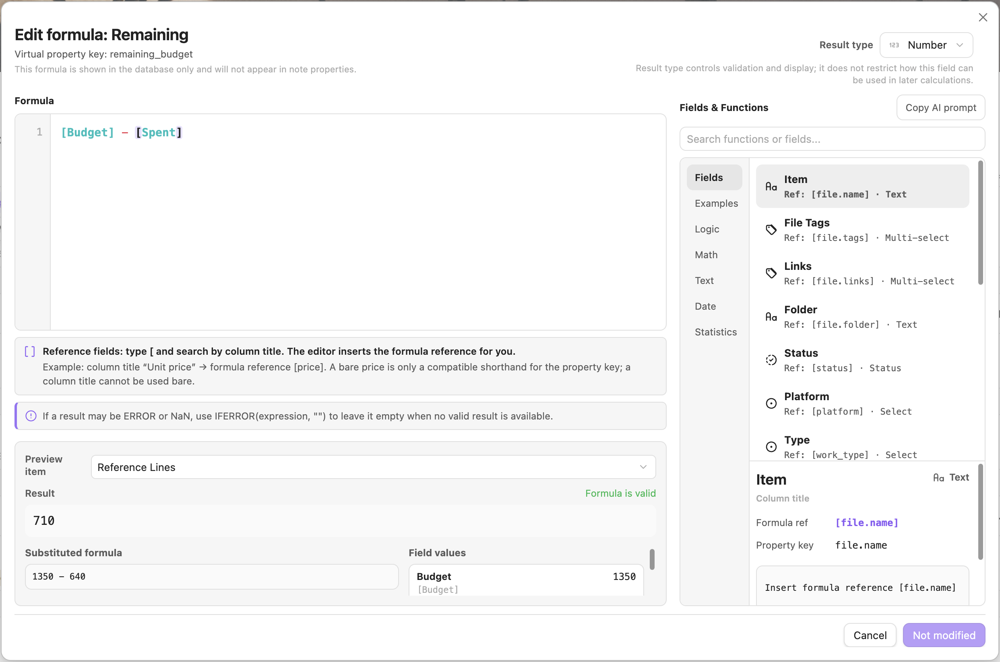 | 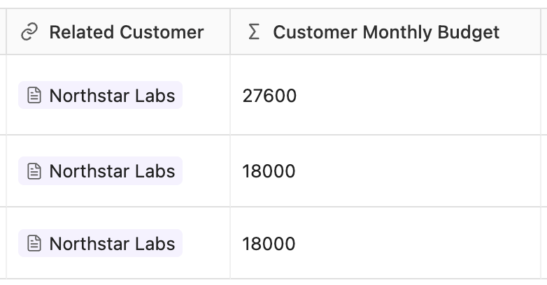 |
| Build computed properties with field references, date/text/number functions, live previews, and optional frontmatter sync. | Keep relationships as ordinary Obsidian wikilinks and calculate count, sum, average, or list values from linked notes. |

No `eval`, hidden relation database, or cloud copy is used.

## Make records easier to scan

| Database and record icons | Covers and visual cards |
| --- | --- |
| 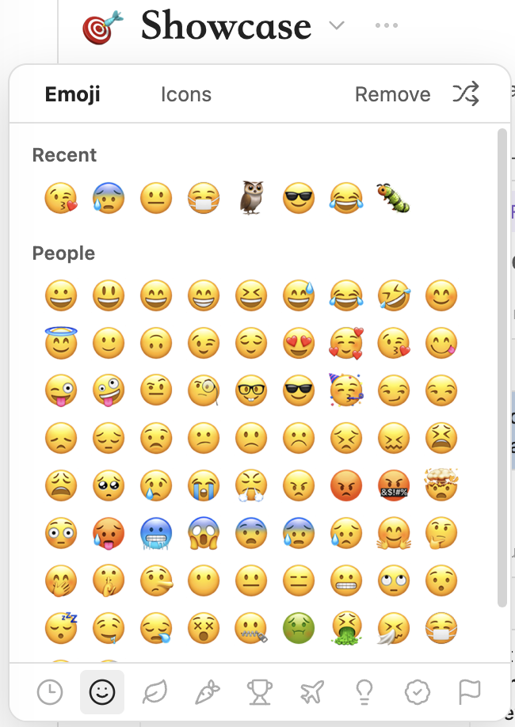 | 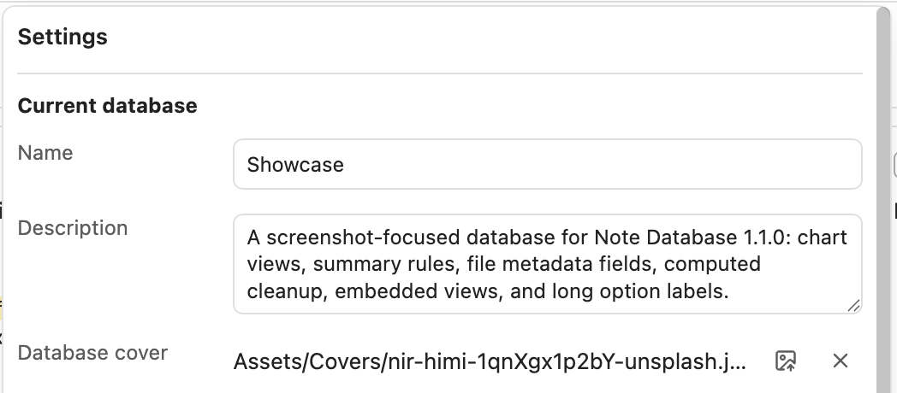 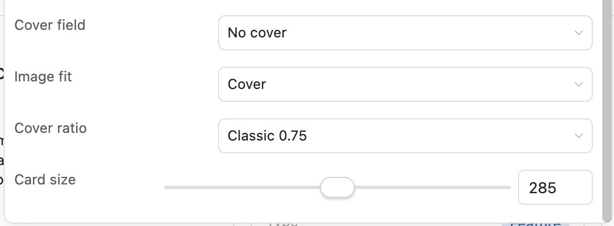 |
| Use Unicode Emoji or Lucide icons, with database defaults and per-view record-icon fields. | Add a draggable database cover and choose independent cover settings for board and gallery views. |

Option-based group titles keep their colors across table, board, and gallery views. Search highlights file names and visible values, including localized dates.

## Plan dates and inspect results

| Search across Calendar and Timeline | Chart drilldown and summaries |
| --- | --- |
|  |  |
| Search the fields visible on event cards, then drag or resize date and datetime records. | Click a chart value to inspect its records before applying a filter. |

Calendar supports month, week, and day. Timeline supports day, week, month, and quarter.

## Use database views anywhere

| Embedded view | Headerless embed |
| --- | --- |
| 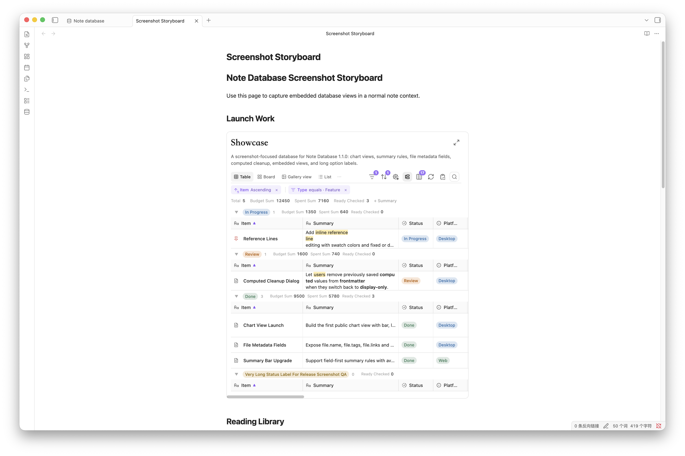 | 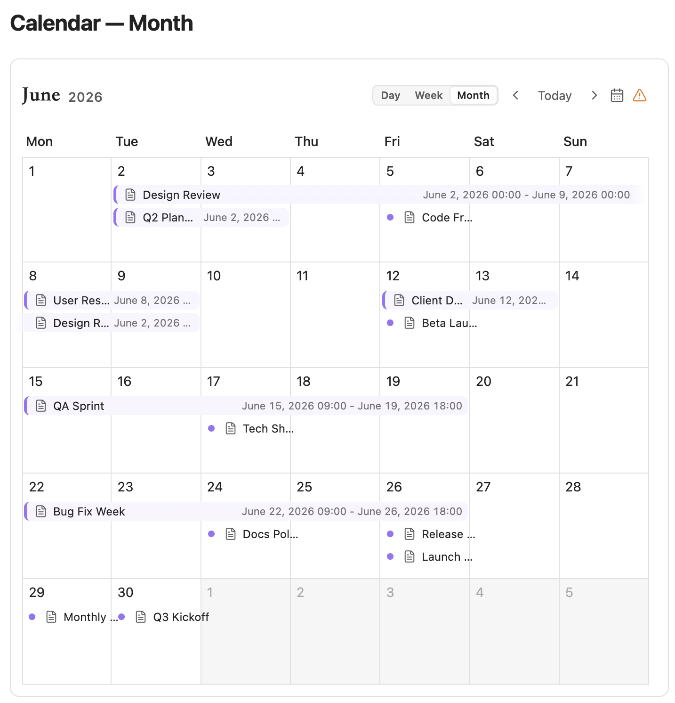 |
| Paste a generated `note-database` block into any note. | Hide the database header when the surrounding note already provides context. |

Embedded records stay read-only, while view switching, filters, sorting, grouping, computed values, and copy/export tools remain available.

## Markdown remains the source of truth

| What | Stored as |
| --- | --- |
| Database | A normal Markdown file with `db_view: true` |
| Records and property values | Markdown notes and their frontmatter |
| Relations | Obsidian wikilinks in frontmatter |
| Templates | Existing Obsidian Templates or Templater files |
| Views | Saved configuration in the database file |

Create records from source rules, groups, subgroups, or row insertion. Apply templates at creation. Export CSV + Markdown ZIP, copy CSV/Markdown tables, or convert an Obsidian `.base` file.

## Start in three steps

1. Install and enable Note Database, then open the dashboard from the ribbon or command palette.
2. Create a database and choose a folder or source rules for its notes.
3. Add properties and views. Edits write back to the original Markdown files.

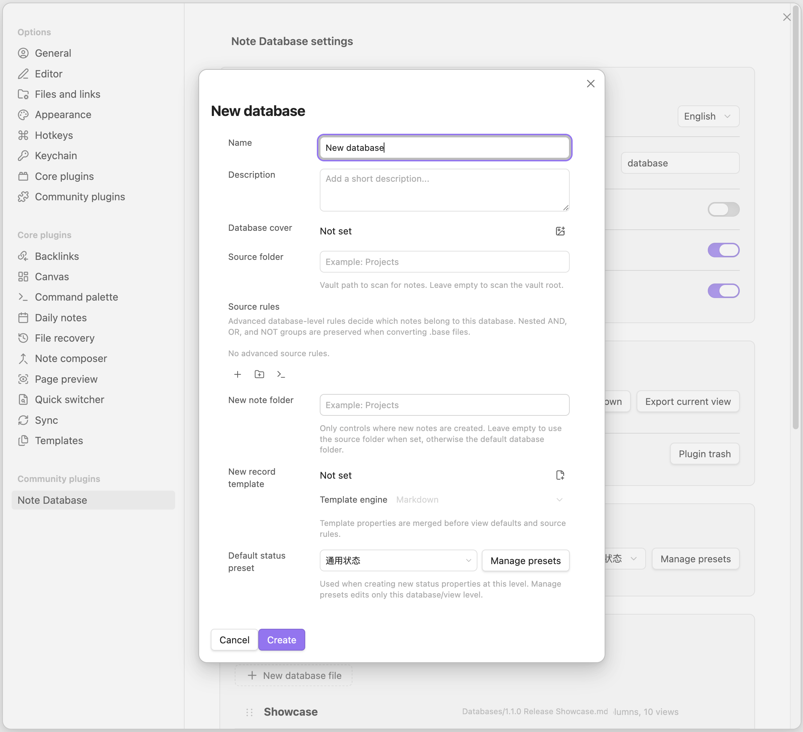

## Installation

1. Open **Settings → Community plugins**.
2. Search for **Note Database**.
3. Install and enable it.

For manual installation, download `main.js`, `styles.css`, and `manifest.json` from the [latest release](https://github.com/pangy9/obsidian-note-database/releases/latest) and copy them to `.obsidian/plugins/note-database/`.

## Privacy

Note Database runs locally in Obsidian. It does not send vault content, metadata, formulas, or settings to an external service. Read the full [privacy policy](PRIVACY.md).

## Support

If Note Database is useful to you, [star the repository](https://github.com/pangy9/obsidian-note-database) or support continued development:

Release notes and the full change history are available on [GitHub Releases](https://github.com/pangy9/obsidian-note-database/releases).
