# Note Database

  <a href="README.md">English</a>

  <strong>把 Markdown 笔记变成可以直接编辑、组织和计算的本地数据库。</strong> 
  同一批笔记，七种视图，依然只是 Markdown。

  
  
  
  
  

直接编辑 frontmatter，用多个视图查看同一批笔记，而所有记录仍留在你原来的 vault 中。

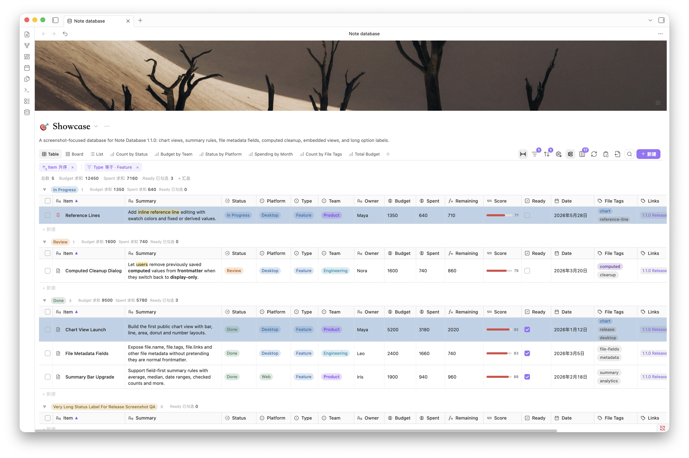

## 功能亮点

- **七种数据库视图：** 用表格、看板、画廊、列表、图表、日历和时间线查看同一批笔记。
- **Markdown 本地存储：** 数据库是带 `db_view: true` 的普通 Markdown 文件；记录、属性与关联也都保存在 vault 中。
- **直接编辑属性：** 不用逐篇打开笔记，即可编辑文本、数字、货币、日期、选项、状态、复选框和文件名；新建属性时统一确认显示名、属性名与类型。
- **电子表格式操作：** 支持键盘导航、范围选择、复制粘贴、填充、越界补行、批量编辑与一步撤销。
- **灵活组织记录：** 组合搜索、筛选、排序、分组、子组、手动顺序、快捷条件标签和结果限制。
- **来源感知的新建：** 按文件夹、标签、属性、链接或表达式界定记录，并在新建时保留来源与分组默认值、套用模板。
- **更直观的展示：** 使用数据库/记录图标、数据库/卡片封面、行内 Markdown、彩色选项、数字样式和条件格式。
- **小计与图表：** 汇总当前结果，在分组中显示多项小计，并从图表数值查看对应笔记。
- **公式、关联与汇总：** 安全计算属性，通过 Obsidian 双链关联笔记，再生成数量、总和、平均值或列表。
- **Obsidian 原生链接体验：** 使用 `file.*` 文件元数据，并通过核心 Page preview 预览记录标题、关联和文本中的内部链接。
- **日期规划：** 在月/周/日日历和日/周/月/季时间线中拖动、调整日期及时间范围。
- **内嵌与迁移：** 把只读数据库视图放进笔记，复制或导出数据，并转换 Obsidian `.base` 文件。
- **本地且私密：** 不建立云端数据副本，不把 vault 内容、metadata、公式或设置发送给外部服务。

## 同一批笔记，七种视图

| 表格 | 看板 |
| --- | --- |
|  |  |
| 密集编辑、范围粘贴与填充、分组排序，以及键盘导航。 | 推进状态、使用子分组和封面，并通过拖拽调整记录。 |

| 画廊 | 列表 |
| --- | --- |
|  | 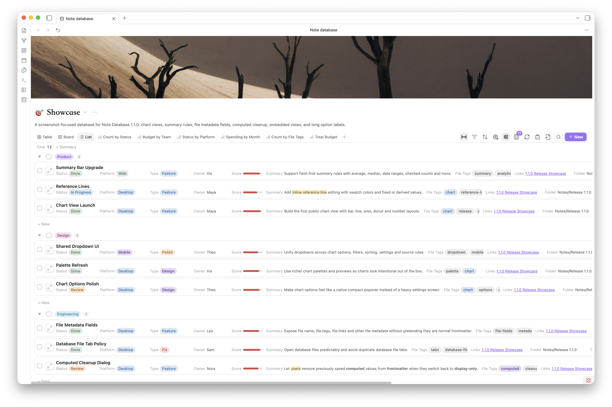 |
| 用封面、属性、分组和小计浏览视觉内容库。 | 快速浏览任务、目录、研究笔记和高密度清单。 |

| 图表 | 时间线 |
| --- | --- |
|  |  |
| 把当前筛选结果转成图表、小计和明细，并导出 PNG。 | 在日、周、月、季尺度中规划，拖动或调整日期范围。 |

| 日历月视图 | 日历周视图 |
| --- | --- |
|  |  |
| 在月历中安排全天与跨日记录。 | 在细化的时间网格中处理全天和具体时段记录。 |

每个视图都能保存自己的筛选、排序、分组、显示属性、标题属性和布局，但不会复制笔记。

## 1.2.7 新增

| 更快的筛选与排序 |
| --- |
| 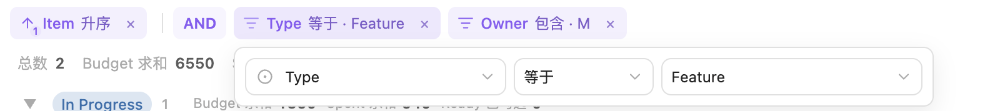 |
| 顶栏直接显示当前规则；点开编辑一条，或直接移除。 |

| 看板记录封面 |
|  --- |
|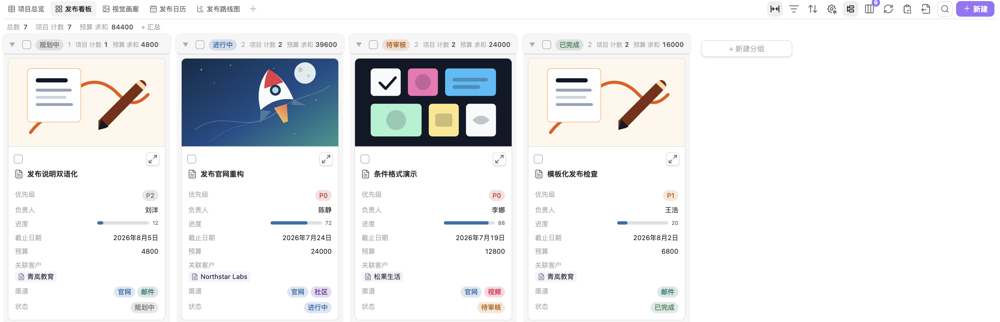 |
| 每个看板独立选择封面属性、裁切方式和宽高比。 |

| 更清楚的公式编辑器 | 统一的新建属性窗口 |
| --- | --- |
| 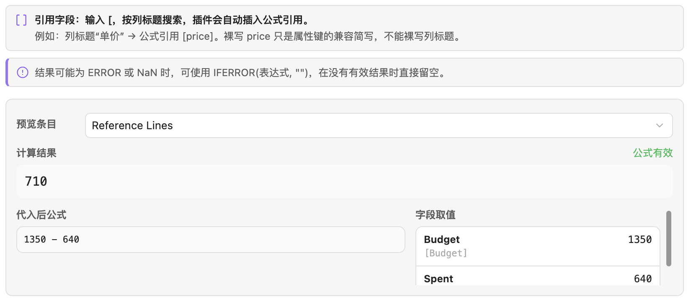 | 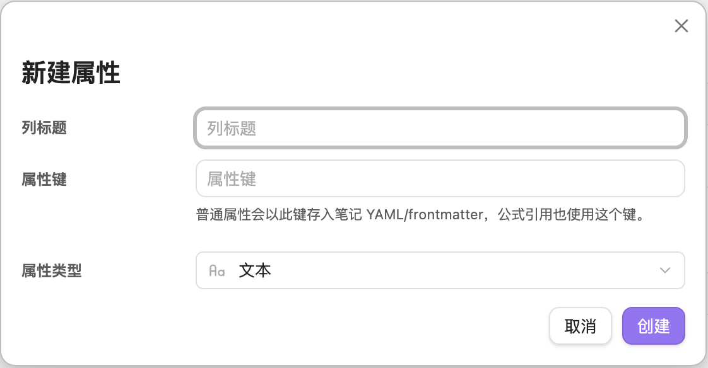 |
| 区分显示名称与 frontmatter 属性名，预览实际代入值，并用 `IFERROR` 处理空值或错误。 | 所有入口都确认显示名称、frontmatter 属性名与属性类型。 |

| 关联 | 汇总 |
| --- | --- |
| 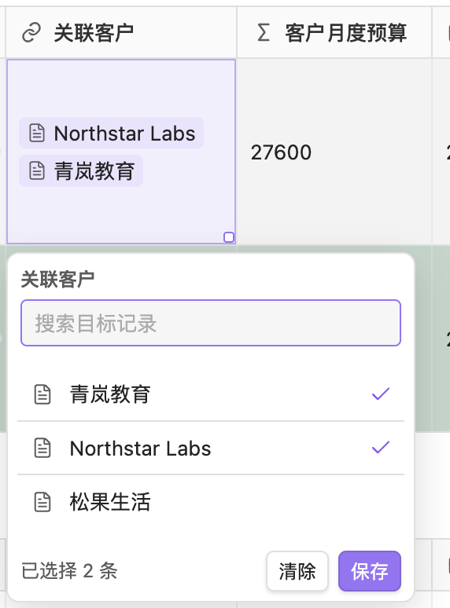 | 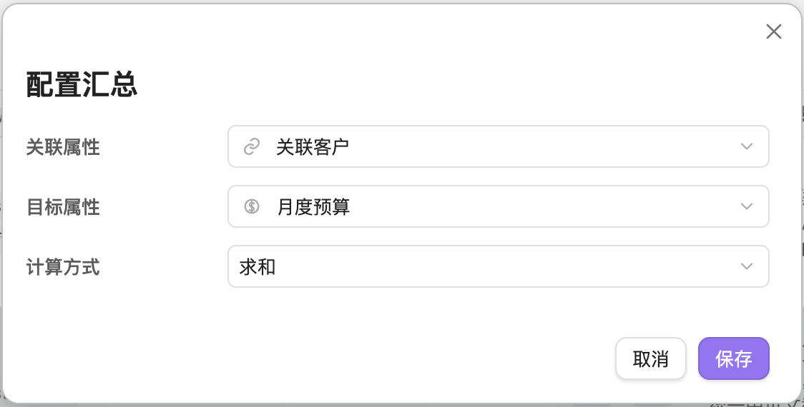|
| 关联保存为双链；切库清理可一步撤销。 | 表格中双击即可配置 Rollup。 |

| 原生笔记预览 |
|  --- |
|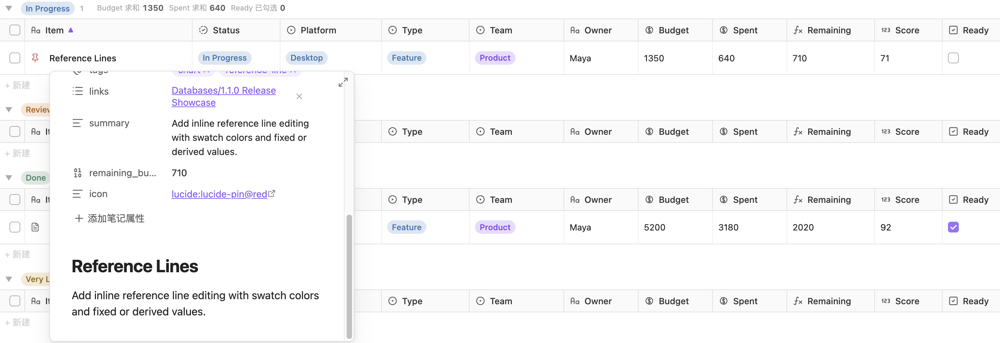 |
| 内部链接复用 Obsidian Page Preview，并遵循用户设置的修饰键。 |

需要先启用 Obsidian 核心插件 **Page preview（页面预览）**。支持记录标题、Relation 属性、可点击的 `file.*` 文件属性、设为 Link 显示模式的文本属性，以及行内 Markdown 文本/计算文本中的内部链接和 `[[双链]]`；Table、Board、Gallery、List、Calendar、Timeline、详情面板、数据库文件视图与内嵌视图使用同一套预览行为。

## 不用逐篇打开，也能批量编辑

属性编辑器支持文本、数字、货币、日期、复选框、单选、多选、状态和文件名。表格还支持范围选择、复制粘贴、填充、越界补行、安全改名和一步撤销。

| 类型化批量编辑 | 行内 Markdown 与数字样式 |
| --- | --- |
|  |  |
| 先查看影响范围；风险写入需要确认，事务失败会回滚。 | 文本可显示为链接或行内 Markdown；数字可显示为评分、进度条或进度环。 |

## 筛选、着色与小计

| 条件格式 | 分组小计 |
| --- | --- |
| 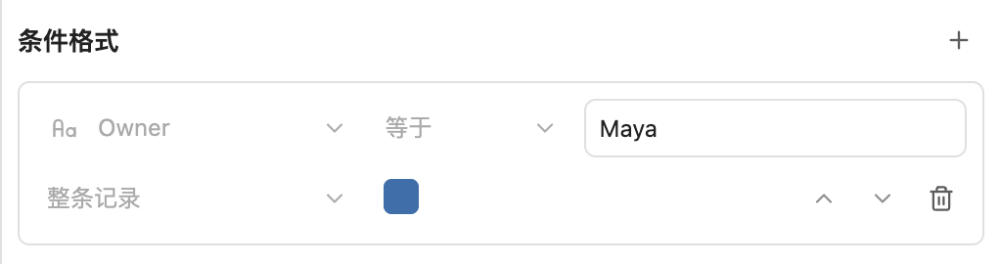 |  |
| 按当前视图的规则，为命中的属性或整条记录着色。 | 在分组视图中添加并排序计数、求和、平均值、最大/最小值等小计。 |

快捷筛选与排序标签和工具栏完整面板使用同一套规则。来源规则可用 `AND`、`OR`、`NOT` 组合文件夹、标签、属性、链接和表达式。

## 计算，也让笔记彼此关联

| 计算属性 | 关联与汇总 |
| --- | --- |
| 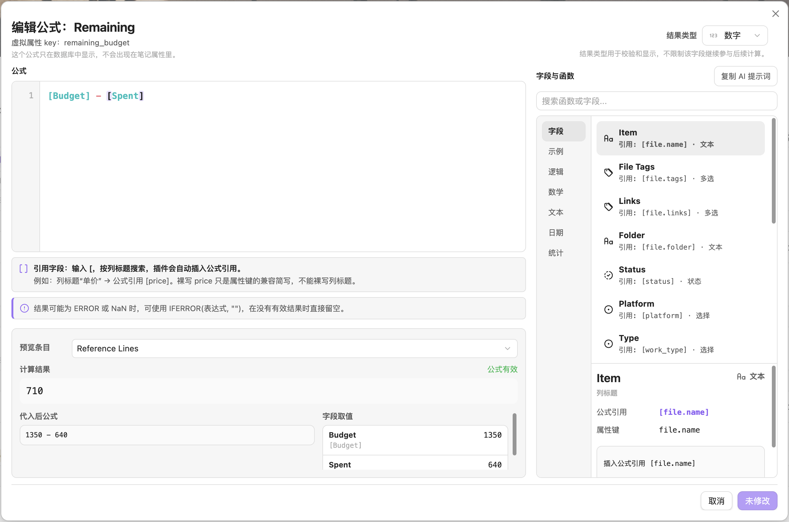 | 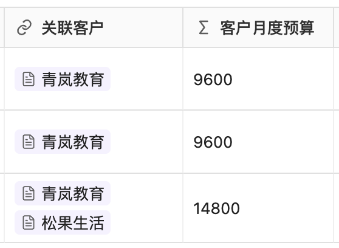 |
| 使用属性引用、日期/文本/数字函数、实时预览，以及可选的 frontmatter 同步。 | 用普通 Obsidian 双链保存关联，再计算数量、总和、平均值或列表。 |

插件不会使用 `eval`，也不会建立隐藏的关联数据库或云端副本。

## 让记录更容易辨认

| 数据库与记录图标 | 封面与视觉卡片 |
| --- | --- |
|  | 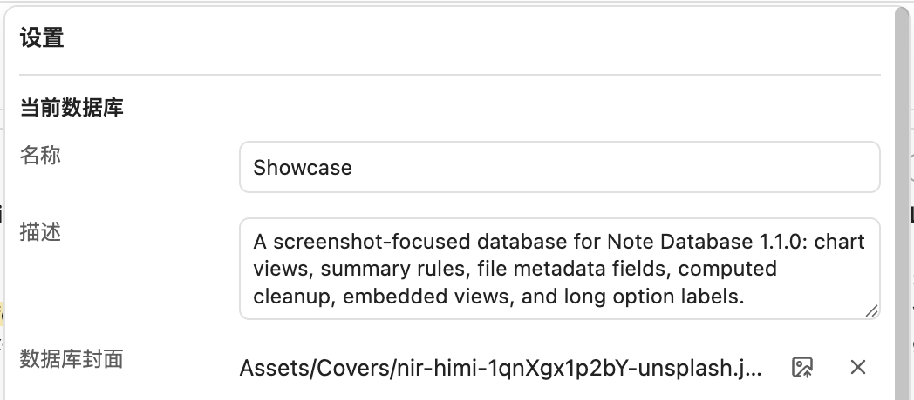 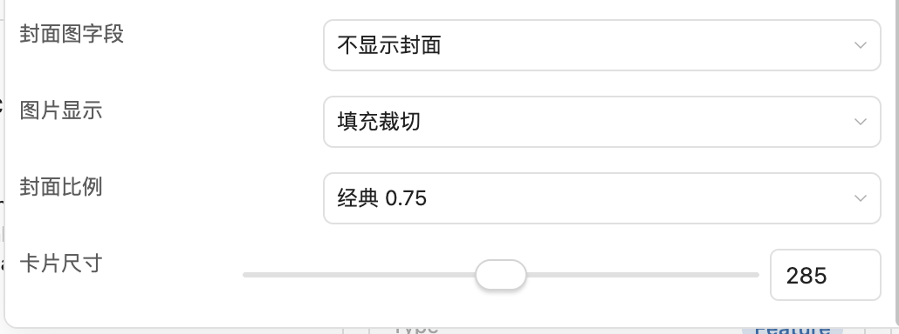|
| 使用 Unicode Emoji 或 Lucide 图标，并允许每个视图选择不同的记录图标属性。 | 拖动数据库封面调整位置；看板与画廊分别保存自己的封面设置。 |

选项类分组标题在表格、看板、画廊和列表中保持相同颜色。搜索会高亮文件名、可见属性和本地化日期。

## 安排日期，查看结果

| 日历与时间线搜索 | 图表明细与小计 |
| --- | --- |
|  |  |
| 搜索事件卡片中的可见字段，再拖动或调整 date / datetime 记录。 | 点击图表数值，先查看对应笔记，再决定是否加入筛选。 |

日历支持月、周、日；时间线支持日、周、月、季。

## 把数据库放进任意笔记

| 内嵌视图 | 隐藏表头的内嵌视图 |
| --- | --- |
| 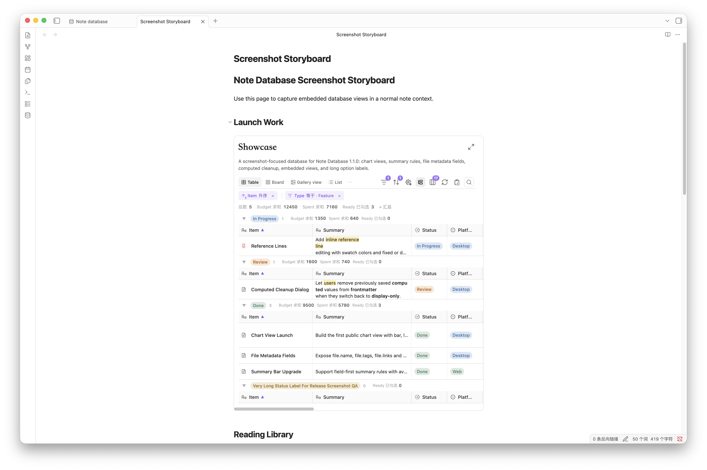 | 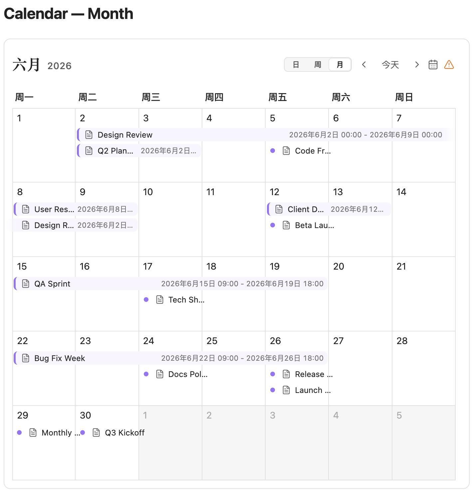 |
| 把自动生成的 `note-database` 代码块粘贴到任意笔记。 | 当笔记正文已经提供上下文时，可以隐藏数据库表头。 |

内嵌视图中的记录保持只读，但仍可切换视图、筛选、排序、分组、查看计算值，以及使用复制和导出工具。

## Markdown 始终是数据源

| 内容 | 保存方式 |
| --- | --- |
| 数据库 | 带有 `db_view: true` 的普通 Markdown 文件 |
| 记录与属性值 | Markdown 笔记及其 frontmatter |
| 关联 | frontmatter 中的 Obsidian 双链 |
| 模板 | 现有的 Obsidian Templates 或 Templater 文件 |
| 视图 | 保存在数据库文件中的配置 |

可以根据来源规则、分组、子组或当前行新建记录，并在创建时套用模板。也可导出 CSV + Markdown ZIP、复制 CSV / Markdown 表格，或转换 Obsidian `.base` 文件。

## 三步开始

1. 安装并启用 Note Database，从 ribbon 或命令面板打开数据库面板。
2. 创建数据库，选择文件夹或来源规则。
3. 添加属性与视图；编辑会写回原始 Markdown 文件。

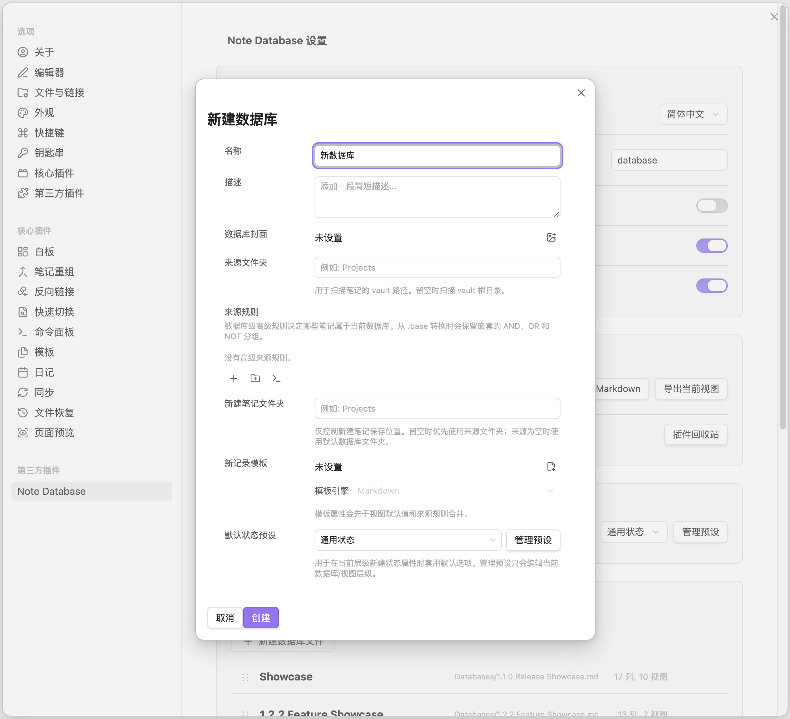

## 安装

1. 打开 **设置 → 第三方插件**。
2. 搜索 **Note Database**。
3. 安装并启用插件。

手动安装时，从[最新版本](https://github.com/pangy9/obsidian-note-database/releases/latest)下载 `main.js`、`styles.css` 和 `manifest.json`，复制到 `.obsidian/plugins/note-database/`。

## 隐私

Note Database 完全在 Obsidian 本地运行，不会把 vault 内容、metadata、公式或设置发送给外部服务。详情见[隐私说明](PRIVACY.md)。

## 支持与打赏

如果 Note Database 对你有帮助，可以给[仓库点一个 Star](https://github.com/pangy9/obsidian-note-database)，或支持后续开发：

版本说明和完整更新历史见 [GitHub Releases](https://github.com/pangy9/obsidian-note-database/releases)。
