# Screenshots

Generated by `npm run screenshots`. Do not edit by hand — this file and every image
below are rewritten on each capture.

Each shot renders the shipped `styles.css` against mock data in headless Chrome, so it
shows what the stylesheet produces rather than a live vault. `npm run screenshots:verify`
fails when a source file listed under a shot has changed since it was captured.

## components

### Add view popover

Tiles keep icon and caption inside their own bounds; the duplicate checkbox is not stretched.

| dark | light |
|---|---|
| 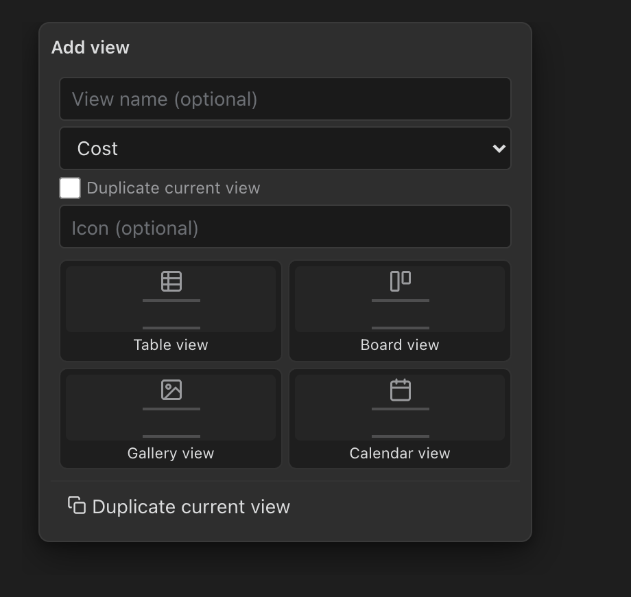 | 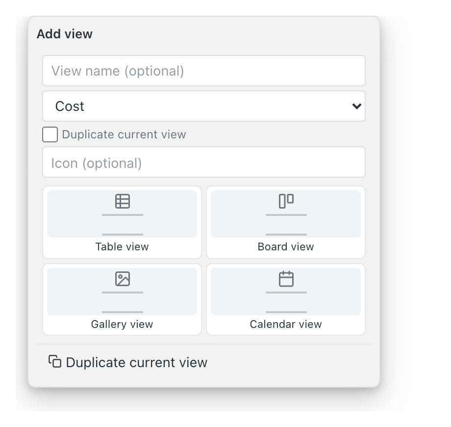 |

Sources: `src/views/ToolbarRenderer.ts`

### Dropdown with disabled option

A disabled option is dimmed and carries a tooltip rather than inline explanatory text.

| dark | light |
|---|---|
| 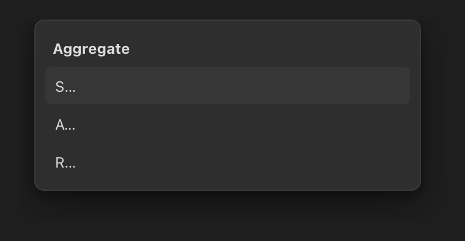 | 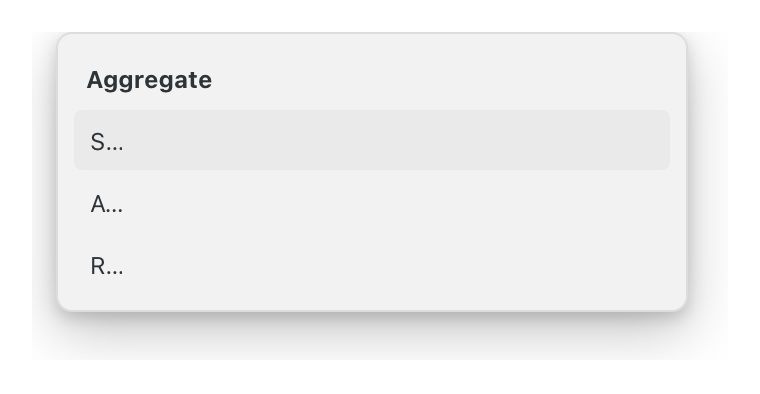 |

Sources: `src/views/DropdownField.ts`

### Column header affordances

The menu trigger sits inline after the label and the label truncates before it moves.

| dark | light |
|---|---|
| 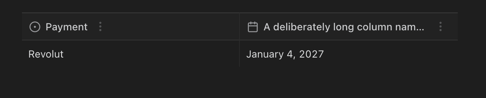 | 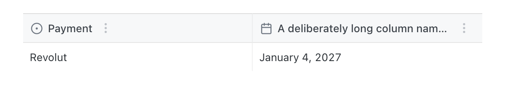 |

Sources: `src/views/ColumnHeaderController.ts`

## states

### Empty state

| dark | light |
|---|---|
| 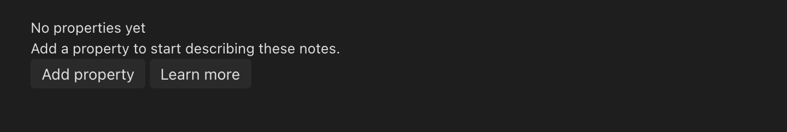 | 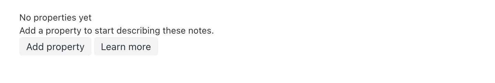 |

Sources: `src/views/EmptyStateRenderer.ts`

## views

### Board view

| dark | light |
|---|---|
| 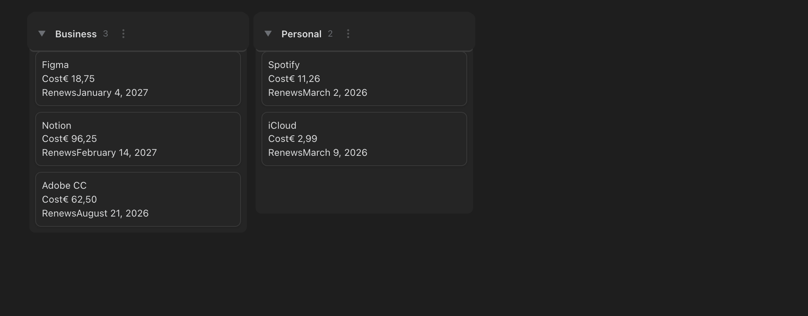 | 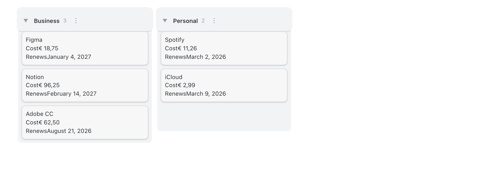 |

Sources: `src/views/BoardRenderer.ts`, `src/views/CardFieldRenderer.ts`

### Gallery view

| dark | light |
|---|---|
| 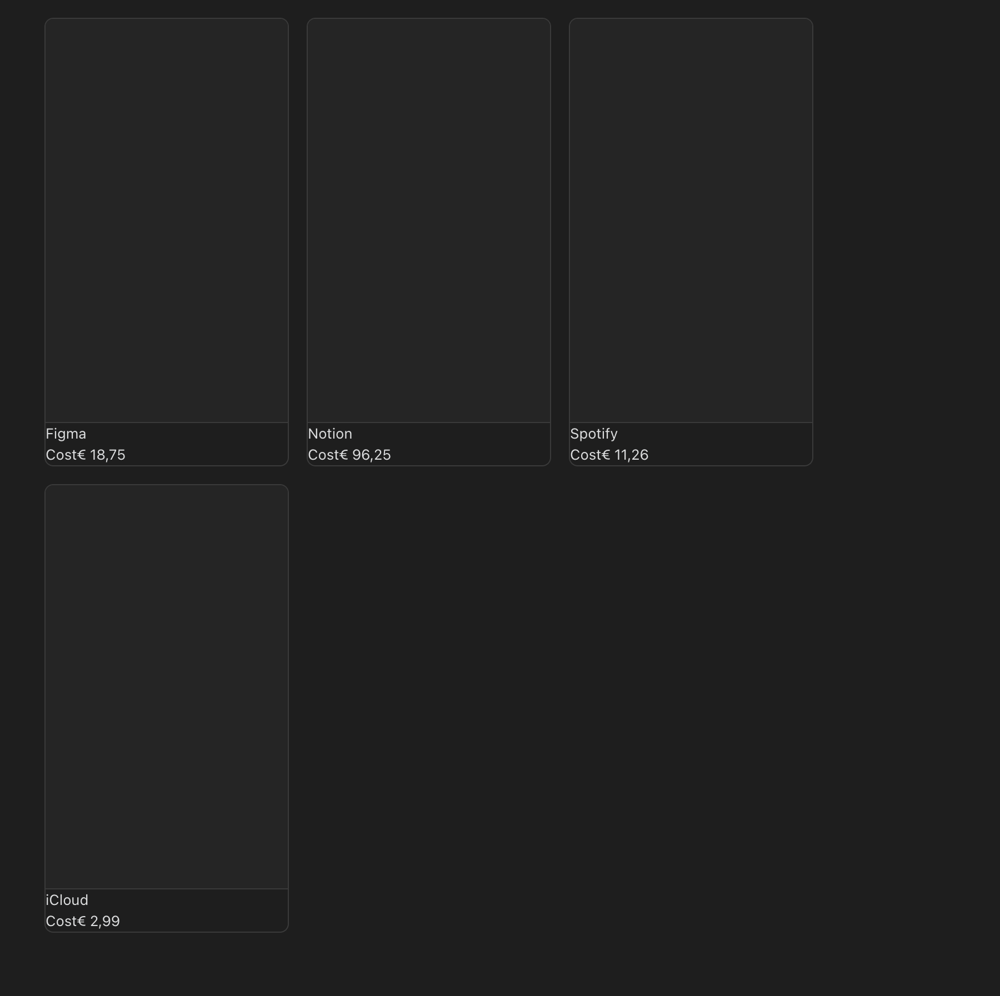 | 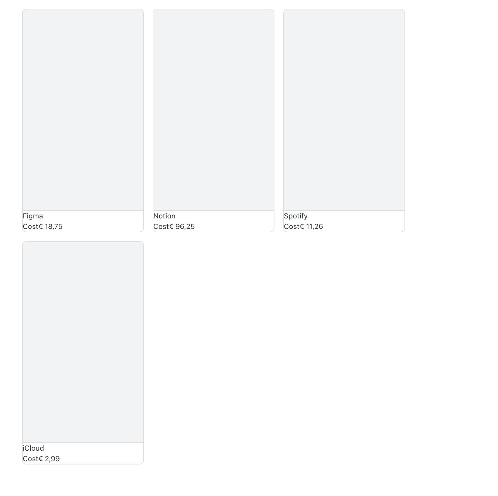 |

Sources: `src/views/GalleryRenderer.ts`, `src/views/CardFieldRenderer.ts`

### List view

| dark | light |
|---|---|
| 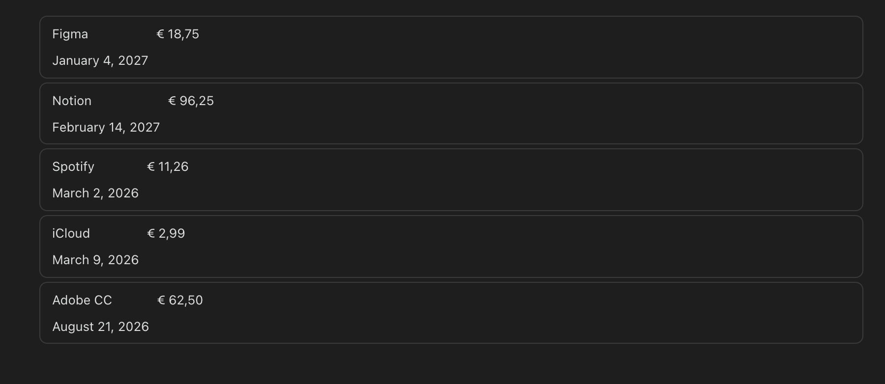 | 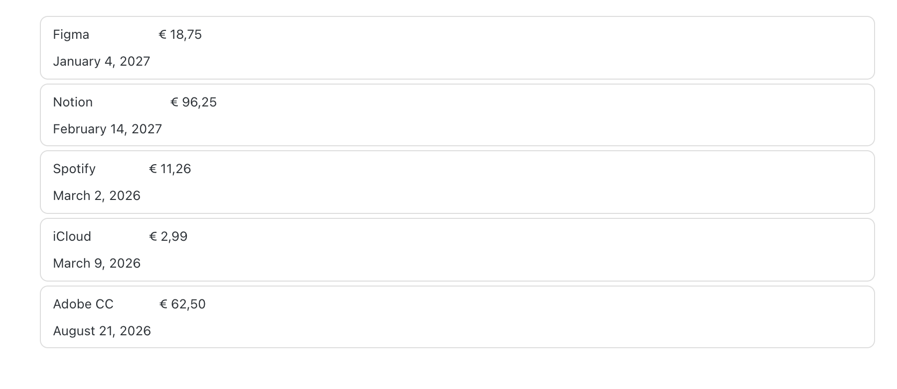 |

Sources: `src/views/ListRenderer.ts`, `src/views/CardFieldRenderer.ts`

### Table view

| dark | light |
|---|---|
| 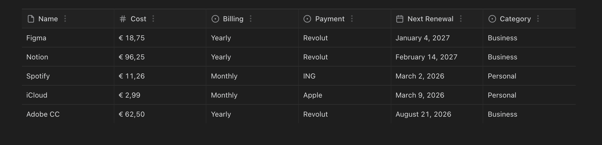 | 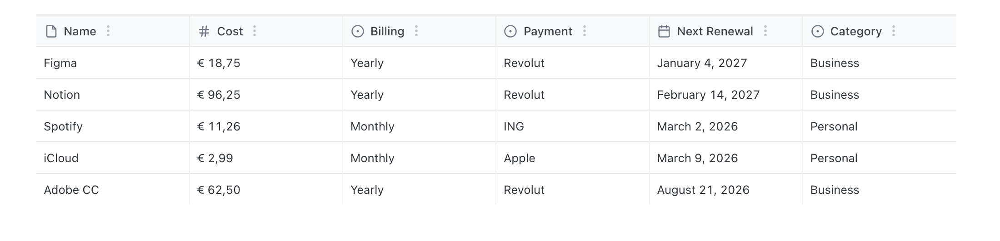 |

Sources: `src/views/TableRenderer.ts`, `src/views/ColumnHeaderController.ts`, `src/views/CellRenderer.ts`
