# Screenshots

Generated by `npm run screenshots`. Do not edit by hand — this file and every image
below are rewritten on each capture.

Each shot renders the shipped `styles.css` against mock data in headless Chrome, so it
shows what the stylesheet produces rather than a live vault. `npm run screenshots:verify`
fails when a source file listed under a shot has changed since it was captured.

## components

### Add view popover

Settings above, actions below, one row grammar for both the seven types and the duplicate.

| dark | light |
|---|---|
|  |  |

Sources: `src/views/toolbar-renderer.ts`

### Board card titled by a currency column

The view's titleField points at the Cost column: the card's main name reads that column's own euro-formatted text (resolveTitleFieldDisplay's typed-format routing) instead of the raw stored number — the operator's phone report, closed. Cost is left out of the meta list below the title, matching how a card's own property list already excludes whichever column is chosen as its title. The constructed-board-title-currency capture is the authority for this state — it mounts the real BoardRenderer; this fixture stays registered for the class-structure coverage a hand-built markup fixture gives.

| dark | light |
|---|---|
| 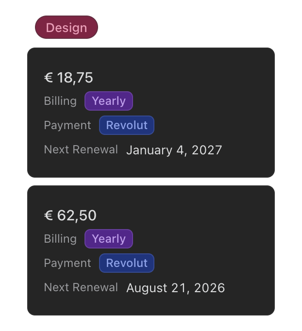 | 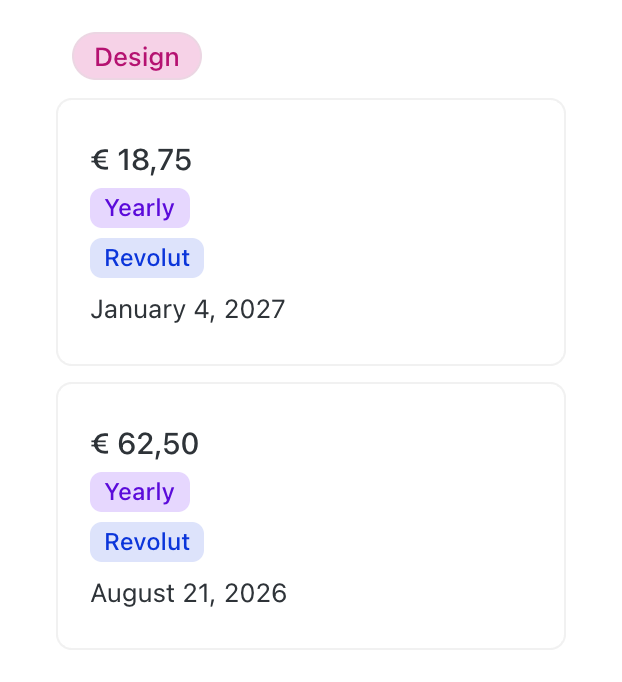 |

Sources: `src/data/title-field-display.ts`, `src/views/board-renderer.ts`, `src/views/card-field-renderer.ts`, `src/views/record-surface/property-row.ts`

### Board view — drag and drop-target language

A frozen mid-drag frame, reordering a card inside its own column: the cards container carries the class its own dragover listener adds (obnotion-kanban-drop-target), and the dragged card keeps the dragstart lift (obnotion-kanban-card--dragging) — the same classes the drag handlers add on dragover/dragenter, applied without a live pointer. The reference reorders live by moving the dragged card's own element ahead of or behind its neighbour on dragover, not by drawing a separate before/after insertion line, so the third card here is an ordinary neighbour rather than a distinct hovered state.

| dark | light |
|---|---|
|  |  |

Sources: `src/views/board-renderer.ts`

### Board view — empty column

A populated lane beside an empty lane, preserving the rendered column header and empty cards container.

| dark | light |
|---|---|
|  |  |

Sources: `src/views/board-renderer.ts`

### Card covers, board

The empty cover in the board's card: the same Lucide image glyph on --background-secondary at a 0.75 aspect ratio the board has always drawn.

| dark | light |
|---|---|
|  |  |

Sources: `src/views/board-renderer.ts`

### Active rule popover — filter

Editing one chip opens the filter panel's single-rule editor: field, operator and value, with no remove button.

| dark | light |
|---|---|
|  |  |

Sources: `src/views/active-rule-popover-renderer.ts`, `src/views/filter-panel-renderer.ts`

### Active rule popover — sort

The sort variant adds obnotion-sort-panel and drops the drag handle and reorder buttons the full panel shows.

| dark | light |
|---|---|
|  |  |

Sources: `src/views/active-rule-popover-renderer.ts`, `src/views/sort-panel-renderer.ts`

### Active filter and sort chips

The rail lives in the header below the toolbar. Sort chips come first and carry their position as a superscript; the AND button between the groups toggles filter logic.

| dark | light |
|---|---|
|  |  |

Sources: `src/views/active-view-controls-renderer.ts`

### Grouped table header rows

Every group field here is option-typed, so every divider title is a colored status badge — at both nesting depths. Per-group summaries sit at the right of each divider.

| dark | light |
|---|---|
|  |  |

Sources: `src/views/group-label-renderer.ts`, `src/views/table-renderer.ts`, `src/views/summary-renderer.ts`

### Owned menu — the shell every context menu uses

Deliberately not wrapped in obnotion-container: this menu mounts on document.body, so a fixture that wrapped it would photograph a surface the plugin never ships. Chromed from Obsidian's own menu variables so it matches the app's real menus and follows a theme that restyles them.

| dark | light |
|---|---|
|  |  |

Sources: `src/views/owned-menu.ts`, `src/views/menu-row.ts`

### Owned menu — the sheet presentation on a phone

The phone form of the owned menu. Rows share one left edge with the icon in a fixed leading column, hairlines divide neighbours but not the last row of a group, and a row that opens a submenu carries a trailing chevron. Captured in viewport mode so the fixed sheet docks at the bottom. Every row carries its icon, including the destructive one: `ColumnMenu` builds that row with `icon: "trash"`, and the fixture drew it bare — a picture of a row the renderer does not make. The icon-less shape is real elsewhere and is exercised where it belongs, by the placement lane's own three-row menu.

| dark | light |
|---|---|
|  |  |

Sources: `src/views/owned-menu.ts`, `src/views/menu-row.ts`, `src/views/mobile-bottom-sheet.ts`

### Owned menu — the row whose submenu is open

The same menu as the fixture above with one row in its open-submenu state, which is the only state the stylesheet draws differently and the one no other capture reaches. The child menu itself is not drawn here: where it lands is arithmetic the plugin runs in JavaScript against a live viewport, and a fixture that placed it would be photographing a guess at that arithmetic rather than the stylesheet this harness exists to photograph.

| dark | light |
|---|---|
| 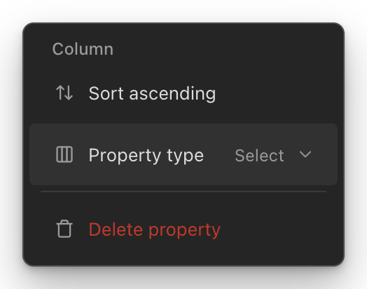 | 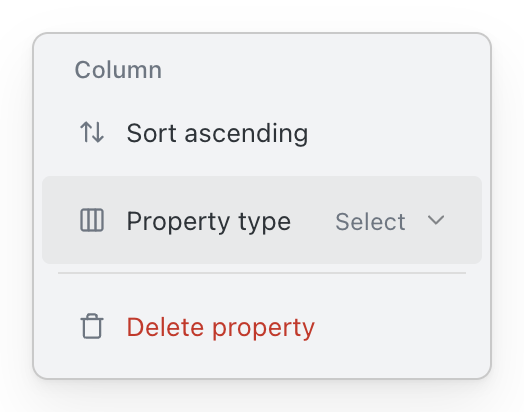 |

Sources: `src/views/owned-menu.ts`, `src/views/menu-row.ts`

### Cell selection status bar

The bar that appears while table cells are selected. Its checkbox clears the selection, so it is always rendered checked.

| dark | light |
|---|---|
|  |  |

Sources: `src/views/embedded-database-renderer.ts`

### Summary row

Total is always present; each configured summary rule is a draggable, clickable item, and the faint + Summary entry adds another.

| dark | light |
|---|---|
|  |  |

Sources: `src/views/summary-renderer.ts`

### Table footer aggregates

A column with summary rules stacks each kind over its result; a column without one shows a + Calculate hint that the stylesheet keeps at zero opacity until the trigger is hovered, so it is invisible here by design.

| dark | light |
|---|---|
|  |  |

Sources: `src/views/table-footer-renderer.ts`, `src/views/table-renderer.ts`

### Embedded table — Load more row

The row `renderTableLoadMoreRow` appends once an embedded table's page limit is reached, colspan read off the real header rather than a second column count. 30px cell / 29px button on desktop; the phone (`is-phone`) capture holds the same 44px thumb floor this stylesheet's other phone rows use.

| dark | light |
|---|---|
| 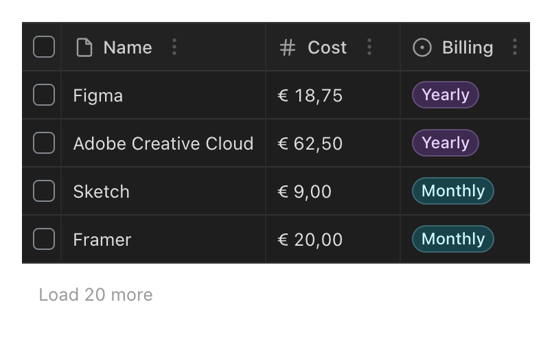 | 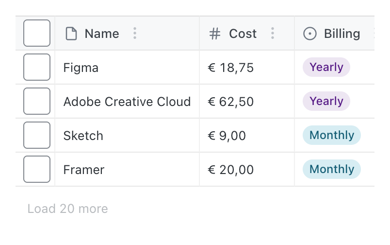 |

Sources: `src/views/embedded-database-renderer.ts`, `styles.css`

### Toast — error, sticky until dismissed

An error toast carries no auto-dismiss timer and no action row — `showToast` builds the row unconditionally and `:empty` hides it, so a plain error photographs with no stray gap under its message.

| dark | light |
|---|---|
| 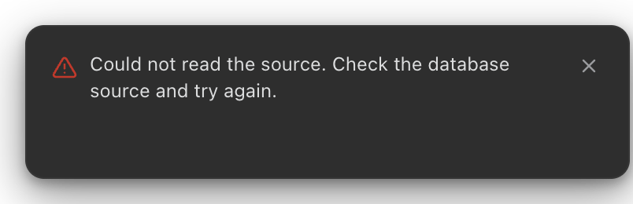 | 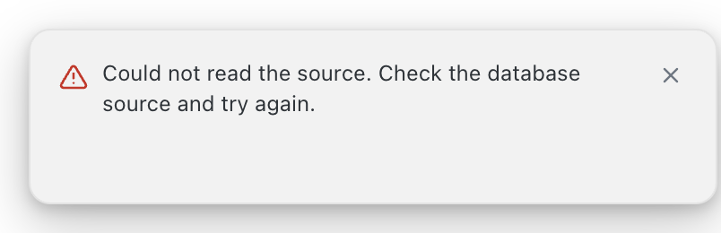 |

Sources: `src/views/toast.ts`

### Toast — success, with an Undo action

The shared feedback surface `showToast` builds, raised here exactly as the gallery-migration notice raises it: success severity, paired with the check glyph rather than colour alone, and an Undo action. Not wrapped in `obnotion-container`: this stack mounts on `doc.body`, so a fixture that wrapped it would photograph a surface the plugin never ships.

| dark | light |
|---|---|
| 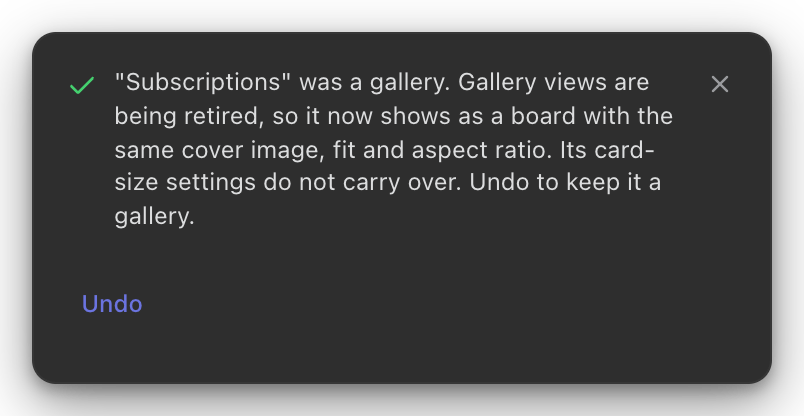 | 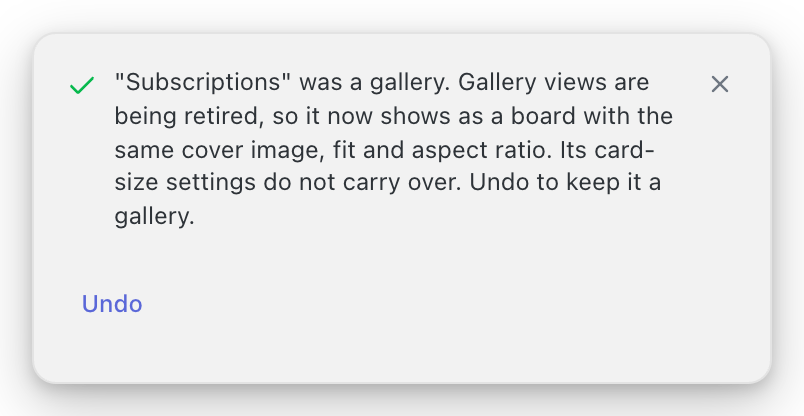 |

Sources: `src/views/toast.ts`

### Main toolbar

View switcher on the left; query, properties, utilities and creation clusters on the right. The search control sits collapsed in the utilities cluster until it has text or focus.

| dark | light |
|---|---|
|  |  |

Sources: `src/views/toolbar-renderer.ts`

### Toolbar search, collapsed and expanded

The wrap is 28px wide at rest and widens to 150px under is-active; the clear button is hidden until the input has text.

| dark | light |
|---|---|
|  |  |

Sources: `src/views/toolbar-renderer.ts`

### More-tools dropdown

The toolbar's overflow menu. Rows come from the shared createMenuRow but carry obnotion-toolbar-menu-row, whose own inline padding is what the heading is aligned to.

| dark | light |
|---|---|
|  |  |

Sources: `src/views/toolbar-renderer.ts`, `src/views/menu-row.ts`

### View switcher tablist

The active tab carries is-active; the ⋯ tab appears only once the toolbar has measured tabs out of view, and opens the all-views hub.

| dark | light |
|---|---|
|  |  |

Sources: `src/views/toolbar-renderer.ts`

### Active rule popover — filter (constructed)

ActiveRulePopoverRenderer's own toggleFilter against a real anchor, with the panel built by FilterPanelRenderer's renderSingleRuleEditor; captured full-page for its position: fixed placement.

| dark | light |
|---|---|
|  |  |

Sources: `src/views/active-rule-popover-renderer.ts`, `tools/bench/table-render-bench.ts`, `tools/live/render-assertion-harness.ts`, `tools/live/render-assertion-bundle.mjs`, `tools/screenshots/constructed-scenarios.mjs`, `tools/storybook/obsidian-stub.mjs`, `tools/storybook/obsidian-dom-shim.mjs`, `src/views/filter-panel-renderer.ts`, `src/views/dropdown-field.ts`, `src/views/popover-position.ts`

### Active rule popover — sort (constructed)

The sort twin of the filter popover: toggleSort against a real anchor with SortPanelRenderer's renderSingleRuleEditor; captured full-page for the same reason.

| dark | light |
|---|---|
|  |  |

Sources: `src/views/active-rule-popover-renderer.ts`, `tools/bench/table-render-bench.ts`, `tools/live/render-assertion-harness.ts`, `tools/live/render-assertion-bundle.mjs`, `tools/screenshots/constructed-scenarios.mjs`, `tools/storybook/obsidian-stub.mjs`, `tools/storybook/obsidian-dom-shim.mjs`, `src/views/sort-panel-renderer.ts`, `src/views/dropdown-field.ts`, `src/views/popover-position.ts`

### Active filter and sort chips (constructed)

ActiveViewControlsRenderer's own render over a state with two effective filters and two sorts, so the AND logic button sits between the groups exactly as the chip row draws it.

| dark | light |
|---|---|
|  |  |

Sources: `src/views/active-view-controls-renderer.ts`, `tools/bench/table-render-bench.ts`, `tools/live/render-assertion-harness.ts`, `tools/live/render-assertion-bundle.mjs`, `tools/screenshots/constructed-scenarios.mjs`, `tools/storybook/obsidian-stub.mjs`, `tools/storybook/obsidian-dom-shim.mjs`, `src/views/filter-panel-renderer.ts`

### Board view — a stored field list hides a column (constructed)

The default board, with an explicit boardCardFields list that reproduces today's derived order verbatim except for hiding the schema's first currency column — the card-level half of the board-card-properties pair: the panel shows the field unchecked, this shows the same list already applied to a real card.

| dark | light |
|---|---|
| 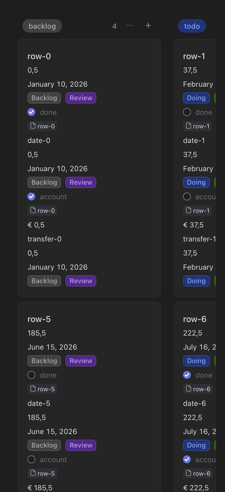 | 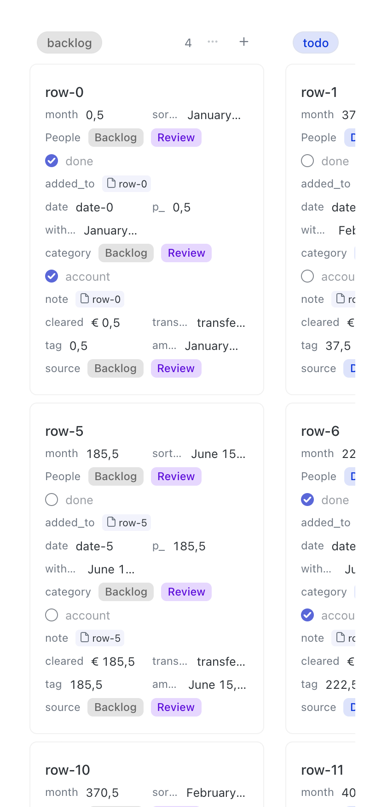 |

Sources: `src/views/board-renderer.ts`, `tools/bench/board-render-bench.ts`, `tools/live/render-assertion-harness.ts`, `tools/live/render-assertion-bundle.mjs`, `tools/screenshots/constructed-scenarios.mjs`, `tools/storybook/obsidian-stub.mjs`, `tools/storybook/obsidian-dom-shim.mjs`, `src/views/board-card-fields.ts`

### Board view — empty column (constructed)

The reference board with one configured select option no row carries, backfilled as a zero-row column through the same withEmptyOptionGroups call the hosts make.

| dark | light |
|---|---|
|  |  |

Sources: `src/views/board-renderer.ts`, `tools/bench/board-render-bench.ts`, `tools/live/render-assertion-harness.ts`, `tools/live/render-assertion-bundle.mjs`, `tools/screenshots/constructed-scenarios.mjs`, `tools/storybook/obsidian-stub.mjs`, `tools/storybook/obsidian-dom-shim.mjs`, `src/views/card-field-renderer.ts`, `src/views/record-surface/property-row.ts`, `src/data/group-visibility.ts`

### Board card titled by a currency column (constructed)

The reference board, titleField pointed at the schema's own currency column: the card's main name reads that column's formatted euro text through the real BoardRenderer, not a hand-written stand-in for its markup.

| dark | light |
|---|---|
| 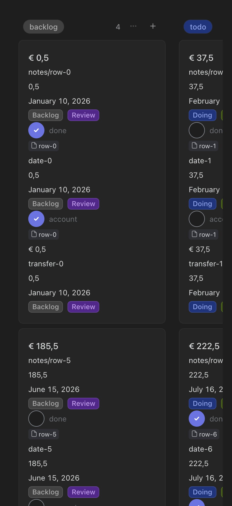 | 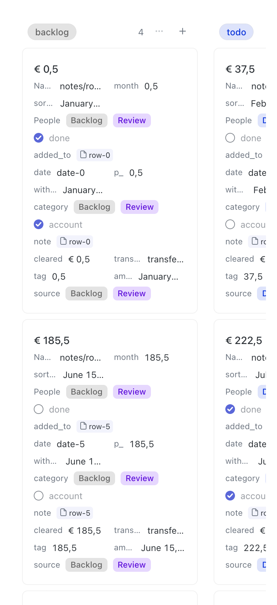 |

Sources: `src/views/board-renderer.ts`, `tools/bench/board-render-bench.ts`, `tools/live/render-assertion-harness.ts`, `tools/live/render-assertion-bundle.mjs`, `tools/screenshots/constructed-scenarios.mjs`, `tools/storybook/obsidian-stub.mjs`, `tools/storybook/obsidian-dom-shim.mjs`, `src/data/title-field-display.ts`, `src/views/card-field-renderer.ts`, `src/views/record-surface/property-row.ts`

### Board card title formatted from the file name (constructed)

The operator's own report: a card whose title source is the (unset, default) file name, and the file names are plain numbers. With a euro titleFormat chosen, the card's main name reads the formatted value, not the raw numeric file name.

| dark | light |
|---|---|
| 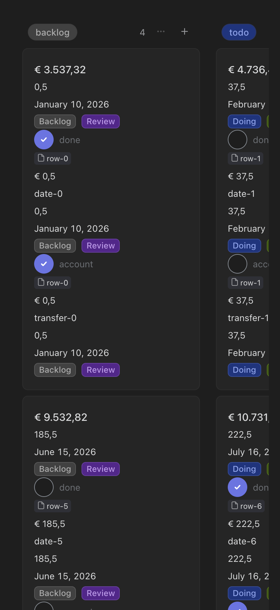 | 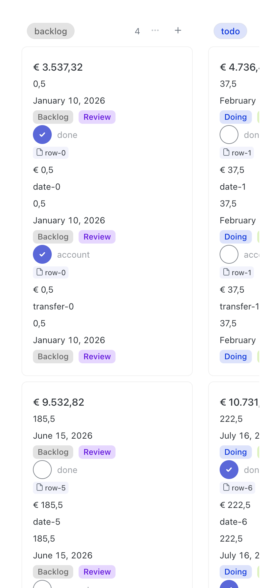 |

Sources: `src/views/board-renderer.ts`, `tools/bench/board-render-bench.ts`, `tools/live/render-assertion-harness.ts`, `tools/live/render-assertion-bundle.mjs`, `tools/screenshots/constructed-scenarios.mjs`, `tools/storybook/obsidian-stub.mjs`, `tools/storybook/obsidian-dom-shim.mjs`, `src/data/title-field-display.ts`

### Card covers, board (constructed)

The empty cover in the board card: the renderer with an image field the rows resolve nothing for, which is the only cover state a capture without a vault can show. This used to mount the gallery's own empty cover beside it, asserted by constructed-state-assertions rather than photographed; the gallery is retired, so only the board host is built here now.

| dark | light |
|---|---|
|  |  |

Sources: `src/views/board-renderer.ts`, `tools/bench/board-render-bench.ts`, `tools/live/render-assertion-harness.ts`, `tools/live/render-assertion-bundle.mjs`, `tools/screenshots/constructed-scenarios.mjs`, `tools/storybook/obsidian-stub.mjs`, `tools/storybook/obsidian-dom-shim.mjs`

### Column header affordances (constructed)

The header cell the table renderer builds with ColumnHeaderController.setup applied — the call database-view.ts wires into its setupColumnHeader action — with one label long enough to truncate.

| dark | light |
|---|---|
|  |  |

Sources: `src/views/column-header-controller.ts`, `tools/bench/table-render-bench.ts`, `tools/live/render-assertion-harness.ts`, `tools/live/render-assertion-bundle.mjs`, `tools/screenshots/constructed-scenarios.mjs`, `tools/storybook/obsidian-stub.mjs`, `tools/storybook/obsidian-dom-shim.mjs`

### Dropdown with disabled option (constructed)

openDropdownMenu's own entry with a selected option, a plain one and a disabled one carrying the reason its tooltip exists to surface. Three options, and the desktop panel still carries a search row: a menu with no field-shaped trigger to type into gets its query field first in the panel, whatever the list's length.

| dark | light |
|---|---|
|  |  |

Sources: `src/views/dropdown-field.ts`, `tools/bench/table-render-bench.ts`, `tools/live/render-assertion-harness.ts`, `tools/live/render-assertion-bundle.mjs`, `tools/screenshots/constructed-scenarios.mjs`, `tools/storybook/obsidian-stub.mjs`, `tools/storybook/obsidian-dom-shim.mjs`

### Dropdown escalated to a desktop sheet (constructed)

createDropdownField's own entry with thirty options — long enough that resolveDesktopDropdownFit's natural-height estimate cannot fit beside the anchor at any position in this viewport, the measured condition the anchored branch itself escalates on. The trigger stays a button; the escalated sheet carries the family's own titled header and an unconditional search row instead of the trigger-as-query-field the ordinary combobox scenario shows.

| dark | light |
|---|---|
| 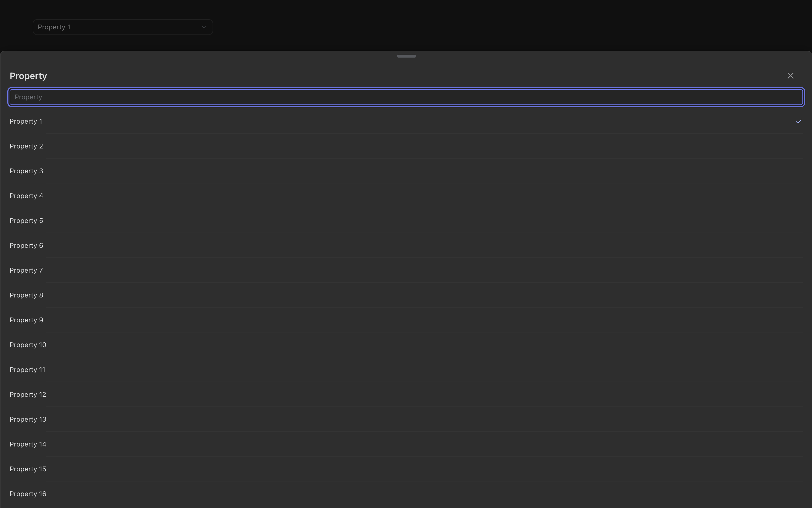 | 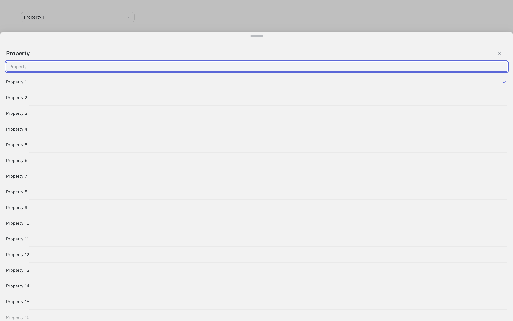 |

Sources: `src/views/dropdown-field.ts`, `tools/bench/table-render-bench.ts`, `tools/live/render-assertion-harness.ts`, `tools/live/render-assertion-bundle.mjs`, `tools/screenshots/constructed-scenarios.mjs`, `tools/storybook/obsidian-stub.mjs`, `tools/storybook/obsidian-dom-shim.mjs`, `src/views/popover-position.ts`

### Searchable dropdown with a typed filter (constructed)

createDropdownField's own combobox entry: a labelled field clicked open, its trigger replaced in place by the query input, and "ri" typed into it so the list narrows live. The phone profile of the same scenario shows the sheet's own search row instead, the grammar the desktop change leaves alone.

| dark | light |
|---|---|
| 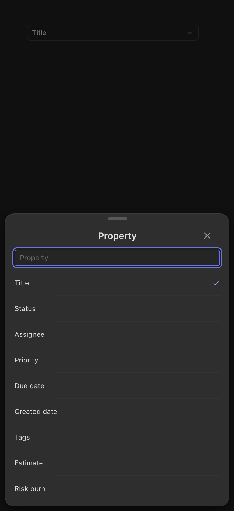 | 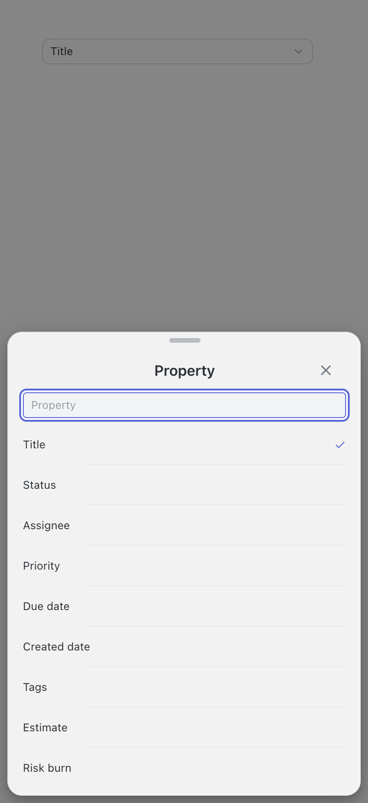 |

Sources: `src/views/dropdown-field.ts`, `tools/bench/table-render-bench.ts`, `tools/live/render-assertion-harness.ts`, `tools/live/render-assertion-bundle.mjs`, `tools/screenshots/constructed-scenarios.mjs`, `tools/storybook/obsidian-stub.mjs`, `tools/storybook/obsidian-dom-shim.mjs`, `src/views/popover-position.ts`

### A migrated list view (constructed)

A config built as viewType: "list", run through the production planListMigration/applyListMigration, then mounted as TableRenderer. Photographs a real table, not a hand-authored one. The migrated table is the proof.

| dark | light |
|---|---|
|  |  |

Sources: `src/views/table-renderer.ts`, `tools/bench/table-render-bench.ts`, `tools/live/render-assertion-harness.ts`, `tools/live/render-assertion-bundle.mjs`, `tools/screenshots/constructed-scenarios.mjs`, `tools/storybook/obsidian-stub.mjs`, `tools/storybook/obsidian-dom-shim.mjs`, `src/data/list-migration.ts`

### Owned menu — the shell every context menu uses (constructed)

createOwnedMenu's own entry with rows built through the handle's addRow the way ColumnMenu builds them. The menu mounts on document.body by design, so the capture is full-page; the phone device pass becomes the bottom-sheet presentation through the module's own showAt placement. Supersedes the desktop menu and the phone sheet fixtures together.

| dark | light |
|---|---|
|  |  |

Sources: `src/views/owned-menu.ts`, `tools/bench/table-render-bench.ts`, `tools/live/render-assertion-harness.ts`, `tools/live/render-assertion-bundle.mjs`, `tools/screenshots/constructed-scenarios.mjs`, `tools/storybook/obsidian-stub.mjs`, `tools/storybook/obsidian-dom-shim.mjs`, `src/views/menu-row.ts`, `src/views/mobile-bottom-sheet.ts`

### Summary row (constructed)

SummaryRenderer's own render with the onChange hook that makes the rule items draggable and clickable, over the same three rule kinds the grouped table uses.

| dark | light |
|---|---|
|  |  |

Sources: `src/views/summary-renderer.ts`, `tools/bench/table-render-bench.ts`, `tools/live/render-assertion-harness.ts`, `tools/live/render-assertion-bundle.mjs`, `tools/screenshots/constructed-scenarios.mjs`, `tools/storybook/obsidian-stub.mjs`, `tools/storybook/obsidian-dom-shim.mjs`

### Table footer aggregates (constructed)

The constructed table with summary rules configured on a currency, a date and a select column, so the footer the table renders stacks real calculated results.

| dark | light |
|---|---|
|  |  |

Sources: `src/views/table-renderer.ts`, `tools/bench/table-render-bench.ts`, `tools/live/render-assertion-harness.ts`, `tools/live/render-assertion-bundle.mjs`, `tools/screenshots/constructed-scenarios.mjs`, `tools/storybook/obsidian-stub.mjs`, `tools/storybook/obsidian-dom-shim.mjs`, `src/views/table-footer-renderer.ts`, `src/views/cell-renderer.ts`

### Grouped table header rows (constructed)

renderGroupedTable's own entry over a two-level group tree with summary rules, so the divider rows carry their coloured badges at both depths and their computed totals.

| dark | light |
|---|---|
|  |  |

Sources: `src/views/table-renderer.ts`, `tools/bench/table-render-bench.ts`, `tools/live/render-assertion-harness.ts`, `tools/live/render-assertion-bundle.mjs`, `tools/screenshots/constructed-scenarios.mjs`, `tools/storybook/obsidian-stub.mjs`, `tools/storybook/obsidian-dom-shim.mjs`, `src/views/group-label-renderer.ts`, `src/views/summary-renderer.ts`

### Main toolbar (constructed)

ToolbarRenderer's own render over a one-view database: heading, view tabs, and the query, properties, utilities and creation clusters. The view-switcher fixture this also supersedes showed the tabs alone; here they sit in the header that owns them.

| dark | light |
|---|---|
|  |  |

Sources: `src/views/toolbar-renderer.ts`, `tools/bench/table-render-bench.ts`, `tools/live/render-assertion-harness.ts`, `tools/live/render-assertion-bundle.mjs`, `tools/screenshots/constructed-scenarios.mjs`, `tools/storybook/obsidian-stub.mjs`, `tools/storybook/obsidian-dom-shim.mjs`

### Add view popover (constructed)

The view-tab plus button clicked, opening the add-view popover through showAddViewMenu's own onclick; captured full-page for the same position: fixed reason as the utilities popover.

| dark | light |
|---|---|
|  |  |

Sources: `src/views/toolbar-renderer.ts`, `tools/bench/table-render-bench.ts`, `tools/live/render-assertion-harness.ts`, `tools/live/render-assertion-bundle.mjs`, `tools/screenshots/constructed-scenarios.mjs`, `tools/storybook/obsidian-stub.mjs`, `tools/storybook/obsidian-dom-shim.mjs`, `src/views/menu-row.ts`, `src/views/popover-position.ts`

### Toolbar search, active (constructed)

The same toolbar with the view state's search text set, which is the real input that widens the collapsed wrap and reveals the clear button. The collapsed wrap is in frame in the plain toolbar capture.

| dark | light |
|---|---|
|  |  |

Sources: `src/views/toolbar-renderer.ts`, `tools/bench/table-render-bench.ts`, `tools/live/render-assertion-harness.ts`, `tools/live/render-assertion-bundle.mjs`, `tools/screenshots/constructed-scenarios.mjs`, `tools/storybook/obsidian-stub.mjs`, `tools/storybook/obsidian-dom-shim.mjs`

### More-tools dropdown (constructed)

The toolbar's More-tools button clicked, opening the utilities popover through renderUtilitiesOverflowButton's own onclick; captured full-page because the popover positions itself with position: fixed.

| dark | light |
|---|---|
|  |  |

Sources: `src/views/toolbar-renderer.ts`, `tools/bench/table-render-bench.ts`, `tools/live/render-assertion-harness.ts`, `tools/live/render-assertion-bundle.mjs`, `tools/screenshots/constructed-scenarios.mjs`, `tools/storybook/obsidian-stub.mjs`, `tools/storybook/obsidian-dom-shim.mjs`, `src/views/menu-row.ts`, `src/views/popover-position.ts`

### Dropdown with disabled option

A disabled option is dimmed and carries a tooltip rather than inline explanatory text.

| dark | light |
|---|---|
|  |  |

Sources: `src/views/dropdown-field.ts`

### Base import confirm modal

The include box in the base-import column table. Same field role as every other modal box, mounted in a centred table cell.

| dark | light |
|---|---|
|  |  |

Sources: `src/views/modals/base-import-confirm-modal.ts`

### Computed field cleanup modal

The one checkbox family that mounts under the modal root instead of the view container. Its box must match every other field-role box.

| dark | light |
|---|---|
|  |  |

Sources: `src/views/modals/computed-frontmatter-cleanup-modal.ts`

### Invalid time events modal

The select box in the invalid-events grid. It carries placement of its own — centred in the 28px lead column — on top of the shared field-role appearance. Every row is invalid, which is the only state this modal opens in: a red dot after the name, a red-bordered end input, and a span reading "Still invalid" rather than a duration. The phone form is the compact-and-narrow grid the modal's own ResizeObserver switches to below 1040 and 680.

| dark | light |
|---|---|
|  |  |

Sources: `src/views/modals/invalid-time-events-modal.ts`

### Column header affordances

The menu trigger sits inline after the label and the label truncates before it moves.

| dark | light |
|---|---|
|  |  |

Sources: `src/views/column-header-controller.ts`

## fields

### Select cell in edit state (constructed)

The same startEdit entry on a select cell, opening the option-list editor over the column's own configured options. Captured full-page for the same positioning reason.

| dark | light |
|---|---|
|  |  |

Sources: `src/views/cell-renderer.ts`, `tools/bench/table-render-bench.ts`, `tools/live/render-assertion-harness.ts`, `tools/live/render-assertion-bundle.mjs`, `tools/screenshots/constructed-scenarios.mjs`, `tools/storybook/obsidian-stub.mjs`, `tools/storybook/obsidian-dom-shim.mjs`, `src/views/record-surface/cell-editor-option.ts`, `src/data/column-types.ts`

### Text cell in edit state (constructed)

CellRenderer's own startEdit — the entry database-view.ts wires into its editCell action — opened on a markdown text cell (toolbar and textarea) and on a number cell (single-line editor). Captured full-page because the editors position themselves against the cell.

| dark | light |
|---|---|
|  |  |

Sources: `src/views/cell-renderer.ts`, `tools/bench/table-render-bench.ts`, `tools/live/render-assertion-harness.ts`, `tools/live/render-assertion-bundle.mjs`, `tools/screenshots/constructed-scenarios.mjs`, `tools/storybook/obsidian-stub.mjs`, `tools/storybook/obsidian-dom-shim.mjs`, `src/views/record-surface/cell-editor-text.ts`, `src/views/record-surface/cell-editor-number.ts`

### Date value picker (constructed)

renderDateValuePicker's own trigger clicked, opening the popover through the module's own open handler with its presets, segments and the flat mini calendar.

| dark | light |
|---|---|
|  |  |

Sources: `src/views/date-value-picker.ts`, `tools/bench/table-render-bench.ts`, `tools/live/render-assertion-harness.ts`, `tools/live/render-assertion-bundle.mjs`, `tools/screenshots/constructed-scenarios.mjs`, `tools/storybook/obsidian-stub.mjs`, `tools/storybook/obsidian-dom-shim.mjs`, `src/views/calendar-mini-calendar-renderer.ts`

### Date value picker with time (constructed)

The datetime twin: the same trigger with the includeTime flag, adding the hour and minute segments and the clock icon.

| dark | light |
|---|---|
|  |  |

Sources: `src/views/date-value-picker.ts`, `tools/bench/table-render-bench.ts`, `tools/live/render-assertion-harness.ts`, `tools/live/render-assertion-bundle.mjs`, `tools/screenshots/constructed-scenarios.mjs`, `tools/storybook/obsidian-stub.mjs`, `tools/storybook/obsidian-dom-shim.mjs`, `src/views/calendar-mini-calendar-renderer.ts`

### File fields (constructed)

renderSpecialFileFieldValue's own dispatch for the file.tags badges and the link-list column, with the per-tag remove buttons the writable-cell context draws.

| dark | light |
|---|---|
|  |  |

Sources: `src/views/file-field-renderer.ts`, `tools/bench/table-render-bench.ts`, `tools/live/render-assertion-harness.ts`, `tools/live/render-assertion-bundle.mjs`, `tools/screenshots/constructed-scenarios.mjs`, `tools/storybook/obsidian-stub.mjs`, `tools/storybook/obsidian-dom-shim.mjs`

### Icon picker popover (constructed)

openIconPickerPopover's own entry with a lucide current token, which is what the module reads to open its Icons tab with the colour strip. The panel mounts on document.body, so the capture is full-page.

| dark | light |
|---|---|
|  |  |

Sources: `src/views/icon-picker-popover.ts`, `tools/bench/table-render-bench.ts`, `tools/live/render-assertion-harness.ts`, `tools/live/render-assertion-bundle.mjs`, `tools/screenshots/constructed-scenarios.mjs`, `tools/storybook/obsidian-stub.mjs`, `tools/storybook/obsidian-dom-shim.mjs`, `src/views/record-icon-renderer.ts`

### Number display styles (constructed)

renderRating, renderProgress and renderProgressRing's own entries, one style per row including the tinted variants that paint through the obnotion-num-color-* classes.

| dark | light |
|---|---|
|  |  |

Sources: `src/views/number-display-renderer.ts`, `tools/bench/table-render-bench.ts`, `tools/live/render-assertion-harness.ts`, `tools/live/render-assertion-bundle.mjs`, `tools/screenshots/constructed-scenarios.mjs`, `tools/storybook/obsidian-stub.mjs`, `tools/storybook/obsidian-dom-shim.mjs`, `src/data/number-display.ts`

### Option colour picker (constructed)

openOptionColorPicker's own entry with the current colour that rings the matching swatch. Mounts on document.body like the icon picker, so the capture is full-page.

| dark | light |
|---|---|
|  |  |

Sources: `src/views/option-color-picker.ts`, `tools/bench/table-render-bench.ts`, `tools/live/render-assertion-harness.ts`, `tools/live/render-assertion-bundle.mjs`, `tools/screenshots/constructed-scenarios.mjs`, `tools/storybook/obsidian-stub.mjs`, `tools/storybook/obsidian-dom-shim.mjs`, `src/data/status-colors.ts`

### Record icon (constructed)

The table's 28px icon gutter with a real renderRecordIcon bag member and an emoji token on one row. Coloured lucide tokens need Obsidian's getIconIds and degrade to the default fallback here, which is also what unparsed values draw.

| dark | light |
|---|---|
|  |  |

Sources: `src/views/record-icon-renderer.ts`, `tools/bench/table-render-bench.ts`, `tools/live/render-assertion-harness.ts`, `tools/live/render-assertion-bundle.mjs`, `tools/screenshots/constructed-scenarios.mjs`, `tools/storybook/obsidian-stub.mjs`, `tools/storybook/obsidian-dom-shim.mjs`, `src/views/table-renderer.ts`, `src/views/cell-renderer.ts`, `src/data/record-icon.ts`

### Relation values (constructed)

renderRelationValue's own entry with no App, the module's documented no-vault mode in which every target renders as resolved — the unresolved state needs a live metadata cache and stays fixture-only.

| dark | light |
|---|---|
|  |  |

Sources: `src/views/relation-value-renderer.ts`, `tools/bench/board-render-bench.ts`, `tools/live/render-assertion-harness.ts`, `tools/live/render-assertion-bundle.mjs`, `tools/screenshots/constructed-scenarios.mjs`, `tools/storybook/obsidian-stub.mjs`, `tools/storybook/obsidian-dom-shim.mjs`

### Status colour range (constructed)

A configured table whose option columns carry one value per status colour, with a multi-select row holding all sixteen, so the whole vocabulary renders as the renderer paints it.

| dark | light |
|---|---|
|  |  |

Sources: `src/views/table-renderer.ts`, `tools/bench/table-render-bench.ts`, `tools/live/render-assertion-harness.ts`, `tools/live/render-assertion-bundle.mjs`, `tools/screenshots/constructed-scenarios.mjs`, `tools/storybook/obsidian-stub.mjs`, `tools/storybook/obsidian-dom-shim.mjs`, `src/views/cell-renderer.ts`, `src/data/status-colors.ts`

### Select cell in edit state

Each row carries a drag handle, a colour dot that opens the colour picker, the check mark and a delete button. An unregistered value offers a plus instead of a trash icon.

| dark | light |
|---|---|
|  |  |

Sources: `src/views/cell-renderer.ts`, `src/views/record-surface/cell-editor-option.ts`, `src/data/column-types.ts`

### Text cell in edit state

Both editors keep the cell's rendered value visible underneath. The multi-line editor marks its cell with obnotion-cell-editing (the accent inset); the single-line one marks its cell with obnotion-cell-popover-editing, which the stylesheet declares no rule for, so that cell shows no edit affordance. Markdown columns gain the format toolbar.

| dark | light |
|---|---|
|  |  |

Sources: `src/views/cell-renderer.ts`, `src/views/record-surface/cell-editor-text.ts`, `src/views/record-surface/cell-editor-number.ts`

### Date value picker

The trigger shows the committed value; the popover stacks quick dates, the three segment inputs and the mini calendar, which renders flat inside the date popover rather than as its own floating surface.

| dark | light |
|---|---|
|  |  |

Sources: `src/views/date-value-picker.ts`, `src/views/calendar-mini-calendar-renderer.ts`

### Date value picker with time

A datetime column adds hour and minute segments after the date, and the trigger swaps calendar-days for calendar-clock.

| dark | light |
|---|---|
|  |  |

Sources: `src/views/date-value-picker.ts`, `src/views/calendar-mini-calendar-renderer.ts`

### File fields

file.tags render as status badges, link-list fields as compact chips, and file.file as a link back to the row's own note. The per-tag remove buttons are in the DOM of a writable cell but sit at opacity 0 until the badge is hovered, so they do not appear here.

| dark | light |
|---|---|
|  |  |

Sources: `src/views/file-field-renderer.ts`

### Icon picker popover

The Icons tab adds the colour strip; the picker is created on document.body, so it is a top-level element here rather than a child of the container.

| dark | light |
|---|---|
|  |  |

Sources: `src/views/icon-picker-popover.ts`, `src/views/record-icon-renderer.ts`

### Number display styles

Rating, progress bar and progress ring all tint through obnotion-num-color-*, which sets --obnotion-number-color. Half slots are the accent overlay clipped to 50%.

| dark | light |
|---|---|
|  |  |

Sources: `src/views/number-display-renderer.ts`, `src/data/number-display.ts`

### Option colour picker

A one-column labelled list (ADR-004) — sixteen rows in the persisted order, each a leading dot and its visible name, the current colour carrying the trailing tick every row in the family uses. Opened from the colour dot in the select editor and created on document.body. On a phone this is the family's own sheet, not the anchored popover: a header names the picker, and the same sixteen rows grow to the 44px floor.

| dark | light |
|---|---|
|  |  |

Sources: `src/views/option-color-picker.ts`, `src/views/popover-host.ts`, `styles.css`

### Record icon

The table puts record icons in a 28px gutter column of their own, whose header is blank so the first property header can borrow the width. An unparsed token falls back to file-text and is-default; a lucide token carries obnotion-record-icon-color-*; an emoji token renders through obnotion-record-icon-emoji.

| dark | light |
|---|---|
|  |  |

Sources: `src/views/record-icon-renderer.ts`, `src/views/table-renderer.ts`, `src/data/record-icon.ts`

### Relation values, resolved and broken

A resolved target renders file-text on a tinted chip; a target the metadata cache cannot find renders alert-triangle inside a dashed warning outline.

| dark | light |
|---|---|
|  |  |

Sources: `src/views/relation-value-renderer.ts`

### Status colour range

The strip is the whole colour vocabulary — every select, status, multi-select and tag value in the plugin is a status-badge in one of these sixteen status-color-* variants. The table below it is a normally configured schema, one tone per option value, which is what the renderer builds. The multi-select remove buttons only become visible on hover.

| dark | light |
|---|---|
|  |  |

Sources: `src/data/status-colors.ts`, `src/views/cell-renderer.ts`

## panels

### Board card properties panel (constructed)

ViewConfigPanelRenderer's own render for a board view, so renderBoardSettings mounts renderBoardCardProperties — the harness's one view-config scenario before this was table-only, so the Properties section never mounted through the capture pipeline. Schema and stored boardCardFields list are board-card-properties-panel.stories.ts's own Editable fixture verbatim: Hours and Due stored visible, Tags stored hidden, Status (the board's own group field) appended hidden because the operator's list never named it. The same render() call forks on isMobileBottomSheet, so this one scenario photographs both the desktop popover and the phone sheet.

| dark | light |
|---|---|
| 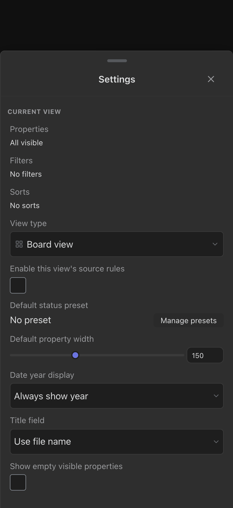 | 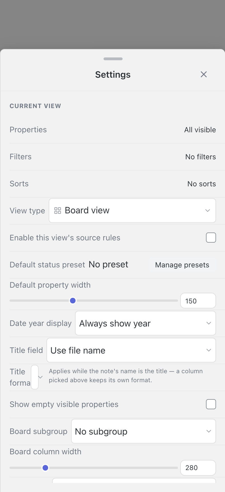 |

Sources: `src/views/board-card-properties-panel.ts`, `src/views/view-config-panel-renderer.ts`, `tools/live/render-assertion-harness.ts`, `tools/live/render-assertion-bundle.mjs`, `tools/screenshots/constructed-scenarios.mjs`, `tools/storybook/obsidian-stub.mjs`, `tools/storybook/obsidian-dom-shim.mjs`, `src/views/board-card-fields.ts`, `src/views/checkbox.ts`, `src/views/property-type-icon.ts`

### Board Groups panel (constructed)

The reference board's own column-options button, then the "Manage groups" row it opens — the same two clicks a reader makes, not a hand-built panel.

| dark | light |
|---|---|
| 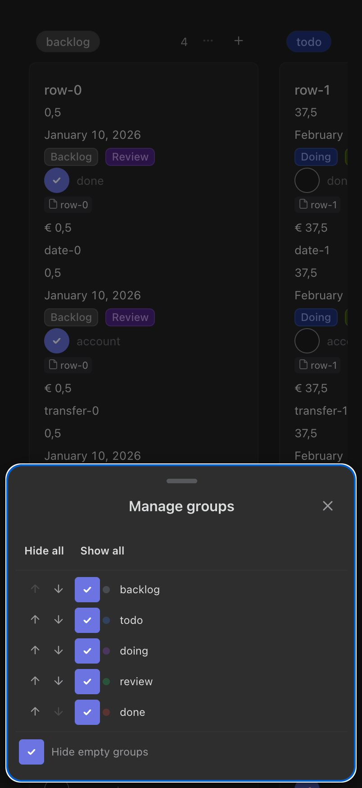 | 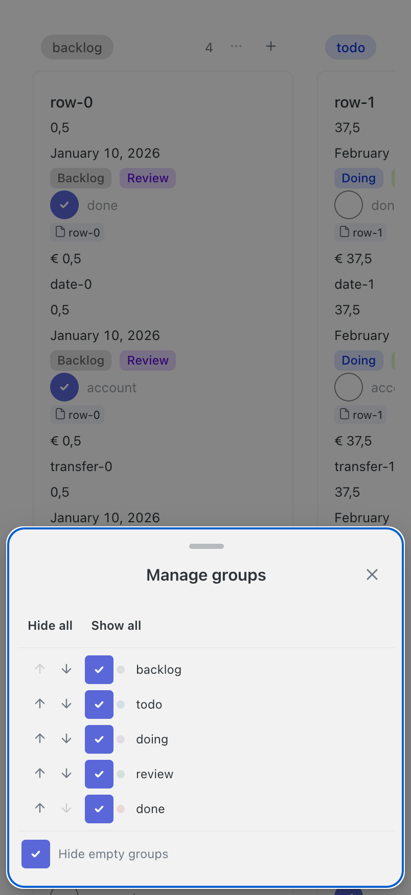 |

Sources: `src/views/board-renderer.ts`, `tools/bench/board-render-bench.ts`, `tools/live/render-assertion-harness.ts`, `tools/live/render-assertion-bundle.mjs`, `tools/screenshots/constructed-scenarios.mjs`, `tools/storybook/obsidian-stub.mjs`, `tools/storybook/obsidian-dom-shim.mjs`, `src/views/board-groups-panel.ts`, `src/views/record-surface/property-row.ts`, `src/views/checkbox.ts`

### Column manager (constructed)

ColumnManagerRenderer's own render over the table bench's sixteen columns with one hidden, so the select-all checkbox sits in its real indeterminate state.

| dark | light |
|---|---|
|  |  |

Sources: `src/views/column-manager-renderer.ts`, `tools/bench/table-render-bench.ts`, `tools/live/render-assertion-harness.ts`, `tools/live/render-assertion-bundle.mjs`, `tools/screenshots/constructed-scenarios.mjs`, `tools/storybook/obsidian-stub.mjs`, `tools/storybook/obsidian-dom-shim.mjs`, `src/views/property-type-icon.ts`, `src/views/checkbox.ts`

### Column width adjuster (constructed)

openColumnWidthAdjuster's own module entry over a real currency column from the table bench. On the phone device isMobileBottomSheet's own check turns it into the shared bottom sheet (chrome, placement, entrance, drag-to-dismiss); on desktop it stays the fixed panel it has always been. Both presentations share the panel-family body markup photographed here, not a bespoke strip.

| dark | light |
|---|---|
|  |  |

Sources: `src/views/column-width.ts`, `tools/bench/table-render-bench.ts`, `tools/live/render-assertion-harness.ts`, `tools/live/render-assertion-bundle.mjs`, `tools/screenshots/constructed-scenarios.mjs`, `tools/storybook/obsidian-stub.mjs`, `tools/storybook/obsidian-dom-shim.mjs`, `src/views/mobile-bottom-sheet.ts`, `src/views/popover-position.ts`, `src/views/popover-auto-close.ts`

### Column menu → submenu, stacked three deep over the record sheet (constructed)

sheet-grammar.mjs's own "record column submenu" pair (depth: 3): the record sheet, an owned menu titled "Column" stacked over it, and a real dropdown opened over the menu in turn — a menu-over-menu chain, the one shape Anytype's own captures confirm does stack three deep.

| dark | light |
|---|---|
| 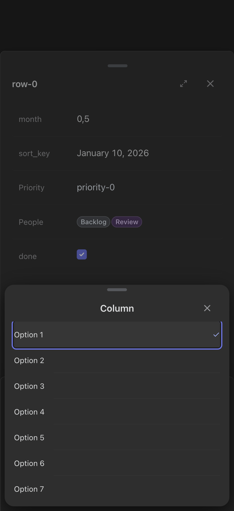 | 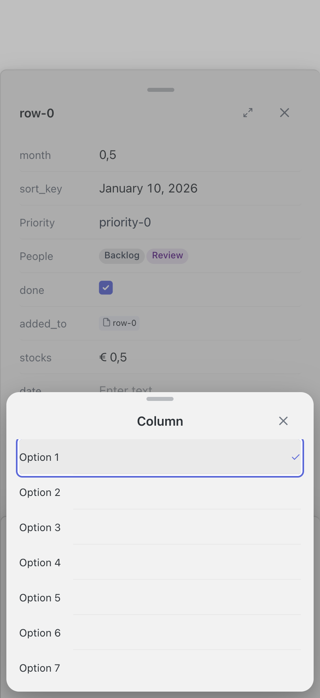 |

Sources: `src/views/surface-shell.ts`, `src/views/mobile-bottom-sheet.ts`, `src/views/popover-position.ts`, `src/views/overlay-stack.ts`, `src/views/dropdown-field.ts`, `tools/live/host-modal-stand-in.ts`, `tools/live/render-assertion-harness.ts`, `tools/live/render-assertion-bundle.mjs`, `tools/screenshots/constructed-scenarios.mjs`, `tools/storybook/obsidian-stub.mjs`, `tools/storybook/obsidian-dom-shim.mjs`, `src/views/owned-menu.ts`, `src/views/record-detail-panel.ts`, `tools/bench/board-render-bench.ts`, `src/views/card-field-renderer.ts`, `src/views/record-surface/property-row.ts`

### Import confirm → dropdown, stacked three deep over the filter sheet (constructed)

sheet-grammar.mjs's own "import confirm dropdown chain" pair (depth: 3): the filter sheet, an "Import" host-modal stand-in stacked over it, and a real dropdown opened over that in turn — a dropdown-over-confirm chain, the other shape kept at depth 3 because it stacks a menu family, not a second sheet.

| dark | light |
|---|---|
| 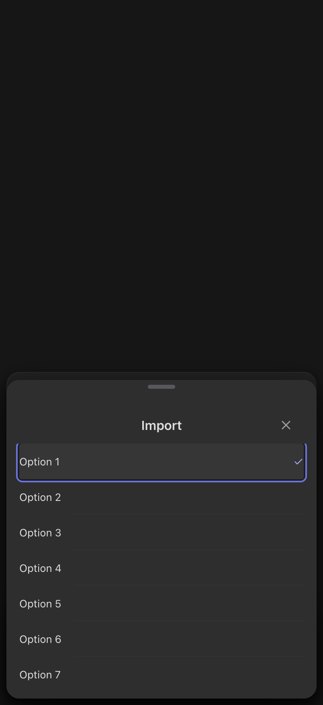 | 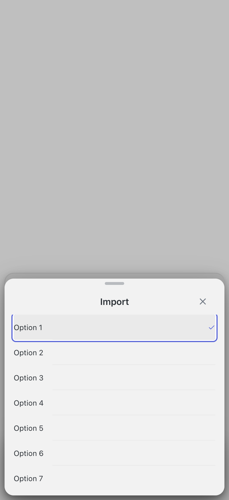 |

Sources: `src/views/surface-shell.ts`, `src/views/mobile-bottom-sheet.ts`, `src/views/popover-position.ts`, `src/views/overlay-stack.ts`, `src/views/dropdown-field.ts`, `tools/live/host-modal-stand-in.ts`, `tools/live/render-assertion-harness.ts`, `tools/live/render-assertion-bundle.mjs`, `tools/screenshots/constructed-scenarios.mjs`, `tools/storybook/obsidian-stub.mjs`, `tools/storybook/obsidian-dom-shim.mjs`, `src/views/filter-panel-renderer.ts`, `tools/bench/table-render-bench.ts`, `src/views/date-value-picker.ts`, `src/data/view-filter-tree.ts`

### Create property → format picker, stacked three deep over the Properties sheet (constructed)

sheet-grammar.mjs's own "properties property type picker" pair (depth: 3): the Properties sheet, a "Create property" host-modal stand-in stacked over it, and a real dropdown opened over that in turn — the BEFORE picture of the pair the depth cap now governs for real. The first level here is a bare stand-in on purpose, the same shape the cap does not reach; the replaced-in-place AFTER picture is the "property-type-picker-replaced" scenario beside this one.

| dark | light |
|---|---|
| 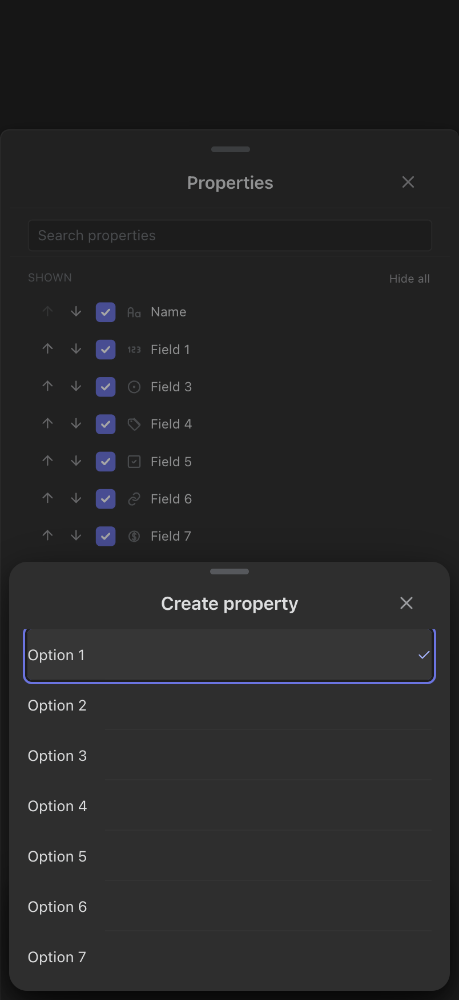 | 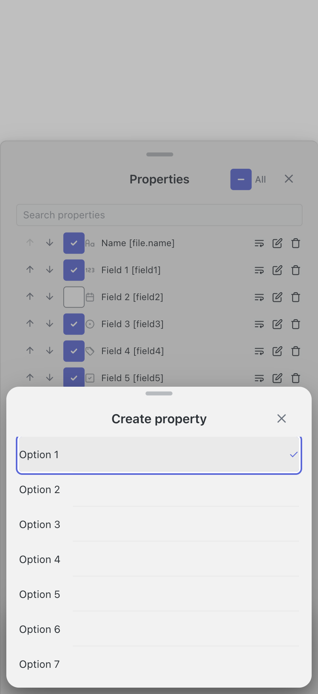 |

Sources: `src/views/surface-shell.ts`, `src/views/mobile-bottom-sheet.ts`, `src/views/popover-position.ts`, `src/views/overlay-stack.ts`, `src/views/dropdown-field.ts`, `tools/live/host-modal-stand-in.ts`, `tools/live/render-assertion-harness.ts`, `tools/live/render-assertion-bundle.mjs`, `tools/screenshots/constructed-scenarios.mjs`, `tools/storybook/obsidian-stub.mjs`, `tools/storybook/obsidian-dom-shim.mjs`, `src/views/column-manager-renderer.ts`, `tools/bench/table-render-bench.ts`, `src/views/property-type-icon.ts`, `src/views/checkbox.ts`

### Create property → format picker, replaced in place over the Properties sheet (constructed)

The AFTER half of the pair beside this one: the same Properties sheet and the same "Create property" chain title, but the first level is a real createSurfaceShell({ role: "panel" }) consumer — the same call CreatePropertyModal itself makes — so the real dropdown opened over it is offered a replace instead of stacking as a third sheet. Two sheets on screen, not three; sheet-grammar.mjs's own "properties property type picker — the real call graph under the depth cap" check asserts the same outcome live, this scenario is the photograph of it.

| dark | light |
|---|---|
| 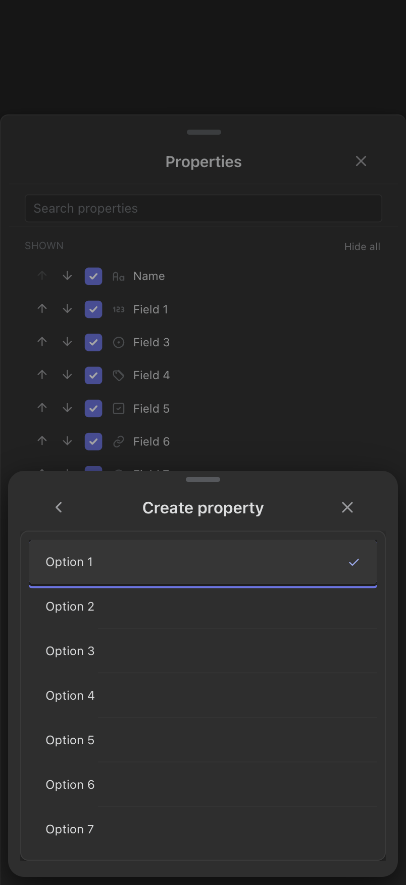 | 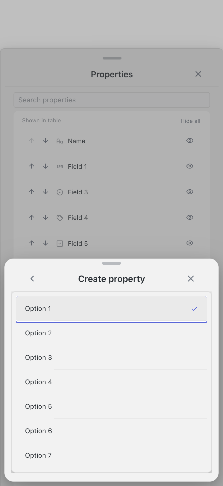 |

Sources: `src/views/surface-shell.ts`, `src/views/mobile-bottom-sheet.ts`, `src/views/popover-position.ts`, `src/views/overlay-stack.ts`, `src/views/dropdown-field.ts`, `tools/live/host-modal-stand-in.ts`, `tools/live/render-assertion-harness.ts`, `tools/live/render-assertion-bundle.mjs`, `tools/screenshots/constructed-scenarios.mjs`, `tools/storybook/obsidian-stub.mjs`, `tools/storybook/obsidian-dom-shim.mjs`, `src/views/column-manager-renderer.ts`, `tools/bench/table-render-bench.ts`, `src/views/property-type-icon.ts`, `src/views/checkbox.ts`

### Filter panel with active conditions (constructed)

FilterPanelRenderer's own render over a flat AND group of three rules, so the panel header defers its logic button to the group's own dropdown.

| dark | light |
|---|---|
|  |  |

Sources: `src/views/filter-panel-renderer.ts`, `tools/bench/table-render-bench.ts`, `tools/live/render-assertion-harness.ts`, `tools/live/render-assertion-bundle.mjs`, `tools/screenshots/constructed-scenarios.mjs`, `tools/storybook/obsidian-stub.mjs`, `tools/storybook/obsidian-dom-shim.mjs`, `src/views/dropdown-field.ts`, `src/views/date-value-picker.ts`, `src/data/view-filter-tree.ts`

### Filter panel with a nested group and a NOT (constructed)

The same renderer over a tree that holds a NOT node and an inner OR group — the nesting depth the panel's own wrap rules allow for a wrapped subtree.

| dark | light |
|---|---|
|  |  |

Sources: `src/views/filter-panel-renderer.ts`, `tools/bench/table-render-bench.ts`, `tools/live/render-assertion-harness.ts`, `tools/live/render-assertion-bundle.mjs`, `tools/screenshots/constructed-scenarios.mjs`, `tools/storybook/obsidian-stub.mjs`, `tools/storybook/obsidian-dom-shim.mjs`, `src/views/dropdown-field.ts`, `src/data/view-filter-tree.ts`

### Confirm sheet — a DbModal presented as a phone sheet (constructed)

ConfirmModal's own onOpen, mounted the same way: the real buildConfirmSheetBody inside the faithful host-modal stand-in, chromed by the real attachSheetChromeToModal.

| dark | light |
|---|---|
| 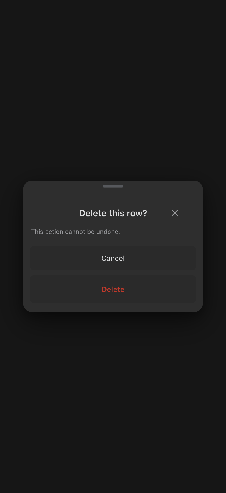 | 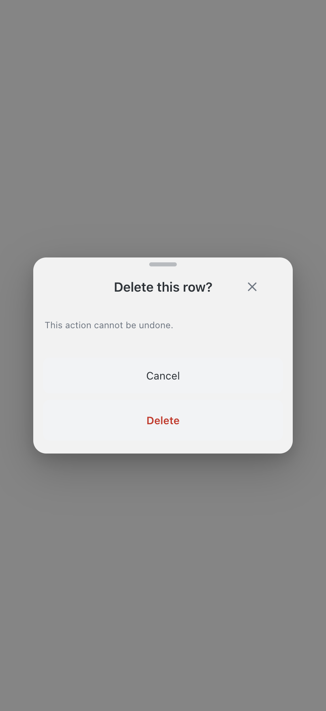 |

Sources: `src/views/modals/obnotion-modal.ts`, `src/views/surface-shell.ts`, `src/views/mobile-bottom-sheet.ts`, `src/views/popover-position.ts`, `tools/live/host-modal-stand-in.ts`, `tools/live/render-assertion-harness.ts`, `tools/live/render-assertion-bundle.mjs`, `tools/screenshots/constructed-scenarios.mjs`, `tools/storybook/obsidian-stub.mjs`, `tools/storybook/obsidian-dom-shim.mjs`, `src/views/modals/confirm-modal.ts`, `src/views/confirm-sheet.ts`

### Confirm sheet, stacked over the Properties sheet (constructed)

The same real ConfirmModal, stacked over the column-manager sheet — the operator's pair, the confirm leg.

| dark | light |
|---|---|
| 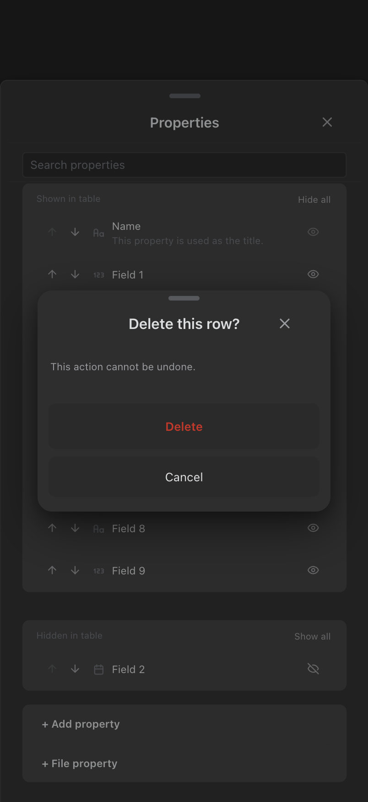 | 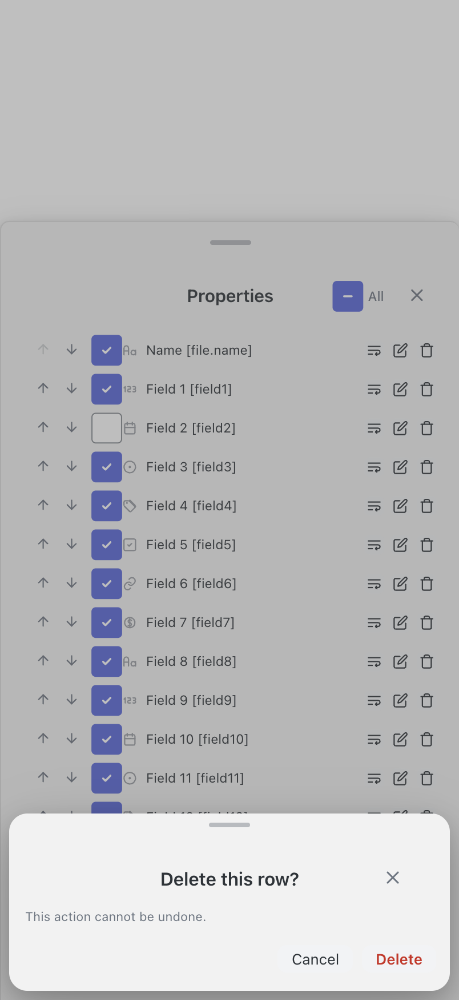 |

Sources: `src/views/modals/obnotion-modal.ts`, `src/views/surface-shell.ts`, `src/views/mobile-bottom-sheet.ts`, `src/views/popover-position.ts`, `tools/live/host-modal-stand-in.ts`, `tools/live/render-assertion-harness.ts`, `tools/live/render-assertion-bundle.mjs`, `tools/screenshots/constructed-scenarios.mjs`, `tools/storybook/obsidian-stub.mjs`, `tools/storybook/obsidian-dom-shim.mjs`, `src/views/modals/confirm-modal.ts`, `src/views/confirm-sheet.ts`, `src/views/column-manager-renderer.ts`, `tools/bench/table-render-bench.ts`, `src/views/property-type-icon.ts`, `src/views/checkbox.ts`

### Edit property sheet — a DbModal presented as a phone sheet (constructed)

ColumnRenameModal's own onOpen ("Edit property — Month"), invoked on an instance built from its own prototype rather than through new — its constructor calls Obsidian's real Modal, which this bundle's obsidian-stub deliberately cannot fake — mounted inside the faithful host-modal stand-in attachSheetChromeToModal has to neutralise: a native empty title and a native close button beside the shipped form.

| dark | light |
|---|---|
| 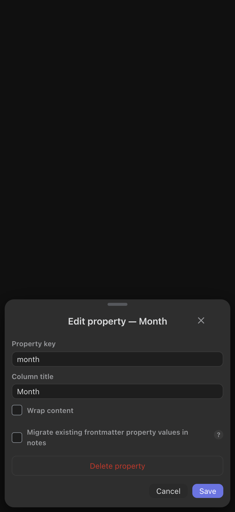 | 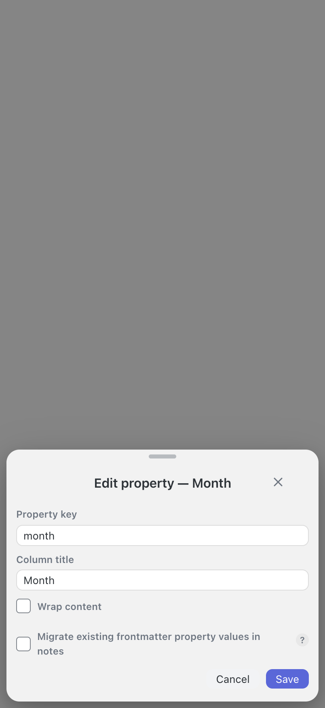 |

Sources: `src/views/modals/obnotion-modal.ts`, `src/views/surface-shell.ts`, `src/views/mobile-bottom-sheet.ts`, `src/views/popover-position.ts`, `tools/live/host-modal-stand-in.ts`, `tools/live/render-assertion-harness.ts`, `tools/live/render-assertion-bundle.mjs`, `tools/screenshots/constructed-scenarios.mjs`, `tools/storybook/obsidian-stub.mjs`, `tools/storybook/obsidian-dom-shim.mjs`, `src/views/modals/column-rename-modal.ts`

### Edit property sheet, stacked over the Properties sheet (constructed)

The same real ColumnRenameModal, opened over a mounted column-manager sheet — the operator's own reported stacked pair — so the parent dim, the child's own fill and the single close control are all the shared production mechanism, not a hand-built approximation of it.

| dark | light |
|---|---|
| 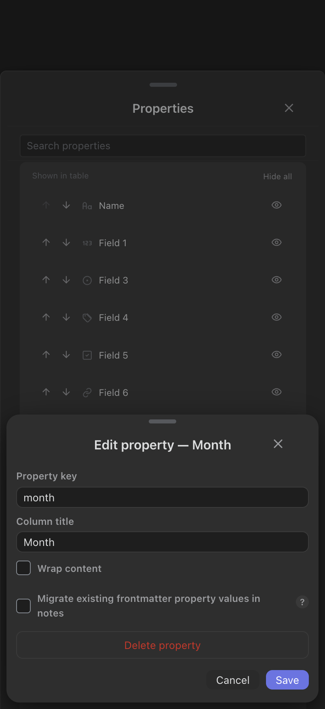 | 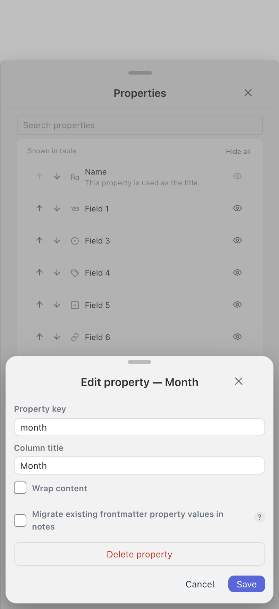 |

Sources: `src/views/modals/obnotion-modal.ts`, `src/views/surface-shell.ts`, `src/views/mobile-bottom-sheet.ts`, `src/views/popover-position.ts`, `tools/live/host-modal-stand-in.ts`, `tools/live/render-assertion-harness.ts`, `tools/live/render-assertion-bundle.mjs`, `tools/screenshots/constructed-scenarios.mjs`, `tools/storybook/obsidian-stub.mjs`, `tools/storybook/obsidian-dom-shim.mjs`, `src/views/modals/column-rename-modal.ts`, `src/views/column-manager-renderer.ts`, `tools/bench/table-render-bench.ts`, `src/views/property-type-icon.ts`, `src/views/checkbox.ts`

### Record detail panel (constructed)

openRecordDetailPanel's own entry against a real anchor over a capture-sized board row: the panel chrome and its typed fields. The note body is absent — mounting it needs a live MarkdownRenderer — and the phone device pass becomes the bottom sheet through positionToolbarPopover's own is-phone branch. Supersedes the desktop panel and the phone sheet fixtures together.

| dark | light |
|---|---|
|  |  |

Sources: `src/views/record-detail-panel.ts`, `tools/bench/board-render-bench.ts`, `tools/live/render-assertion-harness.ts`, `tools/live/render-assertion-bundle.mjs`, `tools/screenshots/constructed-scenarios.mjs`, `tools/storybook/obsidian-stub.mjs`, `tools/storybook/obsidian-dom-shim.mjs`, `src/views/card-field-renderer.ts`, `src/views/record-surface/property-row.ts`, `src/views/popover-position.ts`, `src/views/mobile-bottom-sheet.ts`

### Record detail — note body being typed (constructed)

mountNoteBodyRegion's own entry with beginEdit called, swapping the rendered body for its textarea. The markdown-to-DOM renderer is the injected one the module's contract requires — the real MarkdownRenderer has no standalone build — so the region's modes are production and the content inside them is not. The editor's blur-commits contract means the mount re-enters edit mode after its teardown, so the picture shows the textarea rather than the body it would fall back to.

| dark | light |
|---|---|
|  |  |

Sources: `src/views/note-body-region.ts`, `tools/bench/board-render-bench.ts`, `tools/live/render-assertion-harness.ts`, `tools/live/render-assertion-bundle.mjs`, `tools/screenshots/constructed-scenarios.mjs`, `tools/storybook/obsidian-stub.mjs`, `tools/storybook/obsidian-dom-shim.mjs`

### Record detail — note body not written yet (constructed)

The same region over an empty body, drawing the placeholder line the module writes when a note has frontmatter and nothing else.

| dark | light |
|---|---|
|  |  |

Sources: `src/views/note-body-region.ts`, `tools/bench/board-render-bench.ts`, `tools/live/render-assertion-harness.ts`, `tools/live/render-assertion-bundle.mjs`, `tools/screenshots/constructed-scenarios.mjs`, `tools/storybook/obsidian-stub.mjs`, `tools/storybook/obsidian-dom-shim.mjs`

### Record detail panel, docked (constructed)

The same panel opened by an affordance carrying no element — a menu item, a card's open button — which passes the pane container rather than a pressed element. Pointing the panel AT that container is what drew it as a strip at the top of the window, so this photographs the placement rather than the chrome: the panel takes the pane's height and its trailing edge instead of its content's height. The anchored capture beside it is the control; the two differ only in placement.

| dark | light |
|---|---|
| 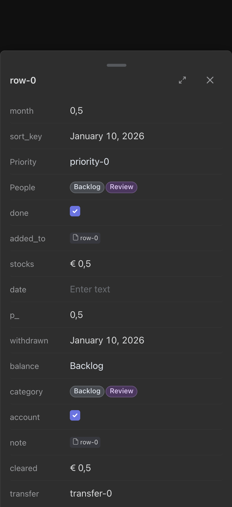 | 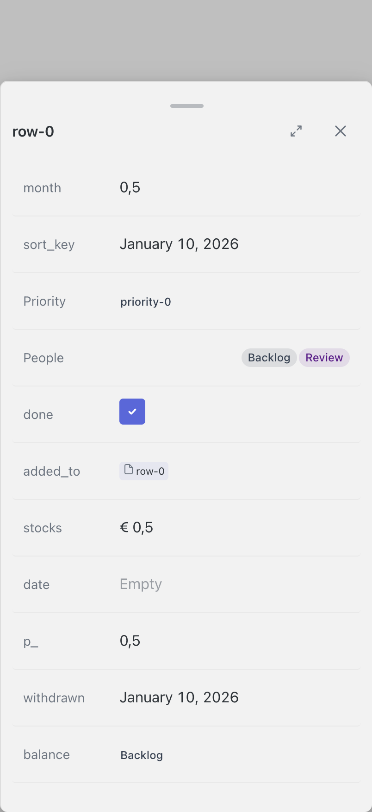 |

Sources: `src/views/record-detail-panel.ts`, `tools/bench/board-render-bench.ts`, `tools/live/render-assertion-harness.ts`, `tools/live/render-assertion-bundle.mjs`, `tools/screenshots/constructed-scenarios.mjs`, `tools/storybook/obsidian-stub.mjs`, `tools/storybook/obsidian-dom-shim.mjs`, `src/views/card-field-renderer.ts`, `src/views/record-surface/property-row.ts`, `src/views/popover-position.ts`, `src/views/record-open-target.ts`

### Table record peek (constructed)

openTableRecordPeek's own entry docked beside the real table it opens from, with the row's typed values rendered through the peek's own property renderer.

| dark | light |
|---|---|
|  |  |

Sources: `src/views/table-record-peek.ts`, `tools/bench/table-render-bench.ts`, `tools/live/render-assertion-harness.ts`, `tools/live/render-assertion-bundle.mjs`, `tools/screenshots/constructed-scenarios.mjs`, `tools/storybook/obsidian-stub.mjs`, `tools/storybook/obsidian-dom-shim.mjs`, `src/views/table-renderer.ts`, `src/views/cell-renderer.ts`

### Sort panel with two rules (constructed)

SortPanelRenderer's own render over two real rules, with the first rule's move-up and the last rule's move-down disabled by the renderer itself.

| dark | light |
|---|---|
|  |  |

Sources: `src/views/sort-panel-renderer.ts`, `tools/bench/table-render-bench.ts`, `tools/live/render-assertion-harness.ts`, `tools/live/render-assertion-bundle.mjs`, `tools/screenshots/constructed-scenarios.mjs`, `tools/storybook/obsidian-stub.mjs`, `tools/storybook/obsidian-dom-shim.mjs`, `src/views/dropdown-field.ts`

### Sort panel with no rules, calendar hint (constructed)

The calendar view's sort panel: the renderer reads config.viewType === "calendar" and draws its layout hint above the empty state — the only state the hint appears in.

| dark | light |
|---|---|
|  |  |

Sources: `src/views/sort-panel-renderer.ts`, `tools/bench/table-render-bench.ts`, `tools/live/render-assertion-harness.ts`, `tools/live/render-assertion-bundle.mjs`, `tools/screenshots/constructed-scenarios.mjs`, `tools/storybook/obsidian-stub.mjs`, `tools/storybook/obsidian-dom-shim.mjs`

### View configuration panel (constructed)

ViewConfigPanelRenderer's own render for a table view with a one-view database, so both the database-scoped and the view-scoped sections draw.

| dark | light |
|---|---|
|  |  |

Sources: `src/views/view-config-panel-renderer.ts`, `tools/bench/table-render-bench.ts`, `tools/live/render-assertion-harness.ts`, `tools/live/render-assertion-bundle.mjs`, `tools/screenshots/constructed-scenarios.mjs`, `tools/storybook/obsidian-stub.mjs`, `tools/storybook/obsidian-dom-shim.mjs`, `src/views/dropdown-field.ts`

### Board card properties panel

The Properties section of a board view's settings panel: fixed readonly Cover and Title rows above one reorderable row per field. Reuses the column manager's row markup (drag handle, checkbox, type icon, name) but drops its wrap/edit/delete actions, which this list has no equivalent of. Payment is hidden by the operator; Billing — the board's own group-by field — is not in the stored list either, so it is appended last, unchecked, rather than removed from the panel entirely.

| dark | light |
|---|---|
| 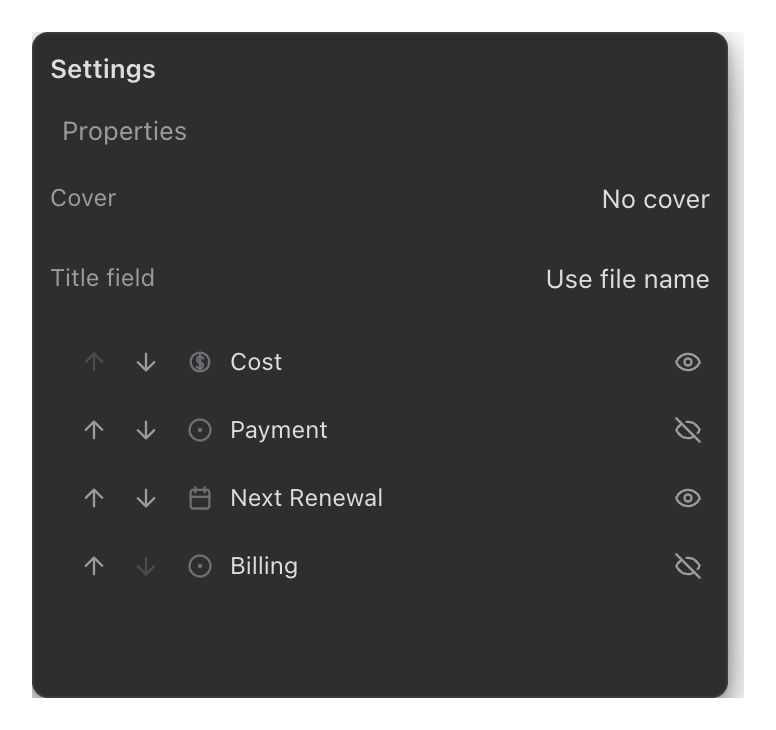 | 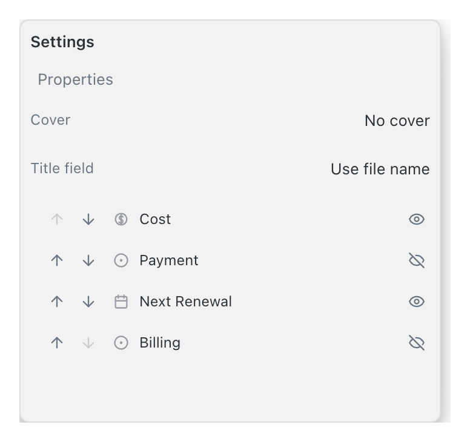 |

Sources: `src/views/board-card-properties-panel.ts`, `src/views/view-config-panel-renderer.ts`, `src/views/property-type-icon.ts`, `src/views/checkbox.ts`

### Board Groups panel

Reached from the board column menu's own "Manage groups" row: every group option, visible or hidden, on the row markup the column manager already uses (drag handle, checkbox, a colour swatch in the type slot instead of a type icon, name), plus hide-all/show-all above the list and "Hide empty groups" below it. Done is hidden here — its toggle sits unchecked rather than removed, so it stays reachable from the same surface that hid it.

| dark | light |
|---|---|
| 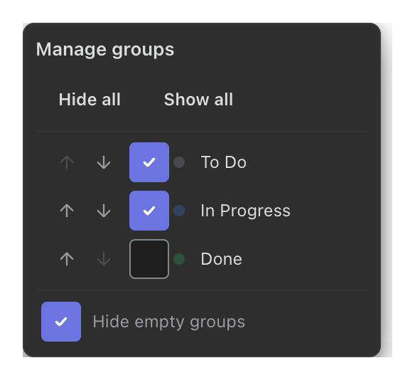 | 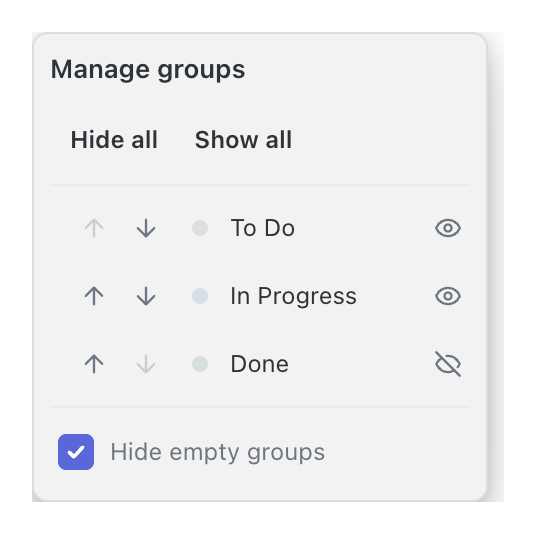 |

Sources: `src/views/board-groups-panel.ts`, `src/views/record-surface/property-row.ts`, `src/views/checkbox.ts`

### Column manager

One row per property: drag handle, visibility checkbox, type icon, name — three interactive controls. Wrap, edit and delete live on the edit-property surface the name tap opens, and the shown/hidden partition carries the bulk actions.

| dark | light |
|---|---|
|  |  |

Sources: `src/views/column-manager-renderer.ts`, `src/views/property-type-icon.ts`

### Column width adjuster — mobile bottom sheet

The adjuster mounts through the shared sheet host (applySheetChrome, placeSheet, attachSheetDragToDismiss) with the same panel-family body every other sheet in this file uses: obnotion-panel-header with a obnotion-cell-edit-close close button, a obnotion-panel-row holding the shared obnotion-view-config-range/obnotion-view-config-number slider-and-value, and a second obnotion-panel-row holding the obnotion-new-placement preset group. No explicit width is set, so Auto is the selected preset and the field shows the column's fallback width.

| dark | light |
|---|---|
|  |  |

Sources: `src/views/column-width.ts`, `src/views/mobile-bottom-sheet.ts`, `src/views/popover-position.ts`

### Filter panel with active conditions

Three conditions build a group node, so the panel header drops its AND/OR button and the group's own logic dropdown carries it instead.

| dark | light |
|---|---|
|  |  |

Sources: `src/views/filter-panel-renderer.ts`, `src/views/dropdown-field.ts`

### Filter panel with a nested group and a NOT

Nesting stops at three levels: the innermost rows lose their add-group button because the tree can go no deeper.

| dark | light |
|---|---|
|  |  |

Sources: `src/views/filter-panel-renderer.ts`, `src/data/view-filter-tree.ts`

### Record detail panel

Opened from a calendar or timeline event card. Fields are click-to-edit; an empty field only appears when the view asks for empty properties. The note body sits last, under the properties. What is photographed there is hand-written markup standing in for Obsidian's renderer output — the real MarkdownRenderer has no standalone build, so no capture in this repository can show it.

| dark | light |
|---|---|
|  |  |

Sources: `src/views/record-detail-panel.ts`, `src/views/card-field-renderer.ts`, `src/views/record-surface/property-row.ts`, `src/views/note-body-region.ts`

### Record detail — mobile bottom sheet

The phone form of the record detail panel. positionToolbarPopover renders it as a bottom sheet with a grab handle; a permanent close button (reusing obnotion-cell-edit-close) and drag-down on the handle dismiss it where the desktop panel relies on Escape and outside-click. Captured in viewport mode so the fixed sheet docks at the bottom. The note body is the last group, below the properties.

| dark | light |
|---|---|
|  |  |

Sources: `src/views/record-detail-panel.ts`, `src/views/popover-position.ts`, `src/views/card-field-renderer.ts`, `src/views/record-surface/property-row.ts`, `src/views/note-body-region.ts`

### Record detail — note body being typed

Tapping the rendered body swaps it for a textarea. The box grows to its content rather than scrolling inside itself, because the sheet is already a scroll container. What a capture cannot show is the software keyboard: the sheet lifts and shortens against --obnotion-keyboard-inset only when one is open, and no capture has one, so this is the editor at an inset of zero. Focus and the keyboard-avoided sheet are device-verified.

| dark | light |
|---|---|
|  |  |

Sources: `src/views/record-detail-panel.ts`, `src/views/note-body-region.ts`

### Record detail — note body not written yet

A record whose note has frontmatter and nothing else. One faint line rather than an empty box: without an affordance the records most in need of a body would be exactly the ones that could not be given one.

| dark | light |
|---|---|
|  |  |

Sources: `src/views/record-detail-panel.ts`, `src/views/note-body-region.ts`

### Record detail — mobile bottom sheet, titled by a currency column

The phone form of the same currency-titled header: getRecordEventTitleField falls through to the identical titleField the desktop panel and the board card read, so the phone sheet's main name agrees with both rather than forking its own value.

| dark | light |
|---|---|
| 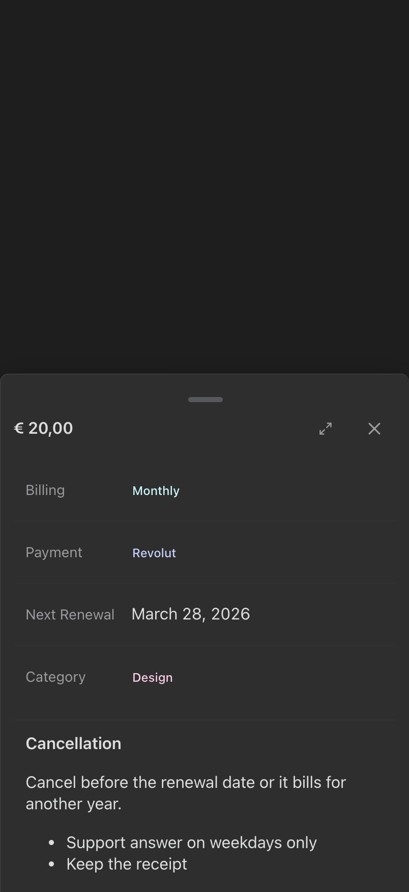 | 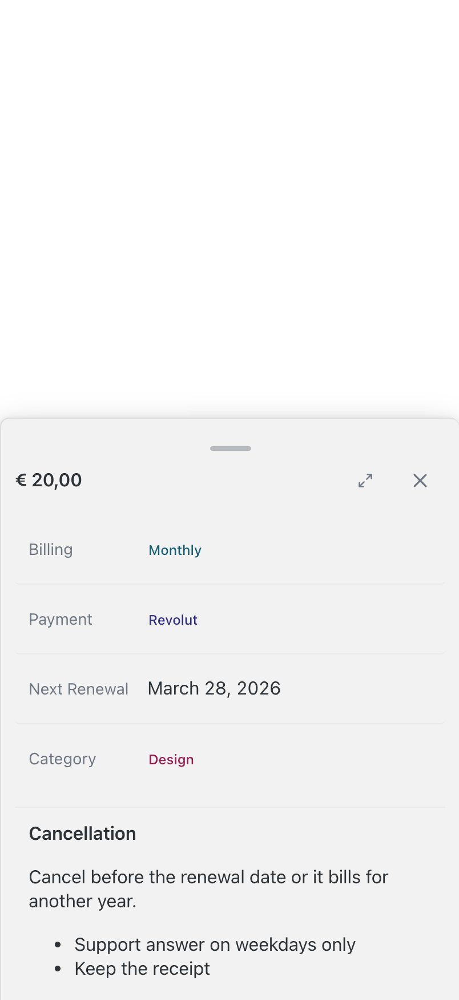 |

Sources: `src/data/title-field-display.ts`, `src/views/record-detail-panel.ts`, `src/views/popover-position.ts`, `src/views/card-field-renderer.ts`, `src/views/record-surface/property-row.ts`

### Record detail header titled by a currency column

The same view's titleField as the board card capture: the header reads the Cost column's own euro-formatted text, the identical value the board card shows for the same row — resolveTitleFieldDisplay is the one place both surfaces read it from. Cost is left out of the fields grid below, matching the title-field exclusion every property list already applies.

| dark | light |
|---|---|
| 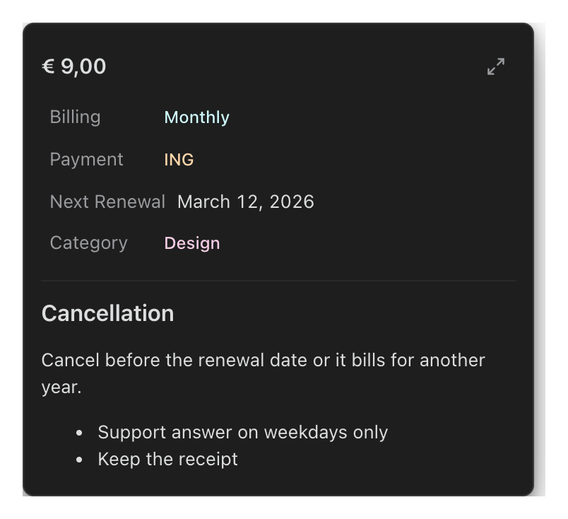 | 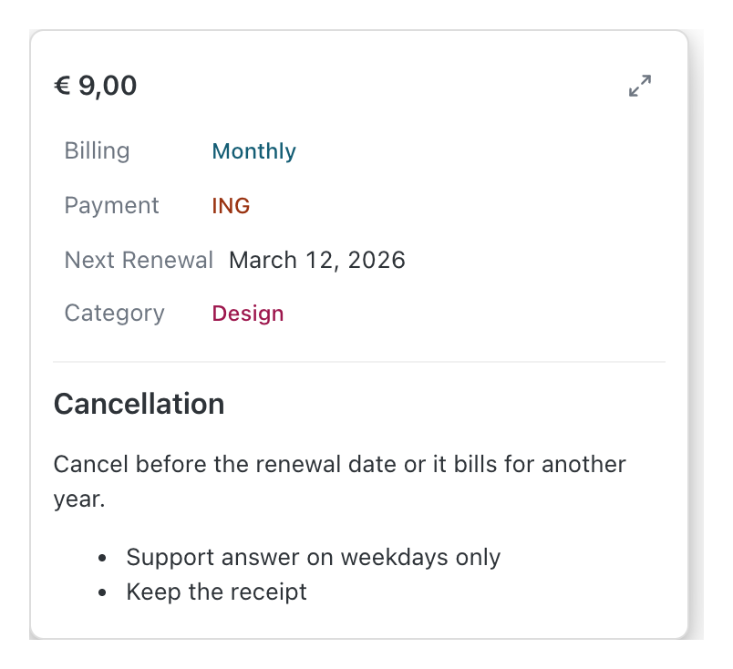 |

Sources: `src/data/title-field-display.ts`, `src/views/record-detail-panel.ts`, `src/views/card-field-renderer.ts`, `src/views/record-surface/property-row.ts`

### Table record peek

Docks against the right edge of the table it was opened from. Values are display-only text, and properties hidden from the table sit behind the disclosure.

| dark | light |
|---|---|
| 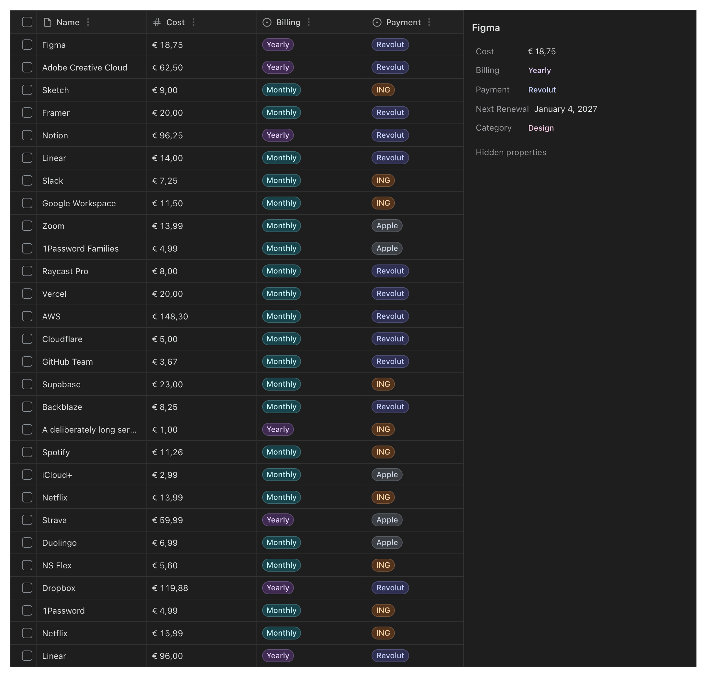 | 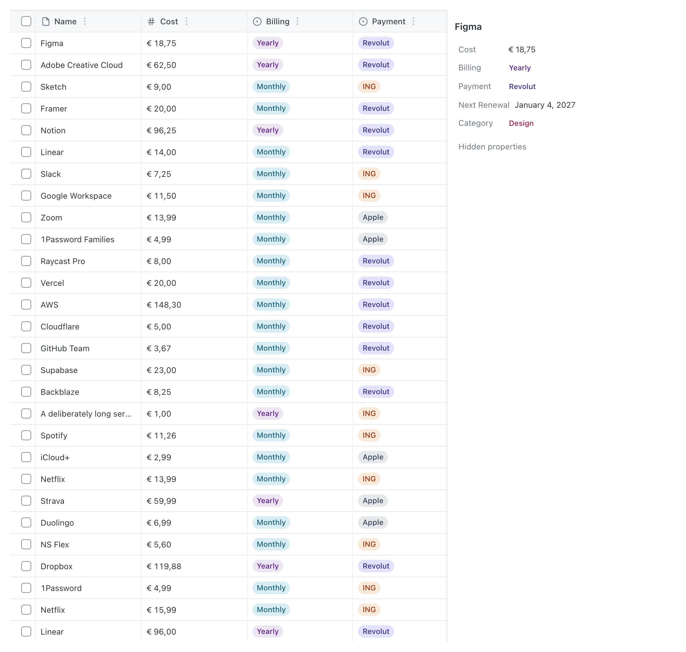 |

Sources: `src/views/table-record-peek.ts`, `src/views/table-renderer.ts`

### Settings — desktop side sheet

The database Settings panel on desktop, docked full-height to the pane's right edge instead of the old 360x560px anchored dropdown that scrolled its own 1461px of content inside that box. Width 420px, measured wider than Anytype's own right-hand object panel (336px) because this body carries a multi-line description field its plain label/value list does not. The header stays fixed; the body below it is the only region that scrolls, independently of the database visible at the left edge of the pane.

| dark | light |
|---|---|
| 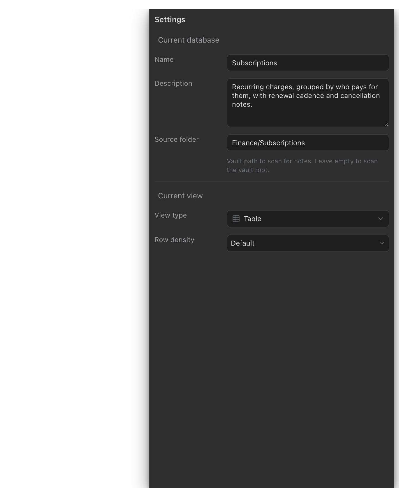 | 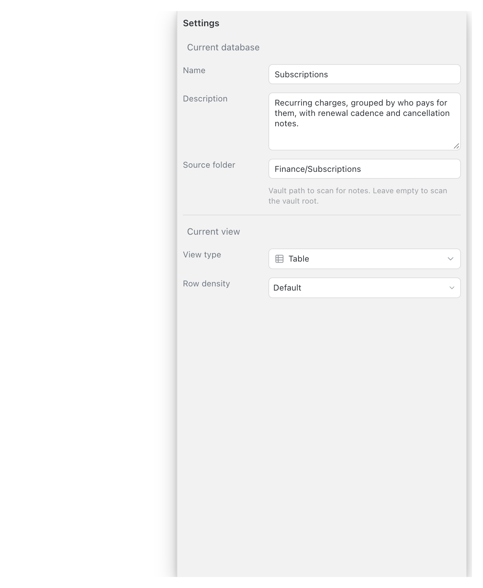 |

Sources: `src/views/surface-shell.ts`, `src/views/view-config-panel-renderer.ts`, `styles.css`

### Sort panel with no rules, calendar hint

Calendar views add a hint above the empty state because layout order wins over user sort.

| dark | light |
|---|---|
|  |  |

Sources: `src/views/sort-panel-renderer.ts`

### Sort panel with two rules

Each rule reads as three rows: property with the arrow pair, direction, then the labelled warning row that deletes it. The rule itself stays draggable; the first rule's move-up and the last rule's move-down are disabled.

| dark | light |
|---|---|
|  |  |

Sources: `src/views/sort-panel-renderer.ts`, `src/views/dropdown-field.ts`

### View configuration panel

The top of the panel for a table view: database-scoped rows above the section divider, view-scoped rows below. Conditional formatting and status presets sit further down and are not in frame.

| dark | light |
|---|---|
|  |  |

Sources: `src/views/view-config-panel-renderer.ts`, `src/views/dropdown-field.ts`

### Settings — mobile bottom sheet

The phone form of the settings panel: a grab handle, a header with a permanent obnotion-sheet-close button (the drag band alone was reported as an unusable sole dismissal on a form this long), and a body that scrolls under the fixed header. Every row is `.obnotion-panel-row` and every hint `.obnotion-panel-hint` — the same wrapper classes the sort, filter and column-width sheets already draw — and the computed-sync choice is the shared `.obnotion-new-placement` segmented group rather than the desktop's card-radio pair. The two switches are the shared checkbox, not the desktop's `.obnotion-toggle-switch`. Conditional formatting and status presets sit further down and are not in frame.

| dark | light |
|---|---|
| 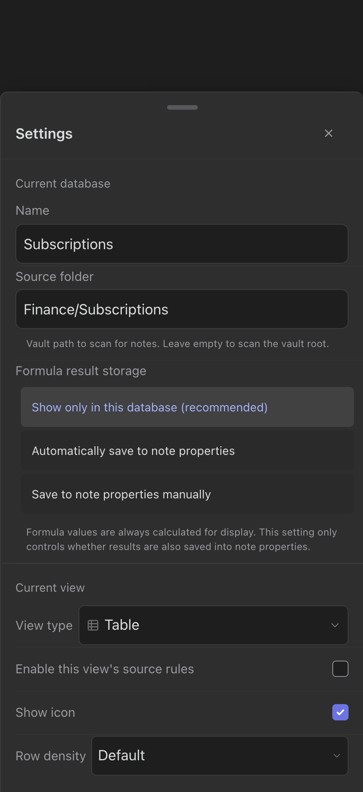 | 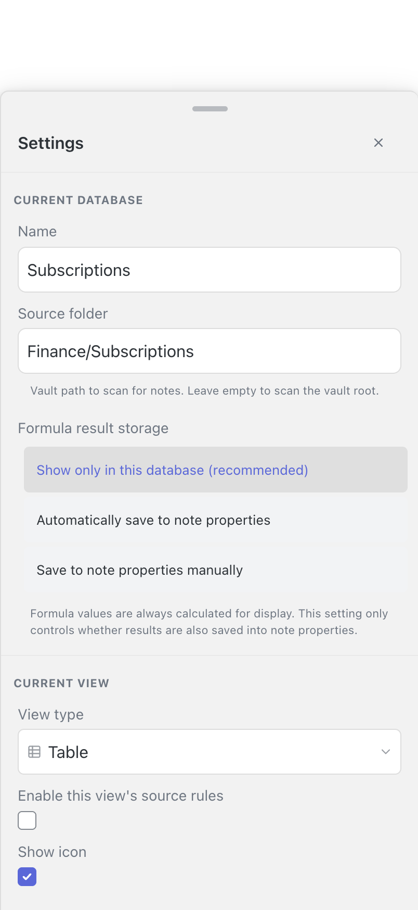 |

Sources: `src/views/view-config-panel-renderer.ts`, `src/views/mobile-bottom-sheet.ts`, `src/views/popover-position.ts`, `src/views/checkbox.ts`, `src/views/dropdown-field.ts`

## project-manager

### Project Manager kanban (reference)

The vendored Project Manager plugin's own KanbanView, mounted through the shared obsidian stub over the board bench's rows converted into its Task shape. Read beside constructed-board: the same titles, statuses, dates, priority tiers, hours and assignees. The tag row stays empty on both sides — our card matches a tags column by name and the bench carries none.

| dark | light |
|---|---|
|  |  |

Sources: `specs/context/obsidian-pm-main/src/views/KanbanView.ts`, `specs/context/obsidian-pm-main/src/ui/composites/KanbanColumn.ts`, `specs/context/obsidian-pm-main/src/ui/composites/KanbanCard.ts`, `tools/bench/board-render-bench.ts`, `tools/live/reference-assertion-bundle.mjs`, `tools/live/reference-mount.ts`, `tools/live/reference-temporal-shim.mjs`, `tools/screenshots/reference-scenarios.mjs`, `tools/storybook/obsidian-stub.mjs`, `tools/storybook/obsidian-dom-shim.mjs`, `tools/bench/reference-fixture.ts`, `src/data/calendar-date-time.ts`, `specs/context/obsidian-pm-main/src/styles/variables.css`, `specs/context/obsidian-pm-main/src/styles/chrome.css`, `specs/context/obsidian-pm-main/src/styles/table.css`, `specs/context/obsidian-pm-main/src/styles/gantt.css`, `specs/context/obsidian-pm-main/src/styles/kanban.css`, `specs/context/obsidian-pm-main/src/styles/widgets.css`, `specs/context/obsidian-pm-main/src/styles/utilities.css`

### Project Manager kanban — subtask tree (reference)

The same kanban with the first three rows wired into a parent with two children and the config's kanbanShowSubtasks on, so the subtask cards carry the parent chip the way constructed-board-subtask draws its tree.

| dark | light |
|---|---|
|  |  |

Sources: `specs/context/obsidian-pm-main/src/views/KanbanView.ts`, `specs/context/obsidian-pm-main/src/ui/composites/KanbanColumn.ts`, `specs/context/obsidian-pm-main/src/ui/composites/KanbanCard.ts`, `tools/bench/board-render-bench.ts`, `tools/live/reference-assertion-bundle.mjs`, `tools/live/reference-mount.ts`, `tools/live/reference-temporal-shim.mjs`, `tools/screenshots/reference-scenarios.mjs`, `tools/storybook/obsidian-stub.mjs`, `tools/storybook/obsidian-dom-shim.mjs`, `tools/bench/reference-fixture.ts`, `src/data/calendar-date-time.ts`, `specs/context/obsidian-pm-main/src/styles/variables.css`, `specs/context/obsidian-pm-main/src/styles/chrome.css`, `specs/context/obsidian-pm-main/src/styles/table.css`, `specs/context/obsidian-pm-main/src/styles/gantt.css`, `specs/context/obsidian-pm-main/src/styles/kanban.css`, `specs/context/obsidian-pm-main/src/styles/widgets.css`, `specs/context/obsidian-pm-main/src/styles/utilities.css`

## states

### Empty state (constructed)

EmptyStateRenderer's renderCard entry for the no-columns reason with the fixture's copy. The fixture it supersedes wrapped the card vocabulary in the hero's wrapper — a composite no single renderer emits — so the constructed picture is the real card shape.

| dark | light |
|---|---|
|  |  |

Sources: `src/views/empty-state-renderer.ts`, `tools/bench/table-render-bench.ts`, `tools/live/render-assertion-harness.ts`, `tools/live/render-assertion-bundle.mjs`, `tools/screenshots/constructed-scenarios.mjs`, `tools/storybook/obsidian-stub.mjs`, `tools/storybook/obsidian-dom-shim.mjs`

### Empty state

| dark | light |
|---|---|
|  |  |

Sources: `src/views/empty-state-renderer.ts`

### Empty state — source missing

| dark | light |
|---|---|
| 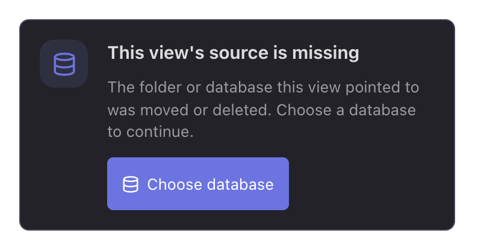 | 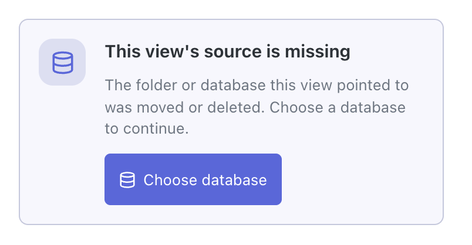 |

Sources: `src/views/empty-state-renderer.ts`, `styles.css`

## views

### Board view — mobile

The reference board inside the default-width container: its fixed-width columns page horizontally on a phone while the card tree remains unchanged.

| dark | light |
|---|---|
|  |  |

Sources: `src/views/board-renderer.ts`, `src/views/group-label-renderer.ts`, `src/views/card-field-renderer.ts`, `src/views/record-surface/property-row.ts`

### Board view — subtask tree

A parent and two child cards beside an ordinary lane, using the same card, title, chip, progress, and footer tree as the rendered board.

| dark | light |
|---|---|
|  |  |

Sources: `src/views/board-renderer.ts`, `src/views/card-field-renderer.ts`, `src/views/record-surface/property-row.ts`, `src/data/subtask-relation.ts`, `src/data/subtask-serialize.ts`, `src/i18n.ts`

### Board view

| dark | light |
|---|---|
|  |  |

Sources: `src/views/board-renderer.ts`, `src/views/card-field-renderer.ts`, `src/views/record-surface/property-row.ts`

### Board view (constructed)

The shipped board renderer at the bench shape: 1600 rows into five status columns.

| dark | light |
|---|---|
|  |  |

Sources: `src/views/board-renderer.ts`, `tools/bench/board-render-bench.ts`, `tools/live/render-assertion-harness.ts`, `tools/live/render-assertion-bundle.mjs`, `tools/screenshots/constructed-scenarios.mjs`, `tools/storybook/obsidian-stub.mjs`, `tools/storybook/obsidian-dom-shim.mjs`, `src/views/card-field-renderer.ts`, `src/views/record-surface/property-row.ts`

### Board view — subtask tree (constructed)

The shipped board renderer with the first capture-sized row wired into a parent (two children, explicit progress, expanded) via buildSubtaskRelation's own frontmatter keys.

| dark | light |
|---|---|
|  |  |

Sources: `src/views/board-renderer.ts`, `tools/bench/board-render-bench.ts`, `tools/live/render-assertion-harness.ts`, `tools/live/render-assertion-bundle.mjs`, `tools/screenshots/constructed-scenarios.mjs`, `tools/storybook/obsidian-stub.mjs`, `tools/storybook/obsidian-dom-shim.mjs`, `src/views/card-field-renderer.ts`, `src/views/record-surface/property-row.ts`, `src/data/subtask-relation.ts`, `src/data/subtask-serialize.ts`, `src/i18n.ts`

### Linked view in a reading host (constructed)

The shipped table renderer paints the same capture-sized data once as a standalone view and once as a linked view inside a readable-line-width host, with prose before and after it.

| dark | light |
|---|---|
| 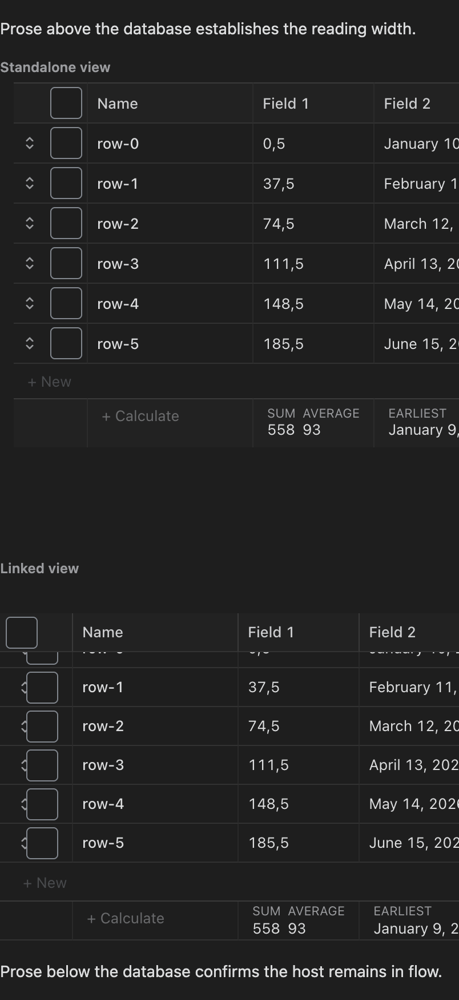 | 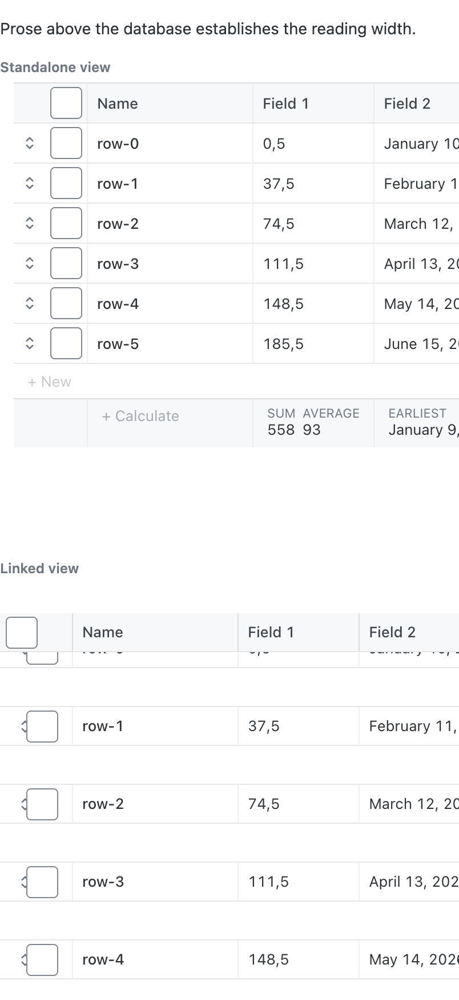 |

Sources: `src/views/table-renderer.ts`, `tools/bench/table-render-bench.ts`, `tools/live/render-assertion-harness.ts`, `tools/live/render-assertion-bundle.mjs`, `tools/screenshots/constructed-scenarios.mjs`, `tools/storybook/obsidian-stub.mjs`, `tools/storybook/obsidian-dom-shim.mjs`

### Table view (constructed)

The shipped table renderer at the bench's sixteen-column shape, over the capture-sized row set captureData selects.

| dark | light |
|---|---|
|  |  |

Sources: `src/views/table-renderer.ts`, `tools/bench/table-render-bench.ts`, `tools/live/render-assertion-harness.ts`, `tools/live/render-assertion-bundle.mjs`, `tools/screenshots/constructed-scenarios.mjs`, `tools/storybook/obsidian-stub.mjs`, `tools/storybook/obsidian-dom-shim.mjs`

### Table with a frozen column, scrolled sideways

The title column pinned via the column menu's Freeze row, table scrolled sideways so content passes under it. Nothing at rest — the right-edge shadow paints only once is-scrolled-x is present, which is table-renderer.ts's own scroll listener toggling it.

| dark | light |
|---|---|
| 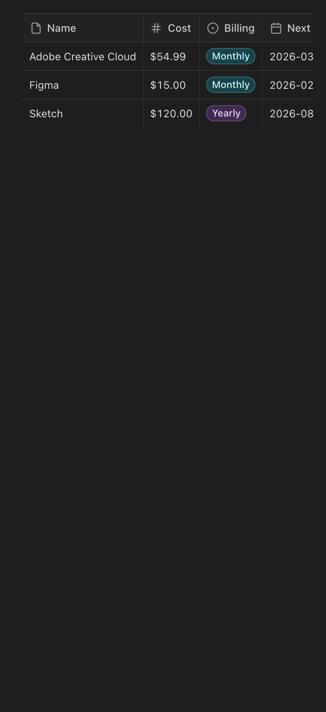 |  |

Sources: `src/views/table-renderer.ts`, `styles.css`

### Table view — mobile auto-fit

The full table the renderer builds: a select gutter, a record-icon gutter and a runtime <colgroup> of fixed px widths. On desktop those widths hold; on the phone (is-phone) the columns auto-fit to content and the select column is no longer clipped by the scroll-area fade mask. The name column is the title cell — a content-sized link plus the always-visible open affordance, rendered on touch as a compact maximize icon so its width goes to the note name instead of a text label.

| dark | light |
|---|---|
|  |  |

Sources: `src/views/table-renderer.ts`, `src/views/table-column-layout-sync.ts`, `src/views/table-layout.ts`, `src/views/cell-renderer.ts`, `src/views/file-title-display.ts`, `src/views/table-record-peek.ts`, `styles.css`

### Table with vertical grid lines off

The Show vertical lines view switch off: obnotion-no-vertical-lines on the table removes every td/th right border, and nothing else — row backgrounds, the bottom border and conditional-format tints are unaffected.

| dark | light |
|---|---|
| 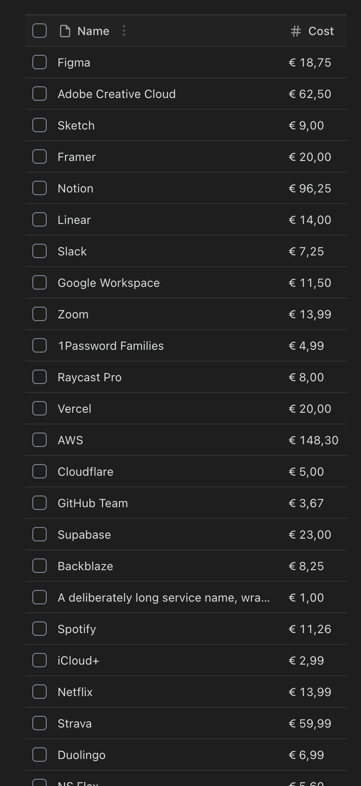 | 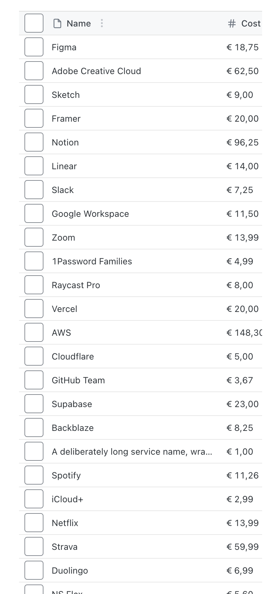 |

Sources: `src/views/table-renderer.ts`, `styles.css`

### Table view

| dark | light |
|---|---|
|  |  |

Sources: `src/views/table-renderer.ts`, `src/views/column-header-controller.ts`, `src/views/cell-renderer.ts`

### Table wrap off — a markdown column clips to one line

The view's wrap switch off, which clips every column whatever mode it carries. Both ways a value used to escape that are shown holding the floor: a long sentence ellipsised at one line, and a value carrying its own line breaks collapsed to spaces instead of forcing a   through white-space: nowrap.

| dark | light |
|---|---|
| 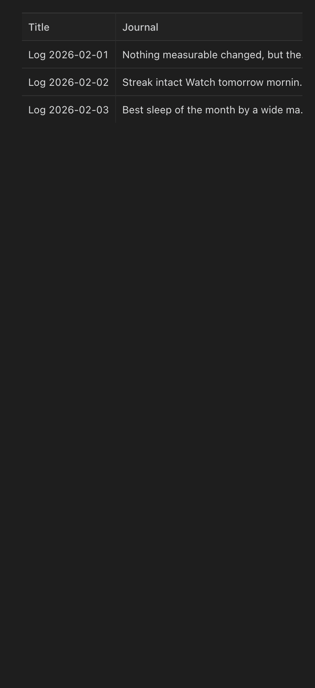 | 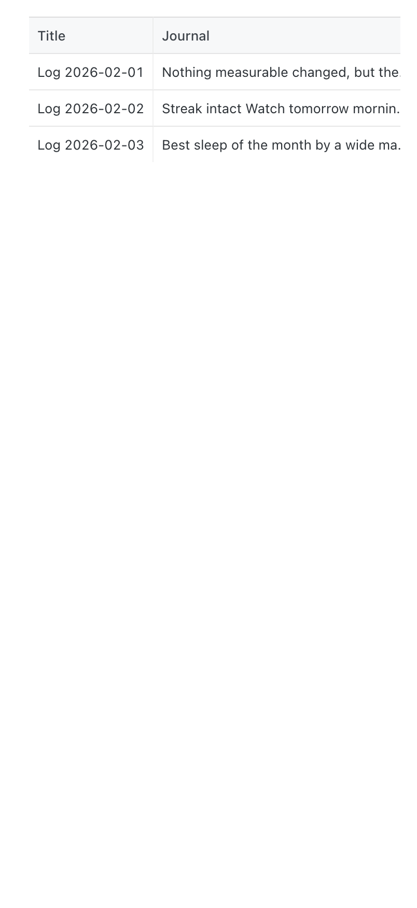 |

Sources: `src/data/column-types.ts`, `src/views/cell-renderer.ts`, `src/views/inline-markdown-renderer.ts`

### Table wrap on — the same markdown column wraps

The same column and the same source values with the switch on: obnotion-cell-wrap sets white-space: normal, so the long sentence takes a second line and the value's own line breaks render as real line breaks again. The phone renders this identically now.

| dark | light |
|---|---|
| 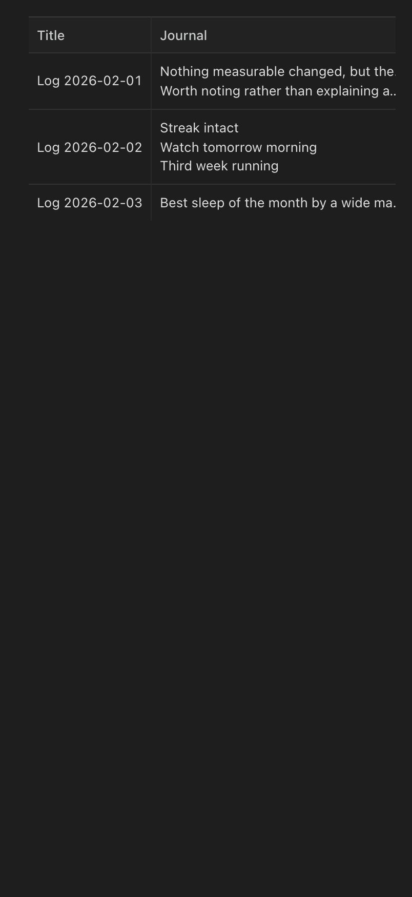 | 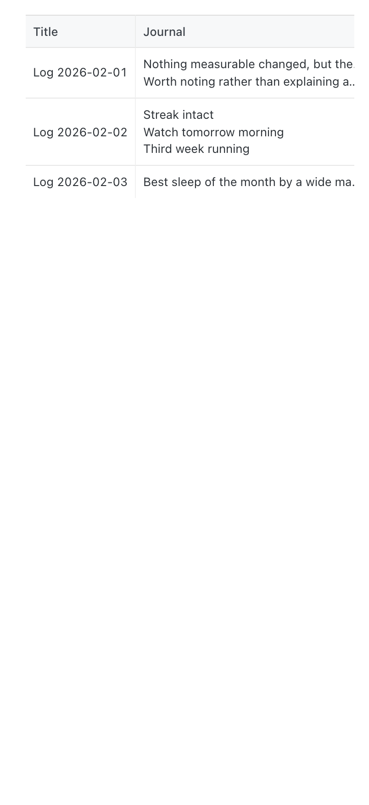 |

Sources: `src/data/column-types.ts`, `src/views/cell-renderer.ts`, `src/views/inline-markdown-renderer.ts`

## Reference roots

Two roots under `screenshots/` are not one of the scenario groups above:

- `screenshots/project-manager/` — our render. reference renders of the vendored Project Manager plugin, produced by `tools/screenshots/reference-scenarios.mjs`. Lane scope: in scope (css-lane `inScopeCaptureRoots` in `tools/lane/css-lane.json`). Index: indexed above under the `project-manager` group.
- `screenshots/anytype/` — photograph. photographs of the third-party Anytype app; never produced by this repo. Lane scope: not in scope (css-lane `inScopeCaptureRoots` in `tools/lane/css-lane.json`). Index: its own index at `screenshots/anytype/README.md`.
