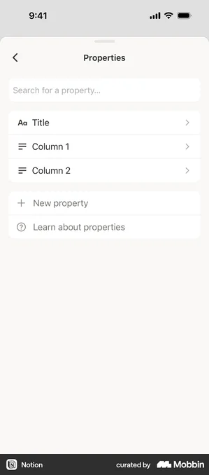
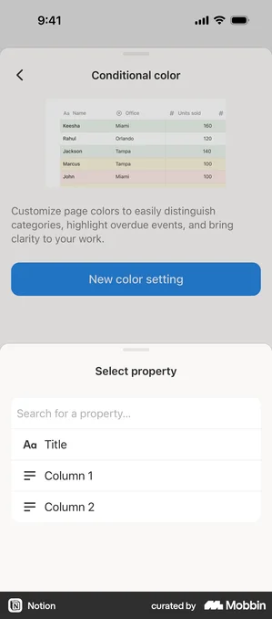
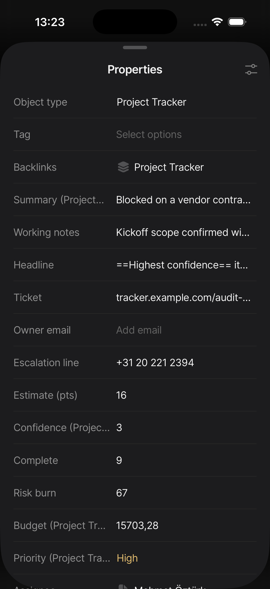
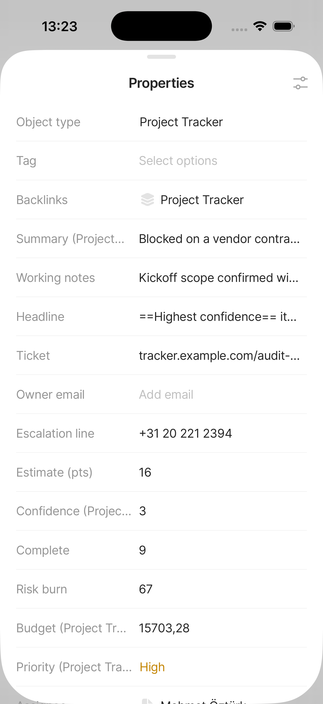
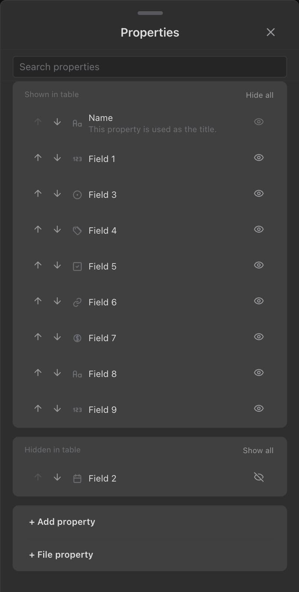
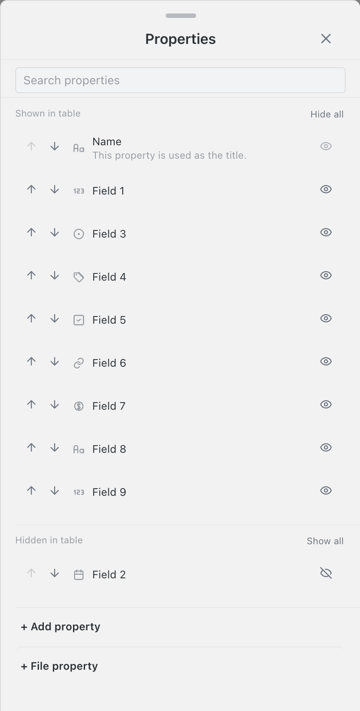

<!-- SPECKIT_TEMPLATE_SOURCE: spec-core + level2-verify | v2.2 -->
# Feature Specification: Phase 2: Properties Sheet Visual Parity

<!-- SPECKIT_LEVEL: 2 -->

---

## EXECUTIVE SUMMARY

Every Properties row still renders as up-arrow, down-arrow, a filled blue checkbox, a type icon and a label, on a flat canvas with zero card grouping; Notion's row is a drag affordance, a type icon, a label and a trailing eye, grouped into inset cards with sentence-case headings and inline bulk links.

**The gate that closes this child is an image judge, not a lane** (parent D1). Our capture is opened beside the reference and scored on the eight-row rubric in `../spec.md` §5; pass is **≥ 14/16 with no row at 0**, twice consecutively on an unchanged tree. The lane clauses in §13.11 are the floor that stops a landed value drifting, and they are never sufficient on their own.

**Critical dependencies**: `../001-settings-sheet-visual-parity/` must have passed its judge twice before this child starts (D4). `../003-filter-sheet-visual-parity/` inherits this child's settled vocabulary.

---

<!-- ANCHOR:metadata -->
## 1. METADATA

| Field | Value |
|-------|-------|
| **Level** | 2 |
| **Priority** | P1 |
| **Status** | DEFINE and PLAN complete — CREATE not started |
| **Created** | 2026-09-10 |
| **Branch** | `worktrees/295-loop-002-properties-sheet-visual-parity` |
| **Parent Spec** | `../spec.md` |
| **Parent Packet** | `076-sheet-visual-parity` |
| **Predecessor** | `../001-settings-sheet-visual-parity/spec.md` |
| **Successor** | `../003-filter-sheet-visual-parity/spec.md` |
<!-- /ANCHOR:metadata -->

---

<!-- ANCHOR:phase-context -->
## Phase Context

**Phase 2** of the Sheet Visual Parity programme, opened by the operator's 2026-09-10 ~21:40 ruling — *"Btw 0.038 still has same old badish ui in most sheets nothing like notion"* and *"Really needs to go step by step multiple ohases per sheet to define, plan, create, screenshot & verify and remediate as needed based on anytype or notion or similar screens untill perfect"*.

**Scope boundary**: the Properties Sheet and every other production surface that renders its grammar. Presentational only — no behaviour, persistence or stored shape moves.

**Deliverables**: a completed DEFINE table (§13), one lane clause per measurable row, the producer changes that reach them, a current phone light + dark capture set, and a `verification.md` carrying the judge's score table once per iteration.
<!-- /ANCHOR:phase-context -->

---

<!-- ANCHOR:problem -->
## 2. PROBLEM & PURPOSE

### Problem Statement

Every Properties row still renders as up-arrow, down-arrow, a filled blue checkbox, a type icon and a label, on a flat canvas with zero card grouping; Notion's row is a drag affordance, a type icon, a label and a trailing eye, grouped into inset cards.

### Purpose

The Properties Sheet reads as its reference does — frame, sections, row anatomy, controls, type, spacing, colour and both themes — and that reading is established by a reviewer opening the two images side by side, not by a number going green.
<!-- /ANCHOR:problem -->

---

<!-- ANCHOR:scope -->
## 3. SCOPE

### The production surfaces this child binds

Per parent D2(a), a target binds **every** producer painting this grammar, not only the renderer the sheet is named after:

- `constructed-column-manager` — `constructedScenario("column-manager", { renderer: "column-manager" })`, mounted by `mountConstructed` → `window.__mountConstructed` → `runRenderAssertions`, harness branch `scenario.renderer === "column-manager"`. Captures `screenshots/notion-clone/panels/constructed-column-manager-mobile-{light,dark}.png` (confirmed current: 804×1748, opened this session)
- `src/views/record-surface/property-row.ts`'s `buildCheckboxPropertyRow` is **shared** by this sheet and the board-groups panel (`src/views/board-groups-panel.ts`, per `styles.css:10338`'s `.obnotion-board-groups-panel .obnotion-column-manager-row` rule). A change to the row shell reaches that surface too; `005-group-sheet-visual-parity` is downstream of this child and must re-check it
- Fixture `panel-column-manager` declares `fixtureOf: "constructed-column-manager"`; no scenario work is owed

### Producers

- `src/views/column-manager-renderer.ts` — the sheet, its section partition (`renderSection`, `:126-156`), and the add-property row (`:159-210`)
- `src/views/record-surface/property-row.ts` — the shared row shell (`buildCheckboxPropertyRow`, `:384-439`) that emits the drag handle (`:398`), the arrow pair (`:404-413`) and the checkbox (`:417`)
- `src/views/checkbox.ts` — the control the row's state indicator stops using
- `styles.css` — `.obnotion-column-manager-row` (`:14336-14344`, `min-height: 30px`, no reference to the shared `--obnotion-sheet-row-min-height: 44px` token every other sheet's rows use), `.obnotion-column-manager-section*` (no card treatment exists today — grep confirms no base `.obnotion-column-manager-section {` rule), `.obnotion-column-manager-add-row` (`:13642-13654`, already full-width rows, not bare glyphs — see 13.0)

### Out of Scope

- Behaviour, semantics, persistence and data shape. In particular: the tap-to-edit affordance on a row's label (`handle.nameEl.addEventListener("click", () => actions.editColumn(col))`, `:410`) opens the existing edit-property surface and is invisible to a screenshot judge — it is not this child's concern, and Notion's own equivalent for renaming/re-typing a property lives on a **different** sheet (13.0)
- Desktop presentations, except as a regression check
- Reopening any `071` landing. A contradiction becomes a Proposed ADR in `../../roadmap.md` §7 (D15), never an amendment made here
- Splitting our single panel into Notion's two separate sheets (Property visibility vs. Properties editor). Ours conflates visibility, reorder and rename into one surface; that is existing behaviour, and un-conflating it would be an architecture change no operator ruling asked for (13.0)
<!-- /ANCHOR:scope -->

---

<!-- ANCHOR:requirements -->
## 4. REQUIREMENTS

### P0 — Blockers (MUST complete)

- **REQ-001** Every numeric target in §13 is measured from our own tree or marked `TBD — needs operator capture`. None is derived from a 299×678 reference asset (D3)
- **REQ-002** Every production surface rendering this grammar is enumerated before any file is named (D2a)
- **REQ-003** Every lane clause runs RED with its failing number recorded before the producer moves
- **REQ-004** The image judge scores ≥ 14/16 with no row at 0, **twice consecutively on an unchanged tree** (D1)

### P1 — Required

- **REQ-005** Phone light and dark captures are current, and both were opened and looked at
- **REQ-006** The `071` clauses this sheet already carries re-run unchanged and green
- **REQ-007** The operator's device row is present and unticked (D5)
<!-- /ANCHOR:requirements -->

---

<!-- ANCHOR:success-criteria -->
## 5. SUCCESS CRITERIA

| ID | Criterion | Measured by |
|----|-----------|-------------|
| SC-001 | Every row of §13 has a target, and every reference path resolves | `spec.md` §13 |
| SC-002 | Every lane clause green, each with its RED number recorded beside it | `tools/live/sheet-grammar.mjs` |
| SC-003 | Judge ≥ 14/16, no row at 0, twice on an unchanged tree | `verification.md` |
| SC-004 | The operator reads the sheet on their own iPhone and reports it aligned | Operator — **no agent ticks this** |
<!-- /ANCHOR:success-criteria -->

---

<!-- ANCHOR:risks -->
## 6. RISKS & DEPENDENCIES

| Risk | Impact | Mitigation |
|------|--------|------------|
| A green lane over an unchanged picture — the failure that opened this programme | The sheet ships looking the same | D1: the judge is a required gate; every rubric row is written about identity and appearance, not count |
| A second surface renders the same grammar and is missed | Half the sheet is fixed | D2a: §3 enumerates every producer, including the shared row shell's board-groups consumer |
| A number is read off a 299×678 thumbnail | A target that is precise and wrong | D3: structural reference only; every number is ours or `TBD` |
| `styles.css` contention with another child | Two changes each pass alone and conflict merged | D4: one child at a time, one css-lane holder |
| A card container renders anywhere in this sheet | Scores 0 on the rubric's Frame row regardless of everything else (D7, operator, 2026-09-11) | No card token is reused from `001`; groups are separated by a hairline divider, the same grammar `001`'s own remediation carries |
<!-- /ANCHOR:risks -->

---

## 7. NON-FUNCTIONAL REQUIREMENTS

Touch targets ≥ 44px on every control this child adds or moves. No contrast regression in either theme. No new dependency, no new runtime pattern.

---

## 8. EDGE CASES

- The sheet at its longest content (15+ properties), against the 90svH cap and the published keyboard inset
- The sheet with the search field focused and the keyboard up
- Zero-hidden (flat single card) and many-hidden (two cards) states
- Both themes, each read on its own rather than assumed from the other

---

## 9. COMPLEXITY ASSESSMENT

Level 2. One surface family, presentational, with a shared stylesheet and a shared row vocabulary. The complexity is in the verification loop, not the change.

---

## 10. RISK MATRIX

| Area | Likelihood | Impact | Net |
|---|---|---|---|
| Visual regression on the board-groups panel, which shares `buildCheckboxPropertyRow` | Medium | Medium | `005`'s own re-check re-runs this row's clauses before it closes |
| The target itself is wrong | Low | High | Three failed judge iterations on one rubric row re-opens DEFINE rather than patching CREATE |

---

## 11. USER STORIES

As the operator, I open the Properties Sheet on my iPhone and it reads like Notion's, so I stop reporting it.

---

## 12. OPEN QUESTIONS

- The section headings' `in table` suffix (`Shown in table` / `Hidden in table`) may be view-type-specific; **no non-table-view capture exists here**, so whether it varies is `unreadable at 299x678`
- Whether Notion offers Property visibility as a direct, non-drill-in entry (the way our toolbar button reaches it) is unobserved; Frame's leading-vs-trailing header control stays deferred to `076/001`'s Proposed ADR-I rather than decided per-child

---

<!-- ANCHOR:gap-table -->
## 13. DEFINE — the designer's brief, and the delta

> Written as a brief to a builder. §13.0 records what was read and what could not be; §13.1-§13.8 are
> the target, property by property; §13.9 is the honest before; §13.10 is the delta table with its
> rubric mapping; §13.11 the lane clauses; §13.12 the provisional register; §13.13 the contradictions
> held Proposed.

### 13.0 The references, and the finding that corrects the scaffold

Reference precedence is parent **D3**. Rung 1 (operator capture) and rung 2 (full-resolution Notion
iOS) are both **empty** — `screenshots/notion/ios/operator/` does not exist, re-checked this session.
Every structural read below is rung 3, a Mobbin thumbnail at **299×678**, confirmed by `PIL` on every
file cited.

| # | Path | What it is | What it answers |
|---|---|---|---|
| R-1 | `screenshots/notion/ios/flows/hiding-properties/…-02-9867cb76-*.webp` | **Property visibility**, all properties shown | The primary content reference: single card, row anatomy, search field, header |
| R-2 | `…-hiding-properties-03-cc8b241a-*.webp` | The same sheet, **one property hidden** | The two-card state, the section headings, the inline bulk links, the required-property's dimmed eye |
| R-3 | `…-hiding-properties-01-52348672-*.webp` | Settings / View options, entry point | Context only — shows the `Property visibility  3 ›` row this sheet opens from; not the sheet itself |
| R-4 | `…-hiding-properties-04/05-*.webp` | A second database's Settings and its full page | Context only — a `Property visibility  1 ›` row on an unrelated database; adds nothing beyond R-3 |
| R-5 | `screenshots/notion/ios/database/…-properties-01-8bb9115f-*.webp`, `…-property-editor-10-0568e792-*.webp` | **Properties editor** ("Edit properties"), a **different** Notion sheet | The add-property vocabulary only (13.10's "Add affordances" row) — see the correction below |
| R-6 | `screenshots/anytype/mobile/sheets/anytype-mobile-sheet-object-properties-settings-light.png` | Anytype's property list | Tie-break only, D15. Row anatomy: type icon (leading), label, a trailing **drag** handle (`≡`), no eye. Its own add-affordance is a `+` inline on the "Properties panel" section heading, not a terminal row |
| R-7 | `071/009` (`property-row.ts:405-411,:417` cited), `071/012` `decision-record.md` ADR-001 | Landed `071` rulings | Contradiction-checking only, not a visual reference |

**The correction this DEFINE makes.** The scaffold's DEFINE table cited `+ New property` / `? Learn
about properties` as this sheet's own reference for its add-property row. That citation is **R-5**,
and R-5 is **not** Property visibility — it is Notion's separate **Properties editor** sheet, reached
from Settings' *"Edit properties"* row, not from *"Property visibility"*. Confirmed two ways: the
two R-5 filenames (`database-properties-01`, one hop later `property-editor-10`) are the same screen
at two states, and neither shows an eye icon, a drag handle, or a Shown/Hidden partition anywhere —
the vocabulary R-1/R-2 show throughout. **Notion's own Property visibility screen has no add-property
affordance at all** — R-1 and R-2 both end their card with nothing below it but canvas, confirmed by
a full-height pixel scan of R-1 finding uniform `rgb(250,248,246)` from `y=280` to the tab bar. Our
sheet keeps a capability Notion's analogous screen does not carry (13.10's "Add affordances" row,
unchanged from the scaffold's conclusion but now correctly sourced): the target borrows R-5's own
row vocabulary for it — full-width labelled rows in their own terminal card — because R-5 is the
closest Notion precedent for *any* add-affordance of this kind, even though it lives one sheet over.

**A second mislabelling, matching parent D3's warning.** `…-hiding-properties-03-cc8b241a-*.webp` and
`…-database-database-15-cc8b241a-*.webp` are **byte-identical** (`cmp` confirmed) — the same capture
filed under two unrelated flow names. Mobbin's naming is not load-bearing; the image content is.

**What the references cannot answer.**

- **No dark-theme Notion capture for this sheet.** Every file above is light; the `001` DEFINE's own
  120-file dark-theme scan covers the same asset pool. Every dark-theme target below is ours
- **Divider thickness and the eye-icon's exact glyph weight are `thumbnail, value unreadable`** at
  1-2px per hairline on a 0.76-scale capture
- **Whether Property visibility has a direct (non-Settings-drill-in) entry point** is unobserved in
  this capture set (§12)

**Superseded 2026-09-11 by D7 (operator ruling).** Every card reference below — R-1/R-2's own card
boundary, the card inset/radius/gap this section reused from `001`, and the card vs. canvas
invariant in §13.7 — is retired. The operator ruled directly: *"Never use bg container like here for
values, notion / anytype use dividers on plain sheet bg thats better"*. This sheet's two-state
grouping (nothing hidden / one-or-more hidden) still exists at the *logic* level (§13.2) but paints
with a **hairline divider and a plain heading**, never a card. `002` also inherits `001`'s
typography and control-shape findings on the same operator session where they apply structurally the
same way (row label weight, icon size, row height range) — see §13.5-§13.6.

---

### 13.1 (a) The sheet frame

Read from R-1/R-2. Ours in `column-manager-renderer.ts:270-290` (`renderHeader`, shared
`buildShellHeader`).

| Property | Target | Where it comes from |
|---|---|---|
| Presentation | Bottom sheet, unchanged | Ours, landed |
| Grab handle | **Present**, centred, above the header | R-1/R-2 both show one; confirmed present in our own capture (`constructed-column-manager-mobile-light.png`) |
| Canvas | `rgb(250,248,246)` light — **measured on R-1 and R-2, identical to `076/001`'s own finding for the same asset family** (`y=62-108` and `y=148-176` both sampled at this value); ours today is `rgb(242,242,242)`, unchanged for this child (13.10) | Pixel sample, this session |
| Title | Centred, one line, semibold — **"Properties"**, unchanged | Ours, confirmed correct in the current capture |
| Trailing control | **`✕` — unchanged for this child.** R-1/R-2 show a leading `‹` back (this is a Settings drill-in in Notion); `buildShellHeader` is the same shared component `076/001` raised as **Proposed ADR-I**. This child does not decide the family question again — it cites ADR-I and targets Frame at **1**, the same posture `001` took | `buildShellHeader` is shared by all eleven sheets (§12) |
| Leading control | None, unchanged | Matches R-3's toolbar-reached case more than R-1/R-2's drill-in case; see §12 |
| Footer | None. The last card is the footer | Matches R-1: nothing below the card but canvas |
<!-- Frame target intentionally does not change; recorded so the rubric's Frame row has a citation rather than a silent carry-forward -->

---

### 13.2 (b) The section list, in order

Read from R-1 (nothing hidden) and R-2 (one hidden). **The count of sections is conditional, and our
own producer already branches on it** (`column-manager-renderer.ts:121-156`): zero hidden columns →
one undivided list; one or more hidden → two headed groups. This is correct today at the *logic*
level and wrong only at the *paint* level (no divider, wrong heading case, no `in table` suffix) —
"no card" is **not** a defect (D7): the target was never a card, once D7 lands on this child too.

| State | R-1/R-2 evidence | Target (D7: dividers, not cards) |
|---|---|---|
| Nothing hidden | R-1: one card, no heading at all | 0 containers, 0 section headings, 0 dividers needed — a single undivided list on the plain background, matching our own existing branch |
| ≥ 1 hidden | R-2: two cards, `Shown in table` heading + `Hide all` inline link over the first, `Hidden in table` + `Show all` over the second, visible gap between them | 0 containers; **1 hairline divider** between the two groups, each with a sentence-case heading carrying the `in table` suffix (§12's open question) and its inline bulk link right-aligned on the same line — matches our own existing branch's *shape*, wrong only in paint |

---

### 13.3 (c) The row-by-row table

| Element | Ours today | Notion (R-1/R-2, structural) | Target |
|---|---|---|---|
| Row: reorder | Arrow-up button, arrow-down button (phone; the drag handle swaps in on desktop, `styles.css:21725-21732`) | A single **six-dot drag grip**, leading edge | **Unchanged.** `071/012` ADR-001 ruled the arrow pair the sort sheet's survivor because it carries a keyboard path the grip does not; extended here rather than contradicted (13.13) |
| Row: state control | A **filled blue checkbox**, leading, before the type icon | An **eye / eye-slash icon, trailing edge**, tap to toggle. No checkbox | State control **moves to the trailing edge** as an eye/eye-slash icon; 0 checkboxes remain in the row; icon hit box ≥ 44px |
| Row: type icon | Present, immediately before the label already (`property-row.ts:429-433` then `:435-436`, back to back) | Present, immediately before the label | **Unchanged** — already correct; only the checkbox between the arrows and the icon is removed |
| Row: label | Present | Present, between the type icon and the eye | Unchanged position; now the last leading-side element since the state control leaves |
| Row order | arrow · arrow · checkbox · icon · label | handle · icon · label · eye | arrow · arrow · icon · label · **eye** |
| Primary property (Title) | Checkbox `disabled` natively (`property-row.ts:385`, already true), no visible contrast difference confirmed | Eye icon ink measures `rgb(162,162,162)` vs an enabled row's `rgb(30,30,30)` — **measured, this session**, a ~5× luma gap | The eye icon for a required column computes a measurably lower contrast than an enabled row's (target: the same order of luma gap, not the exact hex — D3) |
| Row min-height | `30px` (`.obnotion-column-manager-row`, `styles.css:14341`) — **the shared `--obnotion-sheet-row-min-height: 44px` token exists in this stylesheet and is simply not referenced here** | ~44pt single-line row (reused from `076/001`'s R-1-derived, `sips`-scale-confirmed figure; provisional, not asserted by a lane clause) | `min-height: var(--obnotion-sheet-row-min-height)` — swap to the token every other sheet's rows already use |
<!-- /nothing else changes in this table -->

---

### 13.4 (d) Control types

Notion's whole control vocabulary on R-1/R-2 is three kinds relevant to this sheet:

1. **Drag/reorder control** — ours stays the arrow pair (13.3). Unchanged.
2. **Eye toggle** — icon only, trailing, no label, no chevron. Target for our state control.
3. **Action row** — leading icon or `+` glyph, label, no chevron, no value. R-5's `+ New property` /
   `? Learn about properties` is the closest Notion precedent for our add-property row (13.0), since
   R-1/R-2 have no add-affordance of their own to draw from.

**Unchanged, and confirmed already correct:**

- The add-property row is **already** full-width labelled text, not a bare glyph pair — the
  `styles.css:13638-13654` comment records this as an intentional prior fix ("the add affordances
  read as full-width rows, not as a side-by-side pill pair"), and the current capture confirms it
  (`+ Add property`, `+ File property`, each its own full-width row). **The only remaining gap is the
  terminal card wrapping it**, not the row shape itself — the scaffold's claim that this needed
  converting to "full-width labelled rows" was already true before this DEFINE ran
- The search field is already a bordered rounded pill above the list, matching R-1/R-2's placement.
  Its copy differs (`Search properties` vs. Notion's `Search for a property…`) — a microcopy delta,
  noted in 13.10 as optional and non-blocking, since the rubric's Controls row scores control kind
  and affordance, not literal string text

**Forbidden, unchanged from `071`'s landed floor:** a bordered text input anywhere in the row body
(none exists), a native `<select>` (0, landed).

---

### 13.5 (e) Type scale

No new type tier is introduced. Section headings and row labels reuse `076/001`'s already-DEFINEd
tokens (13.5 there, rewritten 2026-09-11 for D7): heading `--obnotion-font-md` (13px) / `--text-muted`
/ sentence case / no letter-spacing, once the `in table` casing lands; row label **17pt regular
(weight ≤ 500)**, row value **17pt, secondary colour**, both reusing `001`'s landed sheet-row tokens,
unchanged here; the row's type icon reuses `001`'s **20-22pt, label-ink** leading-icon target where
this sheet's icon plays the same leading-icon role.

---

### 13.6 (f) Spacing rhythm

**No card inset, radius or gap exists to reuse from `001` (D7, 2026-09-11) — `001`'s own card tokens
are retired, and this table's provisional register moves with them.**

| Property | Reference (R-1/R-2, provisional except where noted) | Ours today | Target |
|---|---|---|---|
| Row min-height | **44-48pt** (32-33 thumbnail px ÷ 0.7608, reusing `076/001`'s widened range) | **30px**, hardcoded | `var(--obnotion-sheet-row-min-height)` = 44px floor, **44-48pt** provisional target — **not derived from a reference asset**, this is our own token range |
| Row inset from sheet edge | white span `x=12…16` to `x=285…288` on R-1, measured this session — matches `076/001`'s `x=12…286` finding | n/a — no grouping surface exists | 16px (`--obnotion-sheet-inset`), reusing the landed token; now read as the row's own inset, not a card's |
| ~~Card corner radius~~ | *(retired, D7 — no card exists on this sheet either)* | n/a | n/a |
| Divider between groups | R-2's inter-card gap read structurally as a boundary; D7 repaints it as a hairline divider rather than a gap between two surfaces | n/a — no boundary painted today | 1 hairline divider, inset to the label on the leading edge, full-bleed on the trailing edge, same grammar as `001` |
| Search field height | ~42pt (32 thumbnail px, R-1 `y=112-144`) | ours today reads close to this already (unmeasured precisely; not a lane target) | unchanged — not asserted |
<!-- spacing target reuses 001's landed divider grammar rather than its retired card tokens, per D4's shared vocabulary and D7's frame ruling -->

---

### 13.7 (g) Both themes

No dark-theme Notion reference exists for this sheet (13.0), so the dark target is **ours** — and,
per D7, there is no card fill left to invert:

> **The divider is a consistent hairline token, visible against the plain sheet background in both
> themes**, the same rule `001`'s rewritten §13.7 states. There is no second surface to invert.

The retired card/canvas pairing this row previously targeted — light `rgb(242,242,242)` canvas
reused against `001`'s card token, dark `rgb(46,46,46)` canvas (identical to `001`'s own reading,
confirming both sheets share the same theme tokens) — no longer applies. This sheet's inheritance of
`001`'s open **ADR-K** is moot for the same reason `001` itself retired it: D7 removes the card
before its fill direction matters (§6, updated).

---

### 13.8 (h) States

| State | Target | Reference |
|---|---|---|
| **Nothing hidden** | 1 card, 0 headings — matches our own existing branch, paint only changes | R-1 |
| **≥ 1 hidden** | 2 cards, both headings, inline bulk links, required property's eye visibly dimmer | R-2 |
| **Search active / keyboard open** | List does not restructure; filtered-out rows hide via class toggle (`wireVisibilitySearch`, unchanged behaviour) | ours — no reference shows this state for Property visibility specifically |
| **Long content (15+ properties)** | Body scrolls; grab bar and header do not | ours, landed elsewhere in the family |
| **Read-only view** | Add-property row and drag affordances hidden (`actions.isReadOnly`, unchanged) | ours — no reference |

---

### 13.9 The before — what a user sees today

Read off `screenshots/notion-clone/panels/constructed-column-manager-mobile-{light,dark}.png`
(804×1748, both opened this session) and confirmed against `column-manager-renderer.ts` and
`property-row.ts`.

**Structure.** A grab handle, a centred `Properties` title, a `✕` top-right. A bordered `Search
properties` field. A `SHOWN` heading — uppercase, grey, small — with `Hide all` right-aligned on the
same line. Fifteen rows, each: an up arrow, a down arrow, a filled blue checkbox (all checked), a
small monochrome type icon, a label (`Name`, `Field 1`…`Field 15`). Then a `HIDDEN` heading with
`Show all`, one row (`Field 2`, unchecked checkbox). Then `+ Add property` and `+ File property`,
each its own full-width bold-text row. **No card boundary exists anywhere** — pixel-sampled this
session at `rgb(242,242,242)` light / `rgb(46,46,46)` dark, uniform from the header's bottom edge to
the sheet's bottom edge, sections and add-row included.

**Controls.** Every row carries five elements in the order arrow-arrow-checkbox-icon-label. The
`⋮⋮` drag handle `buildCheckboxPropertyRow` can also render is present in the DOM but `display:none`
on phone (`styles.css:21725-21732`) — the arrows are its phone-native substitute, confirmed by the
CSS comment naming exactly that swap.

**Type.** Section headings uppercase, no `in table` qualifier. Row labels and values unremarkable,
no defect found.

**Colour.** Both themes read as a single flat surface; no grouping ink exists to invert. `001`'s
dark-inversion defect (**ADR-K, resolved by the operator, not open**) never reached this sheet at
all, and D7 means it never will: this sheet groups with a divider, which has no fill direction to
invert.

**In one sentence.** It is a flat, ungrouped settings list with a leading checkbox and a trailing
label, on a canvas that never varies — where the reference is a two-tier, sectioned list with a
trailing eye.

---

### 13.10 The DELTA table — before → target, per property, with its rubric row

**This child's own CREATE has since landed a two-container shape** (`roadmap.md` §4 row 89's own
entry: "L4 0→2 section containers reading a card background distinct from canvas"), which the D7
ruling retires in turn — the same sequence `001` went through. Both "before" states are recorded.

| Property | Before (pre-`076`) | Before (shipped CREATE) | Target (D7) | Rubric row |
|---|---|---|---|---|
| State control position | leading, before the type icon | trailing, after the label (landed) | unchanged | Row anatomy |
| State control kind | filled checkbox | eye / eye-slash icon (landed) | unchanged | Controls |
| Required-row contrast | checkbox `disabled` natively, no measured visual gap confirmed | eye icon measurably dimmer (landed) | unchanged | Colour |
| Card / container grouping | **0** cards, ever | **1** card (nothing hidden) or **2** cards (≥1 hidden) | **0** containers, ever; a hairline divider between the two groups when ≥1 is hidden | Sections |
| Section heading case | uppercase, no suffix | unchanged from pre-`076` | sentence case, `in table` suffix (§12 open) | Type |
| Row min-height | 30px, hardcoded | 44px (landed) | **44-48pt**, provisional widened range (D7 remediation) | Spacing |
| Add-property row shape | **already** full-width labelled rows | gained a terminal card wrapper | unchanged row shape; the card wrapper is retired, not replaced | Sections |
| Card vs canvas, light | n/a (no card) | card lighter than canvas, reused `001`'s token | n/a — retired (D7) | Colour |
| Card vs canvas, dark | n/a (no card) | inherited `001`'s then-open ADR-K | n/a — retired (D7); ADR-K resolved, not Proposed | Both themes |
| Search field copy | `Search properties` | unchanged | optional: `Search for a property…`; non-blocking, not lane-asserted | — |
| Reorder affordance | arrow pair | unchanged | **unchanged** — `071/012` extended, not contradicted | Controls |
| Type icon position | already before the label | unchanged | unchanged | Row anatomy |

---

### 13.11 The lane clauses these rows become

Written into `tools/live/sheet-grammar.mjs` beside the landed `properties sheet` clauses (if any) or
as a new section, in the shared idiom: a `console.log` header, one `PASS`/`FAIL` line per
measurement, `failures.push` on breach. **No clause asserts a number derived from a reference asset**
(D3); every threshold below is a structural count, an ours-measured value, or our own token.

**L4 and L6 are rewritten below to D7's target (2026-09-11).** Both had already gone GREEN against
the two-container shape this child's first CREATE landed; the remediation task block in `tasks.md`
runs each rewritten clause RED-first against that shipped tree before the producer changes again.

| Clause | Assertion | Expected RED today (against the shipped tree) |
|---|---|---|
| **L1** | Each property row emits **0** elements matching `input.obnotion-checkbox` | 0 — already GREEN, re-run unchanged |
| **L2** | Each property row emits exactly **1** trailing state-control icon (`eye`/`eye-off`) as its last child | 0 — already GREEN, re-run unchanged |
| **L3** | The required column's (Title's) state-control icon computes a measurably lower opacity or contrast than an enabled row's state-control icon | 0 — already GREEN, re-run unchanged |
| **L4** | **0 containers; dividers present.** The sheet renders **0** elements with a card-like background/border-radius container, in either the nothing-hidden or the ≥1-hidden state; when ≥1 column is hidden, **1** hairline divider separates the two groups | 2 section containers with a card background, `border-radius ≥ 8px`, and 0 dividers |
| **L5** | Every `.obnotion-column-manager-row` computes `min-height ≥ 44px` | 44px — already GREEN, re-run unchanged (target widens to 44-48pt, provisional, per `001`'s remediation) |
| **L6** | **0 containers; dividers present.** The add-property row computes a `background` **matching** the sheet canvas — no residual container fill of any kind | The add-property row container (`.obnotion-column-manager-add-row`) computes a `background` distinct from the sheet canvas |

**The `071` regression set re-runs unchanged in the same invocation**: the row's own hairline and
inset grammar this sheet already carries under `071/009`, and the board-groups panel's shared-row
clauses (`005`'s own concern, §3), re-checked here as a courtesy since this child touches the shared
shell first.

---

### 13.12 The provisional register — and what settles each

No new provisional values are introduced beyond what `076/001` already registered for the same
reference family (canvas colour, row inset, divider grammar, row height) — this child reuses those
figures rather than re-deriving them, since both sheets read from the same device/scale assumption
(299×678, `0.7608`, established in `001/spec.md` §13.12). The card inset/radius/gap rows `001`
previously carried are retired there (D7) and are not reused here either. The one value specific to
this child:

| Provisional | Value | How it was derived | Settled by |
|---|---|---|---|
| Required-row eye-icon contrast gap | ~5× luma (`rgb(162,162,162)` vs `rgb(30,30,30)`) | Darkest-pixel sample in a small box around each eye icon, R-2, this session | A full-resolution operator capture (OC-S1, shared with `001`) would confirm the exact ratio; the lane asserts direction and an order of magnitude, not the hex |

Everything else in §13.6/13.7 is **`076/001`'s own provisional register, cited, not re-derived** —
see `../001-settings-sheet-visual-parity/spec.md` §13.12 for the full list and its settling captures
(OC-S1, OC-S2).

---

### 13.13 Contradictions with landed rulings — Proposed, not applied

Under **D15** and parent **D3**, each is a **Proposed ADR** to be transcribed into
`../../roadmap.md` §7.19 by **T001**. None is implemented by this child.

| # | The landed ruling | What this DEFINE read finds | Raised by |
|---|---|---|---|
| **ADR-L** | The scaffold's original DEFINE targeted removing the arrow pair for "1 reorder affordance at the leading edge" (implying a Notion-style grip) | `071/012` ADR-001 already ruled the arrow pair survives on the sort sheet because it carries a keyboard path the grip does not. This DEFINE finds no reason the same reasoning would not hold here, and **does not introduce a grip** — the scaffold's original target is corrected rather than followed. This is a correction to an unlanded scaffold draft, not a contradiction of anything landed, and is recorded here only so the reasoning is legible to whoever implements `tasks.md` | `076/002` |
| **ADR-M** | `roadmap.md` §7.18 ADR-D holds the Properties sheet's 34px row density against the 44px thumb floor, Proposed | This DEFINE's L5 (13.11) closes exactly that gap — swapping the row's hardcoded `30px` for the shared `44px` token. Recorded here so `T001` can mark ADR-D **addressed by `076/002`** rather than leaving it a dangling Proposed row once this child's CREATE step lands L5 | `076/002` |

**ADR-J and ADR-K, both from `076/001`, are resolved by the operator (D7), not open.** ADR-I (header
glyph) remains open and applies here unchanged by inheritance (13.1) — `T001` cites it, not
duplicates it.

<!-- /ANCHOR:gap-table -->

---

## 14. Reference images

> Embedded so a fresh planner and the image judge see the same screens the operator rules
> against. (a) operator device captures and the ruling each grounds; (b) on-tree reference
> captures from Notion/Anytype/ClickUp; (c) the current-state judge capture, where one has
> landed.

### 14.1 Operator screenshots

Grounds: "Never use bg container like here for values, notion / anytype use dividers on plain sheet bg thats better"

### 14.2 Reference captures (Notion / Anytype / ClickUp)

### 14.3 Current-state judge capture

---

## RELATED DOCUMENTS

- **Parent**: `../spec.md` (the loop and the rubric), `../decision-record.md` (D1-D4)
- **Verification**: `verification.md` — created at the VERIFY step, one score table per iteration
- **Predecessor**: `../001-settings-sheet-visual-parity/spec.md` — the divider grammar, the scale derivation and ADR-I this child reuses; ADR-J/ADR-K are resolved (D7), not reused as open questions
- **Predecessor packet**: `../../071-sheet-notion-anytype-alignment/`, whose landings are this child's regression floor
