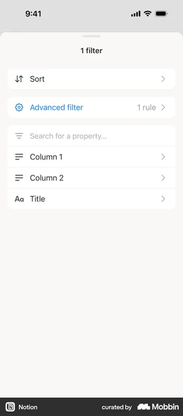
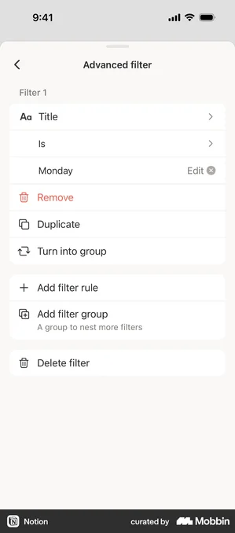
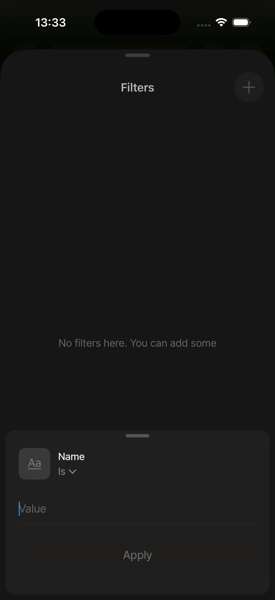
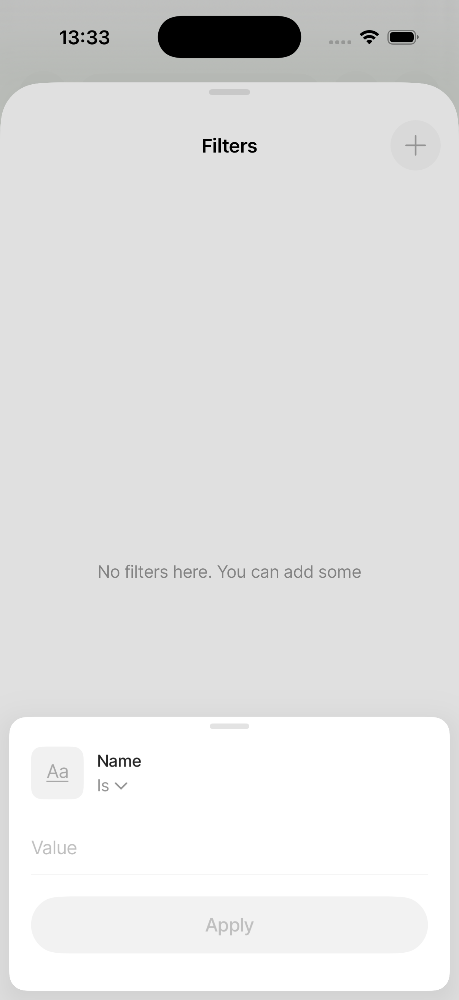
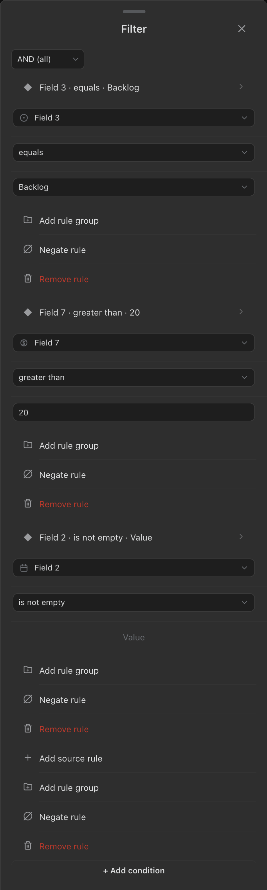
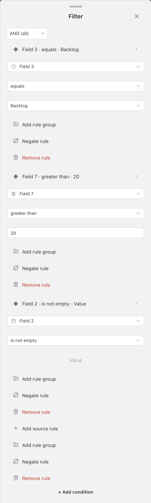

<!-- SPECKIT_TEMPLATE_SOURCE: spec-core + level2-verify | v2.2 -->
# Feature Specification: Phase 3: Filter Sheet Visual Parity

<!-- SPECKIT_LEVEL: 2 -->

---

## EXECUTIVE SUMMARY

The current phone filter surface reads as a form: each condition is three full-width bordered pills,
and each condition repeats its own action rows. The active-rule filter popover still paints three
side-by-side dropdowns. The target is a Notion-shaped two-tier experience: one compact summary row
per condition, a drill-in detail group with property/operator/value rows separated by hairlines on
the plain sheet canvas, and labelled action groups below it. Notion's bottom-sheet references
visibly show inset rounded cards on a grey canvas, but the operator's parent D7 ruling binds this
child to one plain canvas with divider-separated groups and no card containers. The only remaining
cross-packet contradiction is ADR-H in the 005 roadmap §7.19, which remains Proposed under D15. This
brief defines the visual contract; it does not implement it.

The image judge closes this child, not the DOM lane. A Sonnet or Opus reviewer scores the eight
parent rows — Frame, Sections, Row anatomy, Controls, Type, Spacing, Colour, Both themes — at
0/1/2, maximum 16. Pass is at least 14/16 with no row at 0, twice consecutively on an unchanged
tree. The lane is the drift floor beneath that judgement.

The 002 properties child is the sequential predecessor (D4). The operator's C-1 full-resolution
capture is absent, so any comparison number that concerns the reference rather than our established
token ladder is explicitly provisional and must be settled by C-1.

<!-- ANCHOR:metadata -->
## 1. METADATA

| Field | Value |
|-------|-------|
| Level | 2 |
| Priority | P1 |
| Status | CREATE iteration 1 landed lane-green; image judge owed |
| Created | 2026-09-10 |
| Branch | worktrees/301-loop-003-filter-sheet-visual-parity |
| Parent Spec | ../spec.md |
| Parent Packet | 076-sheet-visual-parity |
| Predecessor | ../002-properties-sheet-visual-parity/spec.md |
| Successor | ../004-sort-sheet-visual-parity/spec.md |
<!-- /ANCHOR:metadata -->

---

<!-- ANCHOR:phase-context -->
## Phase Context

Phase 3 of the Sheet Visual Parity programme, opened by the operator's 2026-09-10 ruling:
"Really needs to go step by step multiple ohases per sheet to define, plan, create, screenshot &
verify and remediate as needed based on anytype or notion or similar screens untill perfect" and
"Ui improvement is focus here."

The six-step loop is DEFINE → PLAN → CREATE → SCREENSHOT → VERIFY → REMEDIATE. The scope is
presentational: stored filter expressions, persistence, semantics and desktop behaviour remain
unchanged. Every visual choice below cites the loaded sk-design-fundamentals reference.
<!-- /ANCHOR:phase-context -->

---

<!-- ANCHOR:problem -->
## 2. PROBLEM & PURPOSE

### Problem Statement

The current constructed filter-panel captures begin with a centred Filter header, then show three
stacked bordered controls per condition. Light uses a pale grey canvas and white bordered rows;
dark uses a dark canvas and darker rows. Add rule group, Negate rule and red Remove rule repeat
below every condition. The nested capture adds a NOT rail and icon actions. The separate
constructed-active-rule-filter-mobile-{light,dark}.png capture is a small anchored popover with
Field 3 | equals | Backlog in one horizontal row. This is the before, not a claim that a green
shell lane means visual parity.

### Purpose

Make the filter surface legible as summary → detail → actions. A user identifies the active rule,
enters a focused editor, chooses a property or comparator through a navigation surface, edits a
value without helper prose, and finds destructive actions in a separated group. The active-rule
surface uses the same row grammar instead of preserving the three-dropdown exception.
<!-- /ANCHOR:problem -->

---

<!-- ANCHOR:scope -->
## 3. SCOPE

### Production surfaces bound by this child

Per parent D2, every producer painting this grammar is bound:

- constructed-filter-panel and constructed-filter-panel-nested, registered by
  constructedScenario("filter-panel", { renderer: "filter-panel", filterDepth }) in
  tools/screenshots/constructed-scenarios.mjs. Their in-page branch is
  scenario.renderer === "filter-panel" in tools/live/render-assertion-harness.ts (around line
  3345). Current viewport captures are
  screenshots/notion-clone/panels/constructed-filter-panel-mobile-{light,dark}.png and
  constructed-filter-panel-nested-mobile-{light,dark}.png. The judged full-sheet pair is
  constructed-filter-panel-sheet-mobile-{light,dark}.png.
- constructed-active-rule-filter, registered by
  constructedScenario("active-rule-filter", { renderer: "active-rule-popover", ruleKind: "filter" }).
  Its in-page branch is scenario.renderer === "active-rule-popover" in the same harness (around
  line 3314). Current captures are
  screenshots/notion-clone/components/constructed-active-rule-filter-mobile-{light,dark}.png.
  This is the operator-cited second production surface; 071/008 changed the filter-panel captures
  but did not name this popover.

### Producers

- src/views/filter-panel-renderer.ts — render, renderHeader, renderFilterTreeGroup,
  renderFilterRow, renderStackedConditionRow, renderValueInput.
- src/views/active-rule-popover-renderer.ts — toggleFilter and open.
- src/views/dropdown-field.ts — createDropdownField and openDropdownPopover.
- styles.css — shell, grouping surfaces, rows, controls, focus, themes and keyboard.
- src/i18n.ts — only missing labels for navigation/action rows.

### Harness and evidence files

- tools/screenshots/constructed-scenarios.mjs — registry and source provenance.
- tools/live/render-assertion-harness.ts — mountConstructed's in-page renderer branches.
- tools/live/sheet-grammar.mjs — live geometry/control clauses.
- tools/screenshots/capture.mjs and tools/screenshots/verify.mjs — phone/full-sheet accounting.
- tools/live/sheet-rebuild.mjs and tools/live/sheet-rebuild-harness.ts — real-app
  Chrome/WebKit filter interactions.
- tools/lane/check-lane.mjs and tools/lane/css-lane.json — stylesheet ownership/release evidence.

### Out of scope

Filter semantics, persistence, data shape, parser behaviour and desktop redesign. Reopening or
amending a 071 landing is also out of scope; ADR-H in ../../roadmap.md §7.19 records the additive
Notion summary/detail refinement and remains Proposed under D15. The Notion card observation is
documented, but parent D7 binds this child to plain-canvas divider groups. No Notion claim about
AND/OR placement is made.
<!-- /ANCHOR:scope -->

---

<!-- ANCHOR:requirements -->
## 4. REQUIREMENTS

### P0 — blockers

- REQ-001 Every reference path resolves; every reference-derived number is marked provisional and
  points to C-1.
- REQ-002 Both production surfaces in §3 use one visual grammar; no fixture-only scenario passes.
- REQ-003 Every measurable clause records RED before its producer changes and GREEN after.
- REQ-004 The full-sheet judge scores at least 14/16 with no zero, twice on an unchanged tree.

### P1 — required

- REQ-005 Phone light and dark captures are current, opened and read; the full-sheet pair exposes
  lower action/add/delete groups.
- REQ-006 Existing 071 row/inset/control floors re-run unchanged and remain green.
- REQ-007 Empty, many-item, keyboard-open, nested and active-rule states are covered.
- REQ-008 The operator device row is present and unticked.
<!-- /ANCHOR:requirements -->

---

<!-- ANCHOR:success-criteria -->
## 5. SUCCESS CRITERIA

| ID | Criterion | Measured by |
|----|-----------|-------------|
| SC-001 | DEFINE contains ordered frame/section/row/control/type/spacing/theme/state targets and a before → target delta for each rubric row | spec.md §13 |
| SC-002 | Each target number is an established token/lane floor or reads TBD — needs operator capture, with C-1 named | spec.md §13.12 |
| SC-003 | Production mount and both surfaces are covered, including empty and keyboard probes | plan.md §3; scenario/harness output |
| SC-004 | L1–L6 and unchanged 071 clauses pass after RED-first proof | tasks.md; tools/live/sheet-grammar.mjs |
| SC-005 | Image judge passes at least 14/16 with no row at 0, twice unchanged | verification.md |
| SC-006 | Operator phone read is recorded but not agent-ticked | acceptance-criteria.md |
<!-- /ANCHOR:success-criteria -->

---

<!-- ANCHOR:risks -->
## 6. RISKS & DEPENDENCIES

| Risk | Impact | Mitigation |
|------|--------|------------|
| A green shell lane hides a wrong row model | Three-pill UI ships again | L1–L6 measure identity, grouping and action scope; image judge remains the gate |
| Active-rule popover is fixed in isolation | Two filter grammars survive | Bind active-rule renderer and its constructed capture |
| Thumbnail values become pixel targets | Precise but false target | Notion is 299×678; reference numbers wait for C-1 |
| Dark grouping is a mechanical light inversion | Dividers or text become recessed/illegible | Keep one dark canvas and independently check divider/text contrast |
| styles.css changes without lane | Sibling work/captures become untrustworthy | Acquire/check/release css-lane triplet |
<!-- /ANCHOR:risks -->

---

## 7. NON-FUNCTIONAL REQUIREMENTS

Moved/added controls expose a ≥44px hit box. Normal text remains ≥4.5:1 contrast; boundaries and
focus indicators remain ≥3:1 where applicable. Phone value inputs use at least 16px computed text
to avoid iOS zoom. No new dependency or persistence path.

---

## 8. EDGE CASES

- Empty entry tier: search/property rows and one labelled Add advanced filter row without helper
  prose.
- Many conditions: three flat rules, nested and NOT groups, with lower action/add/delete groups reachable after scroll.
- Keyboard open while editing: respect --obnotion-keyboard-inset, keep header visible, keep
  clear/edit reachable and suppress distracting motion.
- Filled/empty values; only boolean value semantics may use an immediate toggle.
- Light/dark, focus, destructive and disabled/empty states.

---

## 9. COMPLEXITY ASSESSMENT

Level 2. One presentational family, shared stylesheet, and a second renderer converging on the
same grammar. Evidence and visual judgement are the complexity.

---

## 10. RISK MATRIX

| Area | Likelihood | Impact | Response |
|------|------------|--------|----------|
| Structurally right but visually off | Medium | High | Score all rubric rows; reopen DEFINE after three consecutive failures in one row |
| Shared shell token change | Medium | High | Keep tokens unless a RED assertion names the change; re-run sibling floors |
| Empty/keyboard state absent | Medium | Medium | Add explicit constructed state probes before CREATE |
| Comparator and active-rule diverge | Medium | High | Share picker/detail producer; assert L1/L5 |

---

## 11. USER STORIES

As a phone user, I can see an active filter as a compact summary and open one focused editor, so
I know where a tap will take me.

As a phone user, I can choose a property or comparator from a navigable list and edit a value in
a focused field, so a form of bordered pills does not compete for my attention.

As the operator, I can compare full light/dark filter captures beside named Notion screens, so
aligned means a picture has passed rather than only a DOM count.

---

<!-- ANCHOR:open-questions -->
## 12. OPEN QUESTIONS

- Conjunction placement: Notion's AND/OR control is not visible in the relevant 299×678 captures.
  Its position and visual treatment are unreadable at 299x678; 071/008's held Proposed choice
  remains unchanged.
- Reference pixel settlement: C-1 in 071/sheet-notion-audit.md §5 is absent. It settles row
  heights, indentation and action-group gaps; token values below are implementation floors, not
  claims about Notion pixels.
<!-- /ANCHOR:open-questions -->

---

<!-- ANCHOR:gap-table -->
## 13. DEFINE — the drawing board

> **Frame ruling (D7, operator, 2026-09-11):** no card containers anywhere in this sheet — rows
> group with hairline dividers on the plain sheet background. The Notion references below visibly
> show inset cards, but D7 is the current target ruling and overrides that reference presentation.

### 13.1 Reference inventory and precedence

Parent D3 orders evidence as operator full-resolution capture > Notion full-resolution capture >
Notion Mobbin thumbnail > Anytype. No C-1–C-6 or full-resolution Notion capture is present. The
full-resolution operator entry capture `screenshots/operator/0040-filter-property-picker-padding.png`
(1206×2622) and the rejected-container ruling
`screenshots/operator/0040-properties-card-container-rejected.png` (1206×2622) are present and take
precedence for the frame and entry reading. `screenshots/notion/ios/operator/` was checked and is
empty. Every Notion asset named below is a 299×678 Mobbin thumbnail: it settles structure, order,
copy, control type and visible grouping; a pixel value is “thumbnail, value unreadable” and waits
for C-1. The operator capture settles the plain-canvas direction and the C-1 detail capture still
settles exact Advanced filter and Comparator pixels.

Canonical database family, all read:

- screenshots/notion/ios/database/notion-ios-database-filters-01-1d5d6adc-4e6f-41d9-9831-245a420d790b.webp
  — top-level route with filter/sort/property navigation.
- screenshots/notion/ios/database/notion-ios-database-sort-05-1c2f52ce-3d48-4252-a65e-c255db2fab3b.webp
  — no-filter route despite the sort folder name.
- screenshots/notion/ios/database/notion-ios-database-filters-02-890dd17e-5553-47fb-9637-c8bc43392e2a.webp
  — one summary row and separate action/add/delete cards.
- screenshots/notion/ios/database/notion-ios-database-filters-03-5843bb8a-6fdb-46c5-9101-81d493f7f1eb.webp
  — detail property/operator/value rows in one grouped card.
- screenshots/notion/ios/database/notion-ios-database-filters-04-1f10ae24-57fe-4c4b-92b1-048456640ee1.webp
  — same detail grammar with another comparator.
- screenshots/notion/ios/database/notion-ios-database-filters-07-8b59d2b6-dc19-42af-ac49-fd9cf95c8c0a.webp
  — filled value with Edit and circular clear.
- screenshots/notion/ios/database/notion-ios-database-filters-08-d6d8022a-b391-45c1-8901-8200803b9baa.webp
  — Comparator drill-in list with blue Done.

The same seven database frames are byte-identical in
screenshots/notion/ios/flows/filtering-a-database/:
- screenshots/notion/ios/flows/filtering-a-database/notion-ios-flow-filtering-a-database-01-1c2f52ce-3d48-4252-a65e-c255db2fab3b.webp
- screenshots/notion/ios/flows/filtering-a-database/notion-ios-flow-filtering-a-database-02-5843bb8a-6fdb-46c5-9101-81d493f7f1eb.webp
- screenshots/notion/ios/flows/filtering-a-database/notion-ios-flow-filtering-a-database-03-d6d8022a-b391-45c1-8901-8200803b9baa.webp
- screenshots/notion/ios/flows/filtering-a-database/notion-ios-flow-filtering-a-database-04-1f10ae24-57fe-4c4b-92b1-048456640ee1.webp
- screenshots/notion/ios/flows/filtering-a-database/notion-ios-flow-filtering-a-database-05-8b59d2b6-dc19-42af-ac49-fd9cf95c8c0a.webp
- screenshots/notion/ios/flows/filtering-a-database/notion-ios-flow-filtering-a-database-06-890dd17e-5553-47fb-9637-c8bc43392e2a.webp and
- screenshots/notion/ios/flows/filtering-a-database/notion-ios-flow-filtering-a-database-07-1d5d6adc-4e6f-41d9-9831-245a420d790b.webp. The eighth,
- screenshots/notion/ios/flows/filtering-a-database/notion-ios-flow-filtering-a-database-08-c5fc5db2-33f2-4e5e-9bfa-dd284ad9408d.webp, is a normal
- database page and is out of scope.
Related flow frames were read and classified:
screenshots/notion/ios/flows/setting-up-filter/notion-ios-flow-setting-up-filter-01-794591f5-f9b6-4416-8c0c-bea36a0e1e65.webp
is the parent View options sheet;
screenshots/notion/ios/flows/setting-up-filter/notion-ios-flow-setting-up-filter-02-86a8e66c-2ca9-4f11-90b3-17dd3e7367d9.webp
is the Add filter property picker;
screenshots/notion/ios/flows/setting-up-filter/notion-ios-flow-setting-up-filter-03-beabc96b-a48b-470f-9553-3728e73b5f1b.webp
is the Filters host list; and
screenshots/notion/ios/flows/setting-up-filter/notion-ios-flow-setting-up-filter-04-a709d32e-1962-407a-aade-1ca0819f1a4c.webp
and
screenshots/notion/ios/flows/setting-up-filter/notion-ios-flow-setting-up-filter-05-39e7ad85-f85e-41de-8bc9-5df639c18e61.webp
are host page/table states.
screenshots/notion/ios/database/notion-ios-database-filters-11-4acbc134-f8aa-42e5-bf4d-0d10ba691ee9.webp
and
screenshots/notion/ios/database/notion-ios-database-filters-14-bdd3608f-ed64-4909-b79e-3f1983539e0c.webp
are settings/router sheets;
screenshots/notion/ios/database/notion-ios-database-filters-12-6c740ed6-969e-427c-828d-00b779664287.webp
is a Group by picker. The adjacent AI frames
screenshots/notion/ios/ai/notion-ios-ai-filters-05-4c195b27-50ed-4a63-9658-f5fc5c979598.webp,
screenshots/notion/ios/ai/notion-ios-ai-filters-06-a56c9b04-41bc-4875-84f2-d3757a73ddc4.webp,
screenshots/notion/ios/ai/notion-ios-ai-filters-09-7174b226-1497-4754-bf60-43ecba835669.webp
and
screenshots/notion/ios/ai/notion-ios-ai-filters-10-ae3beaf9-9095-4831-ae5e-430bb28d9dd4.webp
are a search/person-filter family with a toggle, not database conditions.
screenshots/notion/ios/menus/notion-ios-menus-filters-15-aeb6d373-0c84-4b69-a591-029ea8938b83.webp
is an Actions menu and
screenshots/notion/ios/navigation/notion-ios-navigation-filters-13-e20dff9f-f089-4d08-8f54-d32decbca5e9.webp
is a Sort by menu. They were audited so names containing “filters” do not silently become false
editor references.

Anytype is lower-precedence structural evidence:

- screenshots/anytype/mobile/sheets/anytype-mobile-sheet-view-filters-empty-light.png and
  screenshots/anytype/mobile/sheets/anytype-mobile-sheet-view-filters-empty-dark.png — handle,
  centred Filters, plus and empty state.
- screenshots/anytype/mobile/sheets/anytype-mobile-sheet-filter-condition-text-light.png and
  screenshots/anytype/mobile/sheets/anytype-mobile-sheet-filter-condition-text-dark.png — child
  property/operator/value sheet with one text field.
- screenshots/anytype/mobile/sheets/anytype-mobile-sheet-filter-condition-operators-light.png
  and screenshots/anytype/mobile/sheets/anytype-mobile-sheet-filter-condition-operators-dark.png
  — flat operator list with selected check.
- screenshots/anytype/mobile/sheets/anytype-mobile-sheet-filter-relation-picker-light.png and
  screenshots/anytype/mobile/sheets/anytype-mobile-sheet-filter-relation-picker-dark.png —
  search and icon+label property rows.

047 research/research.md §6 and §10 corroborates compact filter summaries and three-tier layering.
It does not override a landed Anytype ruling. 071/008 remains untouched; ADR-H in
../../roadmap.md §7.19 is the Proposed contradiction.

### 13.2 Before — what a user sees today

The current production captures were opened at 804×1748 PNG pixels (402×874 CSS phone frame):

|---|---|
| constructed-filter-panel-mobile-light.png | Flush pale-grey sheet, handle and centred Filter; left AND(all); three white bordered full-width condition pills per rule; repeated labelled action rows and bottom Add condition. Dark text, muted icons and red Remove. |
| constructed-filter-panel-mobile-dark.png | Same structure on dark grey with darker row faces, light text, weak dividers and red Remove; a flat form. |
| constructed-filter-panel-nested-mobile-light.png / -dark.png | Same stacked pills plus a NOT group, vertical rail and undo/trash icon actions. |
| constructed-filter-panel-sheet-mobile-light.png / -dark.png | Full-sheet 804×2590 pair exposing all three rules and repeated action rows below the viewport fold. |
| constructed-active-rule-filter-mobile-light.png / -dark.png | Small anchored popover on a large backdrop; Field 3 | equals | Backlog in one row, three dropdowns, no sheet title or grouped detail surface. |

The current production source and capture give the packet-specific RED shape: one active-rule row
with three inline dropdowns; three condition rows per leaf; three bordered control boxes per
condition; two unlabelled action buttons in the nested NOT header; one inline comparator per
condition; and three repeated action rows per condition. The current flat fixture has three leaves,
so the existing global lane measures 9/9 filter rows at 48px, 16px panel padding, 357px row span,
0 native selects, 4 labelled root actions and no horizontal overflow. That global lane is a floor,
not the new visual-parity clauses. A first packet-specific run is still owed after L1–L6 are wired.

### 13.3 Sheet frame

| Property | Target brief | Provenance and design fundamental |
|---|---|---|
| Canvas/fill | Use one --obnotion-surface-overlay sheet canvas for all content. Do not paint --obnotion-settings-card-fill around logical sections or values. Search may use its recessed field fill because it is a control, not a grouping surface. | Operator `0040-properties-card-container-rejected.png`; parent D7; color-system.md §7; depth-and-detail.md §2 |
| Frame shape | Flush phone sheet uses the established shell radius token on top corners. Content groups have no container radius or inset fill; hairline dividers begin at the label inset and run full-bleed to the trailing edge. A floating child picker may use --obnotion-radius-xl (16px) and --obnotion-sheet-float-inset (8px). Reference shell pixels: thumbnail, value unreadable; C-1 settles them. | styles.css:75-90 and :255-300; parent D7; depth-and-detail.md §4 and §7 |
| Handle | One centred visual grabber, existing 34×5px visual token, with the shell hit band. Visible size is provisional against the thumbnail; C-1 settles parity. | styles.css phone-shell rule; interaction-craft.md §3; ux-laws.md §2 |
| Header | Root title is centred Filter with shared close. Detail title is centred Advanced filter with local back plus dismiss. Comparator title is centred with accent-blue Done. No unexplained bare icon toolbar. | Notion filters-02/03/08; hierarchy.md §3; interaction-craft.md §5; review-checklist.md §3 |
| Footer/actions | No fixed footer hides lower groups. Scroll keeps Add and Delete reachable; safe-area and keyboard padding remain. The last destructive action is its own terminal divider group/row. | diagnosis-table.md §2; motion-principles.md §5 |

### 13.4 Sections and grouping, in order

The Notion filter references visibly show inset rounded cards in filters-02/03/04/07 and a separate
terminal Delete card. This is confirmed structural evidence, while exact pixels remain unreadable
in the 299×678 thumbnails. The operator's D7 ruling is the binding production target: one plain sheet
canvas, hairline divider groups, and no rounded or lighter row/value containers. This explicitly
supersedes the card presentation inherited by the pre-D7 draft from 076/001 and 071/007; the
reference observation remains in the evidence record and is not silently erased.

Section headings sit on the same canvas as plain sentence-case secondary text at 13px/400, with an
8px gap before the first row and 16px between logical groups. Divider groups provide proximity and
scan structure; they do not receive a fill, radius or second border.

1. Empty entry tier: header, recessed search/property control and property rows on the plain canvas,
   separated by hairlines, followed by one labelled Add advanced filter row; no helper paragraph.
2. Filter summary tier: a sentence-case section label such as Filter Group 1, then one divider-
   separated group with one navigation row per condition.
3. Rule detail tier: one divider-separated condition group with property, comparator and value rows.
   The group has no rounded/lighter container and no border around an individual control.
4. Rule actions group: Remove (red), Duplicate and the state-appropriate Turn into filter, Wrap in
   group or Turn into group actions, once below the detail with a labelled section heading.
5. Add-actions group: Add filter rule and Add filter group; the group row may carry one muted
   subtitle seen in the reference.
6. Whole-filter destructive group: separate Delete filter row at the bottom, with divider and
   spacing making its destructive scope clear without a card boundary.
7. Comparator sub-sheet: handle/header, flat option rows on the plain canvas, hairline dividers,
   selected state and Done/back; never an inline operator dropdown in the detail group.

Nested/NOT preserves group label → summary → selected detail → actions → add → delete. A NOT rail
may carry semantics but not replace divider grouping or become a second toolbar.

### 13.5 DEFINE row-by-row table

This is the row-by-row contract used by the builder and repeated verbatim in the final report.
The reference is structural; no number below is read from a thumbnail.

| Leading icon | Label | Trailing element | Tap opens what | Source and composition reason |
|---|---|---|---|---|
| filter/funnel | Filter | Active-rule count + chevron | Advanced filter sheet / summary tier | Notion filters-01/02 for route and count; Anytype empty sheet confirms the entry affordance |
| logic/group icon | AND (all) / OR (any) | Selected value + chevron | Logic picker | Current filter semantics and 071/008 ADR-B; Notion's conjunction position was not observed, so this remains Proposed |
| property-type icon | Title Is "Monday" | Count 1 + chevron | Rule detail divider group | Notion filters-02 for compact summary; D7 converts the production group to plain-canvas dividers |
| property-type icon | Property | Chevron | Property picker / detail divider group | Notion filters-03/04 for drill-in row; Anytype relation picker for the navigable list |
| comparator icon | Comparator: Is / Contains | Chevron | Comparator sub-sheet | Notion filters-08 for the child list; Anytype operators corroborate selected-check navigation |
| search icon | Search properties | Clear when non-empty | Filtered property list | Notion setting-up-filter-02 and Anytype relation picker; search is picker chrome, not an inline condition input |
| none | Value | Edit link | Full-width value editor or type-specific value picker | Notion filters-03/04 for the value row; Anytype text condition for a focused editor |
| none | Filled value text | Edit link + circular clear affordance | Value editor; clear immediately removes the value | Notion filters-07 for Edit plus circular clear; the clear action is padded to the shared touch floor |
| trash | Remove | None | Remove one rule | Notion filters-02/03 observed action row; D7 separates destructive text with a labelled divider group |
| copy | Duplicate | None | Duplicate one rule | Notion filters-02/03 observed action-row vocabulary; D7 keeps the row on the plain canvas |
| group | Turn into filter | None | Convert the advanced group to a filter | Notion filters-02 observed summary action; D7 places it in the rule-action divider group |
| group | Wrap in group / Turn into group | None | Wrap the current rule or group | Notion filters-02/03 observed action wording; D7 places it in the rule-action divider group |
| plus | Add filter rule | None | Create a rule and open its detail divider group | Notion filters-02/03 observed add action; Anytype empty sheet confirms plus-led creation |
| group-plus | Add filter group | None | Create a nested group | Notion filters-02/03 observed add action; the supporting subtitle is kept to one short line |
| trash | Delete filter | None | Remove the whole filter configuration | Notion filters-02/03 observed terminal action; D7 isolates the destructive row with divider and spacing |
| none/check | Comparator option (Is, Is not, Contains, etc.) | Check on selected option | Select comparator and return/Done | Notion filters-08 and Anytype operators; flat list selection with dividers on the plain canvas |
| none | No filters here | Plus action | Add filter/property picker | Anytype empty filter sheet for empty-state shape; Notion setting-up-filter-02 for picker route |

### 13.6 Control grammar

Property and comparator are navigation rows with a leading type icon, a readable label, a trailing
value or chevron and a destination. The value is a navigation row: free text opens one full-width
text field only in its editor state; select/date/checkbox values use their existing type picker.
Only boolean value semantics may use an immediate toggle. Filled values expose Edit and a circular
clear action. Icon-only clear is accessible and padded to ≥44px. Actions are full-width labelled
rows in their own labelled divider groups, with dividers between adjacent rows on the plain canvas;
there are zero repeated action rows in the summary group. Search is allowed in picker chrome, but there are no
stacked bordered inline inputs or helper paragraphs beneath condition fields. Keyboard-open editing
uses a real input/textarea at ≥16px and respects --obnotion-keyboard-inset.

This follows ux-laws.md §3 (progressive disclosure), §5 (proximity/common region) and §6
(similarity/Von Restorff/Jakob), diagnosis-table.md §2 for spacing and divider grouping, plus
depth-and-detail.md §2/§4/§7 for one surface with restrained depth and interaction-craft.md §3/§5/§8
for hit areas, focus rings and input size.

### 13.7 Type scale and weights

Use the existing ladder. These numeric values are our stylesheet scale, not thumbnail measurements;
C-1 can reopen them as a recorded target difference.

| Role | Token target | Current numeric token | Weight | Use |
|---|---|---:|---:|---|
| Sheet title | --obnotion-font-lg | 16px | 600 | Filter, Comparator and child titles |
| Section label | --obnotion-font-md | 13px | 400 | Filter Group 1 / sections, sentence case |
| Row label | --obnotion-font-lg | 16px | 400 | Property, comparator, actions and add rows |
| Row value | --obnotion-font-lg | 16px | 400 | Filled value and trailing summary text |
| Subtitle | --obnotion-font-base | 14px | 400 | Add-group supporting line only; no helper paragraph under fields |
| Footnote | none | — | — | No footnote or helper paragraph under condition fields |
| Empty/search hint | --obnotion-font-md | 13px | 400 | Search placeholder and empty hint |

No weight below 400. Hierarchy follows hierarchy.md §2–§3: weight/colour before size, quieter
secondary text, no more than three text-colour roles.

### 13.8 Spacing rhythm

Token-backed values are implementation targets. The reference column is provisional whenever the
thumbnail cannot settle the pixel.

| Relationship | Target | Provenance |
|---|---:|---|
| Phone sheet side inset | --obnotion-sheet-inset = 16px; content begins at that inset | Established styles.css:44-56; `screenshots/operator/0040-filter-property-picker-padding.png` settles the visible entry edge; reference detail edge thumbnail, value unreadable; C-1 settles detail pixels |
| Interactive row min-height | 44px; target window 44–52px | Existing lane floor and interaction-craft.md §3; reference pitch thumbnail, value unreadable; C-1 |
| Row horizontal inset | 16px leading content inset; divider starts at the label inset and runs full-bleed to the trailing edge | Parent D7 and operator rejected-container capture; reference edge thumbnail, value unreadable; C-1 settles detail pixels |
| Shell corner radius | Existing shell radius token; group/container radius is 0 by D7 | Established styles.css:75-90 and parent D7; reference curve thumbnail, value unreadable; C-1 settles shell pixels |
| Group gap | 16px target, never below the 8px spacing floor | diagnosis-table.md §2 and --obnotion-space-5 ladder; reference gap thumbnail, value unreadable; C-1 settles exact gap |
| Hairline divider | 1px | Existing --obnotion-border-subtle and parent D7; reference weight thumbnail, value unreadable; C-1 settles alpha |
| Within-group row rhythm | Adjacent rows are contiguous with 1px hairlines; no pill gap between controls | Parent D7 and diagnosis-table.md §2; exact vertical padding is thumbnail, value unreadable; C-1 |
| Between logical groups | 16px target gap, no tighter than 8px; no card gap because groups have no containers | Parent D7 and --obnotion-space-5; reference gap thumbnail, value unreadable; C-1 |
| Section label to first row | 8px token gap after the sentence-case heading | --obnotion-space-4; reference band thumbnail, value unreadable; C-1 |
| Clear/action hit box | ≥44×44px | shell-edge-control token and interaction-craft.md §3; reference glyph size thumbnail, value unreadable; C-1 |

More space between logical groups than inside groups is the diagnosis-table.md §2 remedy. D7 keeps
the grouping signal to proximity plus hairline dividers; the phone shell is the only rounded frame.

### 13.9 Theme brief

| Token/role | Light target | Dark target | Design basis |
|---|---|---|---|
| Canvas | --obnotion-surface-overlay, a grey sheet canvas | --obnotion-surface-overlay, a dark sheet canvas | color-system.md §7; depth-and-detail.md §2 |
| Grouping fill | None: rows and section labels share the sheet canvas; search alone may use a recessed control fill | None: rows and section labels share the sheet canvas; search alone may use a recessed control fill | Parent D7; color-system.md §7; depth-and-detail.md §2 |
| Primary text | --text-normal | Dark normal text with same hierarchy | color-system.md §6 |
| Secondary text/icons | Muted/faint, not competing | Desaturated muted token, not low-contrast grey | hierarchy.md §2; color-system.md §6 |
| Divider | --obnotion-border-subtle, visible on the plain canvas and inset only at the leading edge | Resolved non-transparent dark divider on the plain canvas with the same geometry | Parent D7; color-system.md §7; review-checklist.md §5 |
| Accent/Done | Accent blue for Done, selected comparator and links | Same semantic accent, independently contrast-checked | color-system.md §7 |
| Destructive | Error red at ≥4.5:1 text contrast | Error red checked against dark sheet background | color-system.md §6; review-checklist.md §5 |
| Focus | Accent ring with ≥3:1 boundary contrast | Same focus semantics against dark sheet background | interaction-craft.md §5; review-checklist.md §3 |

### 13.10 State contract

| State | User-visible target | Evidence |
|---|---|---|
| Empty | Header, recessed search/property control, divider-separated property rows and one Add advanced filter action row; no stacked form/helper paragraph | renderEntryTier; Anytype empty sheet is structural corroboration; add explicit empty scenario if registry lacks it |
| Single/many | One summary row per condition in one divider group; tap drills to one divider-separated detail group; flat, nested and NOT keep labels and semantic rails without cards | Current full-sheet before pair; Notion filters-02/03 observed grouping; parent D7 binds production grammar |
| Filled value | Value, Edit and circular clear; clear is immediate | Notion filters-07 |
| Comparator open | Flat list on the plain child sheet with divider-separated options, selected check and Done/back; no inline comparator remains in detail | Notion filters-08 and Anytype operators; parent D7 |
| Keyboard open | 16px input; sheet lifts by published keyboard inset; header and clear/edit remain reachable; no motion replay | sheet-grammar keyboard probe; motion-principles.md §5 |
| Light/dark | Same order/geometry; one sheet canvas, dividers, text and destructive roles remain separable | Paired constructed captures and contrast check; parent D7; color-system.md §7 |

### 13.11 DELTA table — before → target → rubric

| Property | Before (current tree/capture) | Target | Rubric row | Fundamental |
|---|---|---|---|---|
| Frame | Flush grey/dark sheet with handle and centred Filter; active-rule is a small anchored popover | Token-backed bottom-sheet shell with one plain canvas and divider groups; centred title; local back on drill-in, shared close on root and Done on Comparator | Frame | hierarchy.md §3; parent D7; depth-and-detail.md §2/§4 |
| Sections | Conditions and actions repeat as one long form | Summary group → detail group → one rule-action group → add-actions group → terminal Delete row/group, with headings, proximity and hairlines on the same canvas | Sections | diagnosis-table.md §2; ux-laws.md §5; parent D7 |
| Row anatomy | Three full-width bordered pills; active-rule has three side-by-side dropdowns | Leading icon, readable label, trailing value/chevron/count; one navigation row per concept | Row anatomy | hierarchy.md §2; ux-laws.md §6 |
| Controls | Inline dropdowns and bordered inputs imply direct editing everywhere | Navigation rows open pickers; only focused value state uses a full-width text field; toggles only for boolean values | Controls | ux-laws.md §3; interaction-craft.md §8 |
| Type | Mixed compact pill labels and repeated action text | Token ladder: 16 title/labels, 16 row values, 13 section labels, 14 subtitles, no field footnotes; 400 body and 500/600 emphasis | Type | hierarchy.md §2–§3 |
| Spacing | Stacked pills and repeated action rows create equal/ambiguous gaps | 16px content inset, shell-only radius, 16px provisional group gap with an 8px floor, 44–52px rows and 1px dividers | Spacing | diagnosis-table.md §2; parent D7; depth-and-detail.md §4/§7 |
| Colour | Light white-on-grey and dark dark-on-dark are flat; dividers weak | One grey/dark sheet canvas in both themes, three text roles, visible painted dividers, accent links and contrast-safe red | Colour | color-system.md §6–§7; parent D7 |
| Both themes | Same structural before, dark grouping hierarchy especially weak | Same order/geometry in light and dark with one canvas, independently contrast-checked dividers and text | Both themes | color-system.md §7; review-checklist.md §5; parent D7 |

### 13.12 Provisional values and operator settlement

The implementation may use established token values now, but cannot claim reference parity until
C-1 is available:

| Provisional value | Why it is provisional | Operator capture that settles it |
|---|---|---|
| Reference row pitch, 44–52px target window | Thumbnail, value unreadable; 44–52px is our phone lane floor | C-1 full-resolution Advanced filter sheet |
| Reference 16px outer inset | Thumbnail, value unreadable; 16px is our sheet token | C-1 |
| Reference section gap 16px and within-group rhythm 8px | Thumbnail, value unreadable; grouping is visible, exact gap is not | C-1 |
| Reference shell corner radius and content inset | Thumbnail, value unreadable; the shell curve and content edge are visible, pixels are not; group radius is 0 by D7 | `screenshots/operator/0040-filter-property-picker-padding.png` settles the entry shell/edge reading; C-1 settles Advanced detail and Comparator pixels |
| Reference handle and clear-icon visible sizes | Thumbnail, value unreadable; our hit area is ≥44px | C-1 |
| Reference divider alpha/weight | Thumbnail, value unreadable; target is a resolved 1px divider on the plain canvas | `screenshots/operator/0040-properties-card-container-rejected.png` settles the no-container direction; C-1 settles alpha/weight |
| Reference type sizes and exact weights | Thumbnail, value unreadable; token ladder is our floor | C-1 |

No numeric value is sourced from Anytype. Stylesheet tokens and 071's 44–52px/16px floors are
implementation evidence, not measurements of a Mobbin thumbnail.

### 13.13 Lane clauses to encode

Add stable producer markers before asking for green. The packet-specific RED values below are
measured from the current captures/source and the pre-change global lane. They are not a claim that
the existing global lane already measures every packet clause:

| Clause | Metric and target | Recorded RED today | GREEN evidence |
|---|---|---:|---|
| L1 active-rule grammar | Active-rule filter rows carrying three side-by-side dropdowns = 0 | 1 row (Field 3 / equals / Backlog) | No operator-dropdown controls on active condition row; companion uses shared detail marker |
| L2 summary row | Maximum condition rows per rule at list level = 1; three-rule scenario yields three summary rows | 3 condition rows per leaf, 9 rows across the current three-leaf fixture | One filter-summary-row per condition, each with count/chevron and no inline editor |
| L3 detail grouping | Property/operator/value are one divider-separated group on the plain canvas; rounded/lighter control boxes inside it = 0 | 0 detail-group markers and 3 bordered control boxes per condition | One filter-detail-group, three detail rows, hairlines only between rows and no nested control borders |
| L4 header controls | Unlabelled/bare icon action buttons in phone filter header = 0; labelled shell close/back/Done are exceptions | 2 unlabelled icon buttons in the nested NOT header; the global root-action floor already reads 4 labelled actions | Keep semantics in labelled rows and reserve the header for title plus named navigation/dismissal slots |
| L5 comparator control | Inline operator dropdowns on condition surface = 0; comparator uses child picker | 1 inline operator dropdown per condition, 3 across the current three-leaf fixture | Detail exposes a Comparator navigation row; the phone picker opens a flat option list |
| L6 action scope | Summary-list action rows = 0; detail has one rule-action divider group, one add-actions divider group and one whole-filter Delete divider group | 3 repeated action rows per condition, 9 across the current three-leaf fixture; no dedicated terminal Delete group | Actions occur once below selected detail, add once below, Delete once at bottom; summary has zero action rows |

Unchanged 071 floors re-run in the same pass: rows 44–52px, 16px inset, 1px painted divider, no
native selects, no horizontal overflow, visible labelled root actions and sibling clauses. Lane
green is not image-judge closure.

### 13.14 Design-fundamental decision ledger

| Visual decision | Why this decision | Fundamental cited |
|---|---|---|
| Summary first, detail on tap | Reduces initial choice set and makes common scan state compact | ux-laws.md §3 and §6 |
| One merged detail divider group | Common region/proximity says property/operator/value are one condition; hairlines preserve row scanning without introducing a second surface | ux-laws.md §5; diagnosis-table.md §2; parent D7 |
| Labelled action groups | Text exposes hierarchy and destructive scope; header glyphs are ambiguous | hierarchy.md §3; interaction-craft.md §5 |
| Flat Comparator child list | Finite choice deserves focused picker, not crowded inline control | ux-laws.md §3/§5; interaction-craft.md §3; parent D7 |
| More gap between logical groups than rows | Proximity and headings remain legible because group spacing exceeds within-group row rhythm, without card containers | diagnosis-table.md §2; parent D7 |
| One plain canvas in both themes | A single canvas avoids false depth; dividers and spacing separate groups while dark mode preserves the same geometry | color-system.md §7; parent D7; depth-and-detail.md §2 |
| 44px hit boxes with padded glyphs | Thumb safety without visual noise | interaction-craft.md §3; ux-laws.md §2 |
| No transition while keyboard is open | High-frequency focus/edit path stays stable | motion-principles.md §5; review-checklist.md §4 |

### 13.15 Contradiction record

ADR-H in ../../roadmap.md §7.19 records that 071/008 landed stacked three-pill conditions and
retained AND/OR as held Proposed, while this DEFINE reads Notion's summary row, merged detail
group and Comparator child sheet. This child may implement the additive Notion refinement but must
not amend 071/008. The Notion card observation is confirmed in filters-02/03/04/07, but parent D7
(operator 2026-09-11) is the binding production frame: plain sheet background, hairline divider
groups and no card containers. D7 supersedes the pre-existing card presentation from 076/001 and
071/007 for this phase, so the conflict is resolved explicitly rather than silently rewriting a
landed child. Parent D15 keeps ADR-H Proposed for the condition row model and conjunction. The
Source column above keeps each row's evidence explicit. The conjunction remains TBD — needs
operator capture.

<!-- /ANCHOR:gap-table -->

---

## 14. Reference images

> Embedded so a fresh planner and the image judge see the same screens the operator rules
> against. (a) operator device captures and the ruling each grounds; (b) on-tree reference
> captures from Notion/Anytype/ClickUp; (c) the current-state judge capture, where one has
> landed.

### 14.1 Operator screenshots

Grounds: "Too much side padding and still looks like old one"

Grounds: "Never use bg container like here for values, notion / anytype use dividers on plain sheet bg thats better"

### 14.2 Reference captures (Notion / Anytype / ClickUp)

### 14.3 Current-state judge capture

---

## RELATED DOCUMENTS

- Parent: ../spec.md, ../plan.md, ../decision-record.md (loop, rubric, precedence and D1–D9)
- Anytype research: ../../047-competitor-references-and-pm-alignment/research/research.md
- Prior audit: ../../071-sheet-notion-anytype-alignment/sheet-notion-audit.md
- Proposed contradiction: ../../roadmap.md §7.19 ADR-H
- Plan: plan.md (exact producers, scenario/mount path, lane and capture sequence)
- Verification: verification.md (judge iterations and operator gate)
