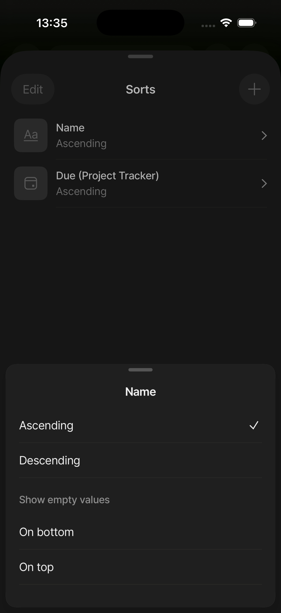
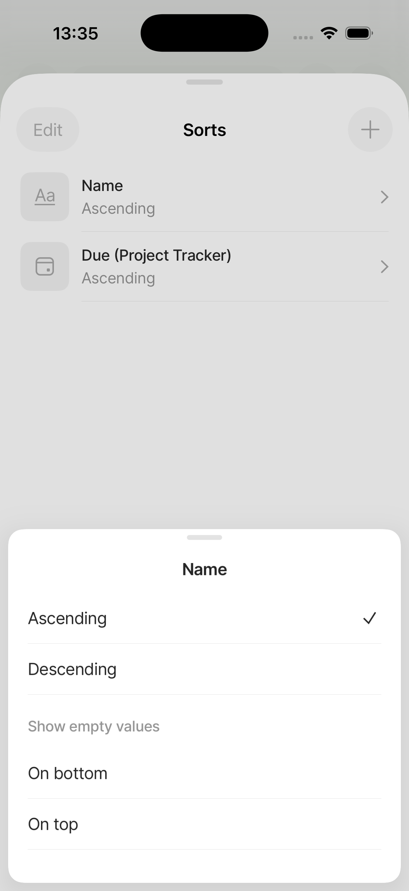
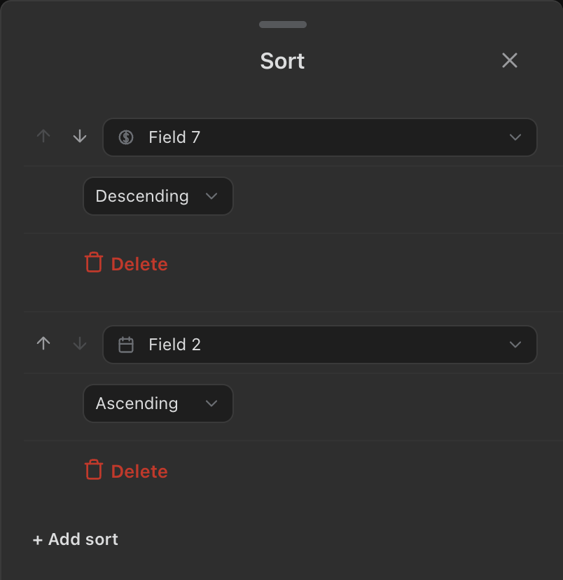
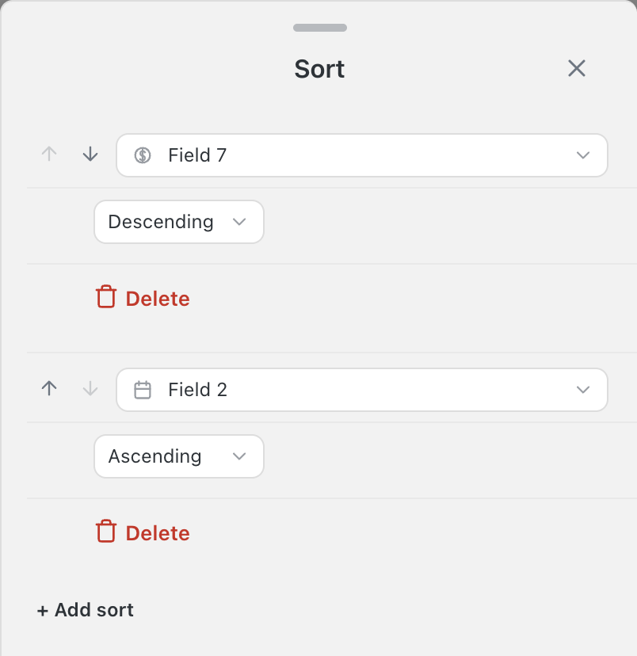

<!-- SPECKIT_TEMPLATE_SOURCE: spec-core + level2-verify | v2.2 -->
# Feature Specification: Phase 4: Sort Sheet Visual Parity

<!-- SPECKIT_LEVEL: 2 -->

---

## EXECUTIVE SUMMARY

The current phone sort sheet reads as a stacked form: each rule is a property picker row (leading
reorder arrows plus a bordered dropdown pill), a separately-boxed direction picker row indented
under it, and a plain-text red Delete row — all drawn with a uniform 1px hairline between every
row, rule boundary or not. Notion merges the property and direction rows into one card, drills
direction into its own two-row sub-sheet, and separates the per-rule Delete into its own card below
the rule, with a further terminal card holding both "Add sort" and "Delete sort". The active-rule
sort popover still renders two bare side-by-side dropdown pills with none of the sheet's own row
grammar. Notion's references visibly show inset cards, but the operator's parent D7 ruling binds
this child to one plain canvas with hairline divider groups and no card containers; D9 requires each
DEFINE row to compose its target from whichever of Anytype, Notion or ClickUp reads best, named in a
Source column.

The image judge closes this child, not the DOM lane. A Sonnet or Opus reviewer scores the eight
parent rows — Frame, Sections, Row anatomy, Controls, Type, Spacing, Colour, Both themes — at
0/1/2, maximum 16. Pass is at least 14/16 with no row at 0, twice consecutively on an unchanged
tree. The lane is the drift floor beneath that judgement.

The 003 filter child is the sequential predecessor (D4) and must pass its judge twice before this
child's CREATE starts. No operator C-1 full-resolution Sort capture exists, so any comparison number
that concerns the reference rather than our established token ladder is explicitly provisional.

<!-- ANCHOR:metadata -->
## 1. METADATA

| Field | Value |
|-------|-------|
| Level | 2 |
| Priority | P1 |
| Status | Planned — DEFINE + PLAN complete; CREATE not started |
| Created | 2026-09-10 |
| Branch | worktrees/305-loop-004-sort-sheet-visual-parity |
| Parent Spec | ../spec.md |
| Parent Packet | 076-sheet-visual-parity |
| Predecessor | ../003-filter-sheet-visual-parity/spec.md |
| Successor | ../005-group-sheet-visual-parity/spec.md |
<!-- /ANCHOR:metadata -->

---

<!-- ANCHOR:phase-context -->
## Phase Context

Phase 4 of the Sheet Visual Parity programme, opened by the operator's 2026-09-10 ruling:
"Really needs to go step by step multiple ohases per sheet to define, plan, create, screenshot &
verify and remediate as needed based on anytype or notion or similar screens untill perfect" and
"Ui improvement is focus here", refined by the 2026-09-11 05:30-05:38 rulings that retire card
containers (D7) and require a best-of-three composed Source column (D9).

The six-step loop is DEFINE → PLAN → CREATE → SCREENSHOT → VERIFY → REMEDIATE. The scope is the
Sort Sheet and every other production surface rendering its grammar, presentational only: no
behaviour, persistence or stored-shape change.
<!-- /ANCHOR:phase-context -->

---

<!-- ANCHOR:problem -->
## 2. PROBLEM & PURPOSE

### Problem Statement

The current constructed sort-panel captures (`constructed-sort-panel-sheet-mobile-{light,dark}.png`)
show a centred "Sort" title with a shared close `✕`, then per rule: a leading up/down arrow pair
plus a bordered dropdown pill reading the property (with its own leading type icon), a second
bordered dropdown pill reading the direction indented under it, and a plain red "Delete" text row —
each row separated by the same uniform 1px hairline (`.obnotion-sort-panel.obnotion-mobile-bottom-
sheet .obnotion-panel-row + .obnotion-panel-row::before`, styles.css:2547-2556 region) whether or
not it crosses a rule boundary. Only "+ Add sort" exists at the bottom; there is no whole-config
delete action. The active-rule sort popover (`constructed-active-rule-sort-mobile-{light,dark}.png`)
shows exactly two side-by-side dropdown pills (field, direction) in a small anchored card, with none
of the sheet's own leading-icon/label reading. This is the before, not a claim that a green shell
lane means visual parity.

### Purpose

Make the sort rule legible as one merged unit — what to sort by and which direction — followed by
its own clearly separated removal action, with a terminal group for whole-config add/delete. The
active-rule surface uses the same divider-group grammar instead of floating two anonymous pills.
<!-- /ANCHOR:problem -->

---

<!-- ANCHOR:scope -->
## 3. SCOPE

### Production surfaces bound by this child

Per parent D2, every producer painting this grammar is bound:

- `constructed-sort-panel` and `constructed-sort-panel-calendar`, registered by
  `constructedScenario("sort-panel", { renderer: "sort-panel" })` in
  `tools/screenshots/constructed-scenarios.mjs`. Their in-page branch is
  `scenario.renderer === "sort-panel"` in `tools/live/render-assertion-harness.ts:3388`. Current
  viewport captures are `screenshots/notion-clone/panels/constructed-sort-panel*-mobile-{light,dark}.png`.
  The judged full-sheet pair is `constructed-sort-panel-sheet-mobile-{light,dark}.png`.
- `constructed-active-rule-sort`, registered by
  `constructedScenario("active-rule-sort", { renderer: "active-rule-popover", ruleKind: "sort" })`.
  Its in-page branch is `scenario.renderer === "active-rule-popover"` in the same harness
  (`render-assertion-harness.ts:3314`). Current captures are
  `screenshots/notion-clone/components/constructed-active-rule-sort-mobile-{light,dark}.png`. This
  is the same second-surface gap `003` closes for filter (parent §4 row 89 finding (c)); `071/012`
  changed the sort-panel captures but never named this popover.
- Fixtures `panel-sort-rules`, `panel-sort-calendar-empty` and `chrome-active-rule-popover-sort`
  declare `fixtureOf` at the two scenarios above; no scenario work is owed.

### Producers

- `src/views/sort-panel-renderer.ts` — `render`, `renderRule`, `renderRuleMoveControls`,
  `renderRulePropertyPicker`, `renderRuleDirectionPicker`.
- `src/views/active-rule-popover-renderer.ts` — `toggleSort`, `open` (shared with filter's
  `toggleFilter`; the sort-specific branch is the one this child may change).
- `src/views/toolbar-primitives.ts` — `createConditionRow`, only if the merged-group wrapper needs
  a shared primitive rather than a sort-local one.
- `styles.css` — sort-rule-row, sort-direction-row, sort-delete-row and the shared
  `.obnotion-panel-row` divider/inset rules at lines 13904-13957, 14054-14125, 12547-12561 and
  11751-11767.
- `src/i18n.ts` — only a new "Delete sort" whole-config label; `panel.addSort` (581),
  `panel.emptySorts` (583), `sortPanel.calendarHint` (584) and `panel.sortDirection` (589) already
  exist and are unchanged.

### Harness and evidence files

- `tools/screenshots/constructed-scenarios.mjs` — registry and source provenance.
- `tools/live/render-assertion-harness.ts` — `mountConstructed`'s in-page renderer branches at
  lines 3314 (active-rule-popover) and 3388 (sort-panel).
- `tools/live/sheet-grammar.mjs` — live geometry/control clauses; existing sort registrations at
  lines 90, 190, 394-395, 457, 499, 502, 2418, 2468-2660, 5254, 5436, 5513, 5570, 5610.
- `tools/screenshots/capture.mjs` and `tools/screenshots/verify.mjs` — phone/full-sheet accounting.
- `tools/lane/check-lane.mjs` and `tools/lane/css-lane.json` — stylesheet ownership/release
  evidence; the lane is currently held by `076-002-properties-sheet-visual-parity` and must be
  released before this child's CREATE step acquires it.

### Out of scope

Sort semantics, persistence, data shape and desktop redesign. Reopening or amending a `071` landing
is out of scope: `071/012` ADR-001 (arrow-pair reorder) is confirmed still PROVISIONAL for Notion's
half in `roadmap.md` §7.19 ADR-F and is not reopened here; the per-rule-delete placement
contradiction is recorded in §13.15 below per that same roadmap section's own pointer. No Notion
claim about the reorder affordance is made.
<!-- /ANCHOR:scope -->

---

<!-- ANCHOR:requirements -->
## 4. REQUIREMENTS

### P0 — blockers

- REQ-001 Every reference path resolves; every reference-derived number is marked provisional and
  says "thumbnail, value unreadable" where read from a 299×678 Mobbin asset.
- REQ-002 Both production surfaces in §3 use one visual grammar; no fixture-only scenario passes.
- REQ-003 Every measurable clause records RED before its producer changes and GREEN after.
- REQ-004 The full-sheet judge scores at least 14/16 with no zero, twice on an unchanged tree.

### P1 — required

- REQ-005 Phone light and dark captures are current, opened and read.
- REQ-006 The `071` clauses this sheet already carries re-run unchanged and green.
- REQ-007 The operator device row is present and unticked.
<!-- /ANCHOR:requirements -->

---

<!-- ANCHOR:success-criteria -->
## 5. SUCCESS CRITERIA

| ID | Criterion | Measured by |
|----|-----------|-------------|
| SC-001 | DEFINE contains ordered frame/section/row/control/type/spacing/theme/state targets, a Source column per D9 and a before → target delta for each rubric row | spec.md §13 |
| SC-002 | Each target number is an established token/lane floor or reads TBD — needs operator capture, with the settling capture named | spec.md §13.12 |
| SC-003 | Both production surfaces are covered, mount chain confirmed by reading each link | plan.md §3 |
| SC-004 | L1-L6 and unchanged 071 clauses pass after RED-first proof | tasks.md; tools/live/sheet-grammar.mjs |
| SC-005 | Image judge passes at least 14/16 with no row at 0, twice unchanged | verification.md |
| SC-006 | Operator phone read is recorded but not agent-ticked | acceptance-criteria.md |
<!-- /ANCHOR:success-criteria -->

---

<!-- ANCHOR:risks -->
## 6. RISKS & DEPENDENCIES

| Risk | Impact | Mitigation |
|------|--------|------------|
| A green shell lane hides a wrong row model | The stacked-form UI ships again | L1-L6 measure identity and grouping; image judge remains the gate |
| Active-rule popover fixed in isolation | Two sort grammars survive | Bind the active-rule renderer's sort branch and its constructed capture |
| Thumbnail values become pixel targets | Precise but false target | Every Notion asset here is 299×678; reference numbers wait for an operator capture |
| The uniform row-divider rule fights the merged-group read | Property+direction still look like two rows even after grouping | L2's group wrapper is a DOM/CSS target, not a spacing tweak alone; judge Row anatomy directly |
| styles.css contention with another child | Sibling work/captures become untrustworthy | Confirm the css-lane triplet is released by `002` before this child's CREATE acquires it |
<!-- /ANCHOR:risks -->

---

## 7. NON-FUNCTIONAL REQUIREMENTS

Touch targets ≥44px on every control this child adds or moves. No contrast regression in either
theme. No new dependency, no new runtime pattern.

---

## 8. EDGE CASES

- The sheet at its longest content, against the 90svH cap and the published keyboard inset.
- The sheet with the keyboard up.
- Empty (`panel.emptySorts`) and single-item states; the calendar-view hint state.
- Both themes, each read on its own rather than assumed from the other.

---

## 9. COMPLEXITY ASSESSMENT

Level 2. One surface family, presentational, with a shared stylesheet and a shared row vocabulary.
The complexity is in the verification loop, not the change.

---

## 10. RISK MATRIX

| Area | Likelihood | Impact | Net |
|---|---|---|---|
| Visual regression on a sibling sheet sharing `.obnotion-panel-row` | Medium | High | Regression clauses re-run in the same lane run |
| The target itself is wrong | Low | High | Three failed judge iterations on one rubric row re-opens DEFINE rather than patching CREATE |

---

## 11. USER STORIES

As the operator, I open the Sort Sheet on my iPhone and it reads like Notion's, so I stop reporting
it.

As a phone user, I see one rule as one merged block — what to sort by, then which way — with its
own removal action clearly separated below it, so a form of loose stacked rows does not compete for
my attention.

---

<!-- ANCHOR:open-questions -->
## 12. OPEN QUESTIONS

- Reorder affordance: Notion's sort-rule reorder gesture was never observed in this repository's
  captures. `071/012` ADR-001's Notion half stays PROVISIONAL (`roadmap.md` §7.19 ADR-F); this
  child does not claim or change it. A full-resolution Anytype capture
  (`anytype-mobile-sheet-view-sorts-{light,dark}.png`) shows a two-rule "Sorts" list behind an
  "Edit" toggle button, which is real evidence of a reorder-adjacent affordance shape, but its
  Edit-mode contents were not captured, so it does not settle Notion's C-4 gap either — recorded as
  additional evidence in §13.15, not as new authority to change the arrow pair.
- Reference pixel settlement: no operator full-resolution Sort capture is present. It would settle
  row heights, indentation, group gaps and shell radius; token values below are implementation
  floors, not claims about Notion pixels.
<!-- /ANCHOR:open-questions -->

---

<!-- ANCHOR:gap-table -->
## 13. DEFINE — the drawing board

> **Frame ruling (D7, operator, 2026-09-11):** no card containers anywhere in this sheet — rows
> group with hairline dividers on the plain sheet background. The Notion references below visibly
> show inset cards, but D7 is the current target ruling and overrides that reference presentation.
> **Reference composition (D9, operator, 2026-09-11):** each row below composes its target from
> whichever of Anytype, Notion or ClickUp reads best for that element, named in the Source column.

### 13.1 Reference inventory and precedence

Parent D3 orders evidence as operator full-resolution capture > Notion iOS full-resolution capture
> Notion Mobbin thumbnail > Anytype/ClickUp. No operator full-resolution Sort capture and no
Notion full-resolution capture are present; `screenshots/notion/ios/operator/` was checked and is
empty. Every Notion asset below is a 299×678 Mobbin thumbnail: it settles structure, order, copy,
control type and visible grouping; a pixel value is "thumbnail, value unreadable" and waits for an
operator capture. Anytype's two Sorts/direction pairs are full-resolution real-device screenshots
(1080×2622-class) and settle structure and, where cited, pixel-adjacent proportion, not our own
token values. The general ClickUp sheet-frame reference
(`screenshots/operator/clickup-views-sheet-reference.png`, read this session, full resolution, the
same asset `decision-record.md` D9 reads) is structural corroboration for frame/handle/close-button
conventions; no ClickUp Sort-specific mobile capture exists in this repository (its iOS "sort"
family file below is confirmed mislabeled).

Canonical Notion sort family, all read this session:

- `screenshots/notion/ios/database/notion-ios-database-sort-01-84653307-*.webp` — the Sort sheet,
  single rule: a back chevron header (no bare `✕`), centred "Sort" title, one card holding
  "Aa Title ›" then "Descending ›" (leading type icon, trailing chevron, hairline between them), a
  separate red "Delete" card below it, and a lighter terminal card holding "+ Add sort" then
  "🗑 Delete sort".
- `screenshots/notion/ios/database/notion-ios-database-sort-02-21c3130a-*.webp` — the same sheet
  dimmed behind a presented direction sub-sheet: its own "Sort" title, blue "Done" top-right, two
  flat rows "Ascending"/"Descending" with a hairline between them, no leading icon, no chevron.
- `screenshots/notion/ios/flows/sorting-a-database/*-06/-07/-08*.webp` — the same two frames plus
  the entry point: the Filter sheet's own "↑↓ Sort  Title ›" navigation row (leading arrow-updown
  icon, label "Sort", trailing current value + chevron, highlighted blue when active), confirming
  the row anatomy Sort itself is *reached* through.
- `screenshots/notion/ios/navigation/notion-ios-navigation-sort-15-fe199502-*.webp` — **not the sort
  sheet**: the Home/Private sidebar's "Sort by" context-menu popover, byte-identical to
  `flows/sorting-pages/*-02`. Recorded as a gap, not a guess.
- `screenshots/notion/ios/database/notion-ios-database-sort-{05,06,08,09,10,13,14,16}-*.webp` and
  `notion-ios-ai-sort-03-*.webp` — read and classified as **other surfaces**: `05`/`14` are the
  Filter sheet (the "↑↓ Sort" row confirms the entry-row reading above but is not the Sort sheet
  itself), `06` is the Group sheet ("Sort: Alphabetical" is one of its rows, not a sort screen),
  `08`/`09`/`10`/`13` are four separate Settings sheets (each carries a "↑↓ Sort ›" navigation row
  in its own list, same reading again), `16`/`ai-03` were not opened this session and are recorded
  as unclassified rather than guessed. None of these eight is usable as a sort-sheet-body reference.

Anytype is lower-precedence but full-resolution structural evidence:

- `screenshots/anytype/mobile/sheets/anytype-mobile-sheet-view-sorts-{light,dark}.png` — a **flat,
  divider-separated list on the plain sheet canvas, no card wrapping at all**: header "Edit" (left,
  pill) / "Sorts" (centred title) / "+" (right, circular); each rule is one row — leading rounded-
  square type icon (Aa for text, a calendar glyph for a date property), then the property label
  (bold) stacked over its direction value (muted, smaller) on one line, trailing chevron — two
  rules shown, separated by one hairline. This is the closest full-resolution corroboration of
  D7's own plain-canvas-divider direction, and of a type-icon-leading row.
- `screenshots/anytype/mobile/sheets/anytype-mobile-sheet-sort-direction-{light,dark}.png` — the
  direction sub-sheet: centred property name as the title ("Name"), flat rows "Ascending"
  (checkmark when selected) and "Descending" with a hairline between them, then a plain secondary-
  text section label "Show empty values", then "On bottom"/"On top" rows. The extra null-handling
  rows are a **behavioural** addition Notion does not have and are out of scope for this
  presentational child; only the flat-list/checkmark/centred-title visual grammar is read.

ClickUp, read this session:

- `screenshots/clickup/ios/settings/clickup-ios-settings-sort-3fe0480a-*.webp` — **not a sort
  surface**: the "Default launch page" account-settings picker. Confirmed mislabeled.
- No other ClickUp iOS capture in this repository shows a mobile sort sheet; its desktop
  `web/database/*-sort-*` and `web/dashboards/*-sort-*` assets are a different form factor and are
  not read as sort-sheet row evidence. ClickUp's contribution below is limited to the general
  sheet-frame conventions `decision-record.md` D9 already extracted (rounded top radius, centred
  bold title, circular `✕` close, a hairline separating a pinned group from the rest, a selection
  state read as a subtle band rather than a container, and a full-width primary pill at the
  sheet's bottom) from `clickup-views-sheet-reference.png`, corroborated again this session.

047 research (`../../047-competitor-references-and-pm-alignment/research/research.md` §6) covers
Anytype's **desktop** chip row ("a leading, direction-colored sort chip"), which is a different
form factor from the mobile sheet above and is cited only as corroboration that Anytype marks a
sort chip's direction visually, not as a mobile-sheet source.

### 13.2 Before — what a user sees today

The current production captures were opened at their native pixel size (402×874 CSS phone frame at
DPR2 for the primary pair; the full-sheet variant expands past the 90svh cap):

|---|---|
| `constructed-sort-panel-sheet-mobile-light.png` | Flush pale-grey sheet, handle, centred "Sort", shared `✕` close. Per rule: leading up/down arrow pair + a white bordered pill reading the property (with its own leading type icon and trailing chevron-down), a second bordered pill below it reading the direction, indented ~42px, then a plain red "Delete" text row (no border, no icon-in-pill, full-row hit target). A 1px hairline is drawn between every adjacent row from the shared `.obnotion-panel-row` rule, whether or not it crosses a rule boundary. Two rules shown; only "+ Add sort" at the bottom, no whole-config delete. |
| `constructed-sort-panel-sheet-mobile-dark.png` | Same structure on the dark canvas; same pill borders, same uniform hairline, red Delete unchanged. |
| `constructed-active-rule-sort-mobile-light.png` / `-dark.png` | A small anchored card: two side-by-side bordered pills, "Field 7 ⌄" and "Ascending ⌄", no leading type-icon-plus-label reading beyond what each pill itself shows, no sheet title, no divider grouping. |

The producer source confirms the packet-specific RED shape precisely: `renderRule` (`sort-panel-
renderer.ts:180-251`) builds the property row and the direction row as two independent
`createConditionRow` calls (211-219) with no shared wrapper, then a separate delete `<button>`
(239-250); all three carry the `.obnotion-panel-row` class, so `styles.css`'s shared sibling rule
(`.obnotion-sort-panel.obnotion-mobile-bottom-sheet .obnotion-panel-row + .obnotion-panel-row::
before`, ~12547) draws a 1px hairline between all of them uniformly — property→direction,
direction→delete and delete→next-rule's-property alike, though `renderRuleDirectionPicker`'s own
`margin-top: -8px` (13915-13919) already pulls the direction row visually closer to its property
row than the 12px gap after the delete row (13924-13943) pulls the next rule away. No terminal
"Delete sort" action exists anywhere in the file. `active-rule-popover-renderer.ts`'s `toggleSort`
(66-90) calls `renderer.renderSingleRuleEditor`, which calls `renderRule(..., compact=true)`
(193-203); the compact branch calls `createConditionRow` with only `field` and `operator` slots
(no `value`, no `trailing`) — confirming exactly **2** dropdowns, not 3 as the inherited scaffold
draft claimed.

### 13.3 Sheet frame

| Property | Target brief | Provenance and design fundamental |
|---|---|---|
| Canvas/fill | One `--obnotion-surface-overlay` sheet canvas for all content; no `--obnotion-settings-card-fill` around the rule, delete or terminal groups | Operator `0040-properties-card-container-rejected.png`; parent D7; color-system.md §7; depth-and-detail.md §2 |
| Frame shape | Flush phone sheet keeps the established shell radius on top corners. Rule, delete and terminal groups have no container radius or inset fill; hairline dividers begin at the label inset and run full-bleed to the trailing edge. Each dropdown pill keeps its own bordered control shape — a control affordance, not a grouping surface, the same exception `003`'s DEFINE grants search | styles.css:75-90/255-300; parent D7; depth-and-detail.md §4/§7 |
| Handle | One centred visual grabber, existing 34×5px token, shared shell hit band | Existing `.obnotion-mobile-bottom-sheet-handle`; interaction-craft.md §3 |
| Header | Root sheet keeps the shared `buildShellHeader` title + `✕` per family-wide ADR-I (unresolved, `roadmap.md` §7.19); Notion's own Sort screen uses a local `‹` back because it is reached as a drill-in from Filter/View options — this is ADR-I's R-5 case, not new evidence, so it does not reopen the family decision here. The direction sub-sheet's header keeps the shell pattern but adds a blue "Done" affordance (Notion sort-02) matching Comparator's own precedent from `003` | Notion sort-01/02/flows-06/07; ADR-I; hierarchy.md §3; interaction-craft.md §5 |
| Footer/actions | No fixed footer hides the terminal group; scroll keeps it reachable; safe-area and keyboard padding remain | diagnosis-table.md §2; motion-principles.md §5 |

### 13.4 Sections and grouping, in order

The Notion sort references visibly show three inset rounded cards (rule, delete, terminal) and the
Anytype Sorts list shows a flat divider-separated list with no card at all. Parent D7 is the
binding production target for both: one plain sheet canvas, hairline divider groups, no rounded or
lighter row/value containers — Anytype's own plain-canvas reading corroborates D7 directly; Notion's
card boundary is translated to a divider-group boundary carrying the same proximity signal.

1. Rule group: one divider-separated group per rule, containing the property row (leading reorder
   arrows, type icon, label, chevron) and the direction row (indented, no leading icon, current
   value, chevron) as its two members. `Source: Notion sort-01 for the merged unit; Anytype Sorts
   list for the plain-canvas/type-icon row anatomy; the arrow pair itself is unchanged 071/012.`
2. Delete group: one single-row divider group directly below its rule group, carrying only the
   destructive action. `Source: Notion sort-01's separate red-card reading; D7 converts the card to
   its own divider group, keeping the delete visually distinct from the rule above it.`
3. Terminal group: one divider group at the bottom of the sheet containing "+ Add sort" and
   "🗑 Delete sort" (whole-config), in that order. `Source: Notion sort-01's terminal card; the row
   order follows the reference exactly.`
4. Calendar-hint prose (calendar views only): unchanged single paragraph above the rule list.
   `Source: ours, 071/012, regression-checked at ≤80 characters.`

Between-group gap is larger than the within-group row rhythm (diagnosis-table.md §2's remedy),
matching the code's own existing `-8px`/`12px` asymmetry noted in §13.2, extended to the new group
boundaries.

### 13.5 DEFINE row-by-row table

The Ours column is the post-`071/012` state. The Target composes the best-reading element per D9;
Source names which reference and why. No number below is read from a 299×678 thumbnail.

| Leading icon | Label | Trailing element | Tap opens what | Ours today | Target | Source and composition reason |
|---|---|---|---|---|---|---|
| reorder arrows (↑↓) | Property (with its own leading type icon) | Chevron-down on its own bordered pill | Property picker | Own row, own pill, own hairline before it | Leads its rule group; unchanged control kind | 071/012 ADR-001 (arrow pair, unamended); Anytype Sorts list for the type-icon-leading row read, already present via `renderDropdownPropertyTypeIcon` |
| none (indented) | Direction | Chevron-down on its own bordered pill | Direction picker | Own row, indented 42px, own pill | Same rule group as the property row above it; no leading icon | Notion sort-01's merged-card read; D7 converts the card boundary to a divider-group boundary |
| — | — | — | Direction choice | Inline dropdown pill (`renderRuleDirectionPicker`) | Opens a flat drill-in sub-sheet: "Ascending"/"Descending", hairline between, no leading icon, no chevron | Notion sort-02's own sub-sheet for the flat two-row list; Anytype's direction sheet for the centred-title/checkmark convention (its extra null-handling rows are out of scope) |
| trash | Delete | none | Remove one rule | `is-warning` text row inside the same undifferentiated row stack | Its own single-row divider group directly below the rule group, not inside it | Notion sort-01's separate red card; D7 converts it to a divider group |
| plus | Add sort | none | Append a rule | Standalone button at the bottom | First row of the terminal group | Notion sort-01's terminal card, row order preserved |
| trash | Delete sort | none | Remove the whole sort configuration | **Does not exist** | Second row of the terminal group | Notion sort-01's terminal card; new i18n key required |
| calendar-hint icon (none) | Spanning/all-day hint paragraph | none | n/a | Single paragraph, 74 characters | Unchanged | Ours, 071/012, regression floor ≤80 characters |
| Aa / calendar (in dropdown) | Field / Direction (active-rule popover) | Two bordered pills side by side | Edit the active rule inline | One anchored card, two anonymous pills, no sheet grammar | Same 2 controls, framed with the sheet's own divider-group/leading-icon reading rather than bare pills | Notion's own popover has no equivalent (Notion has no persistent chip row); target follows the sheet's own settled grammar so the two surfaces read as one system |

### 13.6 Control grammar

Property and direction stay the plugin's own bordered dropdown pickers (0 native `<select>`
elements), which is a control affordance under D7's own "search may use its recessed fill" carve-
out — the pill border belongs to the control, not to a row or group background. Direction's picker
moves from an inline dropdown to a drill-in sub-sheet, matching Notion sort-02 and Anytype's
direction sheet: a finite two-option (plus, for Anytype, null-handling — out of scope) choice
deserves a focused picker over a crowded inline control (ux-laws.md §3, Hick's Law/progressive
disclosure). The per-rule delete stays a full-width labelled text row, not an icon-only button
(interaction-craft.md §3, §5 — a phone reads labels, the row itself is the hit target, unchanged
from `071/012`'s own reasoning). The terminal group's two rows are the same full-width labelled-row
grammar, never a segmented control or icon pair.

### 13.7 Type scale and weights

Use the existing ladder. These are our stylesheet scale, not thumbnail measurements.

| Role | Token target | Current numeric token | Weight | Use |
|---|---|---:|---:|---|
| Sheet title | `--obnotion-font-lg` | 16px | 600 | "Sort" and the direction sub-sheet's title |
| Row label | `--obnotion-font-lg` | 16px | 400 | Property, direction, Add sort, Delete sort |
| Row value | `--obnotion-font-lg` | 16px | 400 | Direction sub-sheet's Ascending/Descending options |
| Destructive label | `--obnotion-font-small` (`--font-ui-small`) | existing | 600 | Delete row and Delete sort, matching `.obnotion-sort-delete-row`'s existing rule |
| Calendar hint | existing panel-hint token | existing | 400 | Unchanged single paragraph |

No weight below 400. No footnote or helper paragraph is added anywhere in this sheet.

### 13.8 Spacing rhythm

Token-backed values are implementation targets. The reference column is provisional wherever no
full-resolution capture settles the pixel.

| Relationship | Target | Provenance |
|---|---:|---|
| Phone sheet side inset | `--obnotion-sheet-inset` = 16px, unchanged | Established `styles.css` token; reference edge thumbnail, value unreadable |
| Interactive row min-height | 44px target window (existing `.obnotion-sort-delete-row` already reads 44px min-height) | Existing lane floor; interaction-craft.md §3 |
| Within-rule-group row gap | Tighter than the between-group gap (existing `-8px` direction-row pull is the floor to preserve) | Existing `styles.css:13915-13919`; diagnosis-table.md §2 |
| Between-group gap (rule → delete → terminal) | Larger than the within-group gap; existing 12px (`13924-13943`) is the floor, extended to the new group boundaries | diagnosis-table.md §2 and `--obnotion-space` ladder; parent D7 |
| Hairline divider | 1px, suppressed between rows that belong to the same divider group (property↔direction), kept between groups | Existing `--obnotion-border-subtle` rule; parent D7 |
| Direction-row indent | 42px, unchanged | Existing `styles.css:13918` |
| Clear/action hit box | ≥44×44px | interaction-craft.md §3 |

### 13.9 Theme brief

| Token/role | Light target | Dark target | Design basis |
|---|---|---|---|
| Canvas | `--obnotion-surface-overlay`, grey sheet canvas | `--obnotion-surface-overlay`, dark sheet canvas | color-system.md §7; parent D7 |
| Grouping fill | None: rule/delete/terminal groups share the sheet canvas; dropdown pills alone keep their own control fill | Same, dark canvas | Parent D7; color-system.md §7 |
| Primary text | `--text-normal` | Dark normal text, same hierarchy | color-system.md §6 |
| Divider | `--obnotion-border-subtle`, visible on the plain canvas, inset at the leading edge | Resolved non-transparent dark divider, same geometry | Parent D7; color-system.md §7 |
| Destructive | `--text-error` at ≥4.5:1, unchanged from `071/012` | Same token checked against the dark sheet background | color-system.md §6 |
| Focus | Accent ring, existing `.obnotion-sort-delete-row:focus-visible` rule | Same semantics against the dark sheet | interaction-craft.md §5 |

### 13.10 State contract

| State | User-visible target | Evidence |
|---|---|---|
| Empty | `panel.emptySorts` text, unchanged | Existing `render()` branch, `sort-panel-renderer.ts:140-141` |
| Single/many | Each rule its own rule-group + delete-group pair; terminal group always present once at least one rule exists | Current full-sheet before pair; Notion sort-01 |
| Direction open | Drill-in sub-sheet, flat rows, hairline between, no inline dropdown left on the sheet behind it | Notion sort-02; Anytype direction sheet |
| Calendar hint | Unchanged single paragraph, ≤80 characters | `sortPanel.calendarHint`, confirmed 74 characters |
| Keyboard open | Not applicable — no text input on this sheet; direction picker is a drill-in, not a keyboard-triggering field | Producer read: no `<input>`/`<textarea>` in `sort-panel-renderer.ts` |
| Light/dark | Same order/geometry; one sheet canvas, dividers, text and destructive roles remain separable | Paired constructed captures; parent D7 |

### 13.11 DELTA table — before → target → rubric

| Property | Before (current tree/capture) | Target | Rubric row | Fundamental |
|---|---|---|---|---|
| Frame | Flush grey/dark sheet, handle, centred "Sort", shared `✕` | Unchanged shell per family-wide ADR-I; direction sub-sheet adds a blue "Done" | Frame | ADR-I; hierarchy.md §3 |
| Sections | One undifferentiated row stack with a uniform hairline between every row | Rule group → delete group → terminal group, each its own divider-separated unit with a larger between-group gap | Sections | diagnosis-table.md §2; parent D7 |
| Row anatomy | Property pill + direction pill + plain delete row, uniformly divided | Property+direction merged into one rule group; delete its own group; terminal group holds add + delete-sort | Row anatomy | hierarchy.md §2; ux-laws.md §5 (proximity/common region) |
| Controls | Direction is an inline dropdown pill | Direction opens a flat drill-in sub-sheet | Controls | ux-laws.md §3 (progressive disclosure/Hick's Law) |
| Type | Existing ladder, no terminal "Delete sort" label exists | Same ladder; add the "Delete sort" destructive label at the same weight as "Delete" | Type | hierarchy.md §2 |
| Spacing | Uniform 1px divider between every row regardless of group | Divider suppressed within a rule group, kept between groups; existing `-8px`/`12px` asymmetry extended to the new boundaries | Spacing | diagnosis-table.md §2; parent D7 |
| Colour | One canvas already, both themes; unaffected by this child structurally | Unchanged token roles, verified after the new groups exist | Colour | color-system.md §6-7 |
| Both themes | Same structural before in both | Same order/geometry, independently checked divider/text contrast after the new groups exist | Both themes | color-system.md §7; parent D7 |

### 13.12 Provisional values and operator settlement

| Provisional value | Why it is provisional | Capture that settles it |
|---|---|---|
| Reference row pitch / group gap exact pixels | Every Notion asset is 299×678; Anytype rows are full-resolution but a different design system | Operator full-resolution capture of the production Sort sheet |
| Notion's reorder-gesture visual | Never observed in any capture, Notion or Anytype | A Notion capture showing a multi-rule sort list mid-drag or its equivalent (C-4 in `071/sheet-notion-audit.md` §5) |
| Anytype's Edit-mode reorder controls | The "Edit" toggle is visible; its revealed content (drag handles, delete affordance) was never captured | A second Anytype capture with "Edit" tapped |
| Exact shell corner radius / content inset for the direction sub-sheet | Thumbnail, value unreadable; our existing shell token is the floor | Operator full-resolution capture |

No numeric value above is sourced from a Mobbin thumbnail. Stylesheet tokens and `071`'s existing
44px/16px/42px floors are implementation evidence, not measurements of a reference pixel.

### 13.13 Lane clauses to encode

Packet-specific RED values below are measured from the current tree's source and captures, read
this session, before any producer or stylesheet change:

| Clause | Metric and target | Recorded RED today | GREEN evidence |
|---|---|---:|---|
| L1 active-rule sort grammar | Active-rule sort popover rows using bare unlabelled side-by-side dropdown pills with no sheet-matching divider/leading-icon grammar = 0 | 1 row (`active-rule-popover-renderer.ts:81-89` via `renderRule(..., compact=true)`, exactly 2 dropdowns: field + direction) | The popover row reads with the sheet's own leading-icon/label grammar; dropdown count stays 2 (field, direction are both required) |
| L2 rule-group merge | Rule-group wrapper markers (one shared group per rule, containing property + direction) = 1 per rule | 0 (property row and direction row are two independent `createConditionRow` siblings, `sort-panel-renderer.ts:211-219`, no shared wrapper) | 1 wrapper per rule, divider suppressed between its two member rows |
| L3 direction control | Inline direction-dropdown pickers on the sheet = 0 | 1 per rule (`renderRuleDirectionPicker`, `sort-panel-renderer.ts:305-328`) | Direction opens a drill-in sub-sheet; 0 inline dropdowns remain |
| L4 delete placement | Per-rule delete rendered as its own divider-group boundary distinct from the rule group above it = 1 | 0 (the delete button is a `.obnotion-panel-row` sibling under the same uniform hairline treatment, `sort-panel-renderer.ts:239-250`) | Delete sits in its own single-row group, separated from the rule group by the between-group gap/divider |
| L5 terminal actions | The sheet carries one terminal group containing both "Add sort" and "Delete sort" = 1 | 0 (only "+ Add sort" exists, `sort-panel-renderer.ts:146-154`; no whole-config delete anywhere in the file) | Terminal group renders both rows in the reference's order |
| L6 `071` regression floor | 1 reorder affordance (arrow pair) unchanged; ≤4 interactive controls per row; ≤80-character calendar-hint prose | Confirmed still green: arrow pair present (`renderRuleMoveControls`, 253-279); property row = 3 controls (up, down, dropdown), direction row = 1; hint = 74 characters | Unchanged after CREATE, re-run in the same lane pass as L1-L5 |

Unchanged `071`/global floors re-run in the same pass: panel-sheets row grammar (44-52px, 16px
inset, 1px divider, 0 native selects), divider-inset grammar, sort rule stack (five rules under the
90svH cap), and sort-sheet prose. Lane green is not image-judge closure.

### 13.14 Design-fundamental decision ledger

| Visual decision | Why this decision | Fundamental cited |
|---|---|---|
| Merge property + direction into one rule group | Common region/proximity reads two adjacent controls as one decision ("sort by X, direction Y") rather than two unrelated rows | ux-laws.md §5 (proximity, common region); parent D7 |
| Direction as a drill-in sub-sheet, not an inline dropdown | A finite two-option choice deserves a focused picker; reduces the sheet's own default control count | ux-laws.md §3 (progressive disclosure, Hick's Law); parent D9 (Notion sort-02, Anytype direction sheet) |
| Delete as its own single-row group below the rule | Destructive scope reads clearly when it is not nested inside the block it removes | hierarchy.md §3 (emphasize by de-emphasizing the surrounding block); Von Restorff, ux-laws.md §5 |
| Terminal add/delete-sort group | Whole-config actions read as a distinct, final decision, not appended to the last rule | diagnosis-table.md §2; parent D9 (Notion sort-01) |
| No card containers, dividers instead | A single canvas avoids false depth; the group boundary is proximity + hairline, not a background | color-system.md §7; parent D7; depth-and-detail.md §2 |
| Keep the arrow pair, do not add a grip | `071/012` ADR-001 already found the arrow pair carries a keyboard path a grip does not; no new Notion evidence exists to reopen it (roadmap ADR-F) | interaction-craft.md §5 (keyboard access); scope discipline against reopening a landed 071 ruling |
| Active-rule popover adopts the sheet's own grammar | Jakob's Law: the same concept (a sort rule) should look like the same thing everywhere it appears in this product | ux-laws.md §6 |

### 13.15 Contradiction record

`roadmap.md` §7.19 records that "`071/012` put the sort rule's labelled delete *inside* the rule
block where the reference puts it in its own card below (`076/004`)" as a contradiction this
child's own `spec.md` §13 carries rather than the cross-packet table. That contradiction is L4/§13.5
above: the delete moves to its own divider group, which is additive under D15 (it does not touch
`071/012`'s destructive-row-as-labelled-text-row grammar, only its position) and does not amend
`071/012` itself.

`071/012` ADR-001 (`roadmap.md` §7.19 ADR-F) chose the `↑↓` pair as the sort sheet's one reorder
affordance and held its Notion half PROVISIONAL pending capture C-4. C-4 is still missing this
session: no Notion capture in this repository shows a sort rule being reordered. The Anytype Sorts
list's "Edit" toggle (§13.12 above) is new evidence of a *different* reorder-adjacent affordance
shape (an explicit edit mode rather than always-visible arrows), but its revealed content was never
captured, so it settles nothing and is recorded as evidence only — the ruling stands unchanged and
`004` does not touch reorder.

No other contradiction with a landed `071` ruling was found for this sheet.

<!-- /ANCHOR:gap-table -->

---

## 14. Reference images

> Embedded so a fresh planner and the image judge see the same screens the operator rules
> against. (a) operator device captures and the ruling each grounds; (b) on-tree reference
> captures from Notion/Anytype/ClickUp; (c) the current-state judge capture, where one has
> landed.

### 14.1 Operator screenshots

Grounds: "Never use bg container like here for values, notion / anytype use dividers on plain sheet bg thats better"

Grounds: "They also have good sheet styling"; "Mix match best of anytype, notion, clickup for sheets"

### 14.2 Reference captures (Notion / Anytype / ClickUp)

### 14.3 Current-state judge capture

---

## RELATED DOCUMENTS

- Parent: ../spec.md, ../plan.md, ../decision-record.md (loop, rubric, precedence and D1-D9)
- Anytype research: ../../047-competitor-references-and-pm-alignment/research/research.md
- Prior audit: ../../071-sheet-notion-anytype-alignment/sheet-notion-audit.md
- Contradiction record: ../../roadmap.md §7.19 (ADR-F, and this child's own §13.15 pointer)
- Plan: plan.md (exact producers, scenario/mount path, lane and capture sequence)
- Verification: verification.md (judge iterations and operator gate)
