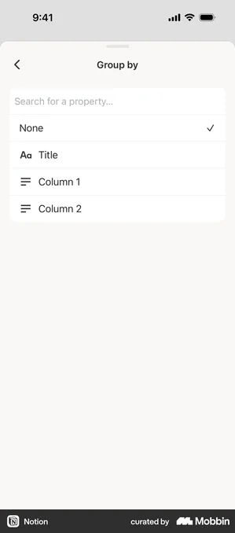
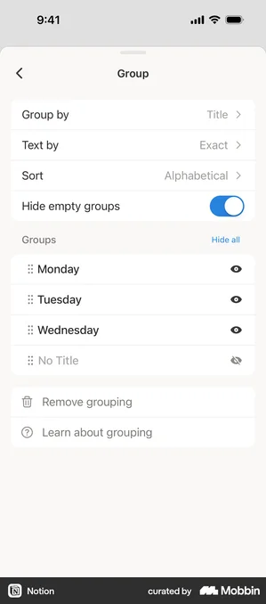
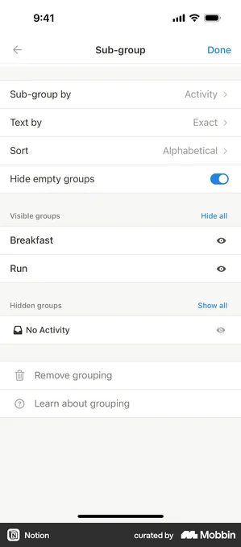
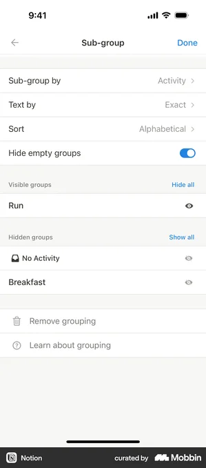
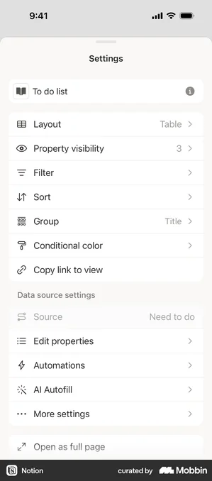
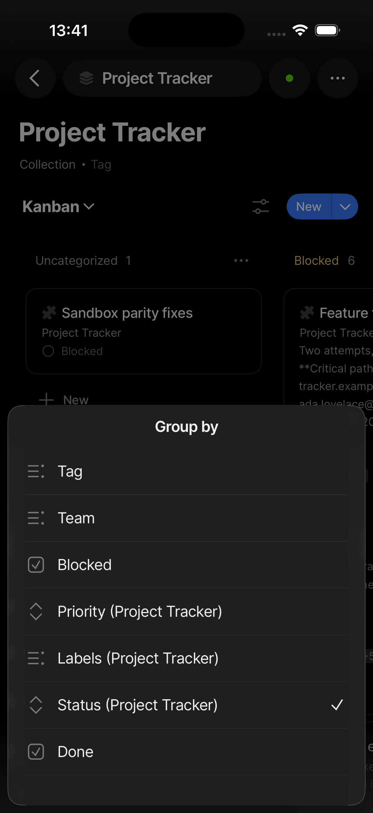
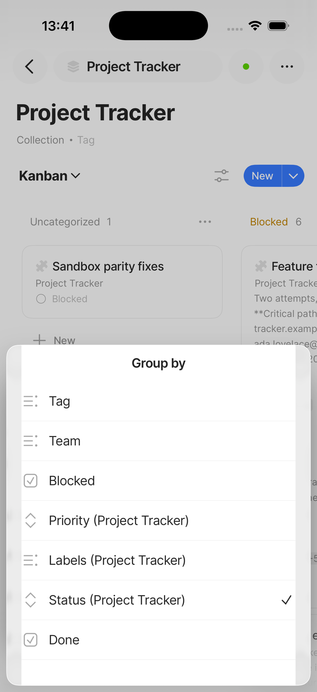
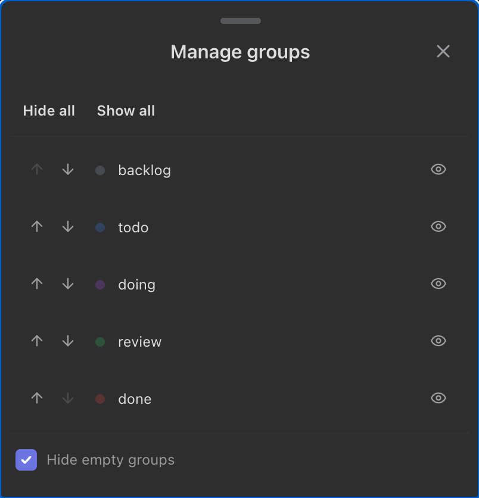
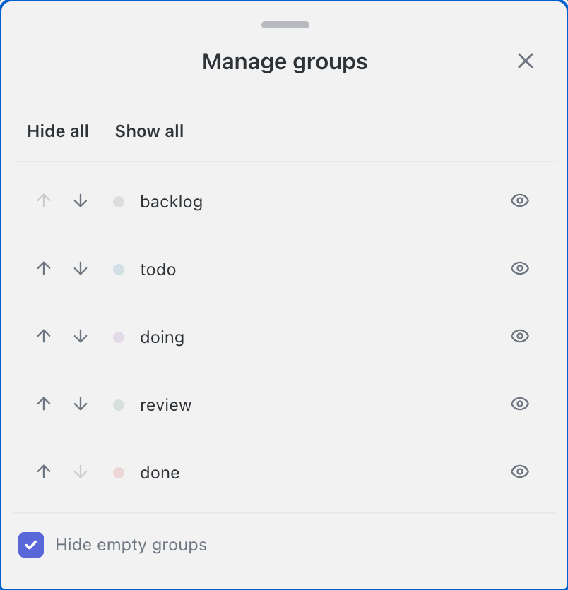
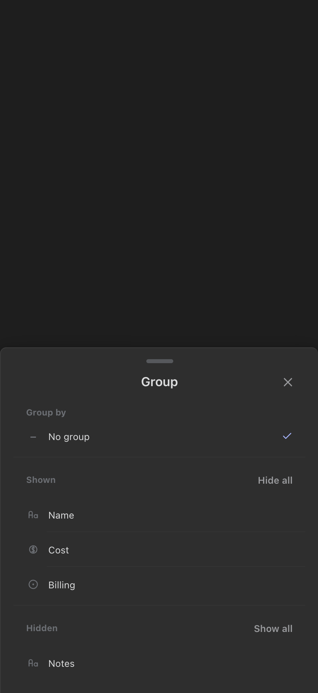

<!-- SPECKIT_TEMPLATE_SOURCE: spec-core + level2-verify | v2.2 -->
# Feature Specification: Phase 5: Group Sheet Visual Parity

<!-- SPECKIT_LEVEL: 2 -->

---

## EXECUTIVE SUMMARY

The group sheet spans two producers this DEFINE finds where the scaffold named one: `toolbar-renderer.ts`'s Group/Sub-group popover (the field picker, already close to the composed target) and `board-groups-panel.ts`'s Manage groups sheet (per-group visibility, reorder and hide-empty — carrying the real gaps). The Notion grouped-result screen the prior audit reported missing exists under the `flows/group-2` name, resolving ADR-G (§12, §13).

**The gate that closes this child is an image judge, not a lane** (parent D1). Our capture is opened beside the reference and scored on the eight-row rubric in `../spec.md` §5; pass is **≥ 14/16 with no row at 0**, twice consecutively on an unchanged tree. The lane clauses in §13 are the floor that stops a landed value drifting, and they are never sufficient on their own.

**Critical dependencies**: `../004-sort-sheet-visual-parity/` must have passed its judge twice before this child starts (D4). `../006-add-view-sheet-visual-parity/` inherits this child's settled vocabulary.

---

<!-- ANCHOR:metadata -->
## 1. METADATA

| Field | Value |
|-------|-------|
| **Level** | 2 |
| **Priority** | P1 |
| **Status** | Planned — DEFINE and PLAN complete (two surfaces named), CREATE not started |
| **Created** | 2026-09-10 |
| **Branch** | `worktrees/290-sheet-parity-program` |
| **Parent Spec** | `../spec.md` |
| **Parent Packet** | `076-sheet-visual-parity` |
| **Predecessor** | `../004-sort-sheet-visual-parity/spec.md` |
| **Successor** | `../006-add-view-sheet-visual-parity/spec.md` |
<!-- /ANCHOR:metadata -->

---

<!-- ANCHOR:phase-context -->
## Phase Context

**Phase 5** of the Sheet Visual Parity programme, opened by the operator's 2026-09-10 ~21:40 ruling — *"Btw 0.038 still has same old badish ui in most sheets nothing like notion"* and *"Really needs to go step by step multiple ohases per sheet to define, plan, create, screenshot & verify and remediate as needed based on anytype or notion or similar screens untill perfect"*.

**Scope boundary**: the Group Sheet and every other production surface that renders its grammar. Presentational only — no behaviour, persistence or stored shape moves.

**Deliverables**: a completed DEFINE table (§13), one lane clause per measurable row, the producer changes that reach them, a current phone light + dark capture set, and a `verification.md` carrying the judge's score table once per iteration.
<!-- /ANCHOR:phase-context -->

---

<!-- ANCHOR:problem -->
## 2. PROBLEM & PURPOSE

### Problem Statement

The group sheet spans two producers this DEFINE finds where the scaffold named one: `toolbar-renderer.ts`'s Group/Sub-group popover (the field picker, already close to the composed target) and `board-groups-panel.ts`'s Manage groups sheet (per-group visibility, reorder and hide-empty — carrying the real gaps). The Notion grouped-result screen the prior audit reported missing exists under the `flows/group-2` name, resolving ADR-G (§12, §13).

### Purpose

The Group Sheet reads as its reference does — frame, sections, row anatomy, controls, type, spacing, colour and both themes — and that reading is established by a reviewer opening the two images side by side, not by a number going green.
<!-- /ANCHOR:problem -->

---

<!-- ANCHOR:scope -->
## 3. SCOPE

### The production surfaces this child binds

Per parent D2(a), a target binds **every** producer painting this grammar, not only the renderer the sheet is named after. The scaffold named one; this DEFINE finds two:

- **Surface A — the toolbar's `Group` / `Sub-group` popover** (`toolbar-renderer.ts`'s `renderGroupPopover`/`populateGroupPopover`). Reached from the toolbar's Group button. On a phone it is promoted to a bottom sheet by the same `positionToolbarPopover` → `applySheetChrome` path every other floating panel uses (`src/views/popover-position.ts:197`), carrying the `.obnotion-group-popover.obnotion-mobile-bottom-sheet` class. It renders: which column groups the view (a flat, checkmark-terminal field list partitioned by the table's own Shown/Hidden property visibility), the active grouping's options (empty-group visibility, date-group mode, board subgroup, row limit, sort-order rows), and the board/table subgroup-field list. **No registered screenshot scenario mounts this surface today** — see the correction below.
- **Surface B — the board's `Manage groups` sheet** (`board-groups-panel.ts`'s `openBoardGroupsPanel`). Reached from a board column's "…" menu → "Manage groups". Renders per-group-**value** visibility (eye/eye-off), reorder (arrow pair) and the "Hide empty groups" setting. Registered: `constructedScenario("board-groups-panel", { boardGroupsPanel: true })`, captures `screenshots/notion-clone/panels/constructed-board-groups-panel-{mobile,sheet-mobile}-{light,dark}.png`.

**Correction (D2b, this session — corrected twice).** A first read of `constructed-scenarios.mjs` alone found no scenario for Surface A and called `group-mobile-{light,dark}.png` an unregistered orphan. That was wrong: the scenario exists at `tools/screenshots/scenarios/panels.mjs:333` (`id: "group"`), is current in `screenshots/manifest.json` (entries 370-371), and matches `roadmap.md` §5.A's own `071/015` row, which records registering it. **The real D2(b) gap is fixture-versus-production, not missing registration**: this scenario's `html()` is a hand-authored template string that the scenario's own note admits "mirrors what ToolbarRenderer's group-popover builder draws" — it does not call `ToolbarRenderer`, mount a real `.obnotion-group-btn` click, or run through `runRenderAssertions` the way `board-groups-panel`'s `constructedScenario(...)` does. Every sibling fixture in this file that duplicates a sheet declares `fixtureOf` pointing at a `constructed-*` counterpart (e.g. `panel-sort-calendar-empty` → `fixtureOf: "constructed-sort-panel-calendar"`, two lines above this one); the `group` scenario has no `fixtureOf` and no constructed counterpart exists anywhere in `constructed-scenarios.mjs` (confirmed by grep). It is drift-blind by construction: `npm run screenshots:verify` hashes the `sources` list for staleness, but a hand-typed template does not read those sources at render time, so the check would stay green even if `renderGroupPopover`'s real output diverged from the fixture entirely. Adding the missing `constructed-*` mount (mirroring `board-groups-panel`'s own click-through pattern via the harness's existing `toolbarPopover: "group"` opt-in, `render-assertion-harness.ts:3278`) and wiring `fixtureOf` on the existing fixture is `tasks.md` T003, and precedes every producer change on Surface A (D2b: no parity claim from a hand-mirrored mount).

**Excluded from this child's scope.** `group-label-renderer.ts` (the scaffold's fourth key file) paints the on-canvas group-header chip inside a board column or table group row — chrome the table and board renderers draw inline, never inside a bottom sheet. It renders no row of either surface above and is not this grammar; `076/018` (board visual parity) is where its on-canvas presentation is judged.

### Producers

- `src/views/toolbar-renderer.ts` — Surface A, the Group/Sub-group popover-as-sheet
- `src/views/board-groups-panel.ts` — Surface B, the board's Manage groups sheet
- `styles.css`
- `tools/screenshots/constructed-scenarios.mjs` — adds Surface A's missing `constructed-*` mount (T003)

### Out of Scope

- Behaviour, semantics, persistence and data shape — including the two-surface split itself. Notion presents one "Group" screen; this plugin presents two, reached from two different entry points. Unifying them would be an architecture change no operator ruling asked for, the same restraint `076/002`'s ADR-L already applied to the properties sheet's own conflated single panel
- `group-label-renderer.ts`'s on-canvas group-header chip (see Excluded, above; owned by `076/018`)
- Desktop presentations, except as a regression check
- Reopening any `071` landing. A contradiction becomes a Proposed ADR in `../../roadmap.md` §7 (D15), never an amendment made here
<!-- /ANCHOR:scope -->

---

<!-- ANCHOR:requirements -->
## 4. REQUIREMENTS

### P0 — Blockers (MUST complete)

- **REQ-001** Every numeric target in §13 is measured from our own tree or marked `TBD — needs operator capture`. None is derived from a 299×678 reference asset (D3)
- **REQ-002** Every production surface rendering this grammar is enumerated before any file is named (D2a)
- **REQ-003** Every lane clause runs RED with its failing number recorded before the producer moves
- **REQ-004** The image judge scores ≥ 14/16 with no row at 0, **twice consecutively on an unchanged tree** (D1)

### P1 — Required

- **REQ-005** Phone light and dark captures are current, and both were opened and looked at
- **REQ-006** The `071` clauses this sheet already carries re-run unchanged and green
- **REQ-007** The operator's device row is present and unticked (D5)
<!-- /ANCHOR:requirements -->

---

<!-- ANCHOR:success-criteria -->
## 5. SUCCESS CRITERIA

| ID | Criterion | Measured by |
|----|-----------|-------------|
| SC-001 | Every row of §13 has a target, and every reference path resolves | `spec.md` §13 |
| SC-002 | Every lane clause green, each with its RED number recorded beside it | `tools/live/sheet-grammar.mjs` |
| SC-003 | Judge ≥ 14/16, no row at 0, twice on an unchanged tree | `verification.md` |
| SC-004 | The operator reads the sheet on their own iPhone and reports it aligned | Operator — **no agent ticks this** |
<!-- /ANCHOR:success-criteria -->

---

<!-- ANCHOR:risks -->
## 6. RISKS & DEPENDENCIES

| Risk | Impact | Mitigation |
|------|--------|------------|
| A green lane over an unchanged picture — the failure that opened this programme | The sheet ships looking the same | D1: the judge is a required gate; every rubric row is written about identity and appearance, not count |
| A second surface renders the same grammar and is missed | Half the sheet is fixed | D2a: §3 enumerates every producer before §13 names a file |
| A number is read off a 299×678 thumbnail | A target that is precise and wrong | D3: structural reference only; every number is ours or `TBD` |
| `styles.css` contention with another child | Two changes each pass alone and conflict merged | D4: one child at a time, one css-lane holder |
<!-- /ANCHOR:risks -->

---

## 7. NON-FUNCTIONAL REQUIREMENTS

Touch targets ≥ 44px on every control this child adds or moves. No contrast regression in either theme. No new dependency, no new runtime pattern.

---

## 8. EDGE CASES

- The sheet at its longest content, against the 90svH cap and the published keyboard inset
- The sheet with the keyboard up
- Empty and single-item states for every list this sheet renders
- Both themes, each read on its own rather than assumed from the other

---

## 9. COMPLEXITY ASSESSMENT

Level 2. One surface family, presentational, with a shared stylesheet and a shared row vocabulary. The complexity is in the verification loop, not the change.

---

## 10. RISK MATRIX

| Area | Likelihood | Impact | Net |
|---|---|---|---|
| Visual regression on a sibling sheet sharing a primitive | Medium | High | Regression clauses re-run in the same lane run |
| The target itself is wrong | Low | High | Three failed judge iterations on one rubric row re-opens DEFINE rather than patching CREATE |

---

## 11. USER STORIES

As the operator, I open the Group Sheet on my iPhone and it reads like Notion's, so I stop reporting it.

---

## 12. OPEN QUESTIONS

- **Resolved this session — ADR-G (`roadmap.md` §7, row 2452).** The prior audit read only the `database/group-by-*` and `database/filters-*` families and reported no populated Notion grouped-result screen anywhere in the repository. `screenshots/notion/ios/flows/group-2/notion-ios-flow-group-2-03-*.webp` and `-04-*.webp` **are** that screen — the same capture, filed under the `group-2` flow name rather than `group-by` or `database`, which is why two prior reads missed it. It shows a `Sub-group` sheet with an explicit **Visible groups** / **Hidden groups** partition, each with its own bulk action (`Hide all` / `Show all`) and a per-row eye/eye-slash toggle. `071/012`'s landed shape (bulk hide/show, per-group eye toggle) is structurally validated by this capture — `roadmap.md`'s ADR-G row should be updated to reflect this find; that edit is outside this child's write scope (parent-level file) and is flagged here for whoever holds it
- **Does the toolbar's inline `Group by` field list stack as its own sheet?** Notion's structure is two levels — an entry sheet with a `Group by ›` navigation row, and a separate stacked picker sheet. Ours inlines the full field list into the same sheet with no navigation step. `048`'s stacking model is the family's own answer for "sub-menus and pickers" (D9 hard constraint) and was not consulted this session; CREATE checks it before deciding whether to stack the field list or record staying flat as a corrected target, given `003`/`004` may have already settled this same question for the filter/sort field pickers
- `group-label-renderer.ts` is out of scope for this child (see §3); it was in the scaffold's key files by mistake, not by finding

---

<!-- ANCHOR:gap-table -->
## 13. THE DEFINE TABLE — reference, current state, target

> **Frame ruling (D7, operator, 2026-09-11):** no card containers anywhere in either surface — rows group with hairline dividers on the plain sheet background. **Declared deviation (ADR-I, operator-held, unresolved):** both surfaces' header keeps the shared `buildShellHeader`'s bare `✕`, against every reference's own close control (Notion `‹`/`Done`, Anytype uncertain, ClickUp a circled `✕`). Following `001`/`002`'s own precedent, **Frame is targeted at 1, not 2**, on both surfaces until ADR-I resolves; the rubric ceiling for this child is **≤ 15/16**, not 16, and 14/16 still passes.

### References read this session (every one opened, not inferred)

**Notion** — four states of the same feature, none of them the two files the scaffold cited turned out to be a complete picture of:

| Capture | State it shows |
|---|---|
| `screenshots/notion/ios/database/notion-ios-database-group-by-13-c3125904-*.webp` (= `flows/group/…-03`) | **Ungrouped entry.** Back-chevron top-left, centred bold title `Group`, plain background, one row `Group by ›`, one row `? Learn about grouping` |
| `screenshots/notion/ios/database/notion-ios-database-filters-12-6c740ed6-*.webp` (mislabelled into the filters family; = `flows/grouping-a-database/…-01`, `flows/group/…-02`) | **Field picker.** Back-chevron, centred title `Group by`, a search field, then a flat list on the plain background: `None ✓`, `Aa Title`, then each column with its type icon. Checkmark on the active row, **no chevrons anywhere** |
| `screenshots/notion/ios/flows/grouping-a-database/notion-ios-flow-grouping-a-database-02-e9698e1b-*.webp` (= `database/notion-ios-database-sort-06-e9698e1b-*.webp`, mislabelled into the sort family) | **Grouped, one flat list.** Back-chevron, centred title `Group`, rows `Group by: Title ›`, `Text by: Exact ›`, `Sort: Alphabetical ›`, a **toggle switch** `Hide empty groups` (on), then one undivided `Groups` list — drag handle · name · eye icon per row, hidden groups dimmed with an eye-slash, **no Visible/Hidden section split in this state** — then `Remove grouping` / `Learn about grouping` below a gap |
| `screenshots/notion/ios/flows/group-2/notion-ios-flow-group-2-03-30ba5533-*.webp` and `-04-f6d1e7e6-*.webp` | **Sub-grouped, partitioned.** Same shell, `Done` top-right instead of a back-chevron, rows `Sub-group by: Activity ›` / `Text by` / `Sort` / `Hide empty groups` toggle, then **`Visible groups` header + `Hide all` link (right-aligned, same line)**, its rows, then **`Hidden groups` header + `Show all` link**, its rows (dimmed, eye-slash) — this is the capture ADR-G's own audit could not find; §12 records the resolution |
| `screenshots/notion/ios/database/notion-ios-database-group-by-07-b4e4ca0d-*.webp` (= `flows/grouping-a-database/…-03`) | The **Settings** sheet's own `Group` row, echoing the active property as trailing text (`Group → Title`) — confirms `001`'s settled navigation-row vocabulary |
| `screenshots/notion/ios/flows/group-2/…-01-794591f5-*.webp` | The **View options** sheet's `Group` row at `None ›` — the same echo, unconfigured |

**Anytype** — `screenshots/anytype/mobile/sheets/anytype-mobile-sheet-kanban-groupby-{light,dark}.png`: a rounded-top sheet, centred bold title `Group by`, a flat list of hairline-divided rows (no card), each with a leading type icon (list-lines for tag/multi-select, a diamond for other properties, a checkbox glyph for boolean fields) and a **checkmark** trailing the active row (`Status`, here). No chevrons. No close/back control visible in the crop. Confirms Notion's own field-picker grammar rather than adding a new one — both references agree independently.

**ClickUp** — `screenshots/operator/clickup-views-sheet-reference.png`: a **Views** switcher sheet (choosing among named saved views), not a group-configuration screen. It has nothing group-specific to contribute; its only applicable input is the family-wide frame reference D9 already carries (circular `✕`, primary pill button) and is not re-cited per row here.

**Operator** — no device capture specific to this sheet exists (`screenshots/operator/` has none for `group`). D3's rung 1 stays empty for this child.

### Current state — both surfaces, opened and read (not inferred from the scaffold's prose)

**Surface A — toolbar `Group` popover-as-sheet**, no grouping active (`screenshots/notion-clone/panels/group-mobile-{light,dark}.png` — a registered, current fixture capture, not a production mount, see §3; read as evidence of the shipped CSS classes it renders, all of which are verified directly against `styles.css` below rather than trusted from the image alone): grab handle, centred bold title `Group`, bare `✕` top-right, plain background throughout, a `Group by` section label, one row `– No group ✓`, a full-bleed hairline divider between every row, a `Shown` section label with `Hide all` inline right-aligned, then each shown column as a row, a `Hidden` section label with `Show all` inline, then each hidden column. Rows read at a 44px floor with 16px inset (`--obnotion-sheet-inset`). **This is already close to the composed target** — it already has dividers, no card, a 44px floor and inline bulk actions; see the Target column for the remaining gaps.

**Surface B — board `Manage groups` sheet** (`screenshots/notion-clone/panels/constructed-board-groups-panel-{mobile,sheet-mobile}-{light,dark}.png`, current and production-mounted): grab handle, centred bold title `Manage groups`, bare `✕` top-right, plain background (no card — this already clears D7's ban), two standalone bold-text buttons `Hide all` / `Show all` under the title with **no section label above them**, a hairline divider below the buttons, then each group as a row — reorder arrow-pair, a small colour dot, the group's name, a trailing eye/eye-off toggle — with **no divider between rows**, then a hairline divider, then a footer row: a **square checkbox** (not a toggle switch) plus the label `Hide empty groups`. Read directly from `board-groups-panel.ts` (293 lines) and `styles.css:10364-10411,11792-11800`: row height inherits the base `.obnotion-column-manager-row` 30px min-height with no phone override raising it to the family's 44px floor; the panel's own padding is a flat `8px`, not the shared `--obnotion-sheet-inset` (16px) every sibling sheet uses; no `.obnotion-board-groups-panel` selector appears anywhere in the divider-hairline or 44px-floor rules that `.obnotion-filter-panel`/`.obnotion-sort-panel`/`.obnotion-group-popover`/`.obnotion-view-config-panel` already share (`styles.css:12548-12567`, `:13487-13494`, `:24904-24907`) — the surface was never added to that shared selector list.

**Correction to the scaffold.** The scaffold's "Ours today" cited a `Shown`/`Hidden` heading partition on Surface B, sourced from `071/012`. The code carries no such heading split — `renderBoardGroupsRows` (`board-groups-panel.ts:83-166`) is one `keys.forEach` loop with no section boundary of any kind. `071/012`'s landing is the **feature** (bulk hide/show + per-group eye toggle), which does exist; the two-heading **presentation** does not, on this surface, today.

### The table — Surface A (toolbar Group / Sub-group popover)

| Element | Source | Ours today | Target |
|---|---|---|---|
| Frame | Notion (shell) + D9 (ADR-I cap) | Handle, centred bold title, bare `✕`, plain background, 16px inset | Unchanged — already matches, **Frame capped at 1** pending ADR-I |
| Field-by picker | Notion + Anytype (both agree) | Flat list, checkmark on active row, no chevrons, `Shown`/`Hidden` partition by table-column visibility | Unchanged — already matches both references |
| Field-by picker: stacked or inline? | Notion (stacks: entry → picker) | Inline, no stacking | `TBD — CREATE checks 048's stacking model and 003/004's own precedent before deciding` (§12) |
| Group Options (when active) | Notion's `Sub-group`/`Group` screens | `Hide empty groups`(named `showEmptyGroups`)/date-mode/subgroup toggles already use `.obnotion-toggle-switch` | Unchanged — already the correct control kind |
| Row anatomy | Notion + Anytype | icon marker · label · checkmark(active)/nothing | Unchanged — matches both |
| Both themes | — | Token-driven, not hand-painted per theme | Confirm at CREATE — no known gap |

### The table — Surface B (board Manage groups sheet)

| Element | Source | Ours today | Target |
|---|---|---|---|
| Frame | D7 (plain bg, no card) + D9 (ADR-I cap) | Plain bg already (no card) — passes D7's ban; inset is 8px flat, not the shared 16px | 16px `--obnotion-sheet-inset` inset, matching every sibling sheet. **Frame capped at 1** pending ADR-I |
| Sections | Notion's `Sub-group` screen (flows/group-2/03,04) — ADR-G resolved, see §12 | No section heading at all; two orphan buttons float under the title with nothing labelling them | **`Visible groups`** header + `Hide all` inline (right-aligned, same line), its rows; **`Hidden groups`** header + `Show all` inline, its rows. Both headers render even when one side is empty — the same stability argument `toolbar-renderer.ts:1909-1912`'s own comment already states for the property Shown/Hidden split, extended here for internal consistency |
| Row anatomy | `071/012` ADR-001 (extended by `076/002` ADR-L) | Reorder arrow-pair · colour dot · label · eye/eye-off toggle, **no divider between rows** | **Unchanged identity** — the arrow pair stays (ADR-L: it carries a keyboard path a drag grip does not, and `076/002` already extended that ruling once; this child extends it again rather than re-litigating it) plus a hairline divider between every row, matching the family's own row grammar |
| Row height | D9 hard constraint (44pt floor) | 30px (`.obnotion-column-manager-row`'s base min-height, no phone override for this surface) | 44px floor, matching `.obnotion-group-popover.obnotion-mobile-bottom-sheet .obnotion-menu-item`'s own already-landed rule |
| "Hide empty groups" control | Notion (toggle switch, both states) + our own Surface A (already a toggle) | Square checkbox (`createCheckbox`) | Toggle switch (`.obnotion-toggle-switch`) — an identity fix, and an internal-consistency one: the same setting reads as a checkbox on one surface and a toggle on its sibling today |
| Value echo | Notion's Settings/View-options rows | — | Not this surface's concern; `001`'s Settings sheet already owns the `Group → <value>` echo |
| Both themes | — | Dark capture exists, structurally matches light (token-driven) | Confirm unchanged after the divider/inset/toggle fixes |

### The lane clauses these rows become

- **L1** Surface A has a `constructed-*` scenario mounting the production renderer through `runRenderAssertions`, wired as the existing `group` fixture's `fixtureOf` target — RED today (0 constructed mounts; T003, D2b)
- **L2** Surface B's sheet padding reads the shared 16px inset token, not a flat 8px — RED today
- **L3** Surface B renders a `Visible groups` header and a `Hidden groups` header, each with its own bulk-action link on the same line — RED today (0 headers)
- **L4** Surface B's group rows carry a hairline divider between every row — RED today (0 dividers)
- **L5** Surface B's group rows clear the family's 44px floor — RED today (30px)
- **L6** Surface B's `Hide empty groups` control is a `role="switch"` toggle, not a checkbox — RED today
- **L7** `071/012`'s existing clauses (bulk hide/show, per-group eye toggle present) re-run unchanged and green
- **L8** Both surfaces' canvas, divider and accent tokens differ correctly between light and dark

### Contradictions with landed `071` rulings

None raised. §12 records that the one contradiction the scaffold carried (ADR-G) is **resolved in `071`'s favour** by this session's own read, not escalated — the group-2 flow capture the earlier audit missed validates the landed shape.

<!-- /ANCHOR:gap-table -->

---

## 14. Reference images

> Embedded so a fresh planner and the image judge see the same screens the operator rules
> against. (a) operator device captures and the ruling each grounds; (b) on-tree reference
> captures from Notion/Anytype/ClickUp; (c) the current-state judge capture, where one has
> landed.

### 14.1 Operator screenshots

Grounds: "Never use bg container like here for values, notion / anytype use dividers on plain sheet bg thats better"

### 14.2 Reference captures (Notion / Anytype / ClickUp)

### 14.3 Current-state captures — both surfaces

**Surface B (board Manage groups sheet), production-mounted, current:**

**Surface A (toolbar Group popover-as-sheet), no grouping active — a registered fixture capture, not yet a production mount (§3):**

---

## RELATED DOCUMENTS

- **Parent**: `../spec.md` (the loop and the rubric), `../decision-record.md` (D1-D4)
- **Verification**: `verification.md` — created at the VERIFY step, one score table per iteration
- **Predecessor packet**: `../../071-sheet-notion-anytype-alignment/`, whose landings are this child's regression floor
