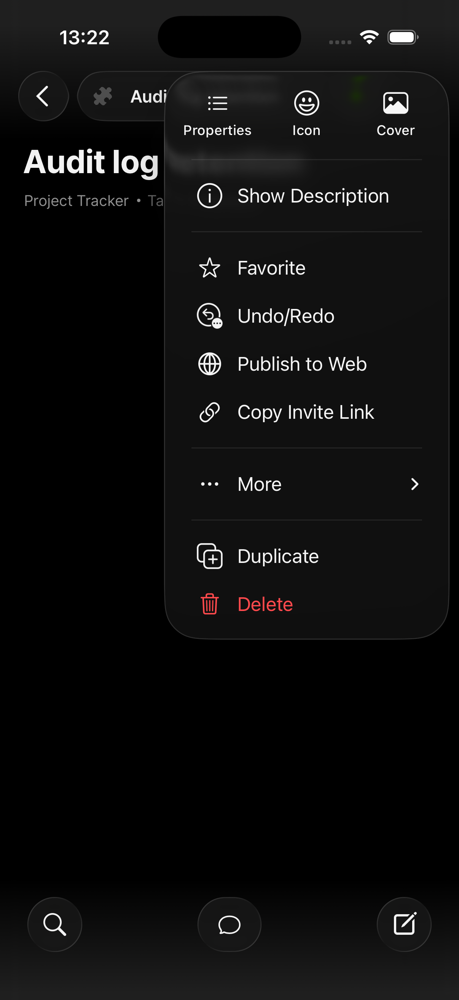
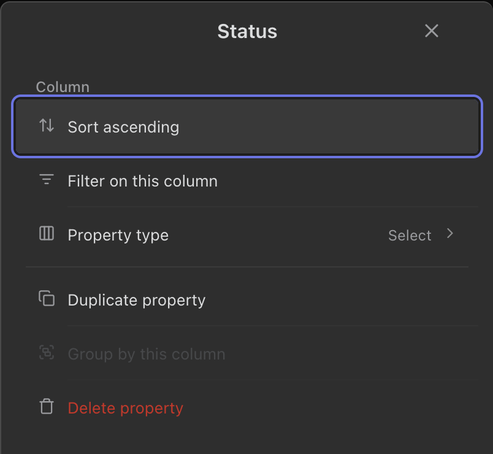
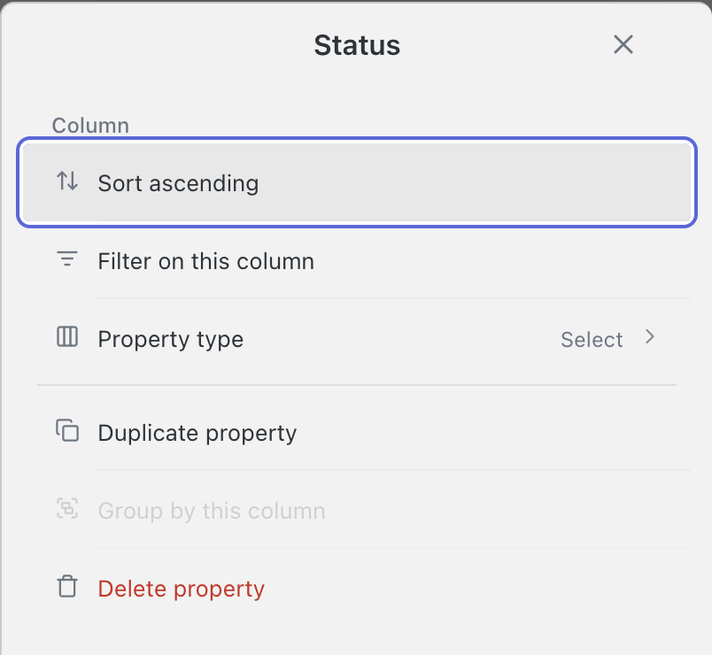

<!-- SPECKIT_TEMPLATE_SOURCE: spec-core + level2-verify | v2.2 -->
# Feature Specification: Phase 9: Record Menu, Cell Menu and Destructive Confirm Visual Parity

<!-- SPECKIT_LEVEL: 2 -->

---

## EXECUTIVE SUMMARY

The row menu, the column/cell menu and the destructive confirm card against Notion's menus and delete confirms, including the action order 071/013 already ruled on.

**The gate that closes this child is an image judge, not a lane** (parent D1). Our capture is opened beside the reference and scored on the eight-row rubric in `../spec.md` §5; pass is **≥ 14/16 with no row at 0**, twice consecutively on an unchanged tree. The lane clauses in §13 are the floor that stops a landed value drifting, and they are never sufficient on their own.

**Critical dependencies**: `../008-record-sheet-visual-parity/` must have passed its judge twice before this child starts (D4). `../010-picker-sheets-visual-parity/` inherits this child's settled vocabulary.

---

<!-- ANCHOR:metadata -->
## 1. METADATA

| Field | Value |
|-------|-------|
| **Level** | 2 |
| **Priority** | P1 |
| **Status** | Scaffolded — nothing started |
| **Created** | 2026-09-10 |
| **Branch** | `worktrees/290-sheet-parity-program` |
| **Parent Spec** | `../spec.md` |
| **Parent Packet** | `076-sheet-visual-parity` |
| **Predecessor** | `../008-record-sheet-visual-parity/spec.md` |
| **Successor** | `../010-picker-sheets-visual-parity/spec.md` |
<!-- /ANCHOR:metadata -->

---

<!-- ANCHOR:phase-context -->
## Phase Context

**Phase 9** of the Sheet Visual Parity programme, opened by the operator's 2026-09-10 ~21:40 ruling — *"Btw 0.038 still has same old badish ui in most sheets nothing like notion"* and *"Really needs to go step by step multiple ohases per sheet to define, plan, create, screenshot & verify and remediate as needed based on anytype or notion or similar screens untill perfect"*.

**Scope boundary**: the Record Menu, Cell Menu and Destructive Confirm and every other production surface that renders its grammar. Presentational only — no behaviour, persistence or stored shape moves.

**Deliverables**: a completed DEFINE table (§13), one lane clause per measurable row, the producer changes that reach them, a current phone light + dark capture set, and a `verification.md` carrying the judge's score table once per iteration.
<!-- /ANCHOR:phase-context -->

---

<!-- ANCHOR:problem -->
## 2. PROBLEM & PURPOSE

### Problem Statement

The row menu, the column/cell menu and the destructive confirm card against Notion's menus and delete confirms, including the action order 071/013 already ruled on.

### Purpose

The Record Menu, Cell Menu and Destructive Confirm reads as its reference does — frame, sections, row anatomy, controls, type, spacing, colour and both themes — and that reading is established by a reviewer opening the two images side by side, not by a number going green.
<!-- /ANCHOR:problem -->

---

<!-- ANCHOR:scope -->
## 3. SCOPE

### The production surfaces this child binds

Per parent D2(a), a target binds **every** producer painting this grammar, not only the renderer the sheet is named after:

- `constructed-owned-menu` — harness branch `scenario.renderer === "owned-menu"` at `tools/live/render-assertion-harness.ts:3667`. Captures include the sheet presentation (`chrome-owned-menu-sheet` declares `fixtureOf` at it)
- `constructed-column-submenu` and `constructed-depth3-column-submenu` — `constructedDepth3Scenario`, via `mountConstructedDepth3Stack`
- `constructed-modal-sheet-confirm` and `constructed-modal-sheet-confirm-stacked` — `constructedModalSheetScenario`, via `mountConstructedModalSheet`
- All are production mounts; no scenario work is owed

### Producers

- `src/views/owned-menu.ts`
- `src/views/row-menu.ts`
- `src/views/column-menu.ts`
- `src/views/confirm-sheet.ts`
- `src/views/modals/confirm-modal.ts`
- `styles.css`

### Out of Scope

- Behaviour, semantics, persistence and data shape
- Desktop presentations, except as a regression check
- Reopening any `071` landing. A contradiction becomes a Proposed ADR in `../../roadmap.md` §7 (D15), never an amendment made here
<!-- /ANCHOR:scope -->

---

<!-- ANCHOR:requirements -->
## 4. REQUIREMENTS

### P0 — Blockers (MUST complete)

- **REQ-001** Every numeric target in §13 is measured from our own tree or marked `TBD — needs operator capture`. None is derived from a 299×678 reference asset (D3)
- **REQ-002** Every production surface rendering this grammar is enumerated before any file is named (D2a)
- **REQ-003** Every lane clause runs RED with its failing number recorded before the producer moves
- **REQ-004** The image judge scores ≥ 14/16 with no row at 0, **twice consecutively on an unchanged tree** (D1)

### P1 — Required

- **REQ-005** Phone light and dark captures are current, and both were opened and looked at
- **REQ-006** The `071` clauses this sheet already carries re-run unchanged and green
- **REQ-007** The operator's device row is present and unticked (D5)
<!-- /ANCHOR:requirements -->

---

<!-- ANCHOR:success-criteria -->
## 5. SUCCESS CRITERIA

| ID | Criterion | Measured by |
|----|-----------|-------------|
| SC-001 | Every row of §13 has a target, and every reference path resolves | `spec.md` §13 |
| SC-002 | Every lane clause green, each with its RED number recorded beside it | `tools/live/sheet-grammar.mjs` |
| SC-003 | Judge ≥ 14/16, no row at 0, twice on an unchanged tree | `verification.md` |
| SC-004 | The operator reads the sheet on their own iPhone and reports it aligned | Operator — **no agent ticks this** |
<!-- /ANCHOR:success-criteria -->

---

<!-- ANCHOR:risks -->
## 6. RISKS & DEPENDENCIES

| Risk | Impact | Mitigation |
|------|--------|------------|
| A green lane over an unchanged picture — the failure that opened this programme | The sheet ships looking the same | D1: the judge is a required gate; every rubric row is written about identity and appearance, not count |
| A second surface renders the same grammar and is missed | Half the sheet is fixed | D2a: §3 enumerates every producer before §13 names a file |
| A number is read off a 299×678 thumbnail | A target that is precise and wrong | D3: structural reference only; every number is ours or `TBD` |
| `styles.css` contention with another child | Two changes each pass alone and conflict merged | D4: one child at a time, one css-lane holder |
<!-- /ANCHOR:risks -->

---

## 7. NON-FUNCTIONAL REQUIREMENTS

Touch targets ≥ 44px on every control this child adds or moves. No contrast regression in either theme. No new dependency, no new runtime pattern.

---

## 8. EDGE CASES

- The sheet at its longest content, against the 90svH cap and the published keyboard inset
- The sheet with the keyboard up
- Empty and single-item states for every list this sheet renders
- Both themes, each read on its own rather than assumed from the other

---

## 9. COMPLEXITY ASSESSMENT

Level 2. One surface family, presentational, with a shared stylesheet and a shared row vocabulary. The complexity is in the verification loop, not the change.

---

## 10. RISK MATRIX

| Area | Likelihood | Impact | Net |
|---|---|---|---|
| Visual regression on a sibling sheet sharing a primitive | Medium | High | Regression clauses re-run in the same lane run |
| The target itself is wrong | Low | High | Three failed judge iterations on one rubric row re-opens DEFINE rather than patching CREATE |

---

## 11. USER STORIES

As the operator, I open the Record Menu, Cell Menu and Destructive Confirm on my iPhone and it reads like Notion's, so I stop reporting it.

---

## 12. OPEN QUESTIONS

- T001 records which of the seven `delete-confirm` frames show the same dialog and which show different destructive flows, before any of them is used as a target

---

<!-- ANCHOR:gap-table -->
## 13. THE DEFINE TABLE — reference, current state, target

> **Frame ruling (D7, operator, 2026-09-11):** no card containers anywhere in this sheet — rows group with hairline dividers on the plain sheet background; where the table below still names a card, D7 overrides it at CREATE time even though this scaffolded table is not rewritten here.

### References

- `screenshots/notion/ios/sheets/notion-ios-sheets-delete-confirm-01-55602f6a-*.webp` and frames `-02`, `-03`, `-06`, `-07`, `-14`, `-15` — seven destructive-confirm captures, the best-populated reference family in this packet
- `screenshots/notion/ios/menus/notion-ios-menus-menu-10-*.webp`, `-13-*.webp`, `notion-ios-menus-context-menu-13-*.webp` — the menu surfaces
- `screenshots/notion/ios/database/notion-ios-database-block-menu-07-9acbba50-*.webp`, `-11-b3e1dff9-*.webp` — the block menu
- `screenshots/notion/ios/database/notion-ios-database-delete-confirm-13-2822ab78-*.webp` — a database-scoped delete confirm

### What the reference cannot answer

- T001 records which of the seven `delete-confirm` frames show the same dialog and which show different destructive flows, before any of them is used as a target

### The table

T001-T004 complete this table. `071/013` already landed a ruling on confirm action order from four Notion captures; `009` re-reads the seven available frames and either confirms that ruling with a larger sample or records a disagreement — it does not assume it.

| Element | Ours today | Notion (structural) | Target |
|---|---|---|---|
| Confirm: action order | Landed by `071/013` | To be re-read at T001 across all 7 frames | `071/013`'s ruling confirmed at n=7 or a disagreement recorded; the count is stated either way |
| Confirm: destructive styling | To be measured at T002 | To be read at T001 | Consistent with `007`'s delete-convention finding — the two children must not pick opposite conventions |
| Confirm: frame | To be measured at T002 | To be read at T001 | Card grammar matching `001` |
| Menu: row anatomy | To be measured at T002 | To be read at T001 | Leading icon · label · trailing state; destructive row placed by the confirmed convention |
| Menu: sheet presentation | Owned menu takes a sheet presentation on touch | To be read at T001 | Sheet presentation matches `001`'s handle and header vocabulary |
| Menu: submenu depth | Depth-3 chain photographed by `constructed-depth3-column-submenu` | To be read at T001 | Depth cap honoured; `TBD` on Notion's own depth |
| Both themes | — | — | Menu, divider, destructive and canvas tokens each distinct in light and dark |

### The lane clauses these rows become

- **L1** the confirm card's action order matches the convention T001 confirms, with the sample size recorded
- **L2** every menu row carries a leading icon and a label, with the destructive row styled by the single convention `007` and `009` share
- **L3** the owned menu's sheet presentation carries the handle and header grammar `001` settled
- **L4** submenu depth stays within the landed cap
- **L5** `071/013`'s clauses re-run unchanged and green

### Contradictions with landed `071` rulings

Raised as **Proposed ADRs** in `../../roadmap.md` §7 under D15 before this child implements. A `071` child is never amended from here.

- `071/013` ruled the confirm card's action order from **four** Notion captures. Seven are available. If the larger sample disagrees, `009` records a Proposed ADR in `roadmap.md` §7 and does not amend `013` directly

<!-- /ANCHOR:gap-table -->

---

## 14. Reference images

> Embedded so a fresh planner and the image judge see the same screens the operator rules
> against. (a) operator device captures and the ruling each grounds; (b) on-tree reference
> captures from Notion/Anytype/ClickUp; (c) the current-state judge capture, where one has
> landed.

### 14.1 Operator screenshots

Grounds: "This one also not updated yet also missing drag handler"

Grounds: "This one comes close but missing drag handler, too much side padding and missing dividers"

Grounds: "A lot of issuws here padding drag gandler missing dividers between items and should have been stacked sheet"

Grounds: "Never use bg container like here for values, notion / anytype use dividers on plain sheet bg thats better"

### 14.2 Reference captures (Notion / Anytype / ClickUp)

### 14.3 Current-state judge capture

---

## RELATED DOCUMENTS

- **Parent**: `../spec.md` (the loop and the rubric), `../decision-record.md` (D1-D4)
- **Verification**: `verification.md` — created at the VERIFY step, one score table per iteration
- **Predecessor packet**: `../../071-sheet-notion-anytype-alignment/`, whose landings are this child's regression floor
