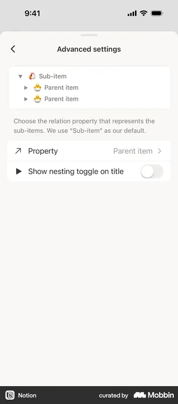

<!-- SPECKIT_TEMPLATE_SOURCE: spec-core + level2-verify | v2.2 -->
# Feature Specification: Phase 13: Board Card Properties Sheet Visual Parity

<!-- SPECKIT_LEVEL: 2 -->

---

## EXECUTIVE SUMMARY

`src/views/board-card-properties-panel.ts` opens a dedicated sheet from the board's column-header overflow ("choose visible fields"), letting the operator toggle which properties paint on every card and reorder them. `071/001`'s sheet-inventory coverage audit (`071/001/inventory.md` row "board-card-properties") already carries a story and captures for it, but no `076` child ever targeted its **visual** grammar — 012 targets the card's own meta-grid CSS, and 002 targets the record/table column manager, a different producer file entirely. This child closes that gap: the sheet's frame, row anatomy (drag handle, checkbox, label) and its relationship to `002`'s shared row shell (`buildCheckboxPropertyRow`, per `002`'s own spec.md note that a change there reaches the board-groups panel too) are judged against the same eight-row rubric as every other `076` child.

**The gate that closes this child is an image judge, not a lane** (parent D1). Pass is **≥ 14/16 with no row at 0**, twice consecutively on an unchanged tree.

**Critical dependencies**: `002-properties-sheet-visual-parity`'s own spec.md flags that `record-surface/property-row.ts`'s `buildCheckboxPropertyRow` is shared with the board-groups panel — this child re-checks whether `board-card-properties-panel.ts` shares the same row shell or carries its own before writing a target, so a `002` fix is not silently duplicated or missed here.

---

<!-- ANCHOR:metadata -->
## 1. METADATA

| Field | Value |
|-------|-------|
| **Level** | 2 |
| **Priority** | P2 |
| **Status** | Scaffolded — opened 2026-09-11 from the coverage audit, nothing started |
| **Created** | 2026-09-11 |
| **Branch** | `worktrees/302-sheet-inventory-coverage` |
| **Parent Spec** | `../spec.md` |
| **Parent Packet** | `076-sheet-visual-parity` |
| **Predecessor** | `../012-board-card-fields/spec.md` |
| **Successor** | `../014-fuzzy-suggest-sheets-visual-parity/spec.md` |
<!-- /ANCHOR:metadata -->

---

<!-- ANCHOR:phase-context -->
## Phase Context

**Phase 13** opened from the 076 coverage audit (`../coverage-audit.md`), which cross-referenced `tools/storybook/sheet-inventory.mjs`'s 87-surface list against children 001-012 and found `board-card-properties` (inventory row 52, `src/views/board-card-properties-panel.ts:31`) named nowhere in any child's producer list.

**Scope boundary**: the field-visibility sheet's own frame, header, row anatomy and reorder affordance. Not the board card itself (`012`), not which properties are visible by default (mechanism, `045-board-card-properties`, unaffected per that packet's own guard test `board-card-properties-panel.test.ts`).

**Deliverables**: a completed DEFINE table (§13) with a Source column per the operator's mix-and-match rule (`scratchpad/loop/076-frame-ruling.md`), one lane clause per measurable row, the stylesheet/producer changes that reach them, current captures (phone, light + dark), and a `verification.md` carrying the judge's score table.
<!-- /ANCHOR:phase-context -->

---

<!-- ANCHOR:problem -->
## 2. PROBLEM & PURPOSE

### Problem Statement

`src/views/board-card-properties-panel.ts` renders as a sheet with one row per board property: a drag handle, a checkbox, and the property's label and type icon. It has never been read against the frame ruling (no card container, dividers on the plain sheet background) or against the Notion/Anytype/ClickUp row grammar the other eleven sheets are being taken to. Its closest sibling, `002-properties-sheet-visual-parity`'s column manager, already has a landed target for the same row shell (`buildCheckboxPropertyRow`) — this child must confirm whether it inherits that shell or draws its own before it can claim a target, otherwise a fix in one may silently diverge from the other.

### Purpose

The board's field-visibility sheet reads as one more sheet in the same family as `002`'s column manager: plain background, hairline-divided rows, a drag handle and checkbox per row, taken through the same six-step loop to the same rubric.
<!-- /ANCHOR:problem -->

---

<!-- ANCHOR:scope -->
## 3. SCOPE

### The production surfaces this child binds

- `board-card-properties` (inventory row 52) — `src/views/board-card-properties-panel.ts:31`, sheet, **has a story** (`yes` in the inventory) and captures (`constructed-board-card-properties-hidden`, `constructed-board-card-properties`, `panel-board-card-properties`)

### Producers

- `src/views/board-card-properties-panel.ts` — the sheet itself
- `src/views/record-surface/property-row.ts` — read first (T001) to confirm whether `buildCheckboxPropertyRow` is shared with this panel, as `002`'s spec.md already confirms it is with the board-groups panel

### Out of Scope

- Which properties are visible by default and their persisted order (mechanism, `045-board-card-properties`) — `board-card-properties-panel.test.ts` stays green unmodified
- `012`'s card meta-grid CSS
- `002`'s own column-manager sheet, unless T001 finds the row shell must change in both places at once, in which case that becomes a named cross-child dependency, not a silent duplicate fix
<!-- /ANCHOR:scope -->

---

<!-- ANCHOR:requirements -->
## 4. REQUIREMENTS

### P0 — Blockers (MUST complete)

- **REQ-001** No card container or tinted background around any row group — dividers on the plain sheet background (076 frame ruling)
- **REQ-002** T001 confirms whether this panel shares `buildCheckboxPropertyRow` with `002`'s column manager and the board-groups panel; if it does, a fix here is coordinated with `002`, not duplicated
- **REQ-003** The image judge scores ≥ 14/16 with no row at 0, twice consecutively on an unchanged tree, against the DEFINE table's chosen references

### P1 — Required

- **REQ-004** Every DEFINE row names its Source reference (Anytype / Notion / ClickUp / operator screenshot) and why, per the operator's mix-and-match rule
- **REQ-005** `045-board-card-properties`'s mechanism guard stays green unmodified
- **REQ-006** The operator's device row is present and unticked
<!-- /ANCHOR:requirements -->

---

<!-- ANCHOR:success-criteria -->
## 5. SUCCESS CRITERIA

| ID | Criterion | Measured by |
|----|-----------|-------------|
| SC-001 | No card container renders around any row group | Lane clause, new |
| SC-002 | Row-shell sharing with `002`/board-groups confirmed and recorded | `spec.md` §13, T001 |
| SC-003 | Judge ≥ 14/16, no row at 0, twice on an unchanged tree | `verification.md` |
| SC-004 | `045`'s mechanism guard stays green unmodified | `board-card-properties-panel.test.ts` |
| SC-005 | The operator reads the sheet on their own iPhone and reports it aligned | Operator — no agent ticks this |
<!-- /ANCHOR:success-criteria -->

---

<!-- ANCHOR:risks -->
## 6. RISKS & DEPENDENCIES

| Risk | Impact | Mitigation |
|------|--------|------------|
| Row shell is shared with `002` and a fix here diverges from a fix there | Two panels drift apart visually | T001 confirms sharing before either child edits the shell; if shared, the css-lane triplet acquisition names both children |
| No Anytype reference exists for this specific sheet (inventory row 52: Notion only) | Target composed from Notion structure alone | Recorded as a gap in §13, not filled by inference; ClickUp's Views-sheet grammar (row anatomy, dividers) may still inform Controls/Row anatomy per the mix-and-match rule |
<!-- /ANCHOR:risks -->

---

## 7. NON-FUNCTIONAL REQUIREMENTS

Touch targets unaffected by a background-only change. No contrast regression in either theme.

---

## 8. EDGE CASES

- A board with zero optional properties configured (empty list state)
- A board with more properties than fit one screen (scroll behaviour, sticky header)

---

## 9. COMPLEXITY ASSESSMENT

Level 2. One sheet, presentational, contingent on confirming row-shell sharing with `002` before any stylesheet edit.

---

## 10. RISK MATRIX

| Area | Likelihood | Impact | Net |
|---|---|---|---|
| Row-shell edit leaks into `002`/board-groups unexpectedly | Medium | Medium | T001 enumerates every `buildCheckboxPropertyRow` consumer before any edit |
| Target composed from Notion alone reads thin | Low | Low | ClickUp's Views-sheet reference is cited for Controls/Row anatomy per the mix-and-match rule |

---

## 11. USER STORIES

As the operator, I open the board's "choose visible fields" sheet and see the same plain-background, divider-separated row family every other sheet now uses, with a clear drag handle and checkbox per property.

---

## 12. OPEN QUESTIONS

- Whether this panel's row shell should be unified with `002`'s literally (one component) or kept as two producers with matched CSS — T001 records the current state; the decision is raised as a Proposed ADR in `../../roadmap.md` §7 if T001 finds real divergence

---

<!-- ANCHOR:gap-table -->
## 13. THE DEFINE TABLE — reference, current state, target

### References

- **Operator screenshot**: none on file naming this specific sheet (the coverage audit found no `scratchpad/operator-references/*.png` captioned for board-card-properties specifically — recorded as a gap, not filled by inference)
- **Notion** (`inventory.md` row 52): `screenshots/notion/ios/database/notion-ios-database-properties-01-8bb9115f-e0da-4e01-bd9d-2b627a4b6727.webp` and 14 more under the same family — the properties-list grammar (row height, drag handle, checkbox placement)
- **Anytype**: `screenshots/anytype/mobile/app/anytype-mobile-space-typeslist-{dark,light}.png` — a list-of-toggleable-items grammar, structurally close though not a 1:1 property list
- **ClickUp** (mix-and-match rule, `scratchpad/loop/076-frame-ruling.md`): `screenshots/clickup/ios/views/clickup-ios-views-*` and the operator's `clickup-views-sheet-reference.png` — row anatomy (icon-tile + label + trailing control) and divider grammar

### What the reference cannot answer

- Exact row height and drag-handle icon weight — not legible at capture resolution on any of the three families; kept as ours (`TBD — needs operator capture` where no current value exists) rather than sampled from a screenshot

### The table

| Element | Ours today | Reference (structural) | Target | Source |
|---|---|---|---|---|
| Frame | `TBD — needs T001 read of board-card-properties-panel.ts` | Plain sheet background, no card container | Dividers on plain background, per 076 frame ruling | Operator ruling (frame ruling supersedes all three) |
| Row anatomy | Drag handle + checkbox + label + icon (per inventory) | Notion: drag handle + label; ClickUp: icon-tile + label + trailing control | Confirm handle and checkbox both stay; icon-tile treatment considered if T001 finds capacity | Notion (base grammar) + ClickUp (icon-tile idea) |
| Dividers | `TBD` | Hairline, inset to label, full-bleed trailing (both Notion and Anytype) | Match the frame-ruling divider spec exactly | Notion / Anytype (agree) |
| Row shell sharing | `TBD — T001` | n/a | Confirmed shared-or-not with `002`/board-groups, recorded in this row | Internal (T001 finding, not a reference) |
<!-- /ANCHOR:gap-table -->

---

## 14. Reference images

> Embedded so a fresh planner and the image judge see the same screens the operator rules
> against. (a) operator device captures and the ruling each grounds; (b) on-tree reference
> captures from Notion/Anytype/ClickUp; (c) the current-state judge capture, where one has
> landed.

### 14.1 Operator screenshots

Grounds: "Never use bg container like here for values, notion / anytype use dividers on plain sheet bg thats better"

### 14.2 Reference captures (Notion / Anytype / ClickUp)

---

## RELATED DOCUMENTS

- **Parent**: `../spec.md` (the loop and the rubric), `../decision-record.md`
- **Coverage source**: `../coverage-audit.md`
- **Related sibling**: `../002-properties-sheet-visual-parity/spec.md` (shared row shell)
- **Frame ruling**: `scratchpad/loop/076-frame-ruling.md`
