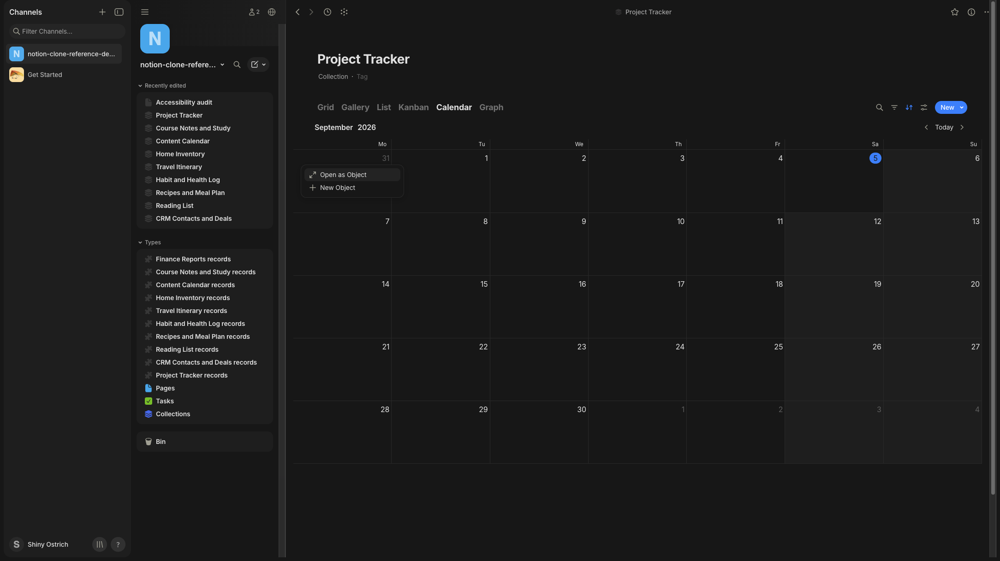
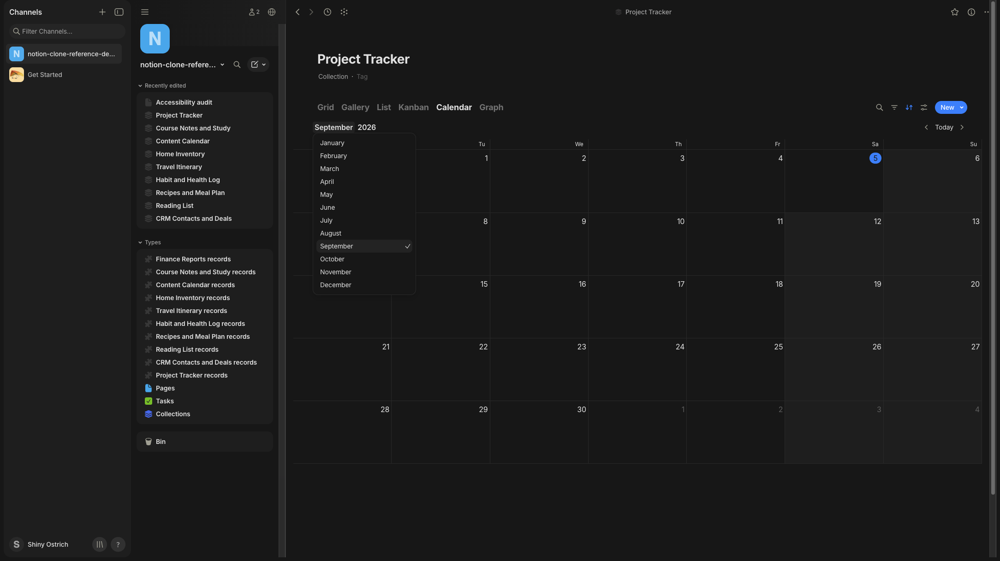

<!-- SPECKIT_TEMPLATE_SOURCE: spec-core + level2-verify | v2.2 -->
# Feature Specification: Phase 16: View-Specific Toolbar Option Popovers Visual Parity

<!-- SPECKIT_LEVEL: 2 -->

---

## EXECUTIVE SUMMARY

Four view-specific toolbar renderers — calendar (`calendar-toolbar-renderer.ts:60`), timeline (`calendar-timeline-toolbar-renderer.ts:47`), chart (`chart-toolbar-renderer.ts:321`) and the mini-calendar popover (`calendar-mini-calendar-renderer.ts:97`) — each open their own options popover from their own view's toolbar, separate from `011-toolbar-overflow-and-column-width`'s generic overflow/utilities scope. Three of the four (`calendar-toolbar-options`, `timeline-toolbar-options`, `chart-toolbar-options`) plus their stacked option dropdowns and the timeline event menu carry `none / none` in the coverage audit — no reference of any kind. The mini-calendar popover shares the date-picker's Notion/Anytype reference family. This child bundles all of them because they share one renderer shape (a view's own toolbar opening its own options popover) even though their reference coverage differs sharply.

**The gate that closes this child is an image judge, not a lane** (parent D1). Pass is **≥ 14/16 with no row at 0**, twice consecutively on an unchanged tree, judged primarily on the mini-calendar popover (the one surface with a usable reference) with the other three judged for internal consistency against it.

**Critical dependencies**: `010-picker-sheets-visual-parity` owns the date-picker sheet itself; the mini-calendar popover here is a toolbar-launched sibling of that picker, not the picker itself.

---

<!-- ANCHOR:metadata -->
## 1. METADATA

| Field | Value |
|-------|-------|
| **Level** | 2 |
| **Priority** | P2 |
| **Status** | Scaffolded — opened 2026-09-11 from the coverage audit, nothing started |
| **Created** | 2026-09-11 |
| **Branch** | `worktrees/302-sheet-inventory-coverage` |
| **Parent Spec** | `../spec.md` |
| **Parent Packet** | `076-sheet-visual-parity` |
| **Predecessor** | `../015-cell-editor-popovers-visual-parity/spec.md` |
| **Successor** | `../017-utility-modal-sheets-visual-parity/spec.md` |
<!-- /ANCHOR:metadata -->

---

<!-- ANCHOR:phase-context -->
## Phase Context

**Phase 16** opened from the coverage audit (`../coverage-audit.md`), which found four view-toolbar option popovers, their three stacked option dropdowns (chart/calendar/timeline) and the timeline event menu with no `076` child — `011`'s scope is the shared toolbar's own overflow/utilities/column-width surfaces, a different producer family entirely.

**Scope boundary**: the options popover each of the four view toolbars opens, and their stacked dropdown/menu children. Not the view's own canvas (calendar grid, timeline bars, chart plot), not `011`'s shared-toolbar scope.

**Deliverables**: a completed DEFINE table with a Source column, one lane clause per measurable row, producer/stylesheet changes, current captures, and `verification.md`.
<!-- /ANCHOR:phase-context -->

---

<!-- ANCHOR:problem -->
## 2. PROBLEM & PURPOSE

### Problem Statement

Three of the four toolbars' options popovers, and every one of their stacked dropdown children, have never been read against any reference — `071/001`'s inventory records `none / none` for `timeline-toolbar-options`, `chart-toolbar-options`, and the chart/calendar/timeline stacked option dropdowns and the timeline event menu. The fourth, `calendar-toolbar-options`, has both a Notion database-calendar reference and an Anytype calendar-day-menu reference; the mini-calendar popover shares the date-picker's fuller reference set. This child treats the mini-calendar popover as the anchor surface and judges the other three for internal consistency against it, recording explicitly which surfaces have zero reference of any kind.

### Purpose

Every view-specific toolbar options popover reads as one consistent family — same frame, same row anatomy, same dividers — whether or not a Notion/Anytype/ClickUp reference exists for that specific view.
<!-- /ANCHOR:problem -->

---

<!-- ANCHOR:scope -->
## 3. SCOPE

### The production surfaces this child binds

- `calendar-toolbar-options` (view toolbar) — `src/views/calendar-toolbar-renderer.ts:60`, has Notion + Anytype references
- `timeline-toolbar-options` (view toolbar) — `src/views/calendar-timeline-toolbar-renderer.ts:47`, `none / none`
- `chart-toolbar-options` (view toolbar) — `src/views/chart-toolbar-renderer.ts:321`, `none / none`
- `mini-calendar-popover` (view toolbar) — `src/views/calendar-mini-calendar-renderer.ts:97`, shares the date-picker's Notion/Anytype family
- Stacked: "chart option dropdown", "calendar option dropdown", "timeline option dropdown" — all `none / none`
- Stacked: "timeline event menu" — `none / none`; provisionally placed here rather than `009`'s menu family (open question §12)

### Producers

- `src/views/calendar-toolbar-renderer.ts`
- `src/views/calendar-timeline-toolbar-renderer.ts`
- `src/views/chart-toolbar-renderer.ts`
- `src/views/calendar-mini-calendar-renderer.ts`

### Out of Scope

- The calendar grid, timeline bars and chart plot canvases themselves
- `011`'s shared-toolbar overflow/utilities/column-width scope
- `010`'s date-picker sheet itself (the mini-calendar popover is a toolbar-launched sibling, not the picker)
<!-- /ANCHOR:scope -->

---

<!-- ANCHOR:requirements -->
## 4. REQUIREMENTS

### P0 — Blockers (MUST complete)

- **REQ-001** No card container around any popover's option list — dividers on the plain background (076 frame ruling)
- **REQ-002** T001 confirms whether all four toolbars already share one popover-chrome primitive; divergence is named, not silently unified
- **REQ-003** The image judge scores ≥ 14/16 with no row at 0, twice consecutively, on the mini-calendar popover as the anchor surface

### P1 — Required

- **REQ-004** Every DEFINE row names its Source reference and why, explicitly marking `none` where no reference of any kind exists
- **REQ-005** The three no-reference surfaces (timeline/chart toolbar options, their stacked dropdowns) are made internally consistent with the anchor surface, not left unaddressed
- **REQ-006** The operator's device row is present and unticked
<!-- /ANCHOR:requirements -->

---

<!-- ANCHOR:success-criteria -->
## 5. SUCCESS CRITERIA

| ID | Criterion | Measured by |
|----|-----------|-------------|
| SC-001 | No card container renders around any popover's option list | Lane clause, new |
| SC-002 | Chrome-sharing confirmation recorded for all four toolbars | `spec.md` §13, T001 |
| SC-003 | Judge ≥ 14/16, no row at 0, twice on an unchanged tree, on the anchor surface | `verification.md` |
| SC-004 | The three no-reference surfaces read consistently with the anchor surface | Judge's per-surface notes in `verification.md` |
| SC-005 | The operator reads a view-toolbar popover on their own iPhone and reports it aligned | Operator — no agent ticks this |
<!-- /ANCHOR:success-criteria -->

---

<!-- ANCHOR:risks -->
## 6. RISKS & DEPENDENCIES

| Risk | Impact | Mitigation |
|------|--------|------------|
| Three of four toolbar popovers have zero reference | Target composed from internal consistency alone, not an external source | Explicitly recorded per row; the mini-calendar/calendar anchor surfaces carry the only external evidence |
| The four renderers do not actually share chrome | A unified fix misses one toolbar | T001 confirms sharing before any producer edit; a divergent toolbar is handled as its own task, not skipped |
| Timeline event menu misclassified against `009` | Wrong-family fix | Recorded as an open question (§12); revisited if T001 finds shared chrome with `009`'s owned-menu |
<!-- /ANCHOR:risks -->

---

## 7. NON-FUNCTIONAL REQUIREMENTS

Touch targets unaffected by a background-only change. No contrast regression in either theme.

---

## 8. EDGE CASES

- A view with zero configurable toolbar options (empty popover state)
- The mini-calendar popover opened from two different toolbar entry points, if any exist

---

## 9. COMPLEXITY ASSESSMENT

Level 2. Four renderers, presentational, contingent on confirming shared chrome before any edit.

---

## 10. RISK MATRIX

| Area | Likelihood | Impact | Net |
|---|---|---|---|
| Divergent chrome across the four renderers | Medium | Medium | T001 diffs all four before any shared-chrome edit |
| No-reference surfaces read inconsistent from the anchor | Medium | Low | Explicit internal-consistency check against the anchor surface in VERIFY |

---

## 11. USER STORIES

As the operator, I open any view's toolbar options — calendar, timeline, chart, or the mini-calendar — and see the same plain-background, divider-separated popover family every other option list in the app uses.

---

## 12. OPEN QUESTIONS

- Whether the timeline event menu should be reclassified into `009`'s menu family once T001 reads its actual chrome — provisionally kept here since the coverage audit found it stacked over the toolbar, not over a record/column

---

<!-- ANCHOR:gap-table -->
## 13. THE DEFINE TABLE — reference, current state, target

### References

- **Operator screenshot**: none on file naming any of these four surfaces (recorded as a gap)
- **Notion** (`calendar-toolbar-options` only): `screenshots/notion/ios/database/notion-ios-database-calendar-02-2413d15d-1ec7-4d3f-9855-9436fc479326.webp` +2
- **Anytype** (`calendar-toolbar-options`, `mini-calendar-popover`): `screenshots/anytype/desktop/menus/anytype-menu-calendar-day-menu-dark-full.png` +6; `anytype-menu-calendar-month-select-dark-full.png` +6
- **Timeline/chart toolbar options and their stacked dropdowns**: `none / none` — no reference of any kind exists; recorded explicitly, not inferred from the calendar family
- **ClickUp**: not consulted — these are view-toolbar option popovers, not board or generic sheets, and no ClickUp view-options capture was identified at time of audit

### What the reference cannot answer

- Timeline and chart toolbar option grammar entirely — no reference exists on either side; the target for these three is composed from internal consistency with the calendar/mini-calendar anchor surfaces, not from an external source

### The table

| Element | Ours today | Reference (structural) | Target | Source |
|---|---|---|---|---|
| Frame | `TBD — T001` | Anytype: day/month-select menu cards, no card container | Plain background, dividers, per frame ruling | Anytype (calendar family) |
| Row anatomy | `TBD — T001` | Anytype: label + selectable state | Label + selectable/checked state, consistent across all four toolbars | Anytype (calendar family), extended by internal consistency to timeline/chart |
| Chrome sharing | `TBD — T001` | n/a | All four toolbars confirmed sharing one popover primitive, or divergence named | Internal (T001 finding) |
| Timeline/chart options (no reference) | `TBD — T001` | none | Matches the anchor surface's frame/row anatomy exactly, recorded as internally-derived, not externally sourced | Internal (no reference exists) |
<!-- /ANCHOR:gap-table -->

---

## 14. Reference images

> Embedded so a fresh planner and the image judge see the same screens the operator rules
> against. (a) operator device captures and the ruling each grounds; (b) on-tree reference
> captures from Notion/Anytype/ClickUp; (c) the current-state judge capture, where one has
> landed.

### 14.1 Operator screenshots

Grounds: "Never use bg container like here for values, notion / anytype use dividers on plain sheet bg thats better"

### 14.2 Reference captures (Notion / Anytype / ClickUp)

---

## RELATED DOCUMENTS

- **Parent**: `../spec.md`, `../decision-record.md`
- **Coverage source**: `../coverage-audit.md`
- **Related siblings**: `../010-picker-sheets-visual-parity/spec.md` (date-picker sheet), `../011-toolbar-overflow-and-column-width/spec.md` (shared toolbar), `../009-menu-and-confirm-visual-parity/spec.md` (possible timeline-event-menu family)
- **Frame ruling**: `scratchpad/loop/076-frame-ruling.md`
