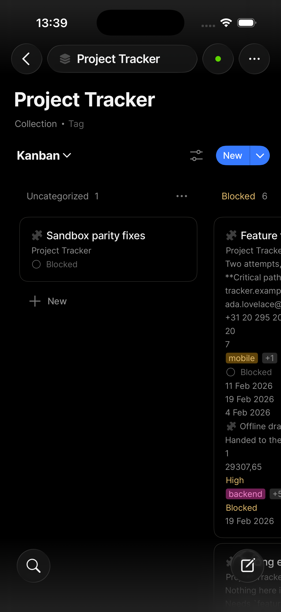
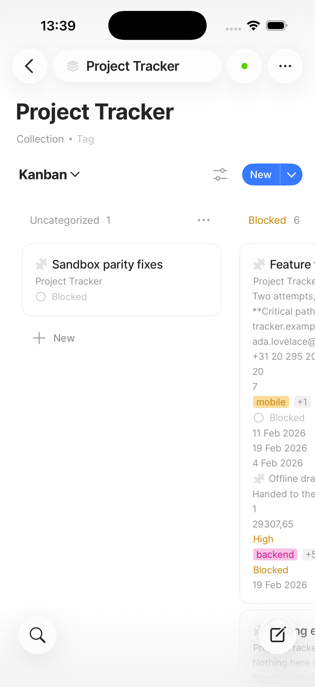

<!-- SPECKIT_TEMPLATE_SOURCE: spec-core + level2-verify | v2.2 -->
# Feature Specification: Phase 19: Board Card Drag Feel (ClickUp)

<!-- SPECKIT_LEVEL: 2 -->

---

## EXECUTIVE SUMMARY

The operator, 2026-09-11 ~05:36, verbatim: *"Board card dragging should look and work like this like in clickup"*, with `scratchpad/operator-references/clickup-board-card-drag-reference.png` as evidence. `069-*`'s touch drag already works mechanically (pointercancel fix landed, the card moves, the property persists), but carries none of ClickUp's drag *feel*: no compact lifted ghost, no rotation/shadow, no source-column placeholder, no target-column highlight, no edge auto-scroll. This child adds the presentation layer on top of the working mechanism, verified by DOM-lane assertions on a scripted touch drag (extending `tools/live/board-touch-drag.mjs`) plus an image judge on mid-drag captures — a new evidence shape for this programme, since every prior `076` child judges a static frame.

**The gate that closes this child is an image judge on a mid-drag capture, not a lane** (parent D1, extended here to a motion state). Pass is **≥ 14/16 with no row at 0**, twice consecutively on an unchanged tree, against `clickup-board-card-drag-reference.png`.

**Critical dependencies**: `018-board-visual-parity-clickup` (the board's static chrome — header/body/card anatomy — landing first); `069-*` (the working drag mechanism this child does not reopen); shares `board-renderer.ts` with `018`, sequenced rather than parallel.

---

<!-- ANCHOR:metadata -->
## 1. METADATA

| Field | Value |
|-------|-------|
| **Level** | 2 |
| **Priority** | P1 |
| **Status** | Scaffolded — opened 2026-09-11 from the operator's ClickUp drag-feel ruling, nothing started |
| **Created** | 2026-09-11 |
| **Branch** | `worktrees/302-sheet-inventory-coverage` |
| **Parent Spec** | `../spec.md` |
| **Parent Packet** | `076-sheet-visual-parity` |
| **Predecessor** | `../018-board-visual-parity-clickup/spec.md` |
| **Successor** | None — nineteenth and, at scaffold, final child |
<!-- /ANCHOR:metadata -->

---

<!-- ANCHOR:phase-context -->
## Phase Context

**Phase 19** opened directly from the operator's 2026-09-11 ~05:36 ruling (verbatim above). Evidence: `scratchpad/operator-references/clickup-board-card-drag-reference.png` and `scratchpad/loop/board-card-drag-feel/operator-notes.md`.

**Scope boundary**: the drag interaction's presentation — ghost anatomy, rotation, shadow, source placeholder, target-column outline, auto-scroll, lift delay, drop animation. Not the drag mechanism itself (`069`, works, not reopened), not the board's static chrome (`018`).

**Deliverables**: a completed DEFINE table with a Source column (ClickUp, per the operator's board-leads ruling), DOM-lane assertions on the ghost/placeholder/highlight elements during a scripted touch drag, mid-drag captures (light + dark) as the judged images, and `verification.md`.
<!-- /ANCHOR:phase-context -->

---

<!-- ANCHOR:problem -->
## 2. PROBLEM & PURPOSE

### Problem Statement

ClickUp's reference shows: on long-press the card lifts as a COMPACT ghost (title row + one key field, not the full card), rotated ~3° with a soft elevated shadow, following the finger; the source column keeps the card's slot as a dimmed placeholder; the column under the finger is highlighted with an accent outline and its header stays visible; neighbouring columns dim; dragging near the edge auto-scrolls the board horizontally; releasing drops the card into the highlighted column at the hovered position. Ours today (per `069`'s landed fix, `b4998c5b`) moves the card and persists the property change, but shows none of this: no ghost, no tilt/shadow, no placeholder, no target highlight, no auto-scroll — it works, but does not look like it.

### Purpose

Dragging a board card on the phone feels and looks like ClickUp's own drag: a compact tilted ghost with shadow, a dimmed source placeholder, a highlighted target column, and edge auto-scroll — layered entirely on top of `069`'s existing working mechanism.
<!-- /ANCHOR:problem -->

---

<!-- ANCHOR:scope -->
## 3. SCOPE

### The production surfaces this child binds

- The board's touch-drag interaction (`board-renderer.ts`, the same file `018` edits for static chrome — sequenced, not parallel)
- `tools/live/board-touch-drag.mjs` — extended with new DOM-state assertions during a scripted drag

### Producers

- `src/views/board-renderer.ts` — drag-start (ghost creation, placeholder), drag-move (target highlight, auto-scroll), drag-end (drop animation)
- `styles.css` — ghost rotation/shadow tokens, placeholder dim, target-column outline (both themes)
- `tools/live/board-touch-drag.mjs` — new assertions

### Out of Scope

- `069`'s drag mechanism (pointer handling, the move + persist logic) — works, not reopened
- `018`'s static column/card chrome — this child's ghost and highlight styling references it but does not re-implement it
- Desktop drag-and-drop (mouse-based), unless the operator's reference and words are confirmed to extend there (currently phone-only evidence)
<!-- /ANCHOR:scope -->

---

<!-- ANCHOR:requirements -->
## 4. REQUIREMENTS

### P0 — Blockers (MUST complete)

- **REQ-001** On long-press, the dragged card lifts as a compact ghost (title row + one key field), rotated ~3°, with a soft elevated shadow, following the finger
- **REQ-002** The source column shows a dimmed placeholder in the card's original slot for the drag's duration
- **REQ-003** The column under the finger shows an accent-outlined highlight; its header stays visible; neighbouring columns dim
- **REQ-004** Dragging near the board's horizontal edges auto-scrolls the board
- **REQ-005** `069`'s existing mechanism (card moves, property persists, no pointercancel regression) re-runs unchanged and green
- **REQ-006** The image judge scores ≥ 14/16 with no row at 0, twice consecutively, on a mid-drag capture against the ClickUp reference

### P1 — Required

- **REQ-007** Lift delay (~250ms long-press) before the ghost appears, matching the reference's feel
- **REQ-008** A drop animation on release, distinct from an abrupt snap
- **REQ-009** Haptics on lift, if Obsidian's mobile WebView exposes them — dropped from scope, not stubbed, if unavailable (open question §12)
- **REQ-010** Every DEFINE row names ClickUp as its Source
- **REQ-011** The operator's device row is present and unticked
<!-- /ANCHOR:requirements -->

---

<!-- ANCHOR:success-criteria -->
## 5. SUCCESS CRITERIA

| ID | Criterion | Measured by |
|----|-----------|-------------|
| SC-001 | Ghost anatomy (compact, rotated, shadowed) present during drag | DOM-lane assertion, new |
| SC-002 | Source-column placeholder present during drag | DOM-lane assertion, new |
| SC-003 | Target-column highlight present, neighbouring columns dim | DOM-lane assertion, new |
| SC-004 | Edge auto-scroll triggers within the defined threshold | DOM-lane assertion, new |
| SC-005 | `069`'s mechanism (move + persist) re-runs unchanged and green | `tools/live/board-touch-drag.mjs` baseline clauses |
| SC-006 | Judge ≥ 14/16, no row at 0, twice on an unchanged tree, on a mid-drag capture | `verification.md` |
| SC-007 | The operator drags a card on their own iPhone and reports it feeling like ClickUp | Operator — no agent ticks this |
<!-- /ANCHOR:success-criteria -->

---

<!-- ANCHOR:risks -->
## 6. RISKS & DEPENDENCIES

| Risk | Impact | Mitigation |
|------|--------|------------|
| Presentation layer regresses `069`'s working mechanism (pointercancel, persistence) | A visually correct drag that no longer saves | `069`'s existing lane clauses re-run unchanged in the same commit as any producer edit |
| Mid-drag capture is a new evidence shape — scripted timing to catch the right frame is fragile | Flaky capture, unreliable judge input | `tools/live/board-touch-drag.mjs` pauses the scripted drag at a named DOM-state checkpoint before capturing, not a wall-clock sleep |
| Shares `board-renderer.ts` with `018` | Merge conflict or double-edit | Sequenced after `018` explicitly (predecessor chain); css-lane triplet acquired in its own turn |
| Haptics may not be exposed by Obsidian's mobile WebView | REQ-009 unimplementable | Confirmed at T001; dropped from scope with a recorded reason if unavailable, not silently stubbed |
<!-- /ANCHOR:risks -->

---

## 7. NON-FUNCTIONAL REQUIREMENTS

Touch targets for the drag handle/card itself unaffected (069's existing hit area). No contrast regression in either theme for the ghost shadow or target-column outline.

---

## 8. EDGE CASES

- Dragging to the same column, same position (no-op drop)
- Dragging off the board's edge entirely (cancel, card returns to source)
- Rapid successive drags (ghost/placeholder cleanup between drags, no stale DOM nodes)

---

## 9. COMPLEXITY ASSESSMENT

Level 2. One interaction layered on an existing working mechanism; the new evidence shape (mid-drag capture, scripted DOM-state lane) is the main complexity driver, not the visual change itself.

---

## 10. RISK MATRIX

| Area | Likelihood | Impact | Net |
|---|---|---|---|
| Regression in `069`'s persist-on-drop mechanism | Low | High | `069`'s own lane clauses re-run unchanged in the same commit |
| Flaky mid-drag capture timing | Medium | Medium | DOM-state checkpoint pause, not a wall-clock sleep, in `board-touch-drag.mjs` |
| Merge conflict with `018` on `board-renderer.ts` | Medium | Low | Explicit predecessor sequencing; css-lane triplet turn-based |

---

## 11. USER STORIES

As the operator, I long-press and drag a board card on my iPhone and it lifts as a small tilted, shadowed ghost, the source slot dims, the target column highlights, and the board auto-scrolls near the edge — the same feel as ClickUp's own board.

---

## 12. OPEN QUESTIONS

- Whether Obsidian's mobile WebView exposes a haptics API; if not, REQ-009 is dropped and recorded as unimplementable in this environment, not silently faked
- Whether desktop mouse-based drag should adopt any of this feel — no operator words or reference cover desktop; left untouched until a ruling arrives

---

<!-- ANCHOR:gap-table -->
## 13. THE DEFINE TABLE — reference, current state, target

### References

*(Session-scoped scratchpad path; not a repo-relative asset. Copied into this child's `operator-notes.md` under the loop scratchpad for durability — see Related Documents.)*

- **Operator screenshot** (primary reference): `scratchpad/operator-references/clickup-board-card-drag-reference.png`
- **Operator words** (verbatim, 2026-09-11 05:36): *"Board card dragging should look and work like this like in clickup"*
- **Ours today**: `069-*`'s landed touch drag (`b4998c5b`: pointercancel fix, card moves, property persists) — mechanically correct, presentationally bare

### What the reference cannot answer

- Exact rotation angle, shadow blur/spread, and auto-scroll speed/threshold in points — approximated from the reference (~3° rotation is a visual read, not a measured value) and recorded as `TBD — needs operator capture` where a precise number is required by a lane assertion
- Haptic feedback timing/pattern — not visible in a screenshot at all; confirmed against Obsidian's own API surface, not inferred from ClickUp

### The table

| Element | Ours today | ClickUp (structural) | Target | Source |
|---|---|---|---|---|
| Ghost anatomy | None — the card itself moves with the finger, full size | Compact ghost: title row + one key field only | Compact ghost, title + one key field | ClickUp |
| Ghost rotation/shadow | None | ~3° tilt, soft elevated shadow | ~3° tilt (visual read), elevated shadow token, both themes | ClickUp |
| Source placeholder | None — the source slot closes immediately | Dimmed placeholder held in the source slot | Dimmed placeholder for the drag's duration | ClickUp |
| Target highlight | None | Accent-outlined column, header stays visible, neighbours dim | Accent outline + neighbour dim, matching `018`'s status-colour tokens where applicable | ClickUp |
| Auto-scroll | None | Edge-triggered horizontal auto-scroll | Auto-scroll within a defined edge threshold | ClickUp |
| Lift delay | None (drag starts immediately on touch-move) | Implied long-press before lift | ~250ms long-press before ghost appears | ClickUp (operator notes) |
| Drop animation | Abrupt (card simply appears in new position) | Smooth settle | A short settle animation on drop | ClickUp |
| Mechanism (move + persist) | Working (`069`, `b4998c5b`) | n/a | Unchanged — not reopened | Internal (069's own landed fix) |
<!-- /ANCHOR:gap-table -->

---

## 14. Reference images

> Embedded so a fresh planner and the image judge see the same screens the operator rules
> against. (a) operator device captures and the ruling each grounds; (b) on-tree reference
> captures from Notion/Anytype/ClickUp; (c) the current-state judge capture, where one has
> landed.

### 14.1 Operator screenshots

Grounds: "Board card dragging should look and work like this like in clickup"

### 14.2 Reference captures (Notion / Anytype / ClickUp)

---

## RELATED DOCUMENTS

- **Parent**: `../spec.md`, `../decision-record.md`
- **Operator ruling source**: `scratchpad/loop/board-card-drag-feel/operator-notes.md`
- **Predecessor (static chrome)**: `../018-board-visual-parity-clickup/spec.md`
- **Mechanism this child does not touch**: `069-*` (touch drag pointercancel fix)
