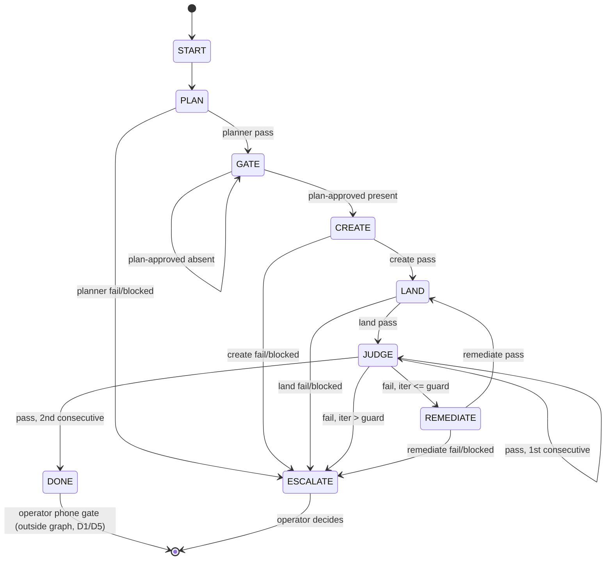

<!-- SPECKIT_TEMPLATE_SOURCE: decision-record | v2.2 -->
<!-- SPECKIT_LEVEL: phase -->

# Decision Record: Sheet Visual Parity

These four bind every child. A child may not vary them; a child that needs to vary one raises it
here first.

---

<!-- ANCHOR:d1 -->
## D1: The image judge is a required gate. Lanes alone never close a sheet.

**Decision.** A child is closed in-repo only when a reviewer has opened our capture and the
reference side by side and scored the eight-row rubric in `spec.md` §5 at **≥ 14/16 with no row at
0**, twice consecutively on an unchanged tree. A DOM lane is a **floor** — it stops a landed value
from drifting — and is never sufficient evidence that a surface looks right.

**Why, in one measured case.** `071/009` set its target as *"**≤4** interactive controls per row"*
and its lane measured **3**. Both numbers are correct. The picture that lane was guarding —
`screenshots/notion-clone/panels/constructed-column-manager-mobile-light.png`, rewritten by
`8f11b642` *after* the `4f345718` row rebuild landed, so it is current — still shows every row as
**↑ ↓ · filled blue checkbox · type icon · label**. The producer confirms it:
`src/views/record-surface/property-row.ts:405-411` sets `arrow-up` and `arrow-down`; `:417` calls
`createCheckbox`. Notion's row, read this session off
`screenshots/notion/ios/flows/hiding-properties/`, is **drag handle · type icon · label · eye
icon** — four elements, which is also ≤ 4.

The target encoded the **count** of controls and never their **identity**, so the lane could go
green while the sheet stayed the sheet the operator complains about. Every rubric row in §5 is
written about identity, order and appearance for exactly this reason.

**What this costs.** A judged gate is slower and less deterministic than a lane. That is accepted:
the failure it prevents — nine children landing green against an operator who sees no change — has
already happened once, and cost more.

**What it does not do.** It does not replace the operator. Gate (c) is the operator's own read on
their own phone, and **no agent ticks that row**.
<!-- /ANCHOR:d1 -->

---

<!-- ANCHOR:d2 -->
## D2: A sheet's target spec binds every production surface that renders its grammar — and every scenario must mount production.

**Decision.** Two clauses, and the second is the weaker one only because it is already satisfied.

**(a) Every surface, not just the named renderer.** When a child defines a row grammar, that
definition binds **every** shipped producer that paints the same concept. A child's DEFINE step
must enumerate them before its PLAN step names files.

The case: `071/008` (`64af87ee`) stacked the filter condition onto its own rows and
`constructed-filter-panel-mobile-light.png` shows exactly that. `64af87ee` touched the
`constructed-filter-panel*` captures and nothing else. The **active-rule popover** —
`src/views/active-rule-popover-renderer.ts`, mounted by the `constructed-active-rule-filter`
scenario through the harness's `scenario.renderer === "active-rule-popover"` branch — renders the
same filter condition from a different producer, was never named by any `071` child, and still
paints one row of three dropdowns. So does its sort twin. That is why `003` and `004` each own two
producers rather than one.

**(b) A scenario must photograph the production mount path.** A capture used as parity evidence
must come from a scenario that mounts the shipped renderer, not hand-written fixture markup.

**This clause is already satisfied for all eleven sheets, and it is recorded so it stays true.**
Audited this session: all fifty-nine `CONSTRUCTED_SCENARIOS` mount the shipped renderers through
`runRenderAssertions`, every one of the eleven sheets has one, and every `panel-*` / `chrome-*` /
`field-*` fixture that duplicates a sheet declares `fixtureOf` pointing at an existing constructed
scenario. Nine fixtures have no constructed counterpart — the two record-detail title-currency
variants, the computed-cleanup / invalid-events / base-import modals, the selection status bar, the
two toasts and table-load-more — and **none is one of the eleven**. Any child that finds an
unregistered production surface registers it as its **first** task.

**Note on the judged image (added by the capture-harness leg).** Both judged sheets so far lost
rubric points to a harness property, not a plugin defect: the phone capture was
`capture: "viewport"` (804×1748), so a sheet taller than the 874 CSS px viewport kept its lower
cards — the settings sheet's C3–C5, the properties sheet's Hidden and add-property cards — below
the fold, and the judge graded half a surface. The capture harness now emits a **full-sheet
variant** beside every judged viewport shot — `<scenario>-sheet-mobile-{light,dark}.png`, the
sheet expanded past its 90svh cap to its own content height, its recorded height checked against
the picture's by `npm run screenshots:verify` — and each child's capture set names that variant as
the image the judge scores. D2(b) is unchanged: the variant photographs the same production mount,
only uncropped.
<!-- /ANCHOR:d2 -->

---

<!-- ANCHOR:d3 -->
## D3: Reference precedence — operator capture > Notion iOS full-res > Mobbin thumbnail > Anytype. D15 is preserved.

**Decision.** When two references disagree about a sheet, the higher rung wins:

| Rung | Source | State today |
|---|---|---|
| 1 | The operator's own full-resolution device capture | **Empty.** C-1..C-6 and one settings-sheet capture are requested and not yet supplied |
| 2 | A full-resolution Notion iOS capture | **Empty.** No full-resolution Notion iOS asset exists in this repository |
| 3 | A Mobbin Notion iOS thumbnail, **299×678** | Populated — `screenshots/notion/ios/**`, re-verified with `sips` this session |
| 4 | Anytype research and captures | Populated — `047` research, `screenshots/anytype/**` |

**The binding consequence of rungs 1 and 2 being empty:** every child works from rung 3, so **no
numeric threshold in this packet may be derived from a reference asset**. A thumbnail is read
**structurally** — which rows, in what order, grouped how, with which leading icon and which
trailing element — and every number in a child's target table is measured from our own tree or
marked `TBD — needs operator capture`. When a rung-1 capture arrives, the child targeting that
sheet re-opens its DEFINE step against it.

**A reader that cannot read a value says so.** The three reference reads taken this session each
returned explicit gaps rather than guesses, and those gaps are binding on the children that inherit
them:

- **Notion's AND/OR conjunction control was never observed.** Every filter capture shows a
  single-condition state. `003` may not claim a Notion position on conjunction placement.
- **Notion's sort-rule reorder affordance was never observed.** Only single-rule states were
  captured. `004` may not claim one, and `071/012` ADR-001's Notion half stays PROVISIONAL.
- **Notion's grouped Shown/Hidden result screen was never captured.** `005` may not build a
  shown/hidden partition *against Notion*; if it builds one, the justification is our own
  internal consistency with `009`'s properties vocabulary, and it is recorded as such.

**D15 is preserved.** A Notion refinement is additive. Where a target here contradicts a landed
Anytype ruling, it becomes a **Proposed ADR** in `roadmap.md` §7 and is not applied by a child.
<!-- /ANCHOR:d3 -->

---

<!-- ANCHOR:d4 -->
## D4: One sheet at a time, in order, and 001 — the settings sheet — is first.

**Decision.** The eleven children run sequentially in their numbered order. A child does not start
until the previous child's image judge has passed twice on an unchanged tree.

**`001` is the settings sheet because the operator named it** — twice. Row 74: *"Also settings
sheet has really bad ui. Actually all sheets should mimic notion way closer"*. Row 84: *"Settings
sheet still has bad ui overall and needs strict alignment with notion sheets"*. It is the sheet
with the largest gap to its reference, and it is the sheet whose vocabulary the other ten inherit:
Notion's **View options** sheet is the table of contents that `Layout`, `Properties`, `Filter`,
`Sort` and `Group` all hang off, so the card grammar `001` settles is the grammar `003`-`006` are
measured against.

**Why sequential rather than parallel**, given eleven independent renderers. The operator's ruling
asks for *"step by step"*, and the mechanism supports it: the children share `styles.css` — which
this repository serialises through a css-lane acquire/edit/release triplet, one holder at a time —
and they share the row vocabulary `001` establishes. Two children redesigning rows at once would
each pass alone and conflict merged, which is the failure `071/012`'s own T009 merge check was
written to catch after the fact. Sequencing prevents it instead.
<!-- /ANCHOR:d4 -->

---

<!-- ANCHOR:d6 -->
## D6: The loop graph — an explicit state machine drives every child through the six-step loop.

**Decision.** The operator, 2026-09-10 ~21:50, verbatim: *"Try to mimic a graph loop with our
phased specs and goal setup."* Each child runs as a graph of named nodes with a verdict file and an
append-only state log, rather than as free-running prose instructions. Two shell drivers implement
it: `loop-driver.sh <child> [max_iters=4]` runs one child's inner graph; `program-loop.sh
[concurrency=2] [max_iters=4]` walks the eleven children in the outer graph, launching a
`loop-driver.sh` per child under a concurrency cap. This decision records the graph so the spec IS
the graph — a later agent reads this table, not the shell scripts, to know what runs next.

### Nodes (inner graph, one per child)

| Node | Agent | Input | Output artefact | Verdict |
|---|---|---|---|---|
| **START** | none (driver bootstrap) | Child folder name, `max_iters` | A `START` state-log line | Always `ok` |
| **PLAN** (DEFINE+PLAN) | A fresh planner — Opus 5 xhigh for `001`, Sonnet 5 xhigh for every other child | The plan-sheet prompt template, the child's reference images | `spec.md` §13's DEFINE table, `plan.md` §3's PLAN section, on a commit | `PLAN-<iter>.json` |
| **GATE** | The operator (human) | The DEFINE table, posted to the operator by the orchestrator | A `plan-approved` marker file at `$L/<child>/plan-approved` | `waiting` until the marker exists, then `pass` |
| **CREATE** | GLM 5.3 flash, write-first (DeepSeek v4.1 flash when available) | `tasks.md`, executed in order | Commits: each lane clause RED with its number, then the producer, then GREEN with its number | `CREATE-<iter>.json` |
| **LAND** | The GLM lander (lander template) | The worktree, a claims string naming the iteration's commits | Rebase onto `origin/main`, a mutation check, light+dark captures by pixel delta, `validate.sh`, a push | `LAND-<iter>.json` |
| **JUDGE** | A Sonnet image judge | Our light+dark captures vs. the named reference, the eight-row rubric in `spec.md` §5 | A new iteration section in `verification.md` (score table + verdict); on fail, also `findings-<iter>.md` | `JUDGE-<iter>.json` |
| **REMEDIATE** | Same as CREATE, in remediate mode | The prior iteration's `findings-<iter-1>.md` | Commits: RED → fix → GREEN per finding, an appended `verification.md` iteration row | `REMEDIATE-<iter>.json` |
| **DONE** | none (driver, on two consecutive JUDGE passes) | Two consecutive `JUDGE` verdicts of `pass` on an unchanged tree | A `DONE` state-log line | `pass` — the operator's own phone screenshot remains the gate outside this graph (D1, D5) |
| **ESCALATE** | The operator | Any node reporting `blocked`, or the iteration guard exceeded | The operator's decision; the outer loop keeps walking the other children | `blocked` |

The outer graph adds one more node the table above does not carry: **LAUNCH** — `program-loop.sh`
dispatching a `loop-driver.sh <child>` for a child with no state yet, under the concurrency cap.
LAUNCH has no verdict file; it is a state-log event (`{"child":"<c>","event":"LAUNCH", ...}`) in the
parent JSONL below.

### Edges

| From | Condition | To |
|---|---|---|
| START | always | PLAN |
| PLAN | planner verdict `pass` | GATE |
| PLAN | planner verdict `fail`/`blocked` | ESCALATE |
| GATE | `plan-approved` marker absent | GATE (polls every 60s) |
| GATE | `plan-approved` marker present | CREATE |
| CREATE | verdict `pass` | LAND |
| CREATE | verdict `fail`/`blocked` | ESCALATE |
| LAND | verdict `pass` | JUDGE |
| LAND | verdict `fail`/`blocked` | ESCALATE |
| JUDGE | verdict `pass`, 2nd consecutive pass on an unchanged tree | DONE |
| JUDGE | verdict `pass`, 1st consecutive pass | JUDGE (next iteration) |
| JUDGE | verdict `fail`, iteration ≤ guard | REMEDIATE |
| JUDGE | verdict `fail`, iteration > guard | ESCALATE (guard tripped) |
| REMEDIATE | verdict `pass` | LAND |
| REMEDIATE | verdict `fail`/`blocked` | ESCALATE |



### Verdict-file schema

Every node's agent writes its verdict file as its **last action**, at
`$L/<child>/<node>-<iter>.json`:

```json
{"status": "pass" | "fail" | "blocked", "sha": "<HEAD short sha or empty>", "score": "<0-16 or null>", "zeros": "<n or null>", "note": "<one line>"}
```

### State-record schema

Two append-only JSONL logs, never rewritten in place:

- **Child log**, `$S/loop/<child>.jsonl`, one line per node transition:
  `{"ts": "<ISO 8601>", "node": "<NODE>", "iter": <n>, "status": "<pass|fail|blocked|started|waiting|ok>", "sha": "<sha or empty>", "score": <n or null>, "note": "<one line>"}`
- **Parent log**, `$S/loop/076.jsonl`, one line per outer-graph event:
  `{"ts": "<ISO 8601>", "child": "<child-or-076>", "event": "<START|LAUNCH|ESCALATE|DONE>", "note": "<one line>"}`

### The guard and the human gate

**Guard.** `loop-driver.sh`'s second argument is `max_iters` (default 4). If the iteration counter
exceeds it without two consecutive JUDGE passes, the driver emits `ESCALATE` with `"iteration guard
$MAX reached without two consecutive judge passes"` and exits — the child stops advancing on its own
and waits on the operator.

**Human gate.** GATE is the one node inside the graph that blocks on a person: after PLAN passes,
the orchestrator posts the DEFINE table to the operator, who may correct the plan before the
orchestrator drops the `plan-approved` marker. Nothing downstream of GATE runs before that marker
exists. This is distinct from D1/D5's operator phone read, which sits **outside** the graph
entirely: DONE is the graph's own terminal state, and the operator's own device confirmation is
what actually closes a child, never an agent (goal.md §1 D5).

**Concurrency.** The outer loop runs at most 2 children at once (`program-loop.sh`'s first
argument); inside a child, every node that dispatches an agent waits for a free slot under a shared
cap of 4 concurrent agents before it starts.
<!-- /ANCHOR:d6 -->

---

<!-- ANCHOR:d7 -->
## D7: Frame — dividers on the plain sheet background, never card containers

**Decision.** The operator, 2026-09-11 05:30, verbatim, reading
`scratchpad/operator-references/0040-properties-card-container-rejected.png` (the Properties sheet on
0.0.40, rows inside a lighter rounded container on the sheet): *"Never use bg container like here for
values, notion / anytype use dividers on plain sheet bg thats better"*.

**The rule.** Sheet content sits on the **plain sheet background** — one canvas token, no second
"card" surface painted on top of it. Rows are separated by **hairline dividers**: inset from the
leading edge to the label, full-bleed to the trailing edge, the way Notion and Anytype both do it.
**No rounded or lighter container of any kind around a row or a value.** Section labels are plain
small secondary-colour text on the same background, set off by spacing and a divider rather than by a
card boundary. Search fields keep their own recessed-field treatment — that is a control, not a
grouping device, and is unaffected. Concretely:

- Rows on the sheet background, hairline dividers inset from the leading edge to the label and
  full-bleed to the trailing edge.
- Section labels as plain, small, secondary-colour text with spacing above and below — no
  uppercase-only requirement, no card boundary.
- Search fields stay recessed fields, unchanged.
- No rounded or lighter container around rows or values, anywhere in a sheet.

**What this supersedes.** Four things, all built on the premise that a bottom sheet groups its rows
into inset rounded cards:

- The parent spec's own §4 reading of Notion's View options sheet as *"three separate inset cards
  with visible gaps between them"* — the premise the eleven children's card vocabulary was built on.
- **ADR-J** (`roadmap.md` §7.19): raised to correct the parent's cited *evidence* (R-1 is full-bleed,
  the inset-card reading comes from R-4/R-5), it left the **inset-card conclusion** itself standing
  for a bottom sheet. That conclusion is now overruled directly by the operator, not by a better
  reference read — D7 outranks D3's precedence ladder here because it is a ruling on the target, not
  a correction to a citation.
- `071/007`'s settings-card landing (`8bd38d77`) — the `.obnotion-settings-card` container, its fill
  token, its radius and its inter-card gap all go; the rows it grouped are re-grouped by dividers.
- **ADR-K** (`roadmap.md` §7.19), the dark-theme card-fill/canvas contrast retune — moot once no card
  fill exists to invert. Both ADR-J and ADR-K are marked **resolved by the operator** in `roadmap.md`
  §7 rather than left Proposed; D7 is the ruling that resolves them.

**Rubric impact.** The eight-row rubric in `spec.md` §5 judges **Frame** and **Sections** against
this grammar from now on: a card container around rows or values scores **0** on Frame regardless of
how well it otherwise matches the reference, and **Sections** is judged by heading-plus-divider
grouping, not by a card boundary.

**What it does not reach.** `001`'s and `002`'s typography and control targets (label size, icon
size, row height, navigation-row shape) are unaffected by this decision on their own terms — D7
governs the *frame* a row sits in, not the row's own anatomy. Where `001`'s notes on the settings
sheet also name typography and sizing defects, those are carried as provisional targets under D7's
remediation rather than as a separate decision (see the settings-sheet finding folded into this
same operator session, recorded in each child's own `spec.md` §13).
<!-- /ANCHOR:d7 -->

---

<!-- ANCHOR:d8 -->
## D8: A release is cut only after a child reaches DONE

**Decision.** The operator, 2026-09-11 05:31, verbatim, on 0.0.40: *"0.40 doesnt feel like the
upgrade the graph loop requested"*. **0.0.40 was cut after a child's CREATE node landed and before
its JUDGE node had passed twice** — `001` and `002` were both still `created, awaiting judge` at the
cut, and the first judge pass on each scored 11/16, nine short of the required floor. The release
therefore shipped the CREATE-stage picture (cards, the typography defects the operator's second
screenshot names) as if it were the finished one.

**The rule, going forward.** A release is cut for a child only after that child reaches the graph's
own **DONE** state — two consecutive JUDGE passes at ≥ 14/16 with no row at 0, on an unchanged tree
(D1, D6). LAND's own push to `origin/main` is unaffected and still happens every iteration; what
changes is **when the orchestrator cuts a version and a GitHub release**: never on a CREATE or LAND
verdict alone, and never on a single JUDGE pass. `plan.md` §6A records this as the operational rule
alongside the loop graph it binds.

**Why this is not already covered by D1.** D1 governs when a child is closed **in-repo** — it says
the image judge is required and a lane is a floor. D8 governs a different action, cutting and
shipping a **release**, which was happening on a faster cadence than D1's own gate and was not
previously tied to it at all. A release cut mid-loop is not a violation of D1 (the child was never
claimed closed in-repo), but it does ship an intermediate, unjudged state to the operator's phone as
if it were current, which is the exact failure D1 was written to prevent one level up.
<!-- /ANCHOR:d8 -->

---

<!-- ANCHOR:d9 -->
## D9: Reference composition — sheets mix Anytype, Notion and ClickUp; boards lead with ClickUp

**Decision.** Three more rulings, operator, 2026-09-11 05:36-05:38, verbatim:

- *"They also have good sheet styling"* — on `scratchpad/operator-references/clickup-views-sheet-reference.png`, ClickUp's iOS **Views** sheet.
- *"In general for board styling lets mimic clickup"*.
- *"Mix match best of anytype, notion, clickup for sheets"*.

**ClickUp joins Anytype and Notion as a third sheet reference, additive under D15.** Read off the
screenshot: a large sheet top radius; a centred bold title with a **round `✕` in a circle** at the
top-right (an input to ADR-I, which stays the operator's own call — ClickUp does show a close glyph,
unlike Notion, but in a circular button rather than a bare glyph); rows at roughly **64pt** with a
coloured rounded icon tile, a label, and trailing link-plus-`···` actions; a hairline **divider**
separating the pinned group from the rest, on the plain sheet background — consistent with D7, not
in tension with it; the selected row carries a subtle full-width rounded band, read as a **selection
state**, not a grouping container, and permitted on that basis only; and a full-width white primary
pill (`+ Add view`) pinned at the bottom of the sheet.

**For sheets: no single source outranks the others, and the DEFINE table composes per element.**
Every sheet child's `spec.md` §13 row-by-row and control-type tables gain a **Source** column naming
which of Anytype, Notion or ClickUp that row's target follows, and why — frame/radius/handle,
header (title plus its control), row anatomy, dividers, selection state, primary action, and
pickers/stacking are each chosen independently, best-of-three, not inherited wholesale from one app.
**The operator's own screenshots and words outrank all three references** wherever they speak
directly to an element (D7's frame ruling is exactly such a case, and composition never reopens it).

**For boards: ClickUp leads.** This is a **Proposed ADR** against `056-board-anytype-parity`'s
landed Anytype board rulings, held Proposed only in the sense that it needs the same transcription
into `roadmap.md` §7 every other contradiction gets — the operator has already resolved the
direction (*"lets mimic clickup"*), so the transcription records a **resolved** ruling, not an open
question. `076/012-board-card-fields` and any future board child read ClickUp first, Anytype and
Notion as secondary references, under the same "operator outranks all three" clause above.

**Hard constraints that always hold, regardless of composition:**

- No grouping containers — dividers on the plain background (D7, unchanged and not reopened by this
  decision).
- Stacked sheets for sub-menus and pickers, per the family's existing stacking model (`048`).
- A grab handle on every phone sheet.
- 16pt inset.
- Rows at 44pt or taller (D7's remediation register also carries a 44-48pt provisional range for the
  settings/properties sheets specifically; this constraint is the floor every sheet shares).

**Rubric impact.** The eight-row rubric's **Frame**, **Sections** and **Controls** rows judge each
sheet against its own **composed** target — the Source column recorded for that child — not against
any single reference app. A child that best-matches Notion on row anatomy but ClickUp on its primary
action button is scored against that composition, not marked down for not looking like one app
throughout.
<!-- /ANCHOR:d9 -->
